# Agentic SDLC — Software Factory

An **AI Foundry–based Software Factory**: a responsive application that
orchestrates specialized Azure AI Foundry agents across the software
development lifecycle, with **selectable human-review and autonomous approval
policies** controlling when agents advance to the next stage.

> Michael Yaacoub | Sr Solution Engineer —
> [LinkedIn](https://www.linkedin.com/in/michael-yaacoub-7a46436/) ·
> [github.com/csdmichael/Foundry-Agentic-Workflow-SDLC](https://github.com/csdmichael/Foundry-Agentic-Workflow-SDLC)

---

## Table of contents

1. [Architecture at a glance](#architecture-at-a-glance)
2. [Capabilities at a glance](#capabilities-at-a-glance)
3. [Workflow execution modes](#workflow-execution-modes)
4. [Live deployment](#live-deployment)
5. [Source control repository](#source-control-repository)
6. [Systems of Record — root URLs](#systems-of-record--root-urls)
7. [Data storage and persistence map](#data-storage-and-persistence-map)
8. [Data flow](#data-flow)
9. [Agent Framework workflow](#agent-framework-workflow)
10. [Model selection and routing](#model-selection-and-routing)
11. [Cost, usage, and model governance](#cost-usage-and-model-governance)
12. [Code generation providers](#code-generation-providers)
13. [Agents in the workflow](#agents-in-the-workflow)
14. [Features](#features)
15. [Technology stack](#technology-stack)
16. [Project setup prerequisites](#project-setup-prerequisites)
17. [Repository layout](#repository-layout)
18. [Quick start (local)](#quick-start-local)
19. [Authentication & roles](#authentication--roles)
20. [Human-in-the-loop approval gates](#human-in-the-loop-approval-gates)
21. [Specialized agents](#specialized-agents)
22. [Systems of Record configuration](#systems-of-record-configuration)
23. [System of record provisioning & REST wrappers](#system-of-record-provisioning--rest-wrappers)
24. [Configuration guide](#configuration-guide)
25. [Security & guardrails](#security--guardrails)
26. [Testing](#testing)
27. [Deployment (CI/CD)](#deployment-cicd)
28. [Troubleshooting](#troubleshooting)
29. [Future work](#future-work)
30. [Diagrams & reference material](#diagrams--reference-material)
31. [References](#references)
32. [License](#license)

---

## Architecture at a glance

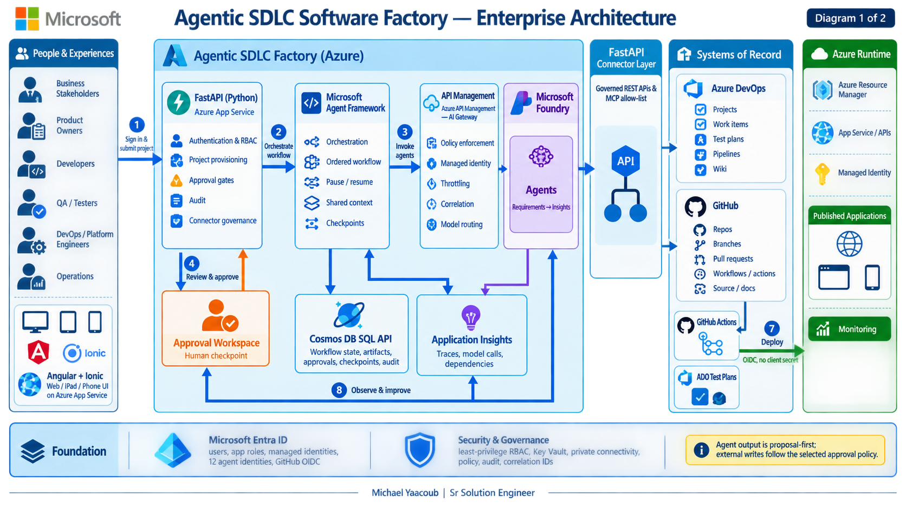

Agents are **built, run, and governed in Microsoft Foundry**, orchestrated with
**Microsoft Agent Framework**, and they reach the outside world only by calling
**Systems of Record through MCP servers and APIs**. Reading the diagram
top-to-bottom:

**1 · People (top band).** Six personas hold accountability across the lifecycle —
Business Stakeholders, Product Owners/Managers, Developers, QA/Testers,
DevOps/Platform Engineers, and Operations. Every persona maps to a role in the
app ([Authentication & roles](#authentication--roles)) and to the approver of
one or more gates.

**2 · Microsoft Agent Framework in Foundry (runtime band).** The framework
supplies built-in orchestration patterns, context & state management, guardrails
& safety, tools & connectors, and observability & logging. This is why the app
does not hand-roll an orchestrator — see
[Agent Framework workflow](#agent-framework-workflow) for the pattern chosen.

**3 · Foundry agents for SDLC (center).** Fourteen ordered Prompt Agents share the
same deterministic graph while retaining independent run records, model policy,
evidence, and checkpoints:

| Order | Phase | Agent | Produces |
| --- | --- | --- | --- |
| 010 | Plan | Requirements Agent | Scope, actors, functional and non-functional requirements, constraints, and risks |
| 020 | Plan | Planning Agent | Epics, Features, User Stories, Tasks, estimates, priorities, and acceptance criteria |
| 030 | Design | Architecture Advisor Agent | Architecture, data model, API contracts, implementation plan, and threat-model inputs |
| 040 | Build | Code Generation Agent | Application code, database assets, tests, CI/CD, branch, and pull request |
| 045 | Build | Code Review Agent | Independent pull-request findings, severity, remediation, test gaps, and approve/request-changes recommendation |
| 050 | Test | Test Planning Agent | Test strategy, suites, cases, traceability, and acceptance coverage |
| 060 | Test | Testing Agent | Execution assessment, defects, quality evidence, and release-readiness findings |
| 070 | Test | Test Automation Agent | Automated tests, pipeline integration, ADO Test Runs, and result evidence |
| 080 | Security | Security and Compliance Agent | Findings, severity, mitigations, residual risk, and promotion recommendation |
| 090 | Deploy | DevOps / Release Agent | Azure hosting, OIDC, merge/deploy evidence, smoke validation, and release record |
| 100 | Operate | Ops Monitoring Agent | Service indicators, alerts, dashboards, incident triage, and runbooks |
| 110 | Operate | Knowledge Assistant | Cited project, support, onboarding, and operational knowledge brief |
| 120 | Improve | Insights Agent | Metrics, thresholds, risks, trends, and prioritized improvement backlog |
| 130 | Improve | Cost Estimator Agent | Token and USD forecast, per-model cost analysis, and best-cost/best-quality/balanced model matrix |

A **Shared Context & State** bus runs underneath all fourteen so an agent inherits
what earlier phases produced instead of re-deriving it. In this implementation
the lifecycle includes an explicit `security` stage before deployment, and the
agents are fronted by **ten approval gates**, beginning with a cost and time
estimate review before inference. An agent advances only
after each prerequisite is explicitly approved by a reviewer or by the selected
automation policy ([Human-in-the-loop approval gates](#human-in-the-loop-approval-gates)).

**4 · Agents call Systems of Record via MCP servers & APIs (bottom).** Agents
never own data. Each integration is a governed connector: Azure DevOps or Jira
(work items; test cases & plans), Azure DevOps / GitHub Actions (pipelines &
automations), GitHub (source control and documentation), GitHub Copilot
(coding assistant), Microsoft Azure (App Services, Functions, Containers,
Key Vault, Monitor), and Azure Communication Services Email (owner lifecycle
notifications).

**5 · Global settings ▸ Project settings (right rail).** The five Systems of
Record are configured once globally and **pre-populated, overridable per
project** — implemented exactly as shown in [Systems of Record configuration](#systems-of-record-configuration).

**6 · Governance & security (right rail, bottom).** RBAC & least privilege, data
policies & compliance, audit logging & observability, security scanning &
guardrails, and cost controls. These are cross-cutting, enforced server-side, and
cannot be bypassed from the UI ([Security & guardrails](#security--guardrails)).

The outcome band across the bottom — consistency & reuse, end-to-end
traceability, faster delivery, quality & reliability, visibility & insights, and
secure & governed operation — is what the approval-gated design is optimizing for.

This consolidated view implements the **AI Foundry-Based Software Factory**
reference architecture and the **Agentic SDLC: Human Accountability + Agent
Execution** operating model. The source reference deck remains available at
[`docs/Microsoft-AI-Stack-for-SDLC.pdf`](docs/Microsoft-AI-Stack-for-SDLC.pdf).

### Tiered configuration

Configuration is strictly separated by tier; business logic never hardcodes
endpoints, keys, tenant IDs, or routes.

| Tier | Config location |
| --- | --- |
| UI | [`src/app/config/`](https://github.com/csdmichael/Foundry-Agentic-Workflow-SDLC/tree/main/src/app/config) |
| API | [`api/src/config/`](https://github.com/csdmichael/Foundry-Agentic-Workflow-SDLC/tree/main/api/src/config) |
| DB / persistence | [`api/src/persistence/config/`](https://github.com/csdmichael/Foundry-Agentic-Workflow-SDLC/tree/main/api/src/persistence/config) |
| Agent orchestration | [`api/src/agents/config/`](https://github.com/csdmichael/Foundry-Agentic-Workflow-SDLC/tree/main/api/src/agents/config) |

### APIM gateway

All Azure AI Foundry calls route through Azure API Management. The backend never
calls Foundry directly except when `FOUNDRY_ALLOW_DIRECT=1` is set for local
development. Every call logs prompt ID, agent ID, model name, token estimate,
project ID, user ID, approval gate ID, workflow run ID, and correlation ID.

## Code generation providers

The proof of concept supports two code-generation providers selected during project creation. Microsoft Foundry remains the default. GitHub Copilot cloud agent is an opt-in external provider for projects that benefit from a repository-native coding workflow.

When Microsoft Foundry is selected, the Code Generation Agent produces a governed proposal through Azure API Management. After approval, the application creates the generated branch, commits the application scaffold, and opens the pull request. When GitHub Copilot is selected, Microsoft Agent Framework still owns workflow sequencing, approval gates, checkpointing, retries, and audit state, while the API submits and monitors an asynchronous GitHub Agent Tasks API task. Copilot works in the provisioned project repository and returns a branch and pull request to the existing review, test, security, and release stages.

The application calls the GitHub Agent Tasks API directly rather than asking the Foundry Code Generation Agent to invoke Copilot through GitHub MCP. GitHub MCP is appropriate for interactive, model-directed tool use. For a provider choice already made by the application, an additional Foundry inference would add latency, token consumption, and nondeterministic tool selection without improving the handoff. Direct task submission also gives the workflow a durable GitHub task identifier and explicit states such as queued, in progress, waiting for user, completed, failed, timed out, and cancelled.

### Provider comparison

| Area | Microsoft Foundry Code Generation Agent | GitHub Copilot cloud agent |
| --- | --- | --- |
| Execution location | Microsoft Foundry through the configured APIM gateway | GitHub-hosted cloud agent environment |
| APIM governance | Model requests are governed through APIM authentication, policies, quotas, logging, and controls | Internal model requests execute within GitHub and cannot pass through this application's APIM gateway |
| Cost monitoring | Token estimates and model usage can be correlated to each project and workflow through APIM telemetry | Usage is measured through GitHub Copilot credits and GitHub Actions minutes; project attribution uses the persisted task and pull request identifiers rather than APIM token telemetry |
| Workflow governance | Microsoft Agent Framework manages execution, checkpoints, approvals, artifacts, and audit records | The same Agent Framework workflow governs task submission, polling, approvals, pull request evidence, retries, and audit records |
| Repository changes | The approved Foundry proposal is converted into files, a branch, commits, and a pull request by the application | Copilot edits the repository in its ephemeral GitHub Actions environment and creates the branch and pull request |
| Model selection | Controlled through Foundry deployments, Model Router, and project-level model overrides | Controlled by GitHub Copilot availability, subscription policy, and optional task model selection |
| Operational visibility | Centralized through APIM, Foundry telemetry, application traces, and audit logs | Split between application traces and GitHub task, pull request, Actions, and Copilot usage data |
| Best fit | Workloads requiring centralized model policy, APIM enforcement, and detailed per-project cost attribution | Repository-focused implementation where native GitHub automation and autonomous pull request creation are the priority |

### APIM exception

All Microsoft Foundry model calls continue to route through the configured Azure API Management gateway. GitHub Copilot cloud agent is an explicitly selected external execution provider, and its internal model calls run within GitHub. Selecting GitHub Copilot is therefore an explicit exception to the APIM model-execution boundary. The exception applies only to GitHub-hosted inference. Project workflow state, task identifiers, status, pull-request evidence, approval decisions, and audit records remain governed by this application.

GitHub Copilot cloud agent must be enabled for the target repository and licensed for the user represented by the configured user-to-server credential. The GitHub Agent Tasks API supports personal access tokens, OAuth user tokens, and GitHub App user-to-server tokens. GitHub App installation tokens are not supported. The Agent Tasks API is currently in public preview and may change.

### Microsoft Agent Framework execution model

The API uses `agent-framework-core` to build one stable sequential graph with
all **14 named Foundry-agent executors**. The configured `executionOrder` is the
single source of truth for graph order. Each node checks its prerequisite gate,
invokes its named Foundry Prompt Agent through APIM when eligible, persists the
proposal, and passes control to the next node. A typed `RequestInfo` event pauses
the graph when a required human checkpoint is unresolved. File checkpoint
storage preserves pending requests and executor state under the configured
persistence root.

Agent identities are stable configuration-derived IDs so a checkpoint can be
rehydrated with the same 14-node topology. A policy coordinator can approve a
non-human gate only after its artifact and tool-evidence requirements pass; ADO,
GitHub, test, and Azure side effects still occur only during gate publication.

---

## Capabilities at a glance

Copy-ready summary for Microsoft Teams, email, or an executive project update:

- **Selectable workflow autonomy:** project intake offers **Human review**, **Minimal intervention**, or **Fully autonomous** execution. Microsoft Agent Framework starts every newly eligible agent automatically; users do not click individual Run buttons. Existing Projects and Project Details use a distinct icon for each mode. Completed cards show **Complete**, while autonomous cards and traces use execution-policy language rather than human-approval status.
- **Durable automatic recovery:** persisted workflow tasks survive API restarts, bounded exponential retries absorb transient Foundry/APIM, connector, and external-CI waits, and a persisted circuit breaker pauses repeated model failures before resuming automatically. Deterministic errors stop visibly with the full actionable upstream detail; model refusals are rejected rather than accepted as artifacts.
- **Detailed human-in-the-loop review before ADO publication:** reviewers can multi-select the exact Epics, Features, User Stories, and Tasks to publish; edit titles, descriptions, acceptance criteria, work-item types, and raw ADO HTML; add child items; or remove individual items, branches, and selected items. Selecting a child does not automatically select its parents, and deletion preserves the reviewer's scroll position and keyboard focus.
- **Approval, revision, and accountability controls:** reviewers can save drafts, approve and publish selected content, request changes with a required comment, reject, or delegate. A change request automatically re-prompts the owning agent. Every decision records the actor, role, timestamp, comments, selected artifacts, and state transition.
- **14 specialized Microsoft Foundry Prompt Agents:** Requirements, Planning, Architecture, Code Generation, Code Review, Test Planning, Testing, Test Automation, Security and Compliance, DevOps/Release, Ops Monitoring, Knowledge Assistant, Insights, and Cost Estimator are nodes in one sequential Microsoft Agent Framework graph and execute through Azure API Management.
- **Independent code review:** Code Review follows approved code generation and uses a different model deployment. It reviews the resulting pull request whether Foundry or GitHub Copilot generated it, reducing correlated generator/reviewer failure before Pull Request Review approval.
- **Durable FinOps and ROI evidence:** Foundry input, cached-input, output, and total tokens are attributed to projects and models. Before creation and throughout delivery, the platform compares Autonomous, Minimal review, Human review, and a totally manual AI-orchestration baseline using explicit labor assumptions. Final statistics preserve model spend, all-in project cost, human hours and dollars saved, ROI, model mix, elapsed time, and per-model breakdown for future Cost Estimator forecasts.
- **Live Foundry model selection and pricing:** Global Settings discovers every successful deployment from the configured Foundry account. Agent-compatible models are selectable; embedding, image, and other incompatible deployments remain visible with a disabled state and explanation. Every model dropdown includes input/output price per 1M tokens. The Model Suggestions & Pricing page lists per-agent recommendations, quality scores, cached-input rates, source, and effective pricing.
- **Ten evidence-aware approval gates:** Cost and Time Estimate, Plan and Scope, Backlog Generation, Architecture and Design, Code Generation, Pull Request Review, Test Acceptance, Security Review, Release and Deployment, and Operate and Improve. Human and Minimal modes require approval of the generated preflight estimate before any agent invocation; Autonomous validates its attached estimate artifact and records an automated decision.
- **Flexible project intake:** the requirements document is the only required upload; technical requirements and UX mockups are optional supporting documents. When a description is blank, single-project intake, the manual project-set wizard, and ZIP import extract two or three concise sentences from the functional requirements before provisioning. That description is stored on the project and written to the Azure DevOps project landing page; explicit descriptions are preserved.
- **Parallel project sets:** one wizard creates `2–20` projects, defaults each to Fully autonomous execution, applies one shared agent/model policy, and allows a project to replace that policy without changing its siblings. Manual intake and validated folder-per-project ZIP import both create independent workflow runs, which advance concurrently with isolated checkpoints, approvals, audit records, and systems of record.
- **Rich Azure DevOps planning automation:** approved Planning output creates an idempotent Epic-to-Task hierarchy plus dated sprints, shared queries, dashboards, delivery plans, estimates, tags, priorities, business value, and acceptance criteria. Generated work items are displayed as a parent/child tree, collapsed by default.
- **Jira-native work and test evidence:** selecting Jira for Work Items or Test Cases & Test Plans automatically uses `https://csdmichael.atlassian.net/jira/software/projects` as the asset root. Project links resolve under `/jira/software/projects/{PROJECT_KEY}`, while individual issues, test plans, and test cases use `/browse/{ISSUE_KEY}` without duplicated `browse` segments.
- **Code-to-work-item traceability:** when Code Generation publishes its branch and pull request, every related Epic, Feature, User Story, and Task moves to **Active**, receives commit/PR hyperlinks, and records an Agentic SDLC discussion entry. After the matching Azure deployment succeeds, the same hierarchy moves to **Closed** with the deployment-run link and completion comment.
- **Architecture and code governance:** architecture, dataflow, API contracts, security design, generated application structure, tests, and CI/CD remain editable and selectable before publication. Generated code is proposed on a branch and reviewed through a real GitHub pull request; GitHub evidence is grouped into Repository, Pull requests, Commits, and Documentation.
- **Verified quality and security evidence:** test planning creates idempotent ADO plans, suites, and cases. Testing and Test Automation reuse the generated CI workflow, create plan-linked automated Test Runs, update ADO result outcomes, mark Test Cases automated, and attach pipeline hyperlinks/discussion evidence. Security and Compliance produces prioritized findings, mitigations, residual risk, and a release recommendation.
- **Controlled Azure release:** Release approval configures repository OIDC without a client secret, provisions Azure hosting, requires a verified generated pull request, confirms the merge, triggers one deployment workflow, and validates health, OpenAPI, UI, seed data, and CRUD behavior.
- **Release documentation in ADO:** the DevOps/Release Agent idempotently creates or updates a Project Overview wiki page with the project description, owners, hosted UI, API, health, Swagger/OpenAPI, repository, pull request, deployment run, merge commit, stack, and governance context.
- **Post-release operations and improvement:** Ops Monitoring defines health indicators, alerts, dashboards, incident triage, and runbooks; Knowledge Assistant creates an operational brief; Insights proposes measurable thresholds and an ordered improvement backlog.
- **Post-completion revisions:** a completed project can start a traceable revision from Requirements, Planning/Work Items, or Architecture. Prior approved gates are carried forward where valid, human instructions enter every downstream prompt, and the selected policy drives the new run through release and operations.
- **End-to-end traceability:** Agent Activity and the append-only Audit Trail correlate prompts, models, artifacts, tool calls, approvals, external URLs, publication actions, and workflow state with correlation identifiers.
- **Owner lifecycle notifications:** Azure Communication Services emails the unique business and technical owners when a project is created, reaches an actionable human approval, fails, or completes. Matching owner addresses are case-insensitively deduplicated into one recipient, and a persistent event ledger prevents duplicate delivery for the same creation, gate, or completion event while allowing a later genuine retry failure to notify again.
  On startup, the API reconciles already-actionable or terminal runs through the
  same ledger so a deployment cannot leave an existing approval or failure
  unnotified.
- **Role-based access and configurable governance:** Entra ID, email OTP, guest access, configurable role permissions, agent settings, model routes, tool allow-lists, guardrails, token limits, and project-level System of Record overrides are enforced server-side.
- **Safe project lifecycle management:** authorized users can delete a local project and independently choose cascade cleanup for workflow-created ADO, GitHub, and captured Azure App Service resources. All options are selected by default, pre-existing linked resources are retained, and local deletion waits for selected external cleanup to succeed. **Deleted Projects** in the left navigation retains a read-only audit projection of who deleted the project, when, its execution mode and last state, and each external cleanup outcome.
  Deletion runs as a durable Cosmos-backed operation with animated percentage
  and trace events for Azure DevOps, GitHub, each App Service, the App Service
  plan, and local records; interrupted cleanup resumes after API restart.

---

## Workflow execution modes

Every project chooses one execution policy during intake. Project sets can mix
the policies, so a single ZIP launch can run autonomous, minimally reviewed,
and fully reviewed projects in parallel. The policy changes **who approves a
gate**; it does not change the 14-agent topology, evidence requirements,
server-side permissions, APIM boundary, audit trail, or guardrails.

In all three modes, Microsoft Agent Framework starts each newly eligible agent
automatically. Users never need to click a separate **Run agent** button. A
human checkpoint pauses promotion and publication until a reviewer approves,
requests changes, rejects, or delegates the proposal.

| Behavior | Autonomous | Minimal Human Review | Human Review |
| --- | --- | --- | --- |
| Intended use | Repeatable delivery for trusted patterns, demos, and high-volume project sets | Default enterprise balance: human control at consequential decisions without reviewing routine evidence | Maximum governance for regulated, high-risk, unfamiliar, or first-of-kind workloads |
| Human checkpoints | None | Preflight estimate + 4 consequential checkpoints | All 10 checkpoints |
| Agent execution | Starts automatically when prerequisites are satisfied | Starts automatically until the next selected human checkpoint | Starts automatically after each human-approved checkpoint |
| Gate decisions | The workflow policy validates evidence and records an automated approval | The policy auto-approves routine gates; people approve the preflight estimate and four consequential gates listed below | A person reviews and decides every gate |
| Editing proposals | Outputs are validated and published automatically | Reviewers can edit/select backlog and architecture proposals at the selected checkpoints | Reviewers can edit/select every gated proposal before publication |
| External side effects | Run automatically after evidence validation | Routine side effects run automatically; consequential publication waits for a reviewer | Every gated publication waits for a reviewer |
| Failure handling | Transient Foundry/external waits enter the durable retry queue; deterministic failures stop with trace evidence | Same durable automation between checkpoints; failures stop for operator action | Same durable automation after each approval; failures stop for operator action |
| UI status | Queued, Running, Failed, or Completed; no stale Awaiting Approval status | Running between checkpoints, Awaiting Approval only at the five human gates | Awaiting Approval at every gate; Running after each decision |

### Autonomous versus Human Review workflows

Both workflows use the same 14-agent lifecycle, ten evidence-aware gates, and
continuous improvement loop. The difference is how each gate advances:

- In **Fully autonomous** mode, the workflow validates the required evidence,
  records the gate decision automatically, and starts the next eligible agent.
  It has no human checkpoints, but it retains every guardrail, permission check,
  artifact, and audit event.

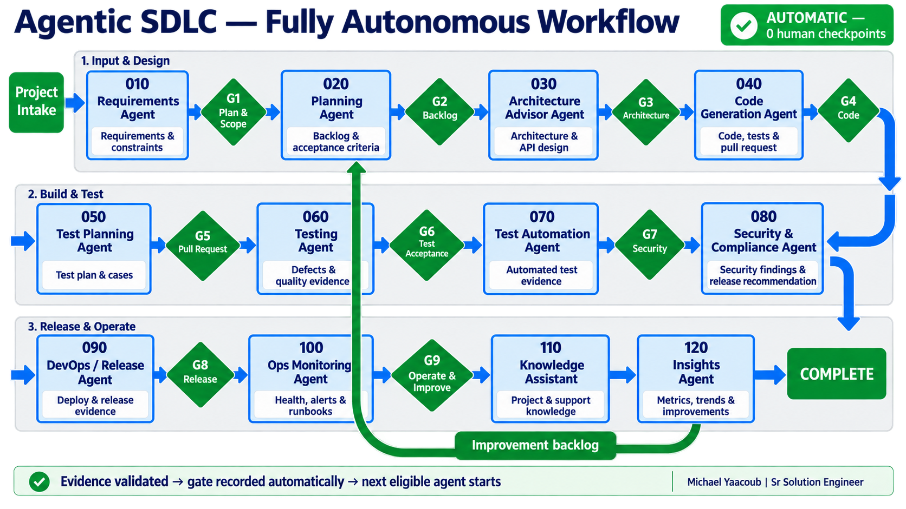

- In **Human Review** mode, the workflow pauses at every gate so an authorized
  reviewer can inspect evidence, edit the proposal, select artifacts, and then
  approve and publish, request changes, reject, or delegate. Approval resumes
  the same workflow at the next eligible agent; a change request returns to the
  owning agent with the reviewer's comments.

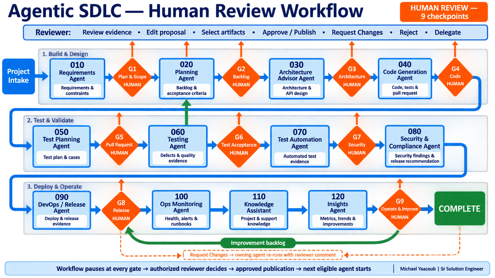

**Minimal Human Review** combines these two paths: Cost and Time Estimate, Backlog Generation,
Architecture and Design, Pull Request Review, and Release and Deployment use
the human-review behavior, while the other five gates advance automatically.

### Gate-by-gate comparison

| Approval gate | Autonomous | Minimal Human Review | Human Review |
| --- | --- | --- | --- |
| Cost and Time Estimate | Automatic after estimate validation | **Human before inference** | **Human before inference** |
| Plan and Scope | Automatic | Automatic | Human |
| Backlog Generation | Automatic | **Human** | Human |
| Architecture and Design | Automatic | **Human** | Human |
| Code Generation | Automatic | Automatic | Human |
| Pull Request Review | Automatic | **Human** | Human |
| Test Acceptance | Automatic | Automatic | Human |
| Security Review | Automatic | Automatic | Human |
| Release and Deployment | Automatic | **Human** | Human |
| Operate and Improve | Automatic | Automatic | Human |

### Minimal Human Review versus Human Review

**Minimal Human Review** is not a less-governed version of the workflow. Every
agent, gate, evidence check, guardrail, permission check, external action, and
audit event still runs. The difference is that people are asked to decide only
where scope or production impact materially changes:

- **Backlog Generation:** approve exactly which requirements and ADO work items
  may be published.
- **Architecture and Design:** approve the technical direction before code is
  generated.
- **Pull Request Review:** inspect the real GitHub pull request before it can be
  merged.
- **Release and Deployment:** authorize Azure provisioning, merge, publication,
  smoke tests, ADO wiki generation, and work-item closure.

The workflow automatically validates and advances Code Generation, Test
Acceptance, Security Review, and Operate/Improve in this mode. Those stages are
not skipped; their artifacts and external evidence remain available in Project
Details, the per-project trace, Agent Activity, and Audit Trail.

**Human Review** pauses at all ten gates. Use it when every transition needs a
named accountable reviewer, when proposals require frequent editing, or when a
customer wants to demonstrate the complete human-in-the-loop governance model.
It provides more decision points, but it also increases elapsed delivery time
and reviewer workload.

**Autonomous** uses the same evidence-aware gates but records their decisions as
automated policy actions. It is appropriate only when the organization accepts
the configured models, tools, guardrails, target systems, and release policy.
Transient work survives process restarts through the persisted task queue, and
the Existing Projects screen shows the execution mode and live stage/agent
progress rather than human approval states. Automated transitions are labelled
as workflow-policy advances, and a finished card is labelled **Complete**. Each
card also exposes the latest trace event and its chronological external evidence.

The fourth option shown in cost and ROI comparisons, **Totally manual
orchestration using AI**, is a planning baseline rather than a selectable
workflow policy. It models a person manually coordinating the same AI-assisted
lifecycle work so the three executable policies can be compared on a consistent
labor and model-cost basis.

---

## Live deployment

Published to **Azure App Service** (Linux, B2 plan `agentic-sdlc-plan`) in
resource group **ai-myaacoub** (West US 2), subscription
`86b37969-9445-49cf-b03f-d8866235171c`. Component-scoped GitHub Actions redeploy
only the changed tier using Azure **OIDC federated login** (no stored secrets).
The API runs as one worker with **Always On** enabled and `/api/health` configured
as its health-check path, allowing its persisted workflow queue to keep running
after users close the browser. One worker remains intentional until queue leases
and dispatch timers are coordinated across instances.

| Resource | URL |
| --- | --- |
| UI (Angular/Ionic) | <https://agentic-sdlc-ui-my.azurewebsites.net> |
| API (FastAPI) | <https://agentic-sdlc-api-my.azurewebsites.net> |
| API health probe | <https://agentic-sdlc-api-my.azurewebsites.net/api/health> |
| API Swagger / OpenAPI UI | <https://agentic-sdlc-api-my.azurewebsites.net/docs> |
| API OpenAPI schema (JSON) | <https://agentic-sdlc-api-my.azurewebsites.net/openapi.json> |
| Foundry agents (project) | <https://002-ai-poc-private.services.ai.azure.com/api/projects/agentic-sdlc> |

Azure management (portal) links:

| Resource | Portal |
| --- | --- |
| Resource group `ai-myaacoub` | [open](https://portal.azure.com/#@MngEnvMCAP829495.onmicrosoft.com/resource/subscriptions/86b37969-9445-49cf-b03f-d8866235171c/resourceGroups/ai-myaacoub/overview) |
| API web app | [open](https://portal.azure.com/#@MngEnvMCAP829495.onmicrosoft.com/resource/subscriptions/86b37969-9445-49cf-b03f-d8866235171c/resourceGroups/ai-myaacoub/providers/Microsoft.Web/sites/agentic-sdlc-api-my/appServices) |
| UI web app | [open](https://portal.azure.com/#@MngEnvMCAP829495.onmicrosoft.com/resource/subscriptions/86b37969-9445-49cf-b03f-d8866235171c/resourceGroups/ai-myaacoub/providers/Microsoft.Web/sites/agentic-sdlc-ui-my/appServices) |
| APIM gateway `ai-gateway-apim-poc-my` | [open](https://portal.azure.com/#@MngEnvMCAP829495.onmicrosoft.com/resource/subscriptions/86b37969-9445-49cf-b03f-d8866235171c/resourceGroups/ai-myaacoub/providers/Microsoft.ApiManagement/service/ai-gateway-apim-poc-my/apim-apis) |
| Cosmos DB `cosmos-fabriciq-demo-01` | [open](https://portal.azure.com/#@MngEnvMCAP829495.onmicrosoft.com/resource/subscriptions/86b37969-9445-49cf-b03f-d8866235171c/resourceGroups/ai-myaacoub/providers/Microsoft.DocumentDB/databaseAccounts/cosmos-fabriciq-demo-01/DataExplorerBlade) |
| Email (ACS) `fabriciq-shortages-email-b3` | [open](https://portal.azure.com/#@MngEnvMCAP829495.onmicrosoft.com/resource/subscriptions/86b37969-9445-49cf-b03f-d8866235171c/resourceGroups/ai-myaacoub/providers/Microsoft.Communication/EmailServices/fabriciq-shortages-email-b3/resourceOverviewId) |

---

## Source control repository

The application supports three selectable primary source code repository providers:
- **GitHub**: Fully integrated with GitHub Repositories. Supports public/private repositories, branch creation, file commits, pull requests, and GitHub Actions CI runs.
- **Azure DevOps Repos**: Idempotent repository provisioning inside Azure DevOps. Integrates seamlessly with Azure Pipelines CI/CD flows.
- **Bitbucket Cloud**: Standard Bitbucket Cloud REST v2 integration. Supports configurable workspaces, public/private repository management, commits via multipart `/src` API, pull request flows, and Bitbucket Pipelines.

### Credentials & Env Overlays
- **GitHub**: Requires `GITHUB_PAT` setting or environment variable.
- **Azure DevOps**: Requires `ADO_PAT` setting or environment variable.
- **Bitbucket Cloud**: Requires `BITBUCKET_TOKEN` (App Password) and optionals `BITBUCKET_USERNAME` and `BITBUCKET_EMAIL`. Supports `BITBUCKET_LIVE=1` env overlay.

### Code-Generation Provider Compatibility
If **GitHub Copilot** is selected as the code-generation provider, the system enforces **GitHub** as the source repository provider because Copilot durable delegation requires GitHub-native repositories.

### Durable Copilot Delegation
Direct Foundry-to-Copilot A2A chat is not possible because Agent Tasks is async; the SDLC flow utilizes durable request/callback/reconciliation/verification signaling to coordinate and verify pull requests before advancing stages.

The application source code is maintained in the private GitHub repository
[csdmichael/Foundry-Agentic-Workflow-SDLC](https://github.com/csdmichael/Foundry-Agentic-Workflow-SDLC).
Request access from **Michael Yaacoub** to view or clone the repository.

---

## Systems of Record — root URLs

These are the configured **root** systems of record the Agentic SDLC can write
into. Every new project gets its own project or repository underneath the
applicable root, and each agent action lands in the provider selected for that
asset class.

| System of Record | Purpose | Root URL |
| --- | --- | --- |
| **Azure DevOps** — work items, test plans, pipelines | Epics → Features → User Stories → Tasks, test plans and cases, build/release pipelines. One project per SDLC project. | <https://dev.azure.com/csdmichael> |
| **Jira Software** — work items and test assets | Optional provider for Work Items and Test Cases & Test Plans. Project navigation uses `/jira/software/projects/{PROJECT_KEY}`; individual issues use `/browse/{ISSUE_KEY}`. | <https://csdmichael.atlassian.net/jira/software/projects> |
| **GitHub** — source code and documentation | Generated code, branches, pull requests, uploaded intake documents, and published requirements/design artifacts. One repository per SDLC project. | <https://github.com/csdmichael> |

### Project intake documents

Requirements and optional supporting documents are **uploaded from disk** in
the New Project wizard; there is no document-library URL to configure. Only the
requirements document is required. `POST /api/projects/intake`
takes the project metadata plus the files as multipart form data, and the API:

1. validates each upload (extension allow-list, non-empty, 25 MB ceiling),
2. extracts its text so the agents receive the content and not just a link,
3. creates the Azure DevOps project and the GitHub repository, then
4. commits the files into that repository:

| Upload | Committed to |
| --- | --- |
| Requirements document (required) | `docs/intake/requirements/<file>` |
| Technical requirements document (optional) | `docs/intake/technical-requirements/<file>` |
| UX mockup document (optional) | `docs/intake/ux-mockups/<file>` |

The wizard also provides reusable Word downloads before the upload controls:

| Template | Starting structure |
| --- | --- |
| [Requirements](https://github.com/csdmichael/Foundry-Agentic-Workflow-SDLC/blob/main/src/assets/templates/requirements-template.docx) | Purpose and scope, Epic, Features and User Stories, Given/When/Then criteria, non-functional requirements, traceability, and assumptions |
| [UX mockups](https://github.com/csdmichael/Foundry-Agentic-Workflow-SDLC/blob/main/src/assets/templates/ux-mockups-template.docx) | `SCR-*` screen inventory, mockup/specification pairs, interaction details, navigation flow, responsive behavior, and accessibility |
| [Technical requirements](https://github.com/csdmichael/Foundry-Agentic-Workflow-SDLC/blob/main/src/assets/templates/technical-requirements-template.docx) | Angular/TypeScript/Ionic UI, Python/FastAPI APIs, Azure SQL or Cosmos DB, Microsoft Foundry and Agent Framework, APIM, and optional Azure Storage |

All three use `{Business Case}` as the document-title placeholder. The first two
are modeled on the Field Service Work Orders files in `docs/samples/`. Regenerate
the checked-in `.docx` assets after changing their source with:

```powershell
npm run generate:templates
```

Word (`.docx` and legacy `.doc`), RTF, Markdown, and plain text are parsed into
text and passed to the agent through the APIM gateway as clearly labelled
context data. PDFs, images, and slide decks are still committed and linked, but
are recorded as `textStatus: unsupported` so it is obvious the model received
only the URL. Approved agent output continues to land in `docs/` — for example
`docs/requirements-analysis.md` — on the repository's default branch, giving a
real, versioned, reviewable URL.

**What gets created per project**

| System | Child artifact | Example |
| --- | --- | --- |
| Azure DevOps | `<org>/<project name>` | `https://dev.azure.com/csdmichael/Contoso%20Claims%20Portal` |
| Jira Software (when selected) | `/jira/software/projects/<project key>` | `https://csdmichael.atlassian.net/jira/software/projects/CONTOSO` |
| Jira issue/test asset | `/browse/<issue key>` | `https://csdmichael.atlassian.net/browse/CONTOSO-100` |
| GitHub | `<owner>/<project-slug>` | `https://github.com/csdmichael/contoso-claims-portal` |

The roots are configuration, not code — they live in
[`api/src/config/integrations.config.json`](https://github.com/csdmichael/Foundry-Agentic-Workflow-SDLC/blob/main/api/src/config/integrations.config.json)
(connector targets) and
[`api/src/config/systems-of-record.config.json`](https://github.com/csdmichael/Foundry-Agentic-Workflow-SDLC/blob/main/api/src/config/systems-of-record.config.json)
(per-class defaults, overridable globally and per project). See
[Systems of Record configuration](#systems-of-record-configuration).

---

## Data storage and persistence map

Production uses the SQL API account `cosmos-fabriciq-demo-01`, database
`agentic_sdlc`, and container `state` at 400 RU/s. The container partition key
is `/_collection`; each repository name is a logical partition, so records in
different collections can safely share an `id`. The API authenticates with its
system-assigned managed identity and a database-scoped Cosmos DB Built-in Data
Contributor assignment.

The account remains policy-private: public network access is disabled, network
bypass is `None`, and SQL traffic resolves through an approved private endpoint
and `privatelink.documents.azure.com`. The API reaches that endpoint by VNet
integration with `vnet-salespoc-westus2/snet-appservice`; no Cosmos firewall,
IP allow-list, public-access, bypass, or private-endpoint setting is modified by
the application or provisioning workflow.

| Data element | What is stored | Production destination / partition | External or derived destination |
| --- | --- | --- | --- |
| Project configuration | Name, owners, environment, execution mode, selected agents, per-project `agentModels` overrides, technology stack, System of Record overrides, provisioning references, and captured Azure resource IDs | Cosmos `agentic_sdlc/state`, `_collection = projects` | ADO/Jira/GitHub URLs and Azure ARM IDs point to the external resources; they are not copies of those resources |
| Global model policy | One model deployment per agent when an administrator overrides the checked-in defaults | Cosmos `agentic_sdlc/state`, `_collection = settings`, record `global-agent-models` | Baseline recommendations remain in `api/src/agents/config/agents.config.json`; deployed model and agent definitions live in Microsoft Foundry |
| Effective model used by an agent | Selected deployment, selection scope, Foundry agent name, routed model returned by Model Router, token estimate, and correlation ID | Cosmos `agentic_sdlc/state`, `_collection = agentRuns` | Foundry owns the Prompt Agent/version; Application Insights owns model-call telemetry |
| Project sets | Set name, member project/run IDs, launch errors, counts, creator, and timestamps | Cosmos `agentic_sdlc/state`, `_collection = projectSets` | Each member project has independent records in the collections below |
| Current workflow stage and status | Stage array, `currentStage`, workflow state, automation status/error, execution-mode snapshot, revision lineage, and timestamps | Source of truth: Cosmos partition `workflowRuns`; list-view summary is denormalized into partition `projects` | Existing Projects and Project Details read this state through the API |
| Durable automation queue | One task per workflow run, actor, retry count, next-available epoch, last error, outcome, and queue timestamps | Cosmos `agentic_sdlc/state`, `_collection = workflowTasks` | Startup recovery requeues persisted `Queued` or interrupted `Running` tasks |
| Foundry circuit-breaker state | Failure count, open/closed state, retry epoch, and last model error | Cosmos `agentic_sdlc/state`, `_collection = workflowCircuitBreakers` | Controls when the API may next invoke a Foundry agent through APIM |
| Agent Framework checkpoints | Encoded executor state and pending request/response checkpoints | Cosmos `agentic_sdlc/state`, `_collection = workflowCheckpoints` | Microsoft Agent Framework loads these documents to resume the same topology |
| Approval gates and decisions | Gate requirements, state, attached artifacts, approver, role, decision, comments, delegation, selected references, and timestamps | Cosmos `agentic_sdlc/state`, `_collection = approvalGates` | Approved publication creates or updates the governed external record |
| Agent execution records | Agent/model identity, prompt ID, state, output IDs, guardrail findings, summary, tool calls, external evidence URLs, and timing | Cosmos `agentic_sdlc/state`, `_collection = agentRuns` | Full model telemetry is sent to Application Insights; generated external evidence remains in ADO/Jira/GitHub/Azure |
| Reviewable agent artifacts | Full redacted proposal content, editable review items, version, review status, owning gate/agent, and publication metadata | Cosmos `agentic_sdlc/state`, `_collection = artifacts` | Approved documents, code, and work items are published to the configured GitHub, ADO, or Jira destination |
| Intake documents | Extracted text and document metadata used as grounded agent context | Cosmos `agentic_sdlc/state`, `_collection = intakeDocuments` | Original uploads are versioned in the project's GitHub repository under `docs/intake/`; binaries are not duplicated in Cosmos |
| Per-project UI trace | Project creation/provisioning, artifact, agent, approval, ADO, Jira, GitHub, CI, Azure, and completion events | No standalone trace collection: `workflowTrace` is computed on read from `projects`, `workflowRuns`, `agentRuns.toolCalls`, `artifacts`, and `approvalGates` | Linked evidence remains in ADO, Jira, GitHub Actions, GitHub, and Azure |
| Application and Foundry telemetry | Request/dependency spans, model invocation traces, latency, result status, and correlation attributes | Azure Application Insights `appInsights-ai-poc-myaacoub` | Filter by the `agentic-sdlc` Foundry project ID or response/conversation ID |
| Audit and deleted-project history | Append-only user, agent, policy, notification, approval, publication, and deletion events with correlation IDs | Cosmos `agentic_sdlc/state`, `_collection = auditLogs` | **Deleted Projects** is a sanitized API/UI projection of `project.delete` audit entries, not a restorable project table |
| Owner notification ledger | Event key, project/run/gate IDs, unique recipient list, subject, attempt count, and `Pending`/`Delivered`/`Failed`/`Skipped` status | Cosmos `agentic_sdlc/state`, `_collection = projectNotifications` | Azure Communication Services Email performs delivery; email failure never changes workflow outcome |
| Project deletion operations | Cascade selections, current phase/message, percentage, ordered resource trace events, terminal result/error, requester, and timestamps | Cosmos `agentic_sdlc/state`, `_collection = projectDeletions` | The completed operation survives project removal and feeds the animated deletion dialog; `project.delete` remains in the append-only audit partition |
| Users and authentication method | User identity, role, provider, enabled state, and profile metadata | Cosmos `agentic_sdlc/state`, `_collection = users` | Entra remains the identity source for internal users; OTP-backed users receive an application JWT |
| Global System of Record and role overrides | Admin-saved SOR provider/URL choices and the editable role-permission matrix | Cosmos `agentic_sdlc/state`, `_collection = settings` | Checked-in JSON config supplies defaults and locked permission invariants |
| Source, planning, test, and release records | Intake binaries, generated source/docs, commits, pull requests, work items, sprints, queries, dashboards, test plans/runs, and wiki | GitHub, Azure DevOps, and Jira are the authoritative external Systems of Record selected per asset class | Local records retain canonical IDs/URLs and enough metadata to render trace evidence |
| Provisioned runtime resources | App Service plans/apps and their live runtime state | Azure Resource Manager | Created resource IDs and ownership flags are captured in Cosmos project and release-agent records for safe cascade deletion |

Secrets are not stored in these collections. PATs, ACS credentials, JWT signing
material, and identity settings remain Azure App Service application settings or
managed identity configuration. OTP codes are held in process memory; only when
the explicit development bypass is enabled can an undelivered code be written
to `otp-log.json` for local/demo diagnostics.

The migration from `/home/data` is complete. A marker in
`_collection = migrationMetadata` prevents stale file data from replaying, and
`PERSIST_MIGRATE_FILE_TO_COSMOS` is disabled after cutover. The original file
store remains a rollback snapshot; it is no longer the production source of
truth. Local development continues to use [`FileRepository`](https://github.com/csdmichael/Foundry-Agentic-Workflow-SDLC/blob/main/api/app/persistence.py)
unless `PERSIST_PROVIDER=cosmos` is selected explicitly.

---

## Data flow

Project intake → approval gate → governed agent action, with guardrails before
and after every agent output.

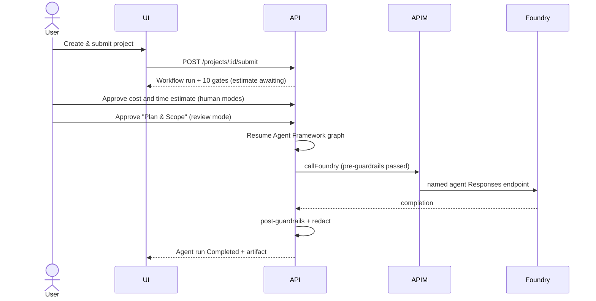
```mermaid
sequenceDiagram
  actor U as User
  participant UI
  participant API
  participant APIM
  participant Foundry
  U->>UI: Create & submit project
  UI->>API: POST /projects/:id/submit
  API-->>UI: Workflow run + 10 gates (estimate awaiting)
  U->>API: Approve cost and time estimate (human modes)
  U->>API: Approve "Plan & Scope" (review mode)
  API->>API: Resume Agent Framework graph
  API->>APIM: callFoundry (pre-guardrails passed)
  APIM->>Foundry: named agent Responses endpoint
  Foundry-->>API: completion
  API->>API: post-guardrails + redact
  API-->>UI: Agent run Completed + artifact
```

### Full sequence (with persistence and audit)

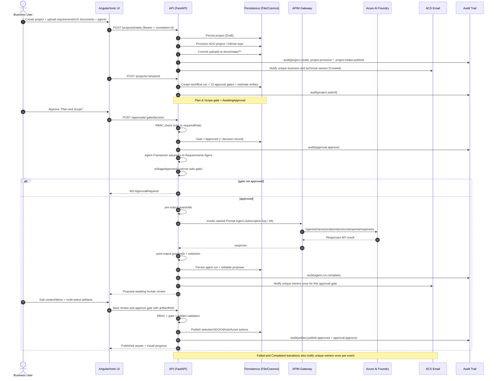
```mermaid
sequenceDiagram
  autonumber
  actor BU as Business User
  participant UI as Angular/Ionic UI
  participant API as API (FastAPI)
  participant DB as Persistence (File/Cosmos)
  participant APIM as APIM Gateway
  participant FDY as Azure AI Foundry
  participant ACS as ACS Email
  participant AUD as Audit Trail

  BU->>UI: Create project + upload requirements/UX documents + agents
  UI->>API: POST /projects/intake (Bearer + correlation-id)
  API->>DB: Persist project (Draft)
  API->>DB: Provision ADO project / GitHub repo
  API->>DB: Commit uploads to docs/intake/**
  API->>AUD: audit(project.create, project.provision.*, project.intake.publish)
  API->>ACS: Notify unique business and technical owners (Created)
  UI->>API: POST /projects/:id/submit
  API->>DB: Create workflow run + 10 approval gates + estimate artifact
  API->>AUD: audit(project.submit)

  Note over API,DB: Plan & Scope gate = AwaitingApproval

  BU->>UI: Approve "Plan and Scope"
  UI->>API: POST /approvals/:gate/decision
  API->>API: RBAC check (role vs requiredRole)
  API->>DB: Gate = Approved (+ decision record)
  API->>AUD: audit(approval.approve)

  API->>API: Agent Framework advances to Requirements Agent
  API->>API: isStageApproved? (server-side gate)
  alt gate not approved
    API-->>UI: 403 ApprovalRequired
  else approved
    API->>API: pre-output guardrails
    API->>APIM: invoke named Prompt Agent (subscription key / MI)
    APIM->>FDY: /agents/{name}/endpoint/protocols/openai/responses
    FDY-->>APIM: Responses API result
    APIM-->>API: response
    API->>API: post-output guardrails + redaction
    API->>DB: Persist agent run + editable proposal
    API->>AUD: audit(agent.run.complete)
    API->>ACS: Notify unique owners once for this approval gate
    API-->>UI: Proposal awaiting human review
    BU->>UI: Edit content/items + multi-select artifacts
    UI->>API: Save review and approve gate with artifactRefs
    API->>API: RBAC + gate + artifact validation
    API->>DB: Publish selected ADO/GitHub/Azure actions
    API->>AUD: audit(artifact.publish.approved + approval.approve)
    API-->>UI: Published assets + visual progress
  end

  Note over API,ACS: Failed and Completed transitions also notify unique owners once per event
```

### Guardrail enforcement points

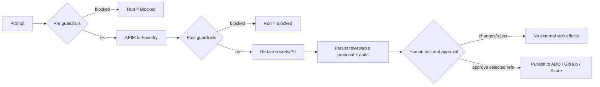
```mermaid
flowchart LR
  P[Prompt] --> PRE{Pre guardrails}
  PRE -- blocked --> B1[Run = Blocked]
  PRE -- ok --> APIM[APIM to Foundry]
  APIM --> POST{Post guardrails}
  POST -- blocked --> B2[Run = Blocked]
  POST -- ok --> RED[Redact secrets/PII]
  RED --> ART[Persist reviewable proposal + audit]
  ART --> HUMAN{Human edit and approval}
  HUMAN -- changes/reject --> HOLD[No external side effects]
  HUMAN -- approve selected refs --> PUB[Publish to ADO / GitHub / Azure]
```

## Agent Framework workflow

Microsoft Agent Framework offers five multi-agent orchestration patterns:


| Pattern | Shape | Fit for a governed SDLC |
| --- | --- | --- |
| **Sequential** | Agents run one after another, each building on the previous output | **Chosen.** The SDLC is inherently ordered — plan → design → build → test → security → deploy — and each stage needs a named approval gate between steps |
| Concurrent | Agents run in parallel on the same input, results are aggregated | No single accountable owner per step; hard to place a gate |
| Group Chat | Agents converse in a shared thread under a chat manager | Non-deterministic turn order; audit trail is a transcript, not a state machine |
| Handoff | Agents dynamically transfer control to each other | Control transfers are agent-decided, which would bypass human gates |
| Magentic | An orchestrator plans and delegates open-ended work | Plan is generated at runtime, so the approval sequence cannot be fixed in advance |

### Approach used: Sequential with configurable approval checkpoints

This platform uses the **Sequential** pattern, extended with Agent Framework
`RequestInfo` request/response semantics so the graph **pauses at unresolved
human approval gates and resumes after a decision**. In minimal or autonomous
mode, the server explicitly validates evidence and records policy-approved
automated decisions. Stage order remains deterministic, every transition is
auditable, and no agent can approve its own output.

The complete governed sequence runs as an Agent Framework graph implemented in
[`api/app/agent_workflow.py`](https://github.com/csdmichael/Foundry-Agentic-Workflow-SDLC/blob/main/api/app/agent_workflow.py):


```mermaid
flowchart LR
  I[Project + execution policy] --> RQ[Requirements]
  RQ --> PL[Planning]
  PL --> AR[Architecture]
  AR --> CG[Code Generation]
  CG --> CR[Code Review]
  CR --> TP[Test Planning]
  TP --> TE[Testing]
  TE --> TA[Test Automation]
  TA --> SC[Security]
  SC --> DR[DevOps / Release]
  DR --> OM[Ops Monitoring]
  OM --> KA[Knowledge Assistant]
  KA --> IN[Insights]
  IN --> CE[Cost Estimator]
  CE --> O[Workflow output + final usage statistics]
  RQ -. unresolved gate .-> H[RequestInfo + checkpoint]
```

Each Foundry executor uses Agent Framework request/response semantics. Pending
requests and graph state are checkpointed under the configured persistence root.
After a human decision or policy-approved automated checkpoint, the server
re-enters the graph; completed nodes are skipped and the next eligible nodes run
without a user click. Model execution remains behind APIM; the framework does
not introduce a direct Foundry path.

## Model selection and routing

The API discovers every successful deployment from the configured Microsoft Foundry account by
using Azure Resource Manager. Deployments that expose the `agentsV2` capability
are selectable; incompatible deployments remain visible and disabled with a reason. The current account includes `model-router`,
`gpt-5.4`, `gpt-5.1-codex`, `Kimi-K2.7-Code`, and `gpt-4.1` as agent-compatible
choices; embedding and image-only deployments are visible but cannot be selected.
The discovery result is cached for five minutes and falls back to checked-in
recommendations when Azure is unavailable.

Model precedence is explicit:

| Scope | Where configured | Behavior |
| --- | --- | --- |
| Recommended default | [`agents.config.json`](https://github.com/csdmichael/Foundry-Agentic-Workflow-SDLC/blob/main/api/src/agents/config/agents.config.json) | Task-aware baseline used when no saved setting exists |
| Global | **Admin → Global Settings → Agent model defaults** | One deployed-model dropdown per agent; inherited by every project |
| Project | New Project **Lifecycle agents** step or the project **Agent models** panel | Stores only agents that differ from global; applies to future runs and revisions |

The checked-in task-aware defaults use only deployments confirmed in the live
Foundry account:

| Default | Agents | Reason |
| --- | --- | --- |
| `model-router` (Balanced) | Requirements, Planning, Test Planning, Ops Monitoring, Knowledge Assistant, Insights, Cost Estimator | Prompt complexity varies, so the router dynamically balances cost and quality |
| `gpt-5.4` | Architecture, Code Review, Security and Compliance, DevOps/Release | Deterministic high-quality reasoning for critical design, independent review, risk, and production decisions |
| `gpt-5.1-codex` | Code Generation, Testing, Test Automation | Code-specialized generation and analysis |

Microsoft's out-of-box **Model Router** analyzes each prompt and chooses an
eligible underlying model. Its deployment supports three objectives:

- **Balanced** (the current deployment and default): considers both quality and cost.
- **Quality**: prioritizes the highest-quality result for critical reasoning.
- **Cost**: favors lower-cost models for high-volume, budget-sensitive work.

Routing mode is a property of the Model Router deployment, not a per-request
switch. Use separately deployed router profiles when different agents require
different Cost or Quality policies. Keep fixed models for stages where model
identity must remain deterministic. Monitor the response `model` field and
evaluate representative role datasets before changing a routing profile.

Prompt Agent versions are immutable. To prevent one project's override from
changing another project's agent, the API idempotently creates a project-scoped
Prompt Agent version that clones the base agent's instructions/tools and changes
only its selected model. `FOUNDRY_MODEL_MANAGEMENT_LIVE=1` enables this
management path in Azure. Agent/version management uses managed identity against
Foundry; **all model execution continues through the configured APIM gateway**.

The API also enforces **model separation** between Code Generation and Code
Review. A global or project model update is rejected when both agents resolve to
the same deployment. This keeps the review independent even when a project
overrides the recommended defaults.

## Cost, usage, and model governance

Every Foundry Responses result is inspected for provider-reported input,
cached-input, output, and total token usage. The agent run stores those exact
values when available and retains the earlier prompt estimate as an explicitly
estimated fallback when a provider does not report usage.

Estimated USD amounts first resolve consumption meters from Azure Retail Prices
for the discovered Foundry model and deployment SKU. Meter names, token units,
geography, effective dates, cached input, and input/output direction are normalized;
unrelated batch, fine-tuning, hosting, image, audio, realtime, and provisioned meters
are rejected. When no trustworthy public meter resolves, the API uses
organization-maintained per-million-token planning rates in
[`api/src/config/model-pricing.config.json`](https://github.com/csdmichael/Foundry-Agentic-Workflow-SDLC/blob/main/api/src/config/model-pricing.config.json).
That configuration also holds a quality score used by the recommendation
matrix. These values support forecasting and portfolio decisions; provider
invoices and Azure billing exports remain authoritative.

### Orchestration ROI methodology

The New Project page calls `POST /api/project-statistics/estimate` for a
non-persisting estimate before project creation. The resulting comparison is
also embedded in the Cost and Time Estimate approval artifact. Each estimate
evaluates four options:

| Option | Human-effort ratio | Role in the product |
| --- | ---: | --- |
| Autonomous SDLC | 5% | Selectable execution policy |
| Minimal human review | 15% | Selectable execution policy |
| Human review at every stage | 40% | Selectable execution policy |
| Totally manual orchestration using AI | 100% | Comparison baseline only |

The checked-in methodology version is **2026-08-30**. Its assumptions are **8
manual hours per selected lifecycle agent** and **USD 100 per loaded labor
hour**. Let $A$ be the number of selected lifecycle agents, $M$ the estimated
or measured AI model cost, $R$ the option's
human-effort ratio, and $H = 8A$ the manual baseline hours. The platform
calculates:

- human hours: $H_R = H \times R$;
- labor cost: $L_R = 100 \times H_R$;
- all-in project cost: $C_R = M + L_R$;
- hours saved: $H - H_R$;
- dollars saved: $C_{manual} - C_R$;
- cost savings: $(C_{manual} - C_R) / C_{manual}$; and
- ROI: $(C_{manual} - C_R) / C_R$.

The same AI model cost is deliberately held constant across all four options so
the comparison isolates orchestration labor. For example, with 10 lifecycle
agents and USD 2 of model cost:

| Option | Human hours | All-in project cost | Hours saved vs manual | Dollars saved vs manual |
| --- | ---: | ---: | ---: | ---: |
| Autonomous SDLC | 4 | USD 402 | 76 | USD 7,600 |
| Minimal human review | 12 | USD 1,202 | 68 | USD 6,800 |
| Human review at every stage | 32 | USD 3,202 | 48 | USD 4,800 |
| Totally manual orchestration using AI | 80 | USD 8,002 | 0 | USD 0 |

These are configurable planning assumptions, not time-sheet measurements or a
promise of realized savings. Actual staffing, rework, governance, licensing,
infrastructure, support, external-provider charges, and organizational overhead
can change the result. Azure billing exports, provider invoices, and recorded
labor remain authoritative.

The **Model Suggestions & Pricing** page shows the recommended deployment and
rationale for every lifecycle agent alongside input, cached-input, and output
prices per 1M tokens, quality score, and whether each rate came from Azure retail
data or configured fallback. The same input/output unit-qualified price appears
in every global, project, and project-set model-selection dropdown.

### Statistics saved after each project

After the complete workflow finishes, the API writes one durable
`projectStatistics` record containing:

- start and completion timestamps plus total elapsed time, including approval waits;
- agent-run count, measured/estimated status, and externally unmetered run count;
- total tokens and estimated total USD cost;
- every model used and a per-model input/cached/output/total-token and cost breakdown;
- per-agent duration, model, token, and cost details;
- all four labor/model cost options, selected-policy human hours, hours and
  dollars saved versus manual AI orchestration, and ROI assumptions;
- the current best-cost, best-quality, and balanced model-selection matrix.

Revisions update the project's cumulative statistics after their new workflow
finishes. In-progress projects are calculated on read, while completed projects
reuse the persisted snapshot. The Cost Estimator Agent receives the current
snapshot and recent completed-project summaries, allowing future estimates to
learn from actual project shape rather than static token limits alone.
Historical statistics written before ROI was introduced are enriched at read
time from the project's selected agents, execution policy, and saved model cost;
no persistence migration is required.

### Cost and comparison screens

- **New Project** shows model cost, selected-option all-in cost, hours and
  dollars saved, and the complete four-option table before creation. Changing
  the execution policy, selected agents, models, or code-generation provider
  refreshes the estimate.
- **Project Cost & Usage** lists every project by tokens, model cost,
  selected-option all-in cost, hours and dollars saved, models used, state, and
  start-to-finish time. Selecting a project opens the four-option ROI table,
  assumptions, per-model ledger, and recommendation matrix.
- **Project Cost Comparison** groups projects by executable workflow policy and
  compares Autonomous, Minimal review, Human review, and Manual AI all-in costs
  alongside selected-policy hours and dollar savings. Existing model-cost,
  token, and elapsed-time charts remain available.

GitHub Copilot cloud-agent model calls run outside this application's APIM and
do not currently return token/billing usage to this API. Such runs are labelled
**externally unmetered** and excluded from the USD model total with an explicit
note; they are never silently presented as free inference.

## Agents in the workflow

The project screen shows all **14 Prompt Agents** in execution order, with an
icon, current state, prerequisite gate, output gate, and separate columns for
agent work and human action. Every agent consumes approved artifacts from the
preceding phase together with the relevant systems of record, then produces an
editable proposal. The final Insights Agent feeds recommendations back to
Planning, making the workflow a continuous improvement loop.

The runtime configuration can split a logical phase across more specialized
agents (for example, Requirements and Planning in the plan phase, or Test
Planning, Testing, and Test Automation in the test phase). It also inserts the
explicit Security & Compliance stage described above. All of those runs still
use the same approval-gated Agent Framework execution path.

Each runtime entry maps one-to-one to the named Prompt Agent in the
`agentic-sdlc` Foundry project. The API invokes
`/api/projects/agentic-sdlc/agents/{name}/endpoint/protocols/openai/responses`
through the wildcard `foundry-agents` APIM API. APIM authenticates to Foundry
with managed identity; there is no browser-to-Foundry or API-to-Foundry bypass.
Portal-facing agent names use execution-order prefixes from `010` through `130`
so the Foundry agent list sorts in the same order as the Agent Framework graph.
Internal `agentId` values remain unprefixed, preserving workflow checkpoints,
approval rules, audit records, and project configuration.


The diagrams below are the current role cards for all 14 agents. Each card
explains the agent's position in the lifecycle, the approved context and Systems
of Record it consumes, the proposal or evidence it produces, and the handoff to
the next agent or approval gate. Prefixes `010` through `120` mirror the ordered
delivery graph. The Cost Estimator card uses `000` to emphasize that the same
agent supplies the preflight estimate before inference; its completed-run
forecast and model recommendations are documented last because they use the
full delivery record.

### 1. Requirements Agent (Plan)

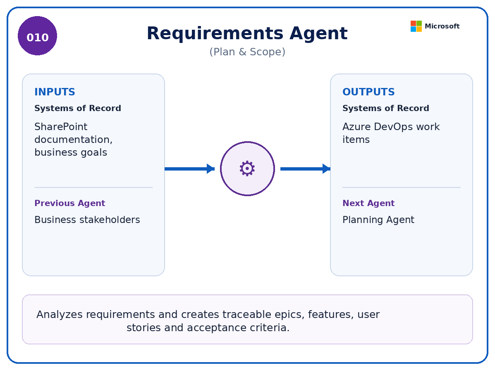

| Specialized agent | Direct Foundry portal | Microsoft Entra identity | Assigned roles |
| --- | --- | --- | --- |
| Requirements Agent | [Open `010-requirements-agent` v1](https://ai.azure.com/nextgen/r/hrN5aZRFSc-wP9iGYjUXHA,ai-myaacoub,,002-ai-poc-private,agentic-sdlc/build/agents/010-requirements-agent/build?version=1) | [Open identity `9d135912-5477-42f0-a387-66d2cafd4106`](https://entra.microsoft.com/#view/Microsoft_AAD_IAM/ManagedAppMenuBlade/~/Overview/objectId/9d135912-5477-42f0-a387-66d2cafd4106/appId/9d135912-5477-42f0-a387-66d2cafd4106) | None (Azure RBAC, Entra directory roles, application roles, and delegated grants) |

The Requirements Agent converts intake documents into a bounded, reviewable
statement of business intent before delivery planning begins.

- **Inputs:** requirements, goals, constraints, and priorities from human or
  business stakeholders plus functional, technical, and UX documents uploaded
  at intake. It is the first agent and has no previous-agent dependency.
- **Outputs:** scope summary, actors, functional and non-functional requirements,
  constraints, assumptions, risks, and traceable acceptance themes. The output
  remains editable proposal evidence for Backlog Generation Approval.

### 2. Planning Agent (Plan)

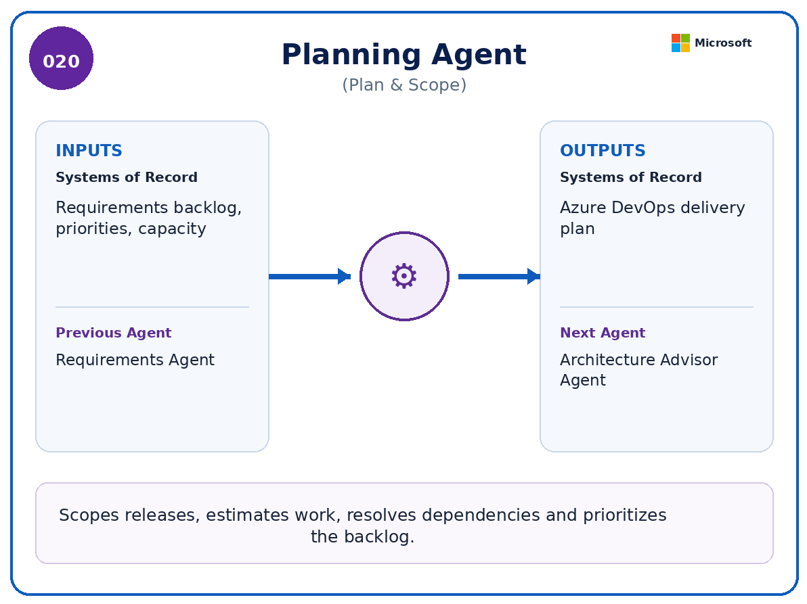

| Specialized agent | Direct Foundry portal | Microsoft Entra identity | Assigned roles |
| --- | --- | --- | --- |
| Planning Agent | [Open `020-planning-agent` v1](https://ai.azure.com/nextgen/r/hrN5aZRFSc-wP9iGYjUXHA,ai-myaacoub,,002-ai-poc-private,agentic-sdlc/build/agents/020-planning-agent/build?version=1) | [Open identity `88132928-d7f2-4b26-be9f-587761679517`](https://entra.microsoft.com/#view/Microsoft_AAD_IAM/ManagedAppMenuBlade/~/Overview/objectId/88132928-d7f2-4b26-be9f-587761679517/appId/88132928-d7f2-4b26-be9f-587761679517) | None (Azure RBAC, Entra directory roles, application roles, and delegated grants) |

The Planning Agent turns the approved requirements proposal into an actionable,
prioritized delivery hierarchy.

- **Inputs:** Requirements Agent output, source documents, project ownership,
  target environment, and configured Azure DevOps conventions.
- **Outputs:** editable Epic → Feature → User Story → Task hierarchy with
  descriptions, acceptance criteria, estimates, priorities, tags, and parent
  links. Approval publishes selected rows plus sprints, shared queries,
  dashboards, and the delivery plan idempotently to Azure DevOps.

### 3. Architecture Advisor Agent (Design)

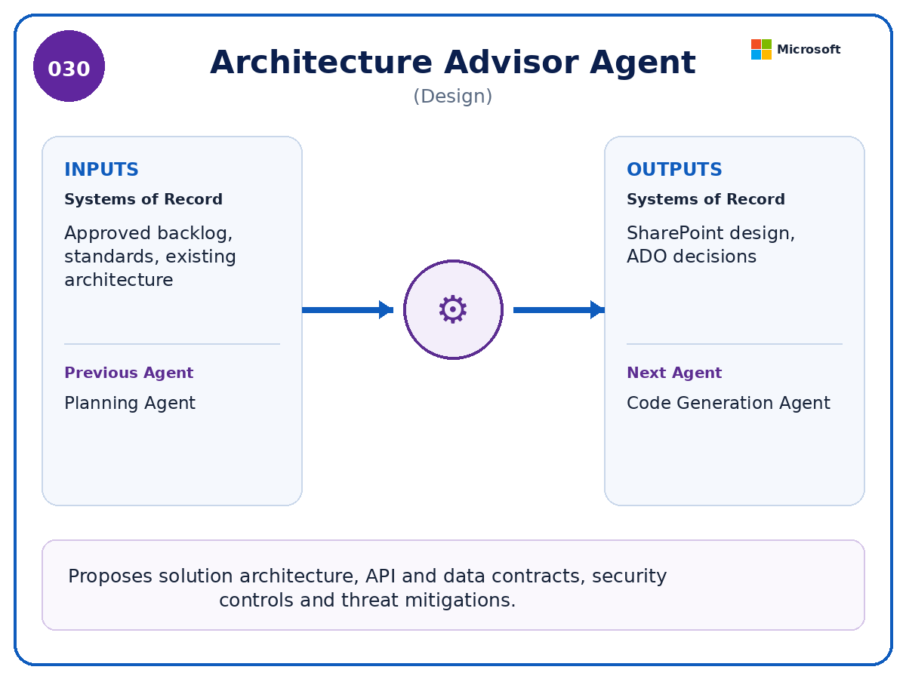

| Specialized agent | Direct Foundry portal | Microsoft Entra identity | Assigned roles |
| --- | --- | --- | --- |
| Architecture Advisor Agent | [Open `030-architecture-advisor-agent` v1](https://ai.azure.com/nextgen/r/hrN5aZRFSc-wP9iGYjUXHA,ai-myaacoub,,002-ai-poc-private,agentic-sdlc/build/agents/030-architecture-advisor-agent/build?version=1) | [Open identity `39bea73e-5b04-4bfa-979f-d1a9a9e2af37`](https://entra.microsoft.com/#view/Microsoft_AAD_IAM/ManagedAppMenuBlade/~/Overview/objectId/39bea73e-5b04-4bfa-979f-d1a9a9e2af37/appId/39bea73e-5b04-4bfa-979f-d1a9a9e2af37) | None (Azure RBAC, Entra directory roles, application roles, and delegated grants) |

The Architecture Agent translates the approved plan into an implementable and
secure technical design.

- **Inputs:** the Planning Agent's approved backlog in Azure DevOps and the
  related requirements and reference documents in the project's GitHub `docs/`
  folder.
- **Outputs:** solution architecture, data models, API contracts, security
  design, and threat-model documentation committed to GitHub `docs/`, with
  associated Azure DevOps work-item updates. The approved design is handed to the
  Code Generation Agent.

### 4. Code Generation Agent (Build)

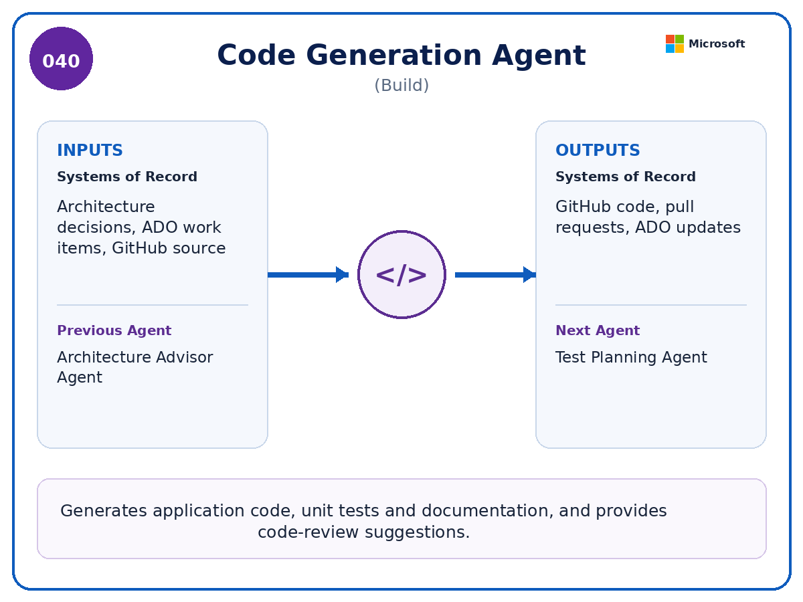

| Specialized agent | Direct Foundry portal | Microsoft Entra identity | Assigned roles |
| --- | --- | --- | --- |
| Code Generation Agent | [Open `040-code-generation-agent` v1](https://ai.azure.com/nextgen/r/hrN5aZRFSc-wP9iGYjUXHA,ai-myaacoub,,002-ai-poc-private,agentic-sdlc/build/agents/040-code-generation-agent/build?version=1) | [Open identity `45ee86b3-6afa-4755-b127-20907699dbba`](https://entra.microsoft.com/#view/Microsoft_AAD_IAM/ManagedAppMenuBlade/~/Overview/objectId/45ee86b3-6afa-4755-b127-20907699dbba/appId/45ee86b3-6afa-4755-b127-20907699dbba) | None (Azure RBAC, Entra directory roles, application roles, and delegated grants) |

The Code Generation Agent implements the approved design while keeping source
changes traceable to the backlog.

- **Inputs:** architecture decisions and acceptance criteria represented by
  Azure DevOps work items, plus the existing GitHub repository and source code.
- **Outputs:** generated or updated GitHub source code, unit tests, and code-review
  context, along with linked Azure DevOps work-item updates. The resulting
  implementation is handed to the independent Code Review Agent.

### 5. Code Review Agent (Build)

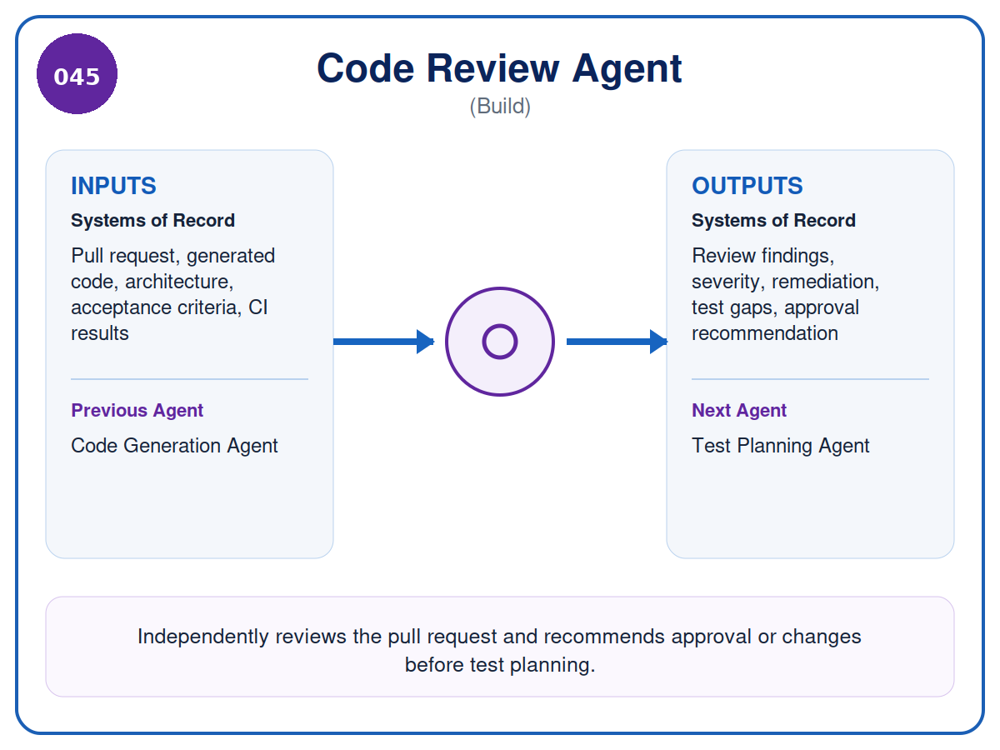

The Code Review Agent evaluates the generated pull request with a model that is
different from the Code Generation Agent's model. The role remains mandatory
and relevant when GitHub Copilot is selected because it reviews Copilot's pull
request rather than repeating code generation.

- **Inputs:** approved architecture and acceptance criteria, generated branch,
  pull-request diff and checks, provider-neutral repository evidence, tests,
  and prior approved artifacts.
- **Outputs:** prioritized findings with severity and file evidence,
  correctness/security/maintainability/test analysis, remediation guidance,
  release risk, and an explicit approve or request-changes recommendation for
  Pull Request Review Approval.

### 6. Test Planning Agent (Test)

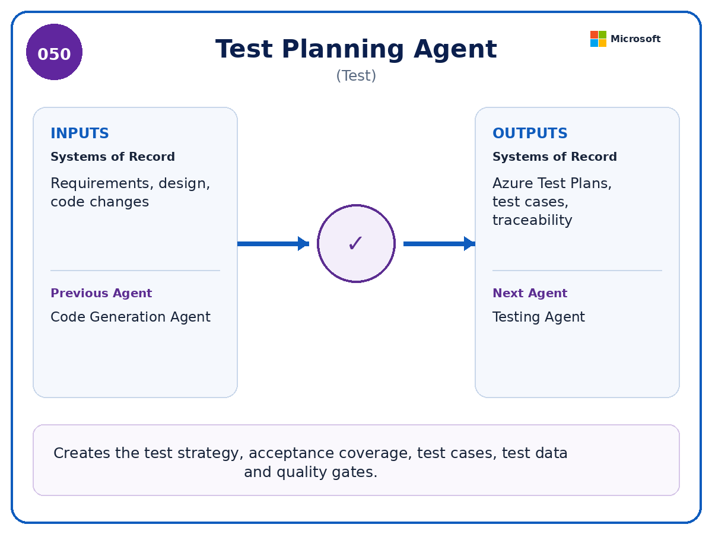

| Specialized agent | Direct Foundry portal | Microsoft Entra identity | Assigned roles |
| --- | --- | --- | --- |
| Test Planning Agent | [Open `050-test-planning-agent` v1](https://ai.azure.com/nextgen/r/hrN5aZRFSc-wP9iGYjUXHA,ai-myaacoub,,002-ai-poc-private,agentic-sdlc/build/agents/050-test-planning-agent/build?version=1) | [Open identity `743aa5fc-a82b-456d-8a2d-23a3e3ae426e`](https://entra.microsoft.com/#view/Microsoft_AAD_IAM/ManagedAppMenuBlade/~/Overview/objectId/743aa5fc-a82b-456d-8a2d-23a3e3ae426e/appId/743aa5fc-a82b-456d-8a2d-23a3e3ae426e) | None (Azure RBAC, Entra directory roles, application roles, and delegated grants) |

The Test Planning Agent turns requirements and acceptance criteria into a
traceable quality strategy before execution starts.

- **Inputs:** approved requirements, ADO acceptance criteria, architecture
  decisions, generated code structure, and configured test-management target.
- **Outputs:** editable unit, integration, security, performance, and UAT scope,
  plus idempotent Azure DevOps Test Plan, suite, and Test Case proposals.

### 7. Testing Agent (Test)

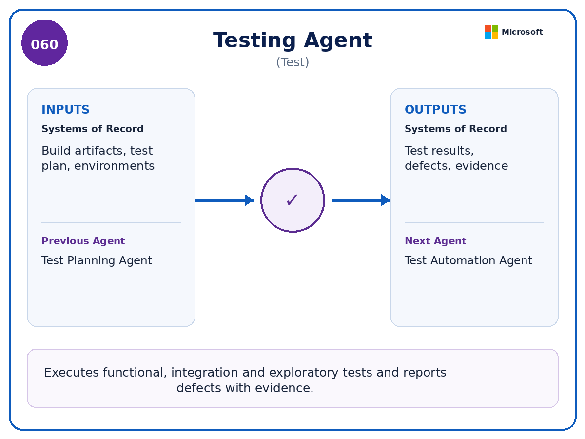

| Specialized agent | Direct Foundry portal | Microsoft Entra identity | Assigned roles |
| --- | --- | --- | --- |
| Testing Agent | [Open `060-testing-agent` v1](https://ai.azure.com/nextgen/r/hrN5aZRFSc-wP9iGYjUXHA,ai-myaacoub,,002-ai-poc-private,agentic-sdlc/build/agents/060-testing-agent/build?version=1) | [Open identity `30439d46-b245-4667-bd9a-ab28f2e424e4`](https://entra.microsoft.com/#view/Microsoft_AAD_IAM/ManagedAppMenuBlade/~/Overview/objectId/30439d46-b245-4667-bd9a-ab28f2e424e4/appId/30439d46-b245-4667-bd9a-ab28f2e424e4) | None (Azure RBAC, Entra directory roles, application roles, and delegated grants) |

The Testing Agent evaluates the implementation and available execution evidence
against the approved plan.

- **Inputs:** generated source and tests, CI status for the exact commit, test
  plan/cases, acceptance criteria, and prior defect history.
- **Outputs:** execution assessment, pass/fail evidence, gaps, defects, quality
  risks, and a recommendation for Test Acceptance Approval.

### 8. Test Automation Agent (Test)

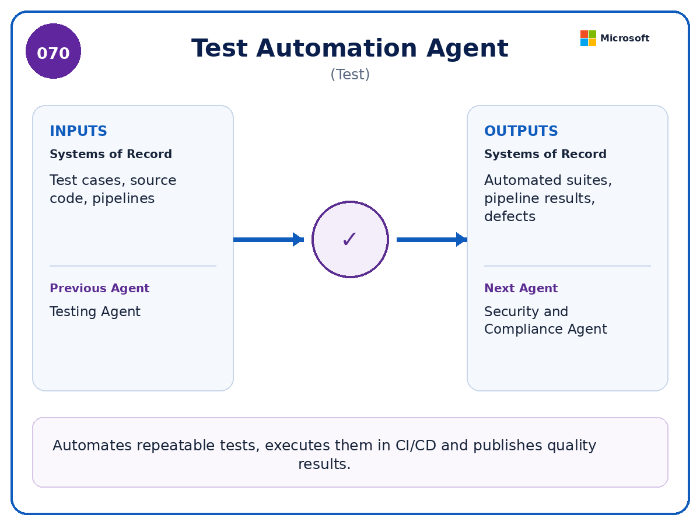

| Specialized agent | Direct Foundry portal | Microsoft Entra identity | Assigned roles |
| --- | --- | --- | --- |
| Test Automation Agent | [Open `070-test-automation-agent` v1](https://ai.azure.com/nextgen/r/hrN5aZRFSc-wP9iGYjUXHA,ai-myaacoub,,002-ai-poc-private,agentic-sdlc/build/agents/070-test-automation-agent/build?version=1) | [Open identity `eeaad823-e1c2-48cf-b0e6-180844f923fa`](https://entra.microsoft.com/#view/Microsoft_AAD_IAM/ManagedAppMenuBlade/~/Overview/objectId/eeaad823-e1c2-48cf-b0e6-180844f923fa/appId/eeaad823-e1c2-48cf-b0e6-180844f923fa) | None (Azure RBAC, Entra directory roles, application roles, and delegated grants) |

The Test Automation Agent converts the approved strategy into repeatable tests
and durable execution records.

- **Inputs:** test strategy, generated application, existing fixtures, pipeline
  provider, and Azure DevOps Test Plan/Test Case mappings.
- **Outputs:** automated unit/integration/security/UAT assets, CI pipeline links,
  plan-linked ADO Test Runs and results, automated Test Case status, and
  retry-safe evidence for Test Acceptance Approval.

### 9. Security and Compliance Agent (Security)

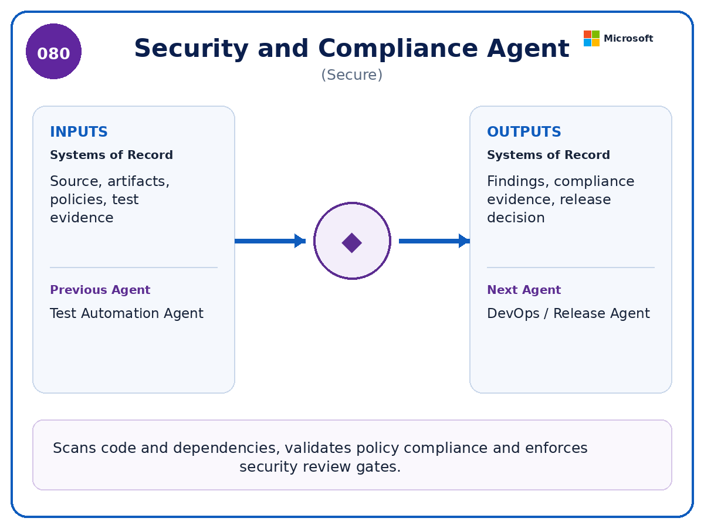

| Specialized agent | Direct Foundry portal | Microsoft Entra identity | Assigned roles |
| --- | --- | --- | --- |
| Security and Compliance Agent | [Open `080-security-compliance-agent` v1](https://ai.azure.com/nextgen/r/hrN5aZRFSc-wP9iGYjUXHA,ai-myaacoub,,002-ai-poc-private,agentic-sdlc/build/agents/080-security-compliance-agent/build?version=1) | [Open identity `291f8ac3-e65d-4e11-bfac-764a7d6c80dc`](https://entra.microsoft.com/#view/Microsoft_AAD_IAM/ManagedAppMenuBlade/~/Overview/objectId/291f8ac3-e65d-4e11-bfac-764a7d6c80dc/appId/291f8ac3-e65d-4e11-bfac-764a7d6c80dc) | None (Azure RBAC, Entra directory roles, application roles, and delegated grants) |

The Security and Compliance Agent independently assesses code, dependencies,
infrastructure, work items, test evidence, and release controls.

- **Inputs:** approved architecture, generated repository and pull request,
  dependency/IaC findings, test evidence, guardrails, and policy requirements.
- **Outputs:** prioritized findings, severity, control evidence, mitigations,
  residual risk, remediation work, and a promotion recommendation for Security
  Review Approval.

### 10. DevOps / Release Agent (Deploy)

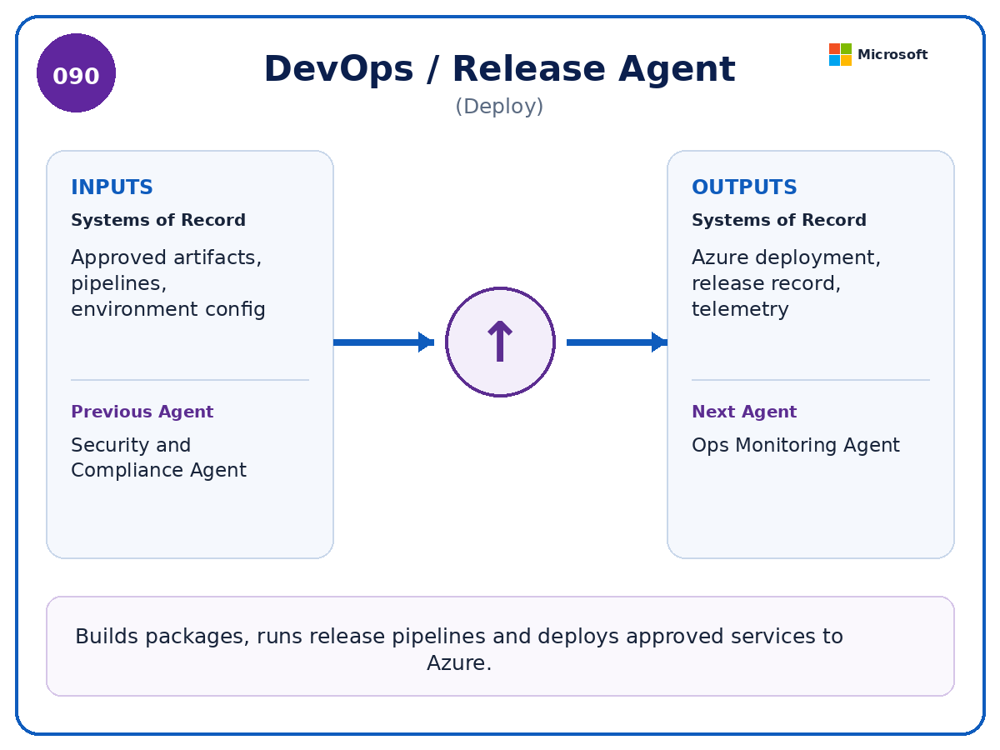

| Specialized agent | Direct Foundry portal | Microsoft Entra identity | Assigned roles |
| --- | --- | --- | --- |
| DevOps / Release Agent | [Open `090-devops-release-agent` v1](https://ai.azure.com/nextgen/r/hrN5aZRFSc-wP9iGYjUXHA,ai-myaacoub,,002-ai-poc-private,agentic-sdlc/build/agents/090-devops-release-agent/build?version=1) | [Open identity `49dc1a82-e6a7-4632-b13d-66a75e4aac1e`](https://entra.microsoft.com/#view/Microsoft_AAD_IAM/ManagedAppMenuBlade/~/Overview/objectId/49dc1a82-e6a7-4632-b13d-66a75e4aac1e/appId/49dc1a82-e6a7-4632-b13d-66a75e4aac1e) | None (Azure RBAC, Entra directory roles, application roles, and delegated grants) |

The DevOps / Release Agent owns the production-impacting release proposal and
publishes it only after PR, test, security, and release prerequisites pass.

- **Inputs:** reviewed pull request, exact-SHA CI/test evidence, security
  recommendation, hosting plan, environment policy, and OIDC configuration.
- **Outputs:** idempotent Azure resources, repository deployment settings,
  approved merge, deployment run, smoke-test results, hosted links, ADO project
  wiki, and Closed work-item evidence after successful publication.

### 11. Ops Monitoring Agent (Operate)

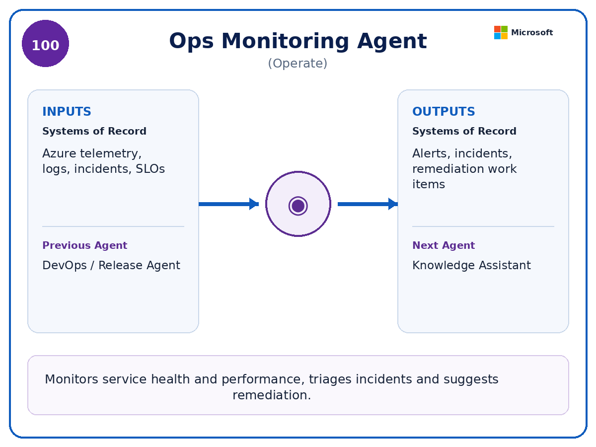

| Specialized agent | Direct Foundry portal | Microsoft Entra identity | Assigned roles |
| --- | --- | --- | --- |
| Ops Monitoring Agent | [Open `100-ops-monitoring-agent` v1](https://ai.azure.com/nextgen/r/hrN5aZRFSc-wP9iGYjUXHA,ai-myaacoub,,002-ai-poc-private,agentic-sdlc/build/agents/100-ops-monitoring-agent/build?version=1) | [Open identity `6671194a-cd5d-4857-aed9-6312ede897af`](https://entra.microsoft.com/#view/Microsoft_AAD_IAM/ManagedAppMenuBlade/~/Overview/objectId/6671194a-cd5d-4857-aed9-6312ede897af/appId/6671194a-cd5d-4857-aed9-6312ede897af) | None (Azure RBAC, Entra directory roles, application roles, and delegated grants) |

The Ops Monitoring Agent converts deployment context and telemetry into an
operational control plan.

- **Inputs:** live endpoints, Application Insights and Log Analytics signals,
  release evidence, service objectives, and operational ownership.
- **Outputs:** health indicators, alert thresholds, dashboard plan, incident
  triage, runbooks, rollback signals, and prioritized operational work items.

### 12. Knowledge Assistant (Operate)

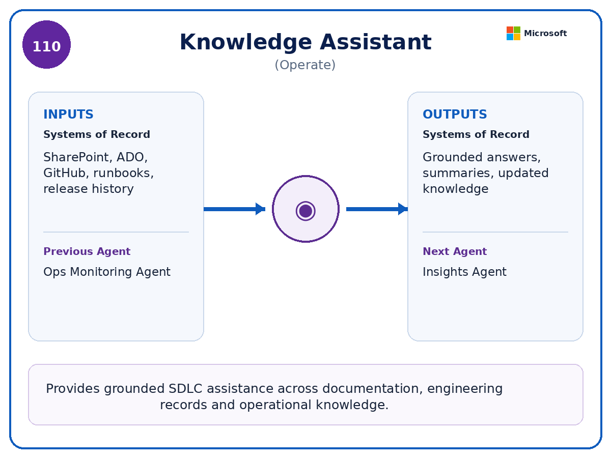

| Specialized agent | Direct Foundry portal | Microsoft Entra identity | Assigned roles |
| --- | --- | --- | --- |
| Knowledge Assistant | [Open `110-knowledge-assistant` v1](https://ai.azure.com/nextgen/r/hrN5aZRFSc-wP9iGYjUXHA,ai-myaacoub,,002-ai-poc-private,agentic-sdlc/build/agents/110-knowledge-assistant/build?version=1) | [Open identity `f5449ed3-fd4f-4e7d-9790-1e5af09192ad`](https://entra.microsoft.com/#view/Microsoft_AAD_IAM/ManagedAppMenuBlade/~/Overview/objectId/f5449ed3-fd4f-4e7d-9790-1e5af09192ad/appId/f5449ed3-fd4f-4e7d-9790-1e5af09192ad) | None (Azure RBAC, Entra directory roles, application roles, and delegated grants) |

The Knowledge Assistant assembles cited, access-aware guidance from approved
project and operational records without owning publication side effects.

- **Inputs:** intake documents, approved decisions, architecture, source docs,
  ADO/GitHub evidence, release links, telemetry context, and runbooks.
- **Outputs:** cited support brief, onboarding guidance, decision history,
  troubleshooting context, and knowledge gaps for project owners.

### 13. Insights Agent (Improve)

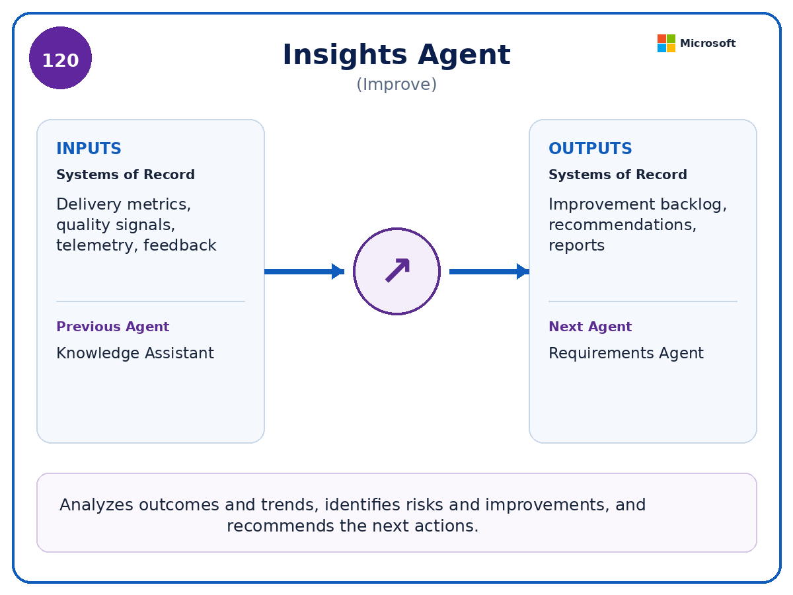

| Specialized agent | Direct Foundry portal | Microsoft Entra identity | Assigned roles |
| --- | --- | --- | --- |
| Insights Agent | [Open `120-insights-agent` v1](https://ai.azure.com/nextgen/r/hrN5aZRFSc-wP9iGYjUXHA,ai-myaacoub,,002-ai-poc-private,agentic-sdlc/build/agents/120-insights-agent/build?version=1) | [Open identity `4e49fe99-c780-461a-bcbe-9056894105c1`](https://entra.microsoft.com/#view/Microsoft_AAD_IAM/ManagedAppMenuBlade/~/Overview/objectId/4e49fe99-c780-461a-bcbe-9056894105c1/appId/4e49fe99-c780-461a-bcbe-9056894105c1) | None (Azure RBAC, Entra directory roles, application roles, and delegated grants) |

The Insights Agent closes the lifecycle by turning delivery and production data
into measurable improvements for the next iteration.

- **Inputs:** delivery lead time, approvals, test/security outcomes, telemetry,
  incidents, operational work items, and user/adoption metrics.
- **Outputs:** trends, thresholds, risks, improvement opportunities, and an
  ordered backlog written to Azure DevOps/GitHub only after the applicable
  approval policy succeeds. Its recommendations return to Planning.

### 14. Cost Estimator Agent (Improve)

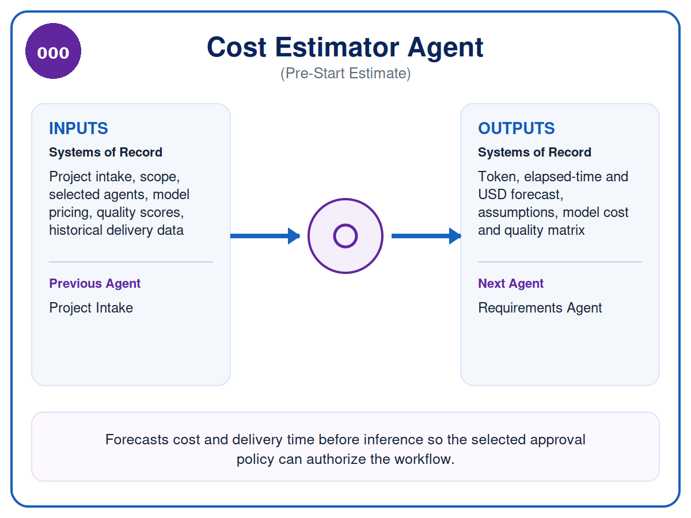

The Cost Estimator Agent has two advisory responsibilities: it supplies the
preflight cost-and-time estimate reviewed before inference, then analyzes the
completed workflow after Operate and Improve Approval so its updated forecast
can use the complete governed delivery record.

- **Inputs:** current project token and elapsed-time measurements, configured
  per-model planning rates and quality scores, model/routed-model identities,
  externally unmetered indicators, and recent completed-project statistics.
- **Outputs:** forecast token consumption and estimated USD total, assumptions,
  four-option all-in project cost and ROI, human hours and dollars saved,
  per-model cost observations, and an agent-by-model update matrix for lowest
  cost, highest quality, and balanced cost/quality.


## Features

- Responsive UI (phone / tablet / web) with role-aware navigation.
- Microsoft **Entra ID** + **email OTP** authentication.
- **New Project** wizard: intake with requirements, technical requirements, and
  UX mockup documents uploaded from disk, ADO & GitHub targets, environment,
  agent selection, one of three execution policies, and a pre-creation
  four-option cost/ROI comparison.
- **New Project Set** wizard: manual multi-project intake or ZIP folder import,
  shared agent/model configuration with per-project overrides, autonomous
  defaults, and bounded parallel workflow launch. Existing Projects groups the
  resulting work by live status and shows execution mode, stage/agent progress,
  running state, and expandable trace evidence with drill-through.
- **Persisted automation queue and circuit breaker** with restart recovery,
  bounded backoff, transient HTTP/Foundry retry, external CI polling, and
  deterministic failure surfacing for autonomous and minimally reviewed runs.
- **Automatic 14-agent continuation** through Microsoft Agent Framework after
  submission and every approval, with no per-agent Run buttons.
- **Completed-project revisions** from Requirements, Planning/Work Items, or
  Architecture, preserving the baseline and carrying forward valid approvals.
- **Ten approval gates** with approve / reject / request-changes / delegate.
- **14-agent visual workflow** with named Foundry identity, status, prerequisite,
  human checkpoint, and last-run evidence for every agent.
- **Human review workspace** with editable proposal content, multi-select
  artifacts/work items, and approval-time publication to ADO/GitHub/Azure.
- **Hierarchical ADO editor** with independent child selection, branch clearing,
  add/remove controls, stable viewport/focus after deletion, editable
  types/titles, and sanitized Rendered versus Raw HTML views.
- **Project deletion** with an explicit confirmation dialog and default-on,
  independently selectable cascade cleanup for workflow-created ADO projects,
  GitHub repositories, and captured Azure resources. Local workflow data is
  removed only after selected external cleanup succeeds; pre-existing linked
  resources are retained. A read-only **Deleted Projects** page remains in the
  left navigation and is backed by the append-only deletion audit record.
  A durable operation presents animated percentage and chronological trace
  messages while ADO, GitHub, each App Service, the plan, and local data are
  processed, and startup recovery resumes an interrupted deletion safely.
- **Business and technical owner email notifications** through Azure
  Communication Services for creation, actionable approval, terminal failure,
  and successful completion, with case-insensitive recipient deduplication and
  persisted event idempotency.
- **Release-generated ADO wiki** with an idempotent `/Project-Overview` page
  containing ownership, hosted UI/API/health/Swagger/OpenAPI links, source,
  pull request, deployment run, merge commit, stack, and governance context.
- **Visual in-app documentation** with high-level architecture, human/agent
  dataflow, Agent Framework patterns, and role diagrams for all 14 agents,
  including independent Code Review and Cost Estimation.
- **Configurable agents** — model, APIM route, tools, MCP servers, guardrails,
  token limits, and approval requirements are all data-driven.
- **APIM gateway layer** in front of Foundry with full audit logging.
- **Mock-safe and live connectors** for ADO, Jira, GitHub, test automation, local
  document upload, Foundry/APIM, and Azure provisioning.
- **Audit trail** for every user, agent, and approval action.
- **Portfolio cost and ROI reporting** with all-in project cost, configurable
  labor assumptions, human hours saved, dollar savings, and comparisons against
  totally manual AI orchestration.
- App Owner **user management** (roles + authentication method).

## Technology stack

| Layer | Technology |
| --- | --- |
| Frontend | Angular 18 (standalone) + Ionic 8, responsive |
| API | Python 3.13 / FastAPI (Uvicorn + Gunicorn) |
| Persistence | Azure Cosmos DB SQL API in production (`agentic_sdlc/state`, partitioned by `/_collection`); FileRepository under `api/data` for local development |
| Auth | Microsoft Entra ID + email OTP (Azure Communication Services) |
| Notifications | Azure Communication Services Email + persisted project-event idempotency |
| Gateway | Azure API Management in front of Azure AI Foundry |
| Hosting | Azure App Service (B2 plan) |

## Project setup prerequisites

The environment build, identity/RBAC boundaries, Azure service inventory,
APIM-only inference architecture, ordered Foundry Agent setup, connector
configuration, deployment sequence, and production-readiness checklist are in
the standalone [Project Setup Prerequisites](docs/PROJECT-SETUP-PREREQUISITES.md)
guide.

The guide includes a component architecture diagram covering Microsoft Entra
user and Agent Identities, Microsoft Foundry, Azure API Management, Microsoft
Agent Framework, Cosmos DB, App Service, Application Insights, Azure DevOps
APIs/MCP tools, GitHub APIs/MCP tools, and GitHub OIDC deployment.

## Repository layout

```
Foundry-Agentic-Workflow-SDLC/
├─ src/                      # Angular/Ionic UI
│  └─ app/
│     ├─ config/            # UI tier config
│     ├─ models/  services/  guards/  shell/  pages/
├─ api/                      # FastAPI/Python API
│  ├─ app/                  # Routes, services, Agent Framework workflow
│  ├─ tests/                # Python API tests
│  └─ src/                  # Shared tier config and legacy TS reference
│     ├─ config/            # API tier config (+ APIM, integrations, guardrails)
│     ├─ persistence/config # DB tier config
│     └─ agents/config      # Agent orchestration tier config
└─ .github/workflows/        # Component-scoped CI/CD (deploy only what changed)

Foundry-Agentic-Workflow-SDLC-Docs/
├─ README.md                 # Technical reference
└─ docs/                     # Diagrams, samples, setup guide, and reference deck
```

## Quick start (local)

Prerequisites: Python 3.13+ and Node.js 20+.

```powershell
# 1) API
cd api
python -m venv .venv
.venv\Scripts\python -m pip install -r requirements.txt
Copy-Item .env.example .env
.venv\Scripts\python -m uvicorn app.main:app --reload --port 8080

# 2) UI (new terminal, repo root)
npm install
npm start                         # http://localhost:8100 (proxies /api -> :8080)
```

Sign in with any email and OTP `000000` (dev bypass), or one of the seeded App
Owners. First run seeds the App Owners from
[`api/src/config/seed-users.json`](https://github.com/csdmichael/Foundry-Agentic-Workflow-SDLC/blob/main/api/src/config/seed-users.json).

## Authentication & roles

Two flows: **Entra ID** (MSAL bearer token validated against tenant JWKS) and
**email OTP** (SHA-256 hashed codes with TTL and rate limiting; app JWT issued
on verify). Roles: **Business User**, **IT User**, **Admin**, **App Owner**.
Details in [Security & guardrails](#security--guardrails).

Seeded App Owners:

- `admin@MngEnvMCAP829495.onmicrosoft.com` (Entra ID)
- `myaacoub@MngEnvMCAP829495.onmicrosoft.com` (Entra ID)
- `myaacoub@microsoft.com` (OTP)

## Human-in-the-loop approval gates

Cost & Time Estimate · Plan & Scope · Backlog Generation · Architecture & Design ·
Code Generation · Pull Request · Test Acceptance · Security Review ·
Release & Deployment · Operate & Improve.

No agent advances when its `runAfterGateName` prerequisite is missing. Agent
output is persisted as `AwaitingApproval`; integrations do not run at generation
time. The approval API validates RBAC, selected `artifactRefs`, artifact/gate
ownership, and review state before publishing. A direct API call therefore
cannot bypass either the prerequisite gate or output review.

Project intake selects one policy:

- **Human review at every stage** pauses at all ten gates.
- **Minimal human intervention** pauses at the Cost & Time Estimate, Backlog,
  Architecture, Pull Request, and Release gates; evidence-based routine,
  quality, and security gates approve automatically.
- **Fully autonomous** validates and records every gate automatically, including
  required artifact and tool evidence, and continues to completion.

In all modes, approval or request-changes immediately re-enters the Agent
Framework graph. A change request includes the reviewer comment in the owning
agent's revised prompt. A failed automated run stops visibly and can be retried
at workflow level.

Approval evidence is gate-specific and configured with the agents. Backlog
Generation cannot close unless the selected artifacts include a Planning Agent
hierarchy. Pull Request Review cannot close until Code Generation has produced
a real GitHub pull-request URL. An authorized approver can reopen a closed gate
for rework only with an audit comment; the gate returns to `AwaitingApproval`
without replaying side effects. Release fails and remains awaiting approval when
the generated PR is absent or GitHub does not report it as merged.

| Gate | Human reviews before approval | Approved side effect |
| --- | --- | --- |
| Plan & Scope | Intake, owners, environment, selected agents | Unlock Requirements and Planning proposals |
| Backlog Generation | Requirements plus a required, selected Planning Agent hierarchy | Publish requirements and create selected ADO Epic/Feature/Story/Task rows, sprints, queries, dashboards, and delivery plan |
| Architecture & Design | Editable architecture, APIs, data, threat model | Publish approved design to GitHub `docs/` |
| Code Generation | Editable implementation and code-structure proposal | Create generated branch and pull request; never merge |
| Pull Request Review | Generated branch, files, PR checks, and real PR URL | Record review evidence and unlock release; approval is rejected when no generated PR exists |
| Test Acceptance | Test plan, cases, automation proposal and evidence | Create selected test assets and queue approved automation |
| Security Review | Findings, severities, remediation proposal | Unlock release proposal only when accepted |
| Release & Deployment | Hosting, pipeline, merge and smoke-test plan | Provision, configure, require a successful/already-complete reviewed PR merge, publish and verify |
| Operate & Improve | Monitoring and insights proposals | Accept operational actions and next-cycle recommendations |

Every decision stores approver, role, timestamp, decision, comments,
previous/next state, delegation target, and artifact references. Every proposal
edit, blocked run, publication, decision, and agent action is written to audit.

## Specialized agents

Cost Estimator · Requirements · Planning · Architecture Advisor · Code
Generation · Code Review · Test Planning · Testing · Test Automation · Security
& Compliance · DevOps / Release · Ops Monitoring · Knowledge Assistant ·
Insights. Each is
configured in
[`api/src/agents/config/agents.config.json`](https://github.com/csdmichael/Foundry-Agentic-Workflow-SDLC/blob/main/api/src/agents/config/agents.config.json)
and editable in **Admin ▸ Agent Configuration**.

Configured governed destinations:

- Requirements assets: the `docs/` folder of the project's own GitHub
  repository, alongside the documents uploaded at intake.
- Planning output: Azure DevOps or Jira, according to the project's Work Items
  selection, with an Epic → Feature → User Story → Task hierarchy.
- Coding output: a repository in the `csdmichael` GitHub account; generated
  output is committed but never auto-merged.
- Test planning and execution: Azure Test Plans/test cases or Jira test assets,
  according to the Test Cases & Test Plans selection, then the supported
  automation runner.

## Systems of Record configuration

Global settings define where each class of SDLC output is tracked. **Every
project inherits them unless it overrides a specific row.** The roots are listed
in [Systems of Record — root URLs](#systems-of-record--root-urls).

| System of Record | Default | Alternatives |
| --- | --- | --- |
| Documentation | GitHub `docs/` folder in the project repository | Azure DevOps Wiki, GitHub Wiki |
| Work Items Tracking | <https://dev.azure.com/csdmichael> | Jira at <https://csdmichael.atlassian.net/jira/software/projects>, GitHub Issues |
| Test Cases & Test Plans Tracking | <https://dev.azure.com/csdmichael> | Jira at <https://csdmichael.atlassian.net/jira/software/projects>, GitHub Issues |
| Code Build / Pipelines | <https://dev.azure.com/csdmichael> | GitHub Actions |
| Source Code Org | <https://github.com/csdmichael> | Azure Repos |

- **Defaults** live in
  [`api/src/config/systems-of-record.config.json`](https://github.com/csdmichael/Foundry-Agentic-Workflow-SDLC/blob/main/api/src/config/systems-of-record.config.json).
  Its `catalog` block drives both the UI form and server-side provider validation.
- **Global overrides** are edited under **Admin ▸ Global Settings**
  (`config.manage` capability) and stored in the persistence tier.
- **Project overrides** are set in the New Project wizard (pre-populated from the
  global values) and on the project detail page (`projects.manage` capability).
  Only overridden keys are stored; the rest keep inheriting.

Resolution order is `config default → global override → project override`. The
API rejects unknown keys, unsupported providers, and non-`https://` URLs, and
audits every settings change.

For Work Items and Test Cases & Test Plans, choosing **Jira** immediately sets
the row URL to the canonical projects root
`https://csdmichael.atlassian.net/jira/software/projects`. The API applies the
same provider-specific default while validating global settings, project
overrides, and inherited historical records, so a stale Azure DevOps URL cannot
survive a provider change. Generated project links append the Jira project key;
issue, test-plan, and test-case links use the site-level `/browse/{ISSUE_KEY}`
route.

## System of record provisioning & REST wrappers

Creating a project in the UI stands up its real homes before the first agent
runs:

| System | What is created | Where |
| --- | --- | --- |
| Azure DevOps | A project (Agile process, Git) | <https://dev.azure.com/csdmichael> |
| GitHub | A repository, plus the intake uploads under `docs/intake/` | <https://github.com/csdmichael> |

Jira is created or reused on demand when an approved Planning or Test Planning
artifact is published and the corresponding project asset class selects Jira.
It is not part of the initial Azure DevOps/GitHub intake provisioning pair.

### Naming

The Azure DevOps project and the GitHub repository are both named after the SDLC
project. A project called `Casino Floor Service` produces the ADO project
`Casino Floor Service` and the GitHub repository `casino-floor-service` — ADO
keeps spaces and strips punctuation, GitHub is slugified.

The wizard's **Azure DevOps project** and **GitHub repository** fields are
overrides, not defaults. Leave them blank to inherit the project name; fill one
in only to target an existing shared project or repository.

### Visibility

Azure DevOps project visibility is fixed to **Private** because the configured
organization rejects public projects. GitHub repositories independently support
**Public** or **Private**, with Public as the demo default. **In production the
recommended default is private.**

Both the default and the allowed values come from `integrations.config.json` →
`visibility`, so flipping an environment to private-by-default is a config change
(`"default": "private"`), not a code change. The API validates the value and
records the resolved visibility on each provisioning entry.

Each connector is provisioned independently. A failure is recorded on the
project and shown on the detail page rather than blocking intake; **Retry
provisioning** (or `POST /api/projects/{id}/provision`) re-runs it once the
missing credential is in place. Toggle any of them in
`integrations.config.json` → `provisionOnProjectCreate`.

As the workflow proceeds, approved agent output goes to the selected targets:
the Planning Agent creates a real linked Epic → Feature → User Story → Task
hierarchy in the project's ADO backlog or Jira project, and the Code Generation
Agent creates a branch, commits its output, and opens a pull request — never a
merge.

After release publication, the DevOps / Release Agent ensures a project wiki
and creates or updates `/Project-Overview` with the project description,
ownership, hosted UI, API health, Swagger/OpenAPI, repository, pull request,
deployment workflow/run, merge commit, stack, and approval-governance context.
Updates use the current page ETag and do not create duplicate pages.

### Parallel project sets

`New Project Set` creates between 2 and 20 projects in one governed operation.
Every project keeps its own persisted project, workflow run, Agent Framework
checkpoint, approval gates, connector targets, and audit events. Once intake is
validated and each run is queued, the API advances independent runs through a
bounded worker pool; model execution still crosses the configured APIM gateway.

The wizard starts every project in **Fully autonomous** mode and lets the user
choose Minimal review or Human review independently. Agent participation and
model deployments are selected once for the set. A project-level **Override**
button clones those effective settings before editing, so changing one project
never mutates the shared policy or another project.

For fast intake, a ZIP contains one top-level folder per project. Each folder
must have one functional requirements document and can include one UX mockup
and one technical requirements document. Names containing `functional` or
`requirements`, `ux` or `mockup`, and `technical` are classified automatically.
An optional `project.json` can supply the project name, owners, environment,
automation mode, description, and explicit document paths. When the description
is blank, the API derives a two- or three-sentence extractive summary from the
functional requirements and sends it to the Azure DevOps project landing page.
Before any project is provisioned,
the API rejects traversal paths, links, encrypted entries, duplicate document
roles, unsupported types, archives over 100 MB, expansion over 250 MB, and
documents over 25 MB.

Existing Projects groups all visible projects by workflow-aware status and
shows the configured execution mode with a mode-specific icon, lifecycle
percentage, current stage, environment, owner, project-set membership, active
animation, and expandable trace. Finished work is grouped as **Complete** rather
than Approved, and autonomous cards do not present human-approval status.
Selecting a project opens its existing single-project detail and governance
workspace with the same execution-mode icon beside the project name.

Authorized project managers can permanently delete a local project with
`DELETE /api/projects/{id}`. The confirmation UI checks both ADO and GitHub
cascade options by default, but either can be cleared. Only SOR resources whose
provisioning status proves they were created by this workflow are deleted;
pre-existing targets are retained. Selected external cleanup runs before local
workflow, gate, artifact, intake, and agent-run records are removed, while the
append-only deletion audit event remains.

The **Deleted Projects** item in the left navigation reads that append-only
history through `GET /api/projects/deleted`. It is intentionally not a recycle
bin: cascade deletion is irreversible, while the page preserves a sanitized
record of project identity, execution mode, last workflow state, deletion actor
and timestamp, and ADO/GitHub/Azure cleanup status.

Provisioning and publication calls are idempotent. If an ADO project or GitHub
repository already exists, the connector records and reuses its canonical URL
instead of failing the workflow. Transient connector and APIM failures enter the
persisted retry policy; organization-specific optional ADO fields degrade
without discarding the work-item state, history, or evidence links.

Every connector is also exposed as a governed REST wrapper under
`/api/integrations` (`integrations.read` to read, `integrations.write` to
mutate, audit-logged either way) covering GitHub repos/branches/contents/pull
requests/issues/Actions, Azure DevOps projects/repos/branches/work
items/backlog/test plans/pipelines. See
[System-of-record REST wrappers](#system-of-record-rest-wrappers) for the
endpoint list.

Connectors start in mock mode, and each one is flipped **independently** — a
provisioning entry reading `mocked` while another reads `created` means only that
connector still lacks its credential pair. Provide credentials, flip `useMock`
(or set `ADO_LIVE` / `GITHUB_LIVE` to `1`), then verify:

```powershell
./scripts/set-connector-secrets.ps1 -AdoPat -GitHubPat   # masked input, no disk writes
cd api; .\.venv\Scripts\Activate.ps1
python scripts/verify_connectors.py --create             # creates a throwaway project in each
```

Azure DevOps needs **both** `ADO_PAT` and `ADO_LIVE=1` on the API app settings.
The organization rejects the App Service managed identity, so the PAT is
required — there is no Entra fallback for `dev.azure.com/csdmichael`.

## Configuration guide

No secrets are stored in source. Non-secret settings live in per-tier config
files; secrets come from environment variables or Azure managed identity.
`.env` files are git-ignored.

### Environment variables (API)

Copy [`api/.env.example`](https://github.com/csdmichael/Foundry-Agentic-Workflow-SDLC/blob/main/api/.env.example) to `api/.env` for local dev.

| Variable | Purpose |
| --- | --- |
| `AUTH_ENTRA_TENANT_ID` | Entra tenant for token validation |
| `AUTH_ENTRA_UI_CLIENT_ID` / `AUTH_ENTRA_API_CLIENT_ID` | App registrations |
| `AUTH_JWT_SIGNING_KEY` | HMAC key for OTP-user app JWTs |
| `AUTH_ACS_CONNECTION_STRING` / `AUTH_ACS_SENDER_ADDRESS` | ACS email for OTP, access requests, and project-owner lifecycle notifications |
| `AUTH_OTP_DEV_BYPASS` | `1` accepts OTP `000000` (DEV ONLY) |
| `AUTH_ALLOW_ANONYMOUS` | `1` runs all requests as app_owner (DEV ONLY) |
| `PERSIST_PROVIDER` | `cosmos` in production; `file` for local development |
| `PERSIST_COSMOS_ENDPOINT` / `PERSIST_COSMOS_DATABASE` | Cosmos SQL endpoint and database; production uses managed identity and `agentic_sdlc` |
| `PERSIST_COSMOS_CONTAINER` | Shared state container; production uses `state` with partition key `/_collection` |
| `PERSIST_COSMOS_CONNECTION_STRING` | Optional local/emulator credential; leave empty in Azure because local auth is disabled |
| `PERSIST_MIGRATE_FILE_TO_COSMOS` | One-time guarded import from `PERSIST_FILE_DATA_ROOT`; set back to `0` after the migration marker is verified |
| `PERSIST_FILE_DATA_ROOT` | Local/file-store data root |
| `APIM_SUBSCRIPTION_KEY` | APIM subscription key for Foundry |
| `FOUNDRY_ALLOW_DIRECT` | `1` allows direct Foundry calls (LOCAL DEV ONLY) |
| `FOUNDRY_MODEL_MANAGEMENT_LIVE` | `1` enables live deployment discovery and project-scoped Prompt Agent version management; inference still uses APIM |
| `ADO_PAT` | Azure DevOps project, work item, test plan, and pipeline permissions |
| `JIRA_EMAIL` / `JIRA_API_TOKEN` | Jira Cloud Basic authentication for project, issue, test-plan, and test-case operations |
| `GITHUB_PAT` | GitHub repository and Actions permissions |
| `ADO_LIVE` / `JIRA_LIVE` / `GITHUB_LIVE` | `1` flips that connector out of mock mode |

Use [`scripts/set-connector-secrets.ps1`](https://github.com/csdmichael/Foundry-Agentic-Workflow-SDLC/blob/main/scripts/set-connector-secrets.ps1) to
capture PATs with masked input and write them straight to the App Service
settings — the values never touch disk or appear in logs.

### Per-tier config files

- **UI**: [`src/app/config/ui.config.ts`](https://github.com/csdmichael/Foundry-Agentic-Workflow-SDLC/blob/main/src/app/config/ui.config.ts) — API base URL, identity, nav.
- **API**: [`api.config.json`](https://github.com/csdmichael/Foundry-Agentic-Workflow-SDLC/blob/main/api/src/config/api.config.json), [`apim.config.json`](https://github.com/csdmichael/Foundry-Agentic-Workflow-SDLC/blob/main/api/src/config/apim.config.json), [`integrations.config.json`](https://github.com/csdmichael/Foundry-Agentic-Workflow-SDLC/blob/main/api/src/config/integrations.config.json), [`guardrails.config.json`](https://github.com/csdmichael/Foundry-Agentic-Workflow-SDLC/blob/main/api/src/config/guardrails.config.json), [`permissions.config.json`](https://github.com/csdmichael/Foundry-Agentic-Workflow-SDLC/blob/main/api/src/config/permissions.config.json), [`systems-of-record.config.json`](https://github.com/csdmichael/Foundry-Agentic-Workflow-SDLC/blob/main/api/src/config/systems-of-record.config.json).
- **DB**: [`api/src/persistence/config/persistence.config.json`](https://github.com/csdmichael/Foundry-Agentic-Workflow-SDLC/blob/main/api/src/persistence/config/persistence.config.json).
- **Agents**: [`api/src/agents/config/agents.config.json`](https://github.com/csdmichael/Foundry-Agentic-Workflow-SDLC/blob/main/api/src/agents/config/agents.config.json).

### Cosmos DB production persistence

[`persistence.config.json`](https://github.com/csdmichael/Foundry-Agentic-Workflow-SDLC/blob/main/api/src/persistence/config/persistence.config.json)
defines the production database, shared container, and partition key. Run the
manual [Cosmos provisioning workflow](https://github.com/csdmichael/Foundry-Agentic-Workflow-SDLC/blob/main/.github/workflows/provision-cosmos.yml)
to idempotently create `agentic_sdlc/state`, validate the policy-managed private
endpoint and DNS path, integrate the API with `snet-appservice`, and grant its
managed identity database-scoped Cosmos DB Built-in Data Contributor access.
The workflow never changes Cosmos public access, firewall, bypass, IP rules,
private endpoints, or private DNS.

For an existing file deployment, freeze writes, set the Cosmos variables plus
`PERSIST_MIGRATE_FILE_TO_COSMOS=1`, and restart. Startup imports every collection
and encoded Agent Framework checkpoint, checks Cosmos item-size limits, and
writes the migration marker last. Verify `/api/health` reports
`"persistence":"cosmos"` and compare project/run/evidence IDs before setting
the migration flag back to `0`. Keep the old file store as rollback evidence.

### Enabling real integrations

Each connector in `integrations.config.json` has `useMock: true` by default.
Set it to `false` (or set the matching `*_LIVE=1` environment variable) and
provide credentials to switch from the mock to the live implementation.

- **Azure DevOps**: set `ADO_PAT`, confirm `organizationUrl` is
  <https://dev.azure.com/csdmichael>, and set `azureDevOps.useMock` to `false`.
  Without a PAT the connector falls back to an Entra ID token for the Azure
  DevOps resource, which only works when the organization is backed by the same
  tenant.
- **Jira**: set `JIRA_EMAIL` and `JIRA_API_TOKEN`, confirm `projectsUrl` is
  <https://csdmichael.atlassian.net/jira/software/projects>, and set
  `jira.useMock` to `false` or `JIRA_LIVE=1`.
- **GitHub**: set `GITHUB_PAT` (`repo` + `workflow`) for
  <https://github.com/csdmichael>. `github.accountType` is auto-detected, so both
  user accounts and organizations work.
- **Testing**: choose `azure-pipelines` or `github-actions` in
  `testAutomation.defaultRunner`. Configure `azurePipelineId`, or
  `githubWorkflow` and `githubRef`, then disable mock mode for the selected
  backing connector.

Verify credentials end to end before enabling a connector in production:

```powershell
cd api; .\.venv\Scripts\Activate.ps1
python scripts/verify_connectors.py                    # connectivity only
python scripts/verify_connectors.py --create           # creates a throwaway project
```

Turning off a mock does not bypass workflow controls. The named human approval
gate is evaluated by the Agent Framework approval executor before any connector
receives the request.

### System-of-record REST wrappers

The API exposes each connector under `/api/integrations` so the UI, the agents,
and operators share one governed code path. Reads need `integrations.read`;
every mutation needs `integrations.write` and is written to the audit log.

| Area | Endpoints |
| --- | --- |
| Status | `GET /api/integrations/status`, `GET /api/integrations/provisioning/preview?name=` |
| Project lifecycle | `GET /api/projects/deleted`; `POST /api/projects/{id}/deletion` starts durable cleanup; `GET /api/projects/deletions/{operationId}` polls progress; synchronous `DELETE /api/projects/{id}` remains for compatibility |
| Project sets | `GET /api/project-sets`, `GET /api/project-sets/{id}`, `POST /api/project-sets/intake`, `POST /api/project-sets/zip/preview`, `POST /api/project-sets/zip` |
| GitHub | `GET/POST /github/repos`, `GET /github/repos/{repo}`, `GET/POST /github/repos/{repo}/branches`, `GET/PUT /github/repos/{repo}/contents`, `GET/POST /github/repos/{repo}/pulls`, `POST /github/repos/{repo}/issues`, `GET /github/repos/{repo}/workflows`, `POST /github/repos/{repo}/workflows/{workflow}/dispatches` |
| Azure DevOps | `GET/POST /ado/projects`, `GET /ado/projects/{project}`, `GET/POST /ado/projects/{project}/repos`, `GET/POST /ado/projects/{project}/repos/{repo}/branches`, `GET/POST /ado/projects/{project}/workitems`, `PATCH /ado/projects/{project}/workitems/{id}`, `POST /ado/projects/{project}/backlog`, `POST /ado/projects/{project}/testplans`, `POST /ado/projects/{project}/testcases`, `GET /ado/projects/{project}/pipelines`, `POST /ado/projects/{project}/pipelines/{id}/runs` |

## Security & guardrails

### Principles

- **No secrets in code.** Secrets come from environment variables or Azure
  managed identity. `.env` files are git-ignored.
- **Human approval before consequential actions.** Work item creation, repo
  creation, pipeline changes, documentation publishing, Azure provisioning, and
  deployment all require an approved gate. Enforcement is server-side.
- **Defense in depth for authorization.** The UI hides unauthorized navigation
  and the API independently blocks unauthorized calls — bypassing the UI cannot
  bypass authorization.

### Role permissions

| Role | Capabilities |
| --- | --- |
| Business User | Create projects, ingest requirements/mockups, review outputs, approve business gates |
| IT User | Review technical design, repos, pipelines, provisioning plans, tests, deployment gates |
| Admin | All functionality except adding or removing people |
| App Owner | Everything Admin can do **plus** user maintenance (add/edit/remove users, set auth method) |

The matrix is data-driven: defaults live in
[`api/src/config/permissions.config.json`](https://github.com/csdmichael/Foundry-Agentic-Workflow-SDLC/blob/main/api/src/config/permissions.config.json)
and App Owner / Admin (`roles.manage`) can edit it under
**Admin ▸ Role Permissions**. Two invariants are enforced server-side and cannot
be overridden:

- `users.manage` is **locked to App Owner** — only the owner can grant or revoke
  access to the application.
- App Owner always holds every capability, and the API refuses to remove or
  demote the last active App Owner.

### Guardrail policies

Configured in [`api/src/config/guardrails.config.json`](https://github.com/csdmichael/Foundry-Agentic-Workflow-SDLC/blob/main/api/src/config/guardrails.config.json)
and evaluated before (`pre`) and after (`post`) each agent output:

- **Content Safety** — screens for harmful content (wire to Foundry Content
  Safety through APIM in production).
- **PII Redaction** — redacts detected PII before persistence.
- **Secret Scanning** — blocks outputs containing apparent secrets/keys/tokens.
- **Human Approval Required** — blocks stage promotion when a gate is missing.

Blocking findings set the agent run to `Blocked` and are written to the audit trail.

### Correlation & audit

A correlation ID is generated in the UI and propagated via the
`x-correlation-id` header across UI → API → APIM → agent calls → audit logs.
Every user action, agent action, and approval decision is recorded in the
audit trail.

### Upload validation

Uploaded files are validated against allowed extensions and a maximum size
defined in [`api.config.json`](https://github.com/csdmichael/Foundry-Agentic-Workflow-SDLC/blob/main/api/src/config/api.config.json).

## Testing

```powershell
# API (from repository root)
$env:PYTHONPATH='api'
api\.venv\Scripts\python.exe -m pytest api\tests -q

# UI unit tests and production build
npm test -- --no-watch --browsers=ChromeHeadless
npm run build
```

Current validated baseline: **259 API tests** and **91 Angular tests**, followed
by a successful production bundle. Focused coverage includes all three workflow
modes, the four-option ROI calculations and pre-creation endpoint, canonical
Jira project/issue links, persisted retry/circuit behavior, refusal recovery, connector
idempotency, project deletion history, owner-recipient deduplication, one email
per approval/completion event, repeated genuine failure notification, and
creation rollback without a false notification.

## Deployment (CI/CD)

Component-scoped workflows deploy **only the changed component** using path
filters and Azure OIDC federated login (no stored client secrets):

- [`.github/workflows/deploy-ui.yml`](https://github.com/csdmichael/Foundry-Agentic-Workflow-SDLC/blob/main/.github/workflows/deploy-ui.yml) — on `src/**` changes.
- [`.github/workflows/deploy-api.yml`](https://github.com/csdmichael/Foundry-Agentic-Workflow-SDLC/blob/main/.github/workflows/deploy-api.yml) — on `api/**` changes.
- [`.github/workflows/provision-cosmos.yml`](https://github.com/csdmichael/Foundry-Agentic-Workflow-SDLC/blob/main/.github/workflows/provision-cosmos.yml) — manual, idempotent private Cosmos database/container, VNet, and database-scoped RBAC provisioning.
- [`.github/workflows/ci.yml`](https://github.com/csdmichael/Foundry-Agentic-Workflow-SDLC/blob/main/.github/workflows/ci.yml) — build + test both on PRs.

Set repository variables `UI_WEBAPP_NAME` / `API_WEBAPP_NAME` and secrets
`AZURE_CLIENT_ID`, `AZURE_TENANT_ID`, `AZURE_SUBSCRIPTION_ID` (environment-scoped
secrets on the `production` environment take precedence over repository-scoped ones).

GitHub issues **ID-qualified OIDC subjects**, so the Entra app registration needs a
federated credential whose subject includes the owner and repository IDs:

```
repo:<owner>@<ownerId>/<repo>@<repoId>:environment:production
```

A legacy `repo:<owner>/<repo>:environment:production` credential alone fails with
`AADSTS700213`.

The API managed identity normally creates or verifies this credential and needs
Microsoft Graph application role `Application.ReadWrite.OwnedBy` on an OIDC app
registration it owns. For an operator-led recovery, an Entra owner may create and
verify the exact credential first, temporarily set `GITHUB_FIC_PREPROVISIONED=1`,
run the release, and remove the setting immediately afterward. This flag skips
only Graph mutation; GitHub variables/secrets, PR merge checks, and all approval
gates still run. Fresh merges rely on the workflow's `push` trigger; explicit
dispatch is reserved for already-merged retries, and generated workflows cancel
duplicate runs for the same ref.

## Troubleshooting

| Symptom | Likely cause | Fix |
| --- | --- | --- |
| `401 Missing bearer token` on API calls | Not signed in / token expired | Sign in again. In dev, set `AUTH_ALLOW_ANONYMOUS=1` to bypass. |
| OTP email never arrives | ACS not configured | Dev mode logs the code to the API console and `api/data/otp-log.json`, or use `000000` when `AUTH_OTP_DEV_BYPASS=1`. |
| Project owner notification never arrives | Business/technical owner is blank or invalid, ACS is not configured, or delivery failed | Confirm the owner email fields and `AUTH_ACS_CONNECTION_STRING` / `AUTH_ACS_SENDER_ADDRESS`. Search Audit Trail for `project.notification.*`; the event records `Delivered`, `Failed`, or `Skipped` without failing the workflow. |
| `403 Forbidden: insufficient role` | Role lacks the capability | Adjust the role under **Admin ▸ Role Permissions**, or have an App Owner change the user's role under **Admin ▸ User Management**. |
| `403 Human approval required before stage` | Stage gate not approved | Approve the corresponding gate in the Human Approval Queue first. |
| Backlog gate cannot approve | No selected Planning Agent artifact | Run Planning, review/select its hierarchy, then approve. A Requirements summary alone cannot create the ADO backlog. |
| PR Review gate cannot approve | Code Generation has not produced a real PR URL | Approve Code Generation and review the generated GitHub PR before approving PR Review. |
| Release stays awaiting approval | Generated PR is missing/unmergeable or OIDC setup failed | Resolve the PR or repository-scoped FIC error and retry; Release never records success when GitHub reports `merged: false`. |
| Autonomous Test Acceptance shows queued while CI runs | Generated-code CI is still queued or in progress | No action is required. The workflow polls the existing feature-branch run and resumes automatically after successful CI evidence appears. |
| Autonomous or Minimal workflow returns to Queued after an upstream error | A transient APIM, Foundry, connector, or external-CI failure entered durable retry/backoff, or the circuit breaker is cooling down | No action is required while it remains Queued. Inspect the project trace and Audit Trail; intervene only if retries exhaust and status becomes Failed. |
| Agent run returns a `[MOCK ...]` response | No APIM subscription key configured | Expected in demo mode. Set `APIM_SUBSCRIPTION_KEY` to call Foundry via APIM. |
| `409 ... is in mock mode` from `/api/integrations/**` | Connector still mocked | Set `useMock: false` in `integrations.config.json` or the matching `ADO_LIVE` / `GITHUB_LIVE` env var. |
| Azure DevOps entry shows `mocked` while GitHub shows `created` | `ADO_PAT` / `ADO_LIVE` missing on the API; GitHub has its own pair | Run `./scripts/set-connector-secrets.ps1 -AdoPat`, set `ADO_LIVE=1` on the API app settings, then **Retry provisioning**. |
| Azure DevOps project is named `AgenticSDLC` instead of the project name | A legacy default was stored on the project | Select **Retry provisioning**. The API replaces the legacy value with the SDLC project name and keeps Azure DevOps private. |
| `503 GITHUB_PAT is required` / `503 ADO_PAT is required` | Live mode without credentials | Run `./scripts/set-connector-secrets.ps1 -AdoPat -GitHubPat`. |
| Provisioning entry shows `failed` on a project | Missing credential or permission | Fix the credential, then use **Retry provisioning** or `POST /api/projects/{id}/provision`. |
| Azure DevOps rejects a `public` project | Org disallows public projects | Enable *Allow public projects* in ADO org policy, or create the project as private. |
| UI cannot reach API | Proxy/API not running | Start the API (`uvicorn app.main:app --port 8080` in `api/`) and the UI (`npm start`); the UI proxies `/api` to `http://localhost:8080`. |
| Cosmos errors on startup | `provider: cosmos` without packages/credentials | Install `azure-cosmos` / `azure-identity`, or set the provider back to `file`. |

### Logs

- API console prints `[foundry-call]` records with the audited fields and
  `[<correlationId>]` on 5xx errors.
- The **Audit Trail** page shows every user, agent, and approval action.

## Future work

The roadmap should be driven by repeatable evaluation results rather than agent
count or model size alone. Start with bounded concurrency, explicit budgets, and
measurable quality gates; increase scale only when the evidence shows a net gain.
The current B2 App Service and Cosmos-backed queue provide a durable
single-worker baseline. The next scale step should decouple HTTP requests from
agent execution without changing Microsoft Agent Framework ownership of
workflow topology or the APIM model-execution boundary.

| Priority | Future work | Proposed approach | Scale / acceptance signal |
| --- | --- | --- | --- |
| P1 | **Multi-agent teams per SDLC role** to optimize delivery speed, quality, and cost | Start with **two producer agents plus one reviewer** for reasoning-heavy stages such as requirements, architecture, code, test, and security. Use **one side-effecting executor plus one read-only reviewer** for release and operations. Cap each project at three concurrent model calls initially; adapt the pool by stage, workload size, risk, and available token budget. | Increase concurrency only when evaluation pass rate or cycle time improves without breaching cost, duplicate-work, or defect thresholds. Track p50/p95 duration, cost per accepted artifact, review disagreement, and rework rate. |
| P1 | **Additional Systems of Record connectors** for qTest and other delivery platforms | Extend the existing Azure DevOps, Jira, and GitHub connector abstraction with capability discovery, canonical artifact types, idempotency keys, pagination, retry policies, health checks, and OAuth/managed-identity credential references. Add qTest plan/case adapters next and expand Jira capability discovery and health telemetry. | A contract test suite proves create/read/update/link behavior across providers; retries do not duplicate artifacts; connector health and sync lag are observable. |
| P1 | **Iterative SDLC sub-workflows** for phases, change requests, enhancements, defects, and hotfixes | Introduce a first-class `Workstream` / `ChangeRequest` entity that references the approved baseline. Run scoped Plan → Design → Build → Test → Release sub-workflows, carry forward unaffected decisions, require impact analysis for changed artifacts, and merge accepted results back into the project state. | Multiple workstreams can run safely against one project; every changed artifact traces to its baseline, request, approvals, tests, and release. |
| P1 | **Cross-project and cross-work-item dependencies** | Persist a dependency graph with canonical project/artifact IDs and typed edges such as blocks, consumes, duplicates, and supersedes. Synchronize provider-native links in Azure DevOps/Jira, calculate critical paths and blast radius, and block promotion when an unresolved dependency violates policy. | Dependency status is current across systems; impact analysis identifies affected projects before approval; no release proceeds with an undisclosed blocking edge. |
| P0 | **Continuous evaluation and regression gates** | Build versioned golden datasets for each role, harvest representative production traces, and evaluate groundedness, completeness, policy compliance, tool correctness, and artifact validity on every agent/model/prompt change. Add adversarial and cross-agent handoff cases. | Prompt, model, or tool changes cannot promote when they regress required metrics; failures link back to traces, datasets, and the responsible version. |
| P0 | **Azure Service Bus workflow backbone for autonomous and human-reviewed runs** | Replace in-process dispatch timers with Service Bus queues/topics for workflow start, stage-ready, scheduled retry, approval-resume, cancellation, and dead-letter events. Use sessions keyed by workflow run for ordered handling, duplicate detection plus Cosmos idempotency/outbox records for exactly-once effects, lock renewal for long agent calls, scheduled delivery for backoff, and DLQs for exhausted work. Autonomous runs continue consuming until completion; human-reviewed runs persist their Agent Framework checkpoint in Cosmos, release the worker while waiting, and publish one resume message when an approval decision is committed. | Closing the UI, recycling the API, or scaling workers never loses work. Autonomous runs advance without polling, approvals can remain paused for days and resume exactly once, duplicate messages do not repeat ADO/GitHub/Azure side effects, and queue depth, oldest-message age, retries, DLQs, and approval wait time meet defined SLOs. |
| P0 | **Containerized self-hosted agent workers for scale, cost, and portability** | Package the Agent Framework execution worker and each specialized agent runtime as versioned OCI images, separate from the web API. Run them on Azure Container Apps Jobs or AKS with KEDA scaling from Service Bus, role-specific CPU/memory/GPU pools, bounded concurrency, managed identity, signed images/SBOMs, and OpenTelemetry. Scale routine pools to zero, use reserved capacity for steady workloads and approved spot pools for interruptible work, and retain Cosmos checkpoints so containers remain stateless and replaceable. Keep all Foundry/model calls behind APIM; “self-hosted” changes worker placement, not the governed inference boundary. Use the same images and configuration contract on any conformant Kubernetes platform for hybrid or cross-cloud portability. | The same conformance suite passes on App Service migration workers, Container Apps, AKS, and another approved Kubernetes environment. Workers scale independently by queue/stage, survive eviction without state loss, isolate high-cost roles, preserve private networking and identity, and demonstrate lower cost per accepted artifact without regressing p95 cycle time, quality, or audit completeness. |
| P0 | **End-to-end observability and FinOps controls** | Correlate UI, API, APIM, model, tool, queue, and System of Record telemetry. Add per-project and per-role token/cost budgets, anomaly alerts, cache effectiveness, tool latency, approval wait time, and cost allocation tags. | Operators can explain every run's latency and cost; budgets can throttle or route before overrun; dashboards expose quality, throughput, and spend together. |
| P1 | **Multi-tenant isolation and delegated administration** | Define tenant/workspace boundaries for data, identities, connectors, agent configurations, quotas, encryption keys, and audit retention. Add delegated administration, environment promotion, noisy-neighbor controls, and tenant-aware disaster recovery. | Automated isolation tests prevent cross-tenant reads/writes; quotas contain noisy workloads; tenant restore and export objectives are tested. |
| P1 | **Policy-as-code and software supply-chain assurance** | Version approval, tool-use, data-classification, network, model, and release policies. Enforce signed artifacts, provenance/SBOM generation, dependency and IaC scanning, environment promotion evidence, and exception expiry. | Every deployment has verifiable provenance and policy evidence; exceptions are time-bound and auditable; critical findings block promotion consistently. |
| P2 | **Versioned project knowledge and decision memory** | Index approved requirements, architecture decisions, code/docs, work items, tests, incidents, and release notes with source/version metadata. Apply access-aware retrieval, freshness rules, conflict detection, and citations for every agent. | Answers cite the approved version, stale or conflicting decisions are flagged, and retrieval quality is covered by repeatable evaluations. |


## Diagrams & reference material

The primary architecture and workflow diagrams are displayed in their relevant
sections above. This index links directly to those visual assets and supporting
reference material.

| Asset | Link |
| --- | --- |
| Consolidated high-level and reference architecture | [docs/HL_Architecture.png](docs/HL_Architecture.png) |
| Fully autonomous SDLC workflow | [docs/Autonomous-SDLC-Workflow.png](docs/Autonomous-SDLC-Workflow.png) |
| Human Review SDLC workflow | [docs/HumanReview-SDLC-Workflow.png](docs/HumanReview-SDLC-Workflow.png) |
| Agent Framework orchestration patterns | [docs/MultiAgent Workflow using Microsoft Agent Framework.jpg](docs/MultiAgent%20Workflow%20using%20Microsoft%20Agent%20Framework.jpg) |
| Per-agent input/output diagrams | [docs/Agents/](docs/Agents) |
| Project setup prerequisites | [docs/PROJECT-SETUP-PREREQUISITES.md](docs/PROJECT-SETUP-PREREQUISITES.md) |
| Full reference deck (PDF) | [docs/Microsoft-AI-Stack-for-SDLC.pdf](docs/Microsoft-AI-Stack-for-SDLC.pdf) |

## References

### Microsoft Learn

- [Agents in Microsoft Foundry](https://learn.microsoft.com/azure/foundry/agents/overview)
- [Microsoft Agent Framework overview](https://learn.microsoft.com/agent-framework/overview/agent-framework-overview)
- [Agents in Agent Framework workflows](https://learn.microsoft.com/agent-framework/workflows/agents-in-workflows)
- [Sequential orchestration](https://learn.microsoft.com/agent-framework/workflows/orchestrations/sequential)
- [Human-in-the-loop workflows](https://learn.microsoft.com/agent-framework/workflows/human-in-the-loop)
- [Workflow checkpoints](https://learn.microsoft.com/agent-framework/workflows/checkpoints)
- [AI gateway in Azure API Management](https://learn.microsoft.com/azure/api-management/genai-gateway-capabilities)
- [MCP servers in Azure API Management](https://learn.microsoft.com/azure/api-management/mcp-server-overview)
- [Model Router for Microsoft Foundry](https://learn.microsoft.com/azure/foundry/openai/concepts/model-router)
- [Use Model Router with Foundry agents](https://learn.microsoft.com/azure/foundry/openai/how-to/model-router-agents)
- [Agent identity concepts in Microsoft Foundry](https://learn.microsoft.com/azure/foundry/agents/concepts/agent-identity)
- [Set up tracing in Microsoft Foundry](https://learn.microsoft.com/azure/foundry/observability/how-to/trace-agent-setup)
- [Azure DevOps Remote MCP Server](https://learn.microsoft.com/azure/devops/mcp-server/remote-mcp-server?view=azure-devops)
- [Connect to Azure Cosmos DB for NoSQL using RBAC and Microsoft Entra ID](https://learn.microsoft.com/azure/cosmos-db/how-to-connect-role-based-access-control)
- [Deploy to Azure App Service by using GitHub Actions](https://learn.microsoft.com/azure/app-service/deploy-github-actions)

### GitHub repositories

- [Microsoft Agent Framework](https://github.com/microsoft/agent-framework) — framework source and Python/.NET workflow samples.
- [AI Gateway Labs](https://github.com/Azure-Samples/AI-Gateway) — APIM policies, infrastructure, and labs for governing models, tools, and agents.
- [Azure DevOps MCP Server](https://github.com/microsoft/azure-devops-mcp) — Azure DevOps context and operations for agents through MCP.
- [GitHub MCP Server](https://github.com/github/github-mcp-server) — GitHub's official MCP server for repositories, pull requests, Actions, and security tooling.
- [Multi-Agent Custom Automation Engine Solution Accelerator](https://github.com/microsoft/Multi-Agent-Custom-Automation-Engine-Solution-Accelerator) — Microsoft reference implementation for governed multi-agent automation.

## License

[MIT](https://github.com/csdmichael/Foundry-Agentic-Workflow-SDLC/blob/main/LICENSE) © 2026 Michael Yaacoub (Microsoft Corporation).
