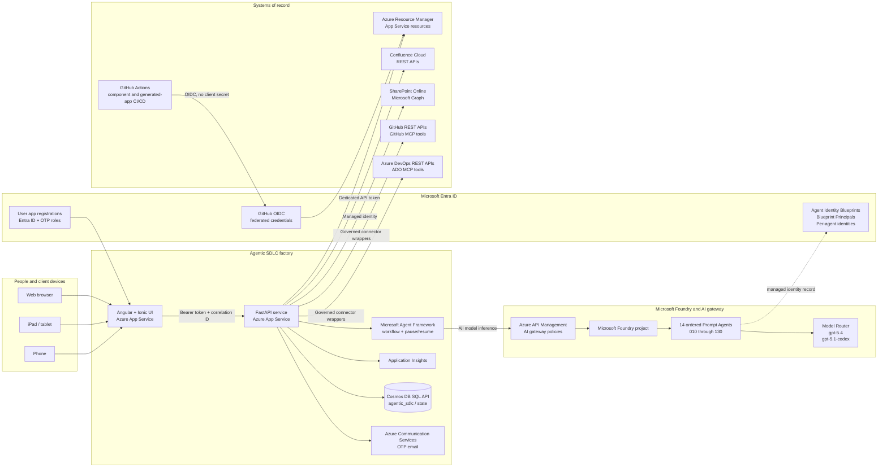
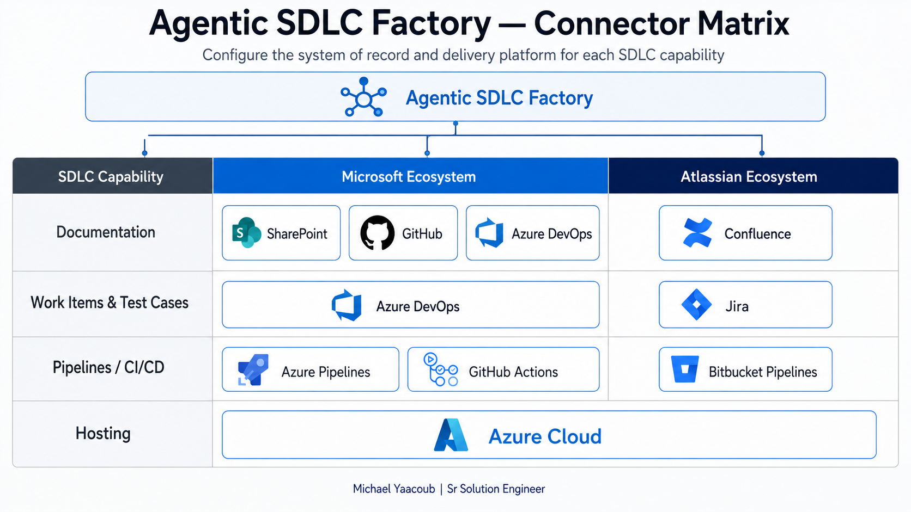

# Project Setup Prerequisites

This guide describes the platform, identities, configuration, and deployment
steps required to host the Agentic SDLC Software Factory. It covers the factory
application itself. Projects generated by the factory have their own deployment
workflows and Azure resources.

## Contents

- [Architecture](#architecture)
- [Technologies and Azure services](#technologies-and-azure-services)
- [Required access](#required-access)
- [Local build prerequisites](#local-build-prerequisites)
- [Build the hosting environment](#build-the-hosting-environment)
- [Connector setup overview](#connector-setup-overview)
- [Azure DevOps connector](#azure-devops-connector)
- [GitHub connector](#github-connector)
- [Jira Cloud connector](#jira-cloud-connector)
- [Bitbucket Cloud connector](#bitbucket-cloud-connector)
- [SharePoint Online connector](#sharepoint-online-connector)
- [Confluence Cloud connector](#confluence-cloud-connector)
- [Microsoft Azure connector](#microsoft-azure-connector)
- [GitHub OIDC deployment](#9-configure-github-oidc-deployment)
- [Application settings](#10-configure-application-settings)
- [Deploy and verify](#11-deploy-and-verify)
- [Production readiness checklist](#production-readiness-checklist)

## Architecture



### Ownership boundaries

| Boundary | Owner | Responsibility |
| --- | --- | --- |
| UI | Angular/Ionic tier | Device-specific presentation, route guards, token forwarding, and correlation headers |
| API | FastAPI tier | Authentication, RBAC, approvals, audit, orchestration, connector governance, and persistence |
| Workflow | Microsoft Agent Framework | Ordered topology, eligible-agent execution, human pause/resume, and checkpoints |
| Model boundary | Azure API Management | The only production inference path to Microsoft Foundry |
| Agent control plane | Microsoft Foundry | Prompt Agent definitions, versions, model bindings, and generated Agent Identities |
| Project data | Cosmos DB SQL API in production; file repository for local development | Projects, project sets, workflow runs, gates, artifacts, checkpoints, notifications, and audit records |
| Delivery records | Azure DevOps, GitHub, SharePoint, and Confluence | Work items, tests, repositories, pull requests, pipelines, project pages, governed documentation, and release evidence |

## Technologies and Azure services

### Application technologies

| Layer | Technology | Supported baseline |
| --- | --- | --- |
| Web UI | Angular, TypeScript, Ionic | Angular 18, Ionic 8, Node.js 22 LTS |
| API | Python, FastAPI, Gunicorn, Uvicorn | Python 3.13 for the factory API |
| Orchestration | Microsoft Agent Framework | `agent-framework-core==1.13.0` |
| Foundry control plane | Azure AI Projects SDK | `azure-ai-projects==2.4.0` |
| Persistence | Repository abstraction | Azure Cosmos DB SQL API (`agentic_sdlc/state`, `/_collection`) for production; JSON file repository for local development |
| Testing | Pytest, Jest, Jasmine/Karma | Backend, legacy API mirror, and Angular component coverage |

### Azure and Microsoft services

| Service | Required use |
| --- | --- |
| Microsoft Foundry account and project | Hosts the 14 Prompt Agents and model deployments |
| Azure API Management | AI gateway, managed-identity backend authentication, policy enforcement, and correlation |
| Microsoft Entra ID | User authentication, app roles, managed identities, Agent Identities, and GitHub OIDC trust |
| Azure App Service plan | Hosts the UI and API Linux web apps |
| Azure Cosmos DB | Private-endpoint-only durable production repository for application state, workflow queues, checkpoints, and notification idempotency |
| Azure Application Insights | API, dependency, and model-call telemetry |
| Azure Communication Services Email | External-user OTP and access-request email |
| Azure DevOps | Project/backlog, queries, sprints, dashboards, delivery plans, Test Plans, pipelines, and wiki |
| GitHub | Source, intake documents, branches, pull requests, Actions, and generated application deployment |
| SharePoint Online | Optional per-project documentation system of record with a modern overview page and document-library hierarchy |
| Confluence Cloud | Optional per-project documentation system of record with a project page, folders, attachment pages, and versioned content |

The checked-in reference deployment uses subscription
`86b37969-9445-49cf-b03f-d8866235171c`, resource group `ai-myaacoub`, Foundry
project `agentic-sdlc`, API app `agentic-sdlc-api-my`, and UI app
`agentic-sdlc-ui-my`. Use environment-specific names in another deployment.

## Required access

### Human operator

The setup operator needs permission to:

- create and configure App Service, API Management, Cosmos DB, Application
  Insights, and Communication Services resources;
- manage role assignments on the Foundry account/project and deployment
  resource group;
- create the UI/API Entra app registrations and grant tenant consent;
- configure Microsoft Foundry models, Prompt Agents, and project access;
- manage API Management APIs, backends, products, named values, and policies;
- create GitHub repository variables, environments, and OIDC trust; and
- create an Azure DevOps PAT with only the project, work item, test, build,
  dashboard, plan, and wiki permissions used by the configured connector.

### Runtime identities

| Identity | Minimum responsibility |
| --- | --- |
| API App Service managed identity | Read Foundry model deployments; manage Prompt Agent versions in the selected project; provision only approved Azure resources; read/write configured persistence services |
| API Management managed identity | Invoke the configured Foundry project/model backend |
| UI Entra application | Sign users in and request the API scope |
| API Entra application | Validate the exposed API audience and application roles |
| GitHub OIDC application/service principal | Deploy generated projects to approved Azure targets without a client secret |
| Foundry Agent Identities | One active identity family for each ordered Prompt Agent; lifecycle managed with the agent |

Use least-privileged scopes and resource-level assignments. Do not grant broad
subscription roles when a resource group or individual resource scope is
sufficient.

When SharePoint is enabled, grant the API App Service managed identity the
Microsoft Graph **Sites.ReadWrite.All application role** and complete tenant
administrator consent. This connector intentionally uses no client secret.

## Local build prerequisites

Install the following before cloning the repository:

- Git;
- Node.js 22 LTS and npm;
- Python 3.13;
- Azure CLI and Azure Developer CLI when operating Azure resources;
- access to Chrome or Edge for UI tests and PDF generation; and
- optional VS Code extensions for Python, Angular, Azure, and Foundry.

From the repository root:

```powershell
npm ci
npm --prefix api ci
python -m venv .venv
.venv\Scripts\python.exe -m pip install -r api\requirements.txt
```

Run the release checks:

```powershell
$env:PYTHONPATH = 'api'
.venv\Scripts\python.exe -m pytest api\tests -q
npm --prefix api run build
npm --prefix api test
npm run build
npx ng test --watch=false --browsers=ChromeHeadless --progress=false
```

## Build the hosting environment

### 1. Create the base resource group and observability

1. Select the subscription, region, naming convention, tags, and production
   resource group.
2. Create Application Insights and its Log Analytics workspace.
3. Create a production Cosmos DB account/database or select the approved
   existing account.
4. Create Azure Communication Services Email and verify the sender domain.

Record resource IDs and non-secret endpoints. Do not put credentials in source
or checked-in JSON.

### 2. Create the App Service hosts

1. Create a Linux App Service plan sized for the expected concurrent project
   workflows. The reference environment uses B2.
2. Create the API web app with Python 3.13.
3. Create the UI web app with Node.js 22 LTS.
4. Enable a system-assigned managed identity on the API app.
5. Configure HTTPS-only, deployment logs, and Application Insights integration.
6. Enable **Always On**, keep one API instance until distributed queue leases
   are implemented, and set `/api/health` as the App Service health-check path.

The API startup command is:

```text
gunicorn app.main:app -k uvicorn.workers.UvicornWorker --bind 0.0.0.0:8000
```

The UI can be hosted with the repository's Node static-SPA startup or an
equivalent approved static host.

### 3. Configure user authentication

1. Register separate Entra applications for the SPA and API.
2. Expose the API scope/audience and configure the SPA redirect URIs.
3. Add the production UI origin to API CORS configuration.
4. Configure the internal Entra domain and assign application roles.
5. Configure the ACS connection string and verified sender for OTP users.
6. Disable `AUTH_OTP_DEV_BYPASS` and `AUTH_ALLOW_ANONYMOUS` in every shared or
   production environment.

### 4. Create the Foundry project and model deployments

1. Create or select a Microsoft Foundry account and project.
2. Deploy the approved model set. The reference policy uses Model Router
   Balanced, `gpt-5.4`, and `gpt-5.1-codex`.
3. Grant the API managed identity Reader on the account and Foundry Project
   Manager on the project.
4. Confirm every selected model exposes the agent capability required by the
   Prompt Agent API.

### 5. Create the ordered Prompt Agents

Create one Prompt Agent per workflow role. Keep the internal application
`agentId` stable and use these Foundry portal names:

| Order | Foundry Prompt Agent |
| --- | --- |
| 010 | `010-requirements-agent` |
| 020 | `020-planning-agent` |
| 030 | `030-architecture-advisor-agent` |
| 040 | `040-code-generation-agent` |
| 045 | `045-code-review-agent` |
| 050 | `050-test-planning-agent` |
| 060 | `060-testing-agent` |
| 070 | `070-test-automation-agent` |
| 080 | `080-security-compliance-agent` |
| 090 | `090-devops-release-agent` |
| 100 | `100-ops-monitoring-agent` |
| 110 | `110-knowledge-assistant` |
| 120 | `120-insights-agent` |
| 130 | `130-cost-estimator-agent` |

Multiples of ten leave insertion room for future roles without renumbering
existing agents. Verify that Foundry created one active Agent Identity blueprint,
blueprint principal, and agent identity for each active Prompt Agent. Delete old
agent versions/names and their identity families only after the API configuration
and production traffic have moved to the replacements.

### 6. Configure API Management as the AI gateway

1. Import or create the wildcard Foundry-agent API route used by
   `agents.config.json`.
2. Configure APIM managed identity authentication to the Foundry backend.
3. Apply content safety, retry, timeout, token/rate-limit, and correlation
   policies approved for the environment.
4. Store APIM secrets in Key Vault-backed named values when a subscription key
   is required.
5. Restrict direct Foundry access. Production API model calls must use APIM;
   `FOUNDRY_ALLOW_DIRECT` is local development only.
6. Validate both conversation creation and Responses calls for one ordered
   Prompt Agent before enabling the full workflow.

### 7. Configure persistence

The reference deployment reuses SQL API account `cosmos-fabriciq-demo-01` and
creates a dedicated database/container:

| Setting | Reference value |
| --- | --- |
| Database | `agentic_sdlc` |
| Container | `state` |
| Partition key | `/_collection` |
| Throughput | 400 RU/s |
| Consistency | Session (inherited from the account) |
| API identity role | Cosmos DB Built-in Data Contributor, scoped to `/dbs/agentic_sdlc` |

One shared container is intentional. Every repository writes its name to
`_collection`, making that value the logical partition. This preserves existing
repository semantics, including identical record IDs in different collections
such as `workflowRuns` and `workflowTasks`. Agent Framework checkpoints use the
`workflowCheckpoints` partition and retain their restricted encoded payload.

From the application repository's Actions page, manually run the checked-in
`.github/workflows/provision-cosmos.yml` workflow in the protected `production`
environment. See GitHub's
[manual workflow guidance](https://docs.github.com/en/actions/how-tos/manage-workflow-runs/manually-run-a-workflow).
The workflow uses GitHub OIDC and is idempotent: it creates only a missing
database/container, validates the partition key and throughput, integrates
`agentic-sdlc-api-my` with `vnet-salespoc-westus2/snet-appservice`, and grants
database-scoped native Cosmos data access to the API managed identity.

The existing Cosmos network configuration is policy-managed. The provisioning
workflow must **validate, never modify**, all of these invariants:

- `publicNetworkAccess` remains `Disabled`;
- `networkAclBypass` remains `None`;
- an approved SQL private endpoint exists in `snet-private-endpoints`;
- `privatelink.documents.azure.com` is linked to `vnet-salespoc-westus2`; and
- the API reaches Cosmos through its App Service VNet integration.

Do not add public IP rules, enable public access, set network bypass, create a
replacement private endpoint, or use account keys/connection strings to work
around a policy denial. Those changes weaken the boundary and can be reverted
by Azure Policy. Fix the VNet integration, private DNS, managed identity, or
role scope instead.

Configure the production API with:

```text
PERSIST_PROVIDER=cosmos
PERSIST_COSMOS_ENDPOINT=https://cosmos-fabriciq-demo-01.documents.azure.com:443/
PERSIST_COSMOS_DATABASE=agentic_sdlc
PERSIST_COSMOS_CONTAINER=state
PERSIST_COSMOS_CONNECTION_STRING=
```

For a one-time migration from the file repository:

1. deploy the Cosmos-capable API while `PERSIST_PROVIDER=file`;
2. capture project, run, approval, artifact, agent-run, audit, and deletion IDs;
3. stop the API briefly to freeze writes;
4. set the Cosmos values and `PERSIST_MIGRATE_FILE_TO_COSMOS=1`, then start it;
5. require `/api/health` to return `"persistence":"cosmos"`;
6. compare the captured IDs and counts through the normal APIs; and
7. set `PERSIST_MIGRATE_FILE_TO_COSMOS=0` and verify another clean restart.

The importer excludes `otp-log.json`, rejects items near the Cosmos 2 MB item
limit, upserts every logical collection and encoded checkpoint, and writes the
`migrationMetadata/file-to-cosmos-v1` marker last. A partial migration can be
retried safely because no completion marker exists. Keep `/home/data` unchanged
as rollback evidence until backup/restore procedures are exercised.

For local development, leave `PERSIST_PROVIDER=file` and set
`PERSIST_FILE_DATA_ROOT` to an isolated directory. The file repository creates
collection JSON files on first use.

### 8. Configure systems of record

#### Connector setup overview

The factory uses seven governed connector families for delivery records,
documentation, source control, CI/CD, work management, and generated Azure
hosting. Configure only the connectors selected by the deployment or by a
project's effective Systems of Record settings.



| Connector | What the application uses it for | Runtime credential | Live-mode setting |
| --- | --- | --- | --- |
| Azure DevOps | Projects, backlogs, sprints, queries, dashboards, delivery plans, Test Plans, Azure Repos, pipelines, and wiki pages | `ADO_PAT`, with Entra fallback only when the Azure DevOps organization accepts the runtime identity | `ADO_LIVE=1` |
| GitHub | Repositories, intake files, branches, pull requests, issues, webhooks, Actions, and optional Copilot coding-agent delegation | `GITHUB_PAT` and, when callback webhooks are enabled, `GITHUB_WEBHOOK_SECRET` | `GITHUB_LIVE=1` |
| Jira Cloud | Projects, epics, stories, tasks, links, test issues, and sprints | `JIRA_EMAIL` plus `JIRA_API_TOKEN` | `JIRA_LIVE=1` |
| Bitbucket Cloud | Repositories, branches, commits, pull requests, Pipelines, variables, deployments, and OIDC metadata | Exactly one mode: access token in `BITBUCKET_ACCESS_TOKEN`, or Basic credential in `BITBUCKET_USERNAME` plus `BITBUCKET_APP_PASSWORD` | `BITBUCKET_LIVE=1` |
| SharePoint Online | Project overview pages, document-library folders, and governed artifact files | API App Service system-assigned managed identity; no connector secret | `SHAREPOINT_LIVE=1` |
| Confluence Cloud | Project pages, folders, attachment pages, and governed artifact attachments | `CONFLUENCE_EMAIL`, `CONFLUENCE_API_TOKEN`, and `CONFLUENCE_CLOUD_ID` | `CONFLUENCE_LIVE=1` |
| Microsoft Azure | Generated App Service plans/apps, app settings, managed identities, role assignments, restarts, and federated credentials | API App Service system-assigned managed identity through `DefaultAzureCredential` | No `AZURE_LIVE` setting |

The six Systems of Record connectors expose status through
`/api/integrations/status`. Microsoft Azure provisioning is a separate managed-
identity path and is not included in that status response or in
`verify_connectors.py`.

1. Set the Azure DevOps organization and GitHub owner defaults in the API
   integration configuration.
2. Create least-privileged PATs or approved app credentials and store them only
   in App Service settings or a secret store.
3. Configure only the required connector live-mode settings: `ADO_LIVE=1`,
   `GITHUB_LIVE=1`, `JIRA_LIVE=1`, `BITBUCKET_LIVE=1`,
   `SHAREPOINT_LIVE=1`, or `CONFLUENCE_LIVE=1`. These settings only switch a
   connector from mock to live mode; they do not force a connector into mock
   mode. The checked-in integration configuration already selects live mode,
   so missing credentials fail closed instead of silently using mock content.
4. Verify project/repository create, read, retry, and idempotency behavior with
   throwaway targets before production use.
5. Keep MCP server allow-lists in agent configuration. MCP tools do not bypass
   the API approval and publication controls.

#### Handle connector credentials safely

- Create credentials from a dedicated automation account where the provider
   supports one. The account still needs the product permissions listed below.
- Enter PATs and tokens only through the repository's masked secret script.
   Do not paste credentials into chat, command arguments, source files, logs, or
   screenshots.
- From the repository root, use `-Gui` to open the topmost masked Windows entry
   dialog. The script writes the credential directly to the API App Service and
   never echoes it.
- Use `-SessionOnly` only for a deliberate local probe. Clear connector
   credentials and `*_LIVE` variables from that shell before running tests.
- Set a rotation owner and expiry alert for every PAT, API token, access token,
   app password, and webhook signing secret.
- Treat `--create` as a write operation against a real tenant. Run it for one
   provider at a time and remove the throwaway resources afterward.

For a deployment other than the checked-in reference environment, pass the
correct `-ResourceGroup` and `-ApiAppName` values to
`set-connector-secrets.ps1`.

#### Azure DevOps connector

**Application use**

- Creates and deletes Azure DevOps projects and teams.
- Creates Azure Repos, branches, commits, pull requests, and merges.
- Creates backlogs, shared queries, iterations, delivery plans, dashboards,
   Test Plans, test runs, YAML pipelines, and project wiki pages.
- Reads the configured Azure Resource Manager service connection and manages
   project Contributors when those workflows are enabled.

**Credential and configuration**

- Secret: `ADO_PAT`.
- Required endpoint: `ADO_ORGANIZATION_URL`.
- Optional profile endpoint override: `ADO_PROFILES_BASE_URL`.
- Optional service-connection name: `ADO_AZURE_SERVICE_CONNECTION`.
- Live switch: `ADO_LIVE=1`.
- The connector can request an Entra token when no PAT is present, but many
   Azure DevOps organizations are attached to another tenant and reject that
   identity. Use a PAT when the read-only probe returns `TF400813`.

**PAT permissions**

Select only the Azure DevOps PAT permissions used by the enabled workflows:

| Azure DevOps permission | OAuth scope name | Why it is required |
| --- | --- | --- |
| Project and Team: Read, write, and manage | `vso.project_manage` | Create/delete projects and manage teams |
| Work Items: Full | `vso.work_full` | Create work items, queries, iterations, and delivery plans |
| Code: Read, write, and manage | `vso.code_manage` | Repositories, imports, branches, commits, pull requests, and merges |
| Test Management: Read and write | `vso.test_write` | Test plans, suites, cases, runs, and results |
| Build: Read and execute | `vso.build_execute` | Create/read YAML definitions and queue runs |
| Wiki: Read and write | `vso.wiki_write` | Project wiki and generated pages |
| Team Dashboards: Manage | `vso.dashboards_manage` | Dashboard and widget creation/update |
| Service Connections: Read | `vso.serviceendpoint` | Resolve the approved Azure service connection |
| Graph: Manage and Identity: Read | `vso.graph_manage`, `vso.identity` | Add or remove project Contributors |

The Work Items **Full** permission is intentional: delivery-plan operations
need more than Work Items read/write. Do not grant all scopes as a substitute
for selecting the entries above. See the official
[Azure DevOps scope reference](https://learn.microsoft.com/en-us/azure/devops/integrate/get-started/authentication/oauth?view=azure-devops#available-scopes)
and [PAT guidance](https://learn.microsoft.com/en-us/azure/devops/organizations/accounts/use-personal-access-tokens-to-authenticate).

**Configure and verify**

1. Create the PAT from the dedicated Azure DevOps account and set its shortest
    practical expiry.
2. Run `.\scripts\set-connector-secrets.ps1 -AdoPat -Gui` and enter the PAT
    only in the masked dialog.
3. Restart the API after changing App Service settings.
4. Run the read-only probe from the repository root:

    ```powershell
    .venv\Scripts\python.exe api\scripts\verify_connectors.py --only ado
    ```

5. Use `--only ado --create` only after the read-only probe passes and only in
    an approved throwaway organization or project namespace.

Common failures are `401` for an invalid/expired PAT, `403` for a missing PAT
scope, and `TF400813` when the fallback Entra identity is not authorized in the
organization. The [Azure DevOps REST reference](https://learn.microsoft.com/en-us/rest/api/azure/devops/)
maps each failing route to its required permission.

The following capture is representative post-provisioning evidence. It does
not display or validate the PAT itself.


#### GitHub connector

**Application use**

- Creates and deletes repositories, commits intake and generated files, and
   manages branches and pull requests.
- Creates issues/comments, collaborators, callback webhooks, Actions variables
   and encrypted secrets, and dispatches/monitors Actions workflows.
- Optionally delegates implementation to the GitHub Copilot coding agent when
   the account entitlement and organization policy allow it.

**Credential and configuration**

- Secret: `GITHUB_PAT`.
- Signing secret when callback webhooks are enabled:
   `GITHUB_WEBHOOK_SECRET`.
- Owner and endpoint settings: the checked-in GitHub owner plus optional
   `GITHUB_API_BASE_URL` and `GITHUB_REPO_BASE_URL` overrides.
- Non-secret OIDC identifiers: `GITHUB_OIDC_CLIENT_ID` and
   `GITHUB_OIDC_TENANT_ID`.
- Public callback origin: `SDLC_API_PUBLIC_URL`.
- Live switch: `GITHUB_LIVE=1`.

**Token permissions**

For the full dynamic repository lifecycle, use a classic PAT with:

- `repo` for repositories, contents, branches, pull requests, issues,
   collaborators, webhooks, Actions settings, and workflow dispatch/status;
- `workflow` when the factory adds or updates files beneath
   `.github/workflows`; and
- `delete_repo` because governed cascade cleanup can delete a repository that
   this workflow created.

The token's account must also have access to the selected owner and the GitHub
Copilot coding-agent entitlement when delegation is enabled. That entitlement
is not a PAT scope. A fine-grained token can be used only when its selected
repository set and permissions cover the intended static repositories; grant
Metadata read plus Administration, Contents, Pull requests, Issues, Webhooks,
Actions, Secrets, and Variables read/write as applicable. Dynamic repository
creation and deletion may require a GitHub App or a classic PAT instead.

Review the official [classic PAT scopes](https://docs.github.com/en/apps/oauth-apps/building-oauth-apps/scopes-for-oauth-apps),
[fine-grained PAT permission reference](https://docs.github.com/en/rest/authentication/permissions-required-for-fine-grained-personal-access-tokens),
[Actions secrets API](https://docs.github.com/en/rest/actions/secrets), and
[webhook guidance](https://docs.github.com/en/webhooks) before issuing the
credential.

**Configure and verify**

1. Create the token from the dedicated GitHub account with access only to the
    intended owner and repositories.
2. Run `.\scripts\set-connector-secrets.ps1 -GitHubPat -Gui` and enter the PAT
    in the masked dialog.
3. Configure `GITHUB_WEBHOOK_SECRET` separately when callback webhook
    registration is enabled. Generate a unique random value; never reuse the PAT.
4. Restart the API, then run:

    ```powershell
    .venv\Scripts\python.exe api\scripts\verify_connectors.py --only github
    ```

5. Use `--only github --create` only for a named throwaway repository and
    delete it after verification.

Common failures are `401` for an invalid token, `403` for an owner policy or
missing scope, `404` when a fine-grained token cannot see the selected
repository, and `422` when the owner/name or webhook configuration is invalid.

These captures show representative governed repository and Actions output.
They do not show token creation or secret entry.


#### Jira Cloud connector

**Application use**

- Resolves the automation account and creates or reuses Jira projects.
- Creates epics, stories, tasks, links, test-plan/test-case issues, and sprints.
- Deletes only Jira projects recorded as workflow-created during governed
   cascade cleanup.

**Credential and configuration**

- Account: `JIRA_EMAIL`.
- Secret: `JIRA_API_TOKEN`.
- Tenant endpoints: `JIRA_BASE_URL` and `JIRA_PROJECTS_URL`.
- Live switch: `JIRA_LIVE=1`.
- Keep Jira and Confluence credentials separate even when both products use the
   same Atlassian organization.

**Account permissions**

This connector uses an Atlassian API token with HTTP Basic authentication. The
token does not add Jira privileges; it inherits the automation account's
product permissions. Grant only the permissions needed for the enabled paths:

- Browse Projects;
- Create Issues, Edit Issues, and Link Issues;
- the board/project permissions needed to create and manage sprints; and
- the Jira global administration permission required by project create/delete
   when the factory is allowed to provision and cascade-delete Jira projects.

Jira permission schemes and organization policies vary, so verify the project
create/delete requirement with the Jira administrator instead of assuming a
site-wide role. See Atlassian's official [API-token guidance](https://support.atlassian.com/atlassian-account/docs/manage-api-tokens-for-your-atlassian-account/),
[Basic authentication guidance](https://developer.atlassian.com/cloud/jira/platform/basic-auth-for-rest-apis/),
and [Jira REST v3 introduction](https://developer.atlassian.com/cloud/jira/platform/rest/v3/intro/).

**Configure and verify**

1. Create a dedicated Atlassian token for the Jira automation account.
2. Run `.\scripts\set-connector-secrets.ps1 -Jira -Gui`, enter the account
    email at the prompt, and enter the token only in the masked dialog.
3. Restart the API, then run:

    ```powershell
    .venv\Scripts\python.exe api\scripts\verify_connectors.py --only jira
    ```

4. Run `--only jira --create` only when real project/issue creation and cleanup
    have been approved.

Common failures are `401` for a mismatched email/token pair, `403` for missing
global or project permissions, and `400` when the selected project template is
not available on that Jira site.

#### Bitbucket Cloud connector

**Application use**

- Creates/deletes repositories, commits files, and manages branches and pull
   requests.
- Reads and enables Pipelines configuration, starts and monitors runs, and
   creates secured/unsecured pipeline variables.
- Reads deployment environments and Bitbucket OIDC claims used for Azure
   workload federation.

**Choose exactly one credential mode**

- Preferred Bearer mode: a repository, project, or workspace access token in
   `BITBUCKET_ACCESS_TOKEN`.
- Basic compatibility mode: `BITBUCKET_USERNAME` plus
   `BITBUCKET_APP_PASSWORD`. Despite the historical setting name, the second
   value may be a Bitbucket API token. Pair an API token with the Atlassian
   account email in `BITBUCKET_USERNAME`; pair a legacy app password with the
   Bitbucket username.
- Shared settings: `BITBUCKET_WORKSPACE`, optional `BITBUCKET_EMAIL`, and
   `BITBUCKET_LIVE=1`.

Never configure both modes. The connector deliberately fails with
`AUTH_MODE_AMBIGUOUS` instead of guessing which credential to send. The secret
script removes stale settings from the opposite mode when it writes a new
credential. Atlassian has deprecated app passwords; use an access/API token
unless a documented compatibility requirement still needs Basic mode.

**Token permissions**

Select the equivalent permission names offered by the chosen workspace,
project, repository, OAuth, or API-token credential type:

| Factory operation | OAuth/access-token scope | API-token scope |
| --- | --- | --- |
| Read repositories, branches, source, and environments | `repository` | `read:repository:bitbucket` |
| Commit files and create branches | `repository:write` | `write:repository:bitbucket` |
| Create repositories and read/enable Pipelines configuration | `repository:admin` | `admin:repository:bitbucket` |
| Delete workflow-created repositories | `repository:delete` | `delete:repository:bitbucket` |
| Read pull requests | `pullrequest` | `read:pullrequest:bitbucket` |
| Create and merge pull requests | `pullrequest:write` | `write:pullrequest:bitbucket` |
| Read pipeline runs | `pipeline` | `read:pipeline:bitbucket` |
| Start pipeline runs | `pipeline:write` | `write:pipeline:bitbucket` |
| Create or update pipeline variables | `pipeline:variable` | `admin:pipeline:bitbucket` |
| Resolve the automation identity | `account` | `read:user:bitbucket` |

The `PUT /repositories/{workspace}/{repo}/pipelines_config` operation that
enables Pipelines specifically requires **repository administration**:
`repository:admin` or `admin:repository:bitbucket`. Pipeline write permission
alone does not authorize this operation. Starting a run additionally needs
`pipeline:write` or `write:pipeline:bitbucket`, and editing variables needs
`pipeline:variable` or `admin:pipeline:bitbucket`.

API-token scopes do not imply their read equivalents. Select every API-token
scope shown in the table for the operations the deployment enables. Workspace
access tokens are a Bitbucket Cloud Premium feature.

Repository/project tokens may not offer the `account` identity scope. Use a
workspace-capable credential when the factory must create repositories and the
identity preflight must pass. Confirm available scopes in Atlassian's official
[Bitbucket REST authentication and scope reference](https://developer.atlassian.com/cloud/bitbucket/rest/intro/),
[workspace access-token guide](https://support.atlassian.com/bitbucket-cloud/docs/workspace-access-tokens/),
[repository access-token guide](https://support.atlassian.com/bitbucket-cloud/docs/repository-access-tokens/),
and [API-token guide](https://support.atlassian.com/bitbucket-cloud/docs/api-tokens/).

**Configure and verify**

1. Create or rotate the Bitbucket credential in Bitbucket. Do not send the
    value through chat or place it on the command line.
2. For Bearer mode, run:

    ```powershell
    .\scripts\set-connector-secrets.ps1 -Bitbucket -BitbucketAuthMode AccessToken -Gui
    ```

3. Use `-BitbucketAuthMode AppPassword -Gui` for Basic compatibility. Supply
   the Bitbucket username for a legacy app password or the Atlassian account
   email for an API token when prompted.
4. Restart the API, then run the read-only preflight before retrying any
    workflow automation:

    ```powershell
    .venv\Scripts\python.exe api\scripts\verify_connectors.py --only bitbucket
    ```

5. Do not retry repository provisioning, Pipelines enablement, or the affected
    workflow until the preflight passes.

Common failures are `AUTH_MODE_AMBIGUOUS` when both credential modes remain,
`401` for a wrong/expired credential, `403` on `pipelines_config` for missing
repository administration, `403` on pipeline runs for missing pipeline write,
and `403` on variables for missing pipeline-variable administration. Workspace
2SV policy and first-run Pipelines enrollment can also block enablement even
when the token scopes are correct.

#### SharePoint Online connector

**Application use**

- Creates or reuses a modern project overview page in Site Pages.
- Creates a governed project folder and eight category folders in the default
   document library.
- Publishes generated artifacts by stable file path so retries replace the
   existing file.
- Deletes only the page and project folder recorded as workflow-created during
   governed cascade cleanup.

**Identity and configuration**

- Credential: the API App Service system-assigned managed identity. There is
   no SharePoint client secret or token-entry step.
- Permission: Microsoft Graph `Sites.ReadWrite.All` as an **application**
   permission, with tenant administrator consent.
- Settings: the approved HTTPS site URL, project root folder, and
   `SHAREPOINT_LIVE=1`. The reference root is `Agentic SDLC Projects`.

`Sites.ReadWrite.All` allows the identity to edit or delete documents and list
items in all site collections without a signed-in user. It is tenant-wide, so
use a dedicated runtime identity, restrict its Azure resource roles, and review
its Graph assignment regularly. The current connector contract requires this
application role; do not substitute delegated user consent or a client secret.

For each project that selects **SharePoint** as its documentation system of
record, the application creates or reuses:

- one modern project overview page in Site Pages;
- one project folder beneath the configured project root; and
- Requirements, Technical Requirements, UX and Design, Architecture and
  Design, Planning, Testing, Release and Operations, and Supporting Files
  category folders.

The connector stores returned site, drive, page, folder, and category IDs in
the project provisioning record. Repeated publication overwrites the same file
path rather than creating duplicate project folders. Cascade deletion targets
only the recorded project page and project folder, and only when the workflow
record says it created them.

Review the official [Microsoft Graph permission reference](https://learn.microsoft.com/en-us/graph/permissions-reference#sitesreadwriteall)
and [App Service managed-identity guidance](https://learn.microsoft.com/en-us/azure/app-service/overview-managed-identity)
before granting access.

**Configure and verify**

1. Enable the API App Service system-assigned identity and record its principal
   ID.
2. Grant and admin-consent the Graph application role for that service
   principal.
3. Configure the site URL and root folder, then restart the API.
4. Run the non-mutating identity, site, and default-library probe:

    ```powershell
    .venv\Scripts\python.exe api\scripts\verify_connectors.py --only sharepoint
    ```

5. Run `--only sharepoint --create` only for an approved throwaway project.
   That mode creates a page, folders, and a verification file; remove those
   test resources afterward.

Common failures are API `503` when managed-identity token acquisition fails,
Graph `403` when the application role or admin consent is missing, and `404`
when the configured site URL cannot be resolved.

#### Confluence Cloud connector

**Application use**

- Creates or reuses a project overview page, a `Project Files` folder, eight
   category folders, and attachment parent pages.
- Publishes attachments by filename and increments page versions on update.
- Deletes recorded workflow-created content from the leaves upward while
   retaining pre-existing resources.

**Credential and configuration**

- Account: `CONFLUENCE_EMAIL`, using a dedicated Atlassian automation account.
- Secret: `CONFLUENCE_API_TOKEN`, created as an API token **with scopes**.
- Tenant routing: `CONFLUENCE_CLOUD_ID` (required by the supported scoped-token
   setup), tenant web URL, space key/name, and the `createSpaceIfMissing`
   policy.
- Live switch: `CONFLUENCE_LIVE=1`.
- Keep Jira and Confluence credentials separate even when they use the same
   Atlassian tenant.

The application derives scoped API URLs beneath
`https://api.atlassian.com/ex/confluence/{cloudId}/wiki/...` from
`CONFLUENCE_CLOUD_ID`. A scoped token does not authenticate against the
tenant-site REST URL. The connector retains that URL path only for legacy-only
unscoped configurations; do not use it with the scoped token documented here.
The tenant web URL remains the base for human-facing links.

**Token and account permissions**

Select only these granular Confluence token scopes:

- `read:space:confluence`
- `write:space:confluence`
- `read:page:confluence`
- `write:page:confluence`
- `delete:page:confluence`
- `write:folder:confluence`
- `delete:folder:confluence`
- `read:hierarchical-content:confluence`
- `read:content-details:confluence`
- `write:attachment:confluence`

The token scopes do not grant product access by themselves. The automation
account must also be allowed to use Confluence and view, create, update, and
delete content in the configured space. It additionally needs permission to
create a space only when `createSpaceIfMissing` is enabled. Do not grant
attachment deletion, space deletion, user-directory, admin, audit, comment,
blog, database, Smart Link, or classic broad-content scopes.

For each project that selects **Confluence** as its documentation system of
record, the application creates or reuses:

- one project overview page under the space home page;
- one `Project Files` folder under the overview page;
- the same eight category folders used by SharePoint; and
- one attachment page inside each category folder because Confluence
  attachments require a content parent.

Attachment publication uses Confluence's create-or-update-by-filename
operation, so retries replace an existing attachment instead of accumulating
copies. Overview page updates increment the current page version. Cascade
deletion is explicit and bottom-up: category attachment pages, category
folders, project folder, then project page. Pre-existing resources are retained.

Use the official [Confluence OAuth/API-token scope reference](https://developer.atlassian.com/cloud/confluence/scopes-for-oauth-2-3LO-and-forge-apps/),
[Basic authentication guidance](https://developer.atlassian.com/cloud/confluence/basic-auth-for-rest-apis/),
and [REST API v2 introduction](https://developer.atlassian.com/cloud/confluence/rest/v2/intro/)
when issuing or troubleshooting the token.

**Configure and verify**

1. Create the scoped token for the dedicated account.
2. Run `.\scripts\set-connector-secrets.ps1 -Confluence -Gui`. Enter the
   account email at the prompt and enter the token only in the masked dialog.
3. Configure the cloud ID, tenant URL, space key/name, and
   `createSpaceIfMissing`, then restart the API.
4. Verify the account, tenant routing, and configured space:

    ```powershell
    .venv\Scripts\python.exe api\scripts\verify_connectors.py --only confluence
    ```

This probe can create the configured space when `createSpaceIfMissing` is
enabled and the space is absent. Disable that option for a non-mutating check,
or explicitly approve the one-time space creation before running the probe.
Use `--only confluence --create` only for approved throwaway project content.

Common failures are `401` for an invalid email/token pair, `403` for missing
token scopes or space permissions, `404` when the configured space is absent
and creation is disabled, and API `409` when a scoped token is routed to the
tenant-site REST URL instead of
`api.atlassian.com/ex/confluence/{cloudId}/wiki/...`.

#### Microsoft Azure connector

**Application use**

- Creates or reuses generated-project App Service plans and API/UI web apps.
- Configures app settings, startup commands, managed identities, role
   assignments, restarts, and governed resource cleanup.
- Reads Foundry model deployments and manages exact external OIDC federated
   credentials when the deployment enables that capability.

**Identity and configuration**

- Authentication: API App Service system-assigned managed identity through
   `DefaultAzureCredential` for Azure Resource Manager and Microsoft Graph.
- Local operators use their existing `az login` identity through the same
   credential chain.
- There is no Azure connector secret and no `AZURE_LIVE` setting.
- Do not set generic `AZURE_CLIENT_ID` or `AZURE_TENANT_ID` App Service
   settings; they make `DefaultAzureCredential` look for a user-assigned identity
   and break this system-assigned identity design. Use the dedicated
   `GITHUB_OIDC_CLIENT_ID` and `GITHUB_OIDC_TENANT_ID` settings for generated
   deployment federation.

**Least-privilege assignments**

- At the generated-project resource-group scope, grant the API identity
   **Website Contributor** and **Web Plan Contributor**.
- Grant **Role Based Access Control Administrator** only at the narrow scope
   where the connector must create a role assignment. Do not grant Owner merely
   to make provisioning succeed.
- On Microsoft Foundry, grant **Reader** on the account and **Foundry Project
   Manager** on the selected project.
- On Cosmos DB, grant **Cosmos DB Built-in Data Contributor** at the
   `agentic_sdlc` database scope. Do not use account keys or a production
   connection string.
- Grant the Microsoft Graph application role
   `Application.ReadWrite.OwnedBy` only when the API identity owns the target
   OIDC app registration and must create federated identity credentials. When
   platform administrators pre-provision those credentials, set the dedicated
   pre-provisioned configuration instead of granting broader Graph access.

Review the official [Azure built-in role definitions](https://learn.microsoft.com/en-us/azure/role-based-access-control/built-in-roles),
[role-assignment guidance](https://learn.microsoft.com/en-us/azure/role-based-access-control/role-assignments-portal),
[App Service managed-identity guidance](https://learn.microsoft.com/en-us/azure/app-service/overview-managed-identity),
[workload identity federation guidance](https://learn.microsoft.com/en-us/entra/workload-id/workload-identity-federation),
and [Cosmos DB native RBAC guidance](https://learn.microsoft.com/en-us/azure/cosmos-db/nosql/security/how-to-grant-data-plane-role-based-access).

**Configure and verify**

1. Enable the API web app's system-assigned identity and record its principal
    ID, not a secret.
2. Apply each role at the narrow resource, project, database, or resource-group
    scope listed above.
3. Confirm `/api/health` reports the intended Cosmos provider and use Azure
    role-assignment inventory to verify the API principal's effective scopes.
4. Exercise generated Azure provisioning only with a throwaway project after
    role inventory succeeds. `verify_connectors.py` has no `--only azure`
    option.

The following capture shows representative generated App Service resources;
it does not prove the runtime identity's role assignments.


Common failures are `No Azure credential available` when the managed identity
is disabled or generic Azure identity settings redirect the credential chain,
`403` from ARM for a missing role/action at the target scope, and `403` from
Graph when federated-credential management was not pre-provisioned and the
owned-application permission is absent.

#### Select the documentation SOR during project creation

In **New Project → Systems of Record**, choose `SharePoint` or `Confluence` for
Documentation. The setting is project-scoped. The Existing Projects, Dashboard,
Project Cost Comparison, Project Cost & Usage, and Project Details pages render
provider icons from that project's effective SOR configuration.


Intake files publish after project hierarchy provisioning. Generated
requirements, architecture, and release overview content remains subject to
the configured approval policy. Microsoft Agent Framework still owns workflow
pause/resume behavior, and APIM remains the Foundry model execution boundary.

#### Verify without mock content

Run the connector verification utility without `--create` first. Most probes
perform authentication and read operations only. The Confluence probe may
create the configured space when `createSpaceIfMissing` is enabled, and the
Bitbucket probe reads Pipelines configuration for an existing repository.
Review the target configuration before running either probe. After local tests
pass, use `--only sharepoint --create` or `--only confluence --create`
separately to create real throwaway content, capture its returned
page/folder/file URL, and clean it up. Never run a broad create verification
against production tenants.

Common failures:

- SharePoint `403`: the API identity lacks Graph application permission,
  tenant admin consent, or site access.
- Confluence `401`: the dedicated account email/token pair is invalid.
- Confluence `403`: the account lacks space or content permissions.
- Connector status `mock`: the deployment live-mode setting is not enabled.

### 9. Configure GitHub OIDC deployment

1. Create a production GitHub environment and Azure federated credential using
   the repository/environment subject.
2. Add only non-secret App Service names and environment values as repository
   variables.
3. Keep component path filters so UI-only changes do not redeploy the API and
   API-only changes do not redeploy the UI.
4. Grant deployment identities only the target resource permissions.
5. Protect production environments with the organization's required reviewers
   and branch policy.
6. Keep **Provision Cosmos persistence** manual-only. Its OIDC principal needs
   management-plane permission to create SQL databases/containers, configure
   the existing web app's VNet integration, and create native Cosmos SQL role
   assignments; it never receives Cosmos account keys.

### 10. Configure application settings

At minimum, configure the settings documented in the main README, including:

- Entra tenant/client/audience values;
- JWT signing material for OTP sessions;
- ACS sender configuration;
- APIM base route and optional subscription key;
- Foundry account/project endpoint and model-management flag;
- Cosmos provider, endpoint, database, and container settings (managed identity;
   no production connection string);
- ADO, GitHub, Jira, Bitbucket, and Confluence connector credentials/live flags,
  plus the SharePoint site URL (SharePoint uses managed identity); and
- UI CORS origins and external UI-to-API base URL mapping.

Never set generic `AZURE_CLIENT_ID` or `AZURE_TENANT_ID` App Service settings
when the API is intentionally using its system-assigned managed identity. Use
the repository's dedicated OIDC setting names instead.

### 11. Deploy and verify

Deploy the API before the UI, restart the API worker after code publication,
and verify:

1. `/api/health` returns `200` and reports `"persistence":"cosmos"`;
2. OTP and Entra sign-in resolve the expected role/capabilities;
3. `/api/agents` returns exactly the 14 ordered `010` through `130` names while
   internal IDs remain unprefixed;
4. APIM can invoke one Prompt Agent and correlation IDs reach telemetry;
5. connector status reports the intended live/mock state;
6. SharePoint verification and each enabled documentation-provider preflight
   succeeds; `createSpaceIfMissing` is disabled for a non-mutating Confluence
   check or its one-time write is explicitly approved;
7. a two-project autonomous set creates two distinct workflow runs and advances
   them concurrently;
8. Human review and Minimal review pause only at their configured gates;
9. approved output publishes to the selected systems of record exactly once on retry;
10. project/run/gate/artifact/agent-run IDs and counts match the pre-migration
   baseline; and
11. the phone, tablet, and web layouts have no horizontal overflow or occluded
    actions.

## Production readiness checklist

- [ ] Development bypasses are disabled.
- [ ] Secrets are absent from source, deployment packages, logs, and screenshots.
- [ ] APIM is the only model-inference path.
- [ ] Managed identities and Agent Identities are least privileged.
- [ ] Cosmos public access is disabled, bypass is `None`, private endpoint and
   DNS links are approved, and the API has database-scoped native data access.
- [ ] `/api/health` reports Cosmos persistence and the one-time migration flag
   is disabled after parity validation.
- [ ] The 14 Foundry agents are ordered `010` through `130` with no old active names.
- [ ] Cosmos backup, retention, restore, and regional strategy are approved.
- [ ] Connector credentials have rotation owners and expiry monitoring;
   SharePoint uses Graph application permission instead of a client secret.
- [ ] SharePoint and Confluence create/update/delete proofs use real throwaway
   resources and confirm that pre-existing resources are retained.
- [ ] App Insights alerts cover API failures, APIM/model latency, connector errors,
      workflow failures, and queue age.
- [ ] GitHub environment protection and OIDC trust are verified.
- [ ] Full automated tests and one end-to-end governed workflow pass before go-live.

## Related references

- [Main technical README](../README.md)
- [Role-sequenced user guide](user-guide/README.md)
- [Agent Framework workflow diagram](MultiAgent%20Workflow%20using%20Microsoft%20Agent%20Framework.jpg)
- [High-level architecture](HL_Architecture.png)
