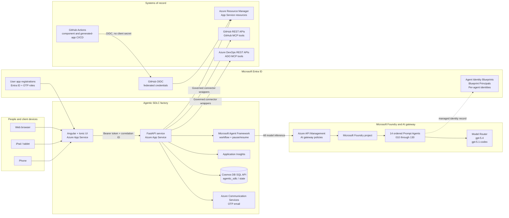

# Project Setup Prerequisites

This guide describes the platform, identities, configuration, and deployment
steps required to host the Agentic SDLC Software Factory. It covers the factory
application itself. Projects generated by the factory have their own deployment
workflows and Azure resources.

## Architecture



### Ownership boundaries

| Boundary | Owner | Responsibility |
| --- | --- | --- |
| UI | Angular/Ionic tier | Device-specific presentation, route guards, token forwarding, and correlation headers |
| API | FastAPI tier | Authentication, RBAC, approvals, audit, orchestration, connector governance, and persistence |
| Workflow | Microsoft Agent Framework | Ordered topology, eligible-agent execution, human pause/resume, and checkpoints |
| Model boundary | Azure API Management | The only production inference path to Microsoft Foundry |
| Agent control plane | Microsoft Foundry | Prompt Agent definitions, versions, model bindings, and generated Agent Identities |
| Project data | Cosmos DB SQL API in production; file repository for local development | Projects, project sets, workflow runs, gates, artifacts, checkpoints, notifications, and audit records |
| Delivery records | Azure DevOps and GitHub | Work items, tests, repositories, pull requests, pipelines, wiki pages, and release evidence |

## Technologies and Azure services

### Application technologies

| Layer | Technology | Supported baseline |
| --- | --- | --- |
| Web UI | Angular, TypeScript, Ionic | Angular 18, Ionic 8, Node.js 22 LTS |
| API | Python, FastAPI, Gunicorn, Uvicorn | Python 3.13 for the factory API |
| Orchestration | Microsoft Agent Framework | `agent-framework-core==1.13.0` |
| Foundry control plane | Azure AI Projects SDK | `azure-ai-projects==2.4.0` |
| Persistence | Repository abstraction | Azure Cosmos DB SQL API (`agentic_sdlc/state`, `/_collection`) for production; JSON file repository for local development |
| Testing | Pytest, Jest, Jasmine/Karma | Backend, legacy API mirror, and Angular component coverage |

### Azure and Microsoft services

| Service | Required use |
| --- | --- |
| Microsoft Foundry account and project | Hosts the 14 Prompt Agents and model deployments |
| Azure API Management | AI gateway, managed-identity backend authentication, policy enforcement, and correlation |
| Microsoft Entra ID | User authentication, app roles, managed identities, Agent Identities, and GitHub OIDC trust |
| Azure App Service plan | Hosts the UI and API Linux web apps |
| Azure Cosmos DB | Private-endpoint-only durable production repository for application state, workflow queues, checkpoints, and notification idempotency |
| Azure Application Insights | API, dependency, and model-call telemetry |
| Azure Communication Services Email | External-user OTP and access-request email |
| Azure DevOps | Project/backlog, queries, sprints, dashboards, delivery plans, Test Plans, pipelines, and wiki |
| GitHub | Source, intake documents, branches, pull requests, Actions, and generated application deployment |

The checked-in reference deployment uses subscription
`86b37969-9445-49cf-b03f-d8866235171c`, resource group `ai-myaacoub`, Foundry
project `agentic-sdlc`, API app `agentic-sdlc-api-my`, and UI app
`agentic-sdlc-ui-my`. Use environment-specific names in another deployment.

## Required access

### Human operator

The setup operator needs permission to:

- create and configure App Service, API Management, Cosmos DB, Application
  Insights, and Communication Services resources;
- manage role assignments on the Foundry account/project and deployment
  resource group;
- create the UI/API Entra app registrations and grant tenant consent;
- configure Microsoft Foundry models, Prompt Agents, and project access;
- manage API Management APIs, backends, products, named values, and policies;
- create GitHub repository variables, environments, and OIDC trust; and
- create an Azure DevOps PAT with only the project, work item, test, build,
  dashboard, plan, and wiki permissions used by the configured connector.

### Runtime identities

| Identity | Minimum responsibility |
| --- | --- |
| API App Service managed identity | Read Foundry model deployments; manage Prompt Agent versions in the selected project; provision only approved Azure resources; read/write configured persistence services |
| API Management managed identity | Invoke the configured Foundry project/model backend |
| UI Entra application | Sign users in and request the API scope |
| API Entra application | Validate the exposed API audience and application roles |
| GitHub OIDC application/service principal | Deploy generated projects to approved Azure targets without a client secret |
| Foundry Agent Identities | One active identity family for each ordered Prompt Agent; lifecycle managed with the agent |

Use least-privileged scopes and resource-level assignments. Do not grant broad
subscription roles when a resource group or individual resource scope is
sufficient.

## Local build prerequisites

Install the following before cloning the repository:

- Git;
- Node.js 22 LTS and npm;
- Python 3.13;
- Azure CLI and Azure Developer CLI when operating Azure resources;
- access to Chrome or Edge for UI tests and PDF generation; and
- optional VS Code extensions for Python, Angular, Azure, and Foundry.

From the repository root:

```powershell
npm ci
npm --prefix api ci
python -m venv api/.venv
api/.venv/Scripts/python.exe -m pip install -r api/requirements.txt
```

Run the release checks:

```powershell
$env:PYTHONPATH = 'api'
api/.venv/Scripts/python.exe -m pytest api/tests -q
npm --prefix api run build
npm --prefix api test
npm run build
npm test -- --watch=false --browsers=ChromeHeadless
```

## Build the hosting environment

### 1. Create the base resource group and observability

1. Select the subscription, region, naming convention, tags, and production
   resource group.
2. Create Application Insights and its Log Analytics workspace.
3. Create a production Cosmos DB account/database or select the approved
   existing account.
4. Create Azure Communication Services Email and verify the sender domain.

Record resource IDs and non-secret endpoints. Do not put credentials in source
or checked-in JSON.

### 2. Create the App Service hosts

1. Create a Linux App Service plan sized for the expected concurrent project
   workflows. The reference environment uses B2.
2. Create the API web app with Python 3.13.
3. Create the UI web app with Node.js 22 LTS.
4. Enable a system-assigned managed identity on the API app.
5. Configure HTTPS-only, deployment logs, and Application Insights integration.
6. Enable **Always On**, keep one API instance until distributed queue leases
   are implemented, and set `/api/health` as the App Service health-check path.

The API startup command is:

```text
gunicorn app.main:app -k uvicorn.workers.UvicornWorker --bind 0.0.0.0:8000
```

The UI can be hosted with the repository's Node static-SPA startup or an
equivalent approved static host.

### 3. Configure user authentication

1. Register separate Entra applications for the SPA and API.
2. Expose the API scope/audience and configure the SPA redirect URIs.
3. Add the production UI origin to API CORS configuration.
4. Configure the internal Entra domain and assign application roles.
5. Configure the ACS connection string and verified sender for OTP users.
6. Disable `AUTH_OTP_DEV_BYPASS` and `AUTH_ALLOW_ANONYMOUS` in every shared or
   production environment.

### 4. Create the Foundry project and model deployments

1. Create or select a Microsoft Foundry account and project.
2. Deploy the approved model set. The reference policy uses Model Router
   Balanced, `gpt-5.4`, and `gpt-5.1-codex`.
3. Grant the API managed identity Reader on the account and Foundry Project
   Manager on the project.
4. Confirm every selected model exposes the agent capability required by the
   Prompt Agent API.

### 5. Create the ordered Prompt Agents

Create one Prompt Agent per workflow role. Keep the internal application
`agentId` stable and use these Foundry portal names:

| Order | Foundry Prompt Agent |
| --- | --- |
| 010 | `010-requirements-agent` |
| 020 | `020-planning-agent` |
| 030 | `030-architecture-advisor-agent` |
| 040 | `040-code-generation-agent` |
| 045 | `045-code-review-agent` |
| 050 | `050-test-planning-agent` |
| 060 | `060-testing-agent` |
| 070 | `070-test-automation-agent` |
| 080 | `080-security-compliance-agent` |
| 090 | `090-devops-release-agent` |
| 100 | `100-ops-monitoring-agent` |
| 110 | `110-knowledge-assistant` |
| 120 | `120-insights-agent` |
| 130 | `130-cost-estimator-agent` |

Multiples of ten leave insertion room for future roles without renumbering
existing agents. Verify that Foundry created one active Agent Identity blueprint,
blueprint principal, and agent identity for each active Prompt Agent. Delete old
agent versions/names and their identity families only after the API configuration
and production traffic have moved to the replacements.

### 6. Configure API Management as the AI gateway

1. Import or create the wildcard Foundry-agent API route used by
   `agents.config.json`.
2. Configure APIM managed identity authentication to the Foundry backend.
3. Apply content safety, retry, timeout, token/rate-limit, and correlation
   policies approved for the environment.
4. Store APIM secrets in Key Vault-backed named values when a subscription key
   is required.
5. Restrict direct Foundry access. Production API model calls must use APIM;
   `FOUNDRY_ALLOW_DIRECT` is local development only.
6. Validate both conversation creation and Responses calls for one ordered
   Prompt Agent before enabling the full workflow.

### 7. Configure persistence

The reference deployment reuses SQL API account `cosmos-fabriciq-demo-01` and
creates a dedicated database/container:

| Setting | Reference value |
| --- | --- |
| Database | `agentic_sdlc` |
| Container | `state` |
| Partition key | `/_collection` |
| Throughput | 400 RU/s |
| Consistency | Session (inherited from the account) |
| API identity role | Cosmos DB Built-in Data Contributor, scoped to `/dbs/agentic_sdlc` |

One shared container is intentional. Every repository writes its name to
`_collection`, making that value the logical partition. This preserves existing
repository semantics, including identical record IDs in different collections
such as `workflowRuns` and `workflowTasks`. Agent Framework checkpoints use the
`workflowCheckpoints` partition and retain their restricted encoded payload.

Run [`.github/workflows/provision-cosmos.yml`](https://github.com/csdmichael/Foundry-Agentic-Workflow-SDLC/blob/main/.github/workflows/provision-cosmos.yml)
manually in the protected `production` environment. The workflow uses GitHub
OIDC and is idempotent: it creates only a missing database/container, validates
the partition key and throughput, integrates `agentic-sdlc-api-my` with
`vnet-salespoc-westus2/snet-appservice`, and grants database-scoped native
Cosmos data access to the API managed identity.

The existing Cosmos network configuration is policy-managed. The provisioning
workflow must **validate, never modify**, all of these invariants:

- `publicNetworkAccess` remains `Disabled`;
- `networkAclBypass` remains `None`;
- an approved SQL private endpoint exists in `snet-private-endpoints`;
- `privatelink.documents.azure.com` is linked to `vnet-salespoc-westus2`; and
- the API reaches Cosmos through its App Service VNet integration.

Do not add public IP rules, enable public access, set network bypass, create a
replacement private endpoint, or use account keys/connection strings to work
around a policy denial. Those changes weaken the boundary and can be reverted
by Azure Policy. Fix the VNet integration, private DNS, managed identity, or
role scope instead.

Configure the production API with:

```text
PERSIST_PROVIDER=cosmos
PERSIST_COSMOS_ENDPOINT=https://cosmos-fabriciq-demo-01.documents.azure.com:443/
PERSIST_COSMOS_DATABASE=agentic_sdlc
PERSIST_COSMOS_CONTAINER=state
PERSIST_COSMOS_CONNECTION_STRING=
```

For a one-time migration from the file repository:

1. deploy the Cosmos-capable API while `PERSIST_PROVIDER=file`;
2. capture project, run, approval, artifact, agent-run, audit, and deletion IDs;
3. stop the API briefly to freeze writes;
4. set the Cosmos values and `PERSIST_MIGRATE_FILE_TO_COSMOS=1`, then start it;
5. require `/api/health` to return `"persistence":"cosmos"`;
6. compare the captured IDs and counts through the normal APIs; and
7. set `PERSIST_MIGRATE_FILE_TO_COSMOS=0` and verify another clean restart.

The importer excludes `otp-log.json`, rejects items near the Cosmos 2 MB item
limit, upserts every logical collection and encoded checkpoint, and writes the
`migrationMetadata/file-to-cosmos-v1` marker last. A partial migration can be
retried safely because no completion marker exists. Keep `/home/data` unchanged
as rollback evidence until backup/restore procedures are exercised.

For local development, leave `PERSIST_PROVIDER=file` and set
`PERSIST_FILE_DATA_ROOT` to an isolated directory. The file repository creates
collection JSON files on first use.

### 8. Configure Azure DevOps and GitHub

1. Set the Azure DevOps organization and GitHub owner defaults in the API
   integration configuration.
2. Create least-privileged PATs or approved app credentials and store them only
   in App Service settings or a secret store.
3. Enable each live connector independently with `ADO_LIVE=1` and
   `GITHUB_LIVE=1` after its health check succeeds.
4. Verify project/repository create, read, retry, and idempotency behavior with
   throwaway targets before production use.
5. Keep MCP server allow-lists in agent configuration. MCP tools do not bypass
   the API approval and publication controls.

### 9. Configure GitHub OIDC deployment

1. Create a production GitHub environment and Azure federated credential using
   the repository/environment subject.
2. Add only non-secret App Service names and environment values as repository
   variables.
3. Keep component path filters so UI-only changes do not redeploy the API and
   API-only changes do not redeploy the UI.
4. Grant deployment identities only the target resource permissions.
5. Protect production environments with the organization's required reviewers
   and branch policy.
6. Keep **Provision Cosmos persistence** manual-only. Its OIDC principal needs
   management-plane permission to create SQL databases/containers, configure
   the existing web app's VNet integration, and create native Cosmos SQL role
   assignments; it never receives Cosmos account keys.

### 10. Configure application settings

At minimum, configure the settings documented in the main README, including:

- Entra tenant/client/audience values;
- JWT signing material for OTP sessions;
- ACS sender configuration;
- APIM base route and optional subscription key;
- Foundry account/project endpoint and model-management flag;
- Cosmos provider, endpoint, database, and container settings (managed identity;
   no production connection string);
- ADO and GitHub connector credentials/live flags; and
- UI CORS origins and external UI-to-API base URL mapping.

Never set generic `AZURE_CLIENT_ID` or `AZURE_TENANT_ID` App Service settings
when the API is intentionally using its system-assigned managed identity. Use
the repository's dedicated OIDC setting names instead.

### 11. Deploy and verify

Deploy the API before the UI, restart the API worker after code publication,
and verify:

1. `/api/health` returns `200` and reports `"persistence":"cosmos"`;
2. OTP and Entra sign-in resolve the expected role/capabilities;
3. `/api/agents` returns exactly the ordered `010` through `120` names while
   internal IDs remain unprefixed;
4. APIM can invoke one Prompt Agent and correlation IDs reach telemetry;
5. connector status reports the intended live/mock state;
6. a two-project autonomous set creates two distinct workflow runs and advances
   them concurrently;
7. Human review and Minimal review pause only at their configured gates;
8. approved output publishes to ADO/GitHub exactly once on retry; and
9. project/run/gate/artifact/agent-run IDs and counts match the pre-migration
   baseline; and
10. the phone, tablet, and web layouts have no horizontal overflow or occluded
    actions.

## Production readiness checklist

- [ ] Development bypasses are disabled.
- [ ] Secrets are absent from source, deployment packages, logs, and screenshots.
- [ ] APIM is the only model-inference path.
- [ ] Managed identities and Agent Identities are least privileged.
- [ ] Cosmos public access is disabled, bypass is `None`, private endpoint and
   DNS links are approved, and the API has database-scoped native data access.
- [ ] `/api/health` reports Cosmos persistence and the one-time migration flag
   is disabled after parity validation.
- [ ] The 12 Foundry agents are ordered `010` through `120` with no old active names.
- [ ] Cosmos backup, retention, restore, and regional strategy are approved.
- [ ] ADO and GitHub credentials have rotation owners and expiry monitoring.
- [ ] App Insights alerts cover API failures, APIM/model latency, connector errors,
      workflow failures, and queue age.
- [ ] GitHub environment protection and OIDC trust are verified.
- [ ] Full automated tests and one end-to-end governed workflow pass before go-live.

## Related references

- [Main technical README](../README.md)
- [Role-sequenced user guide](user-guide/README.md)
- [Agent Framework workflow diagram](MultiAgent%20Workflow%20using%20Microsoft%20Agent%20Framework.jpg)
- [High-level architecture](HL_Architecture.png)
