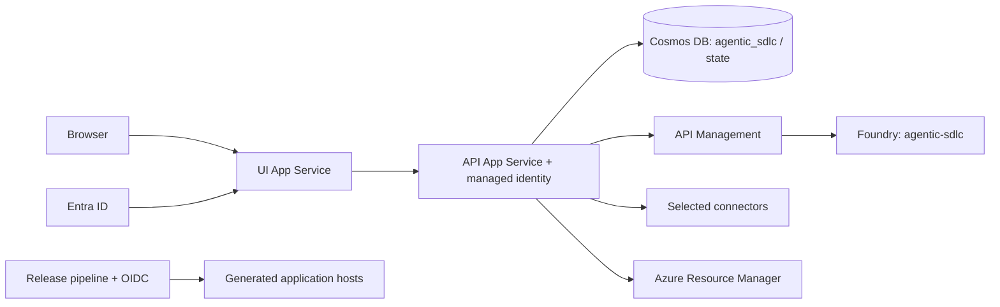
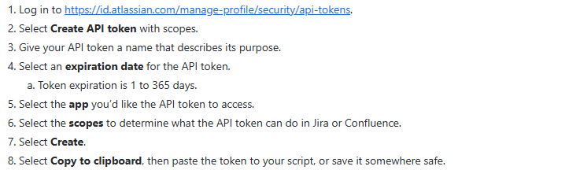
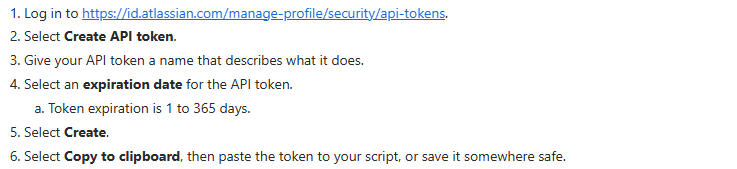
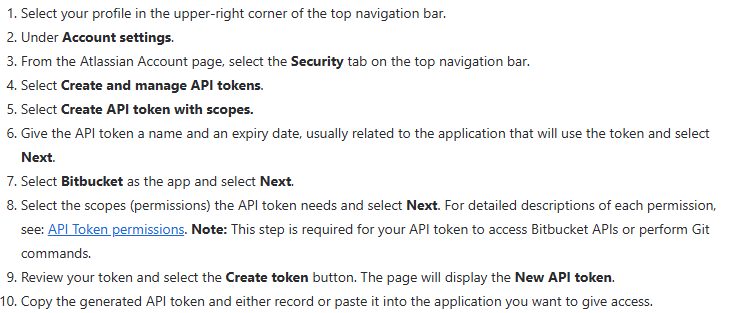

# Agentic SDLC Factory Setup Guide

Use this checklist to install the **factory application** in your Azure environment. Applications generated by the factory have a separate release pipeline. Replace every `<placeholder>` with your own value; do not reuse the sample tenant, subscription, accounts, or resource names in the source repository.

**Baseline:** Windows PowerShell 7, Python 3.13, Node.js 22 LTS, Azure App Service **B3**, and Microsoft Foundry project **`agentic-sdlc`** in **West US 2 (`westus2`)**. This is a reference application, not a production certification. Complete the [go-live checks](#go-live-checks) before customer production use.

## Table of Contents

- [Before You Start](#before-you-start)
- [1. Azure Prerequisites](#1-azure-prerequisites)
  - [1a. Cosmos DB](#1a-cosmos-db)
  - [1b. Microsoft Foundry](#1b-microsoft-foundry)
  - [1c. Entra ID App Registrations](#1c-entra-id-app-registrations)
  - [1d. App Service Hosting](#1d-app-service-hosting)
  - [1e. API Management](#1e-api-management)
  - [Additional Services](#additional-services)
- [2. Connector Setup](#2-connector-setup)
  - [2a. SharePoint, Optional](#2a-sharepoint-optional)
  - [2b. Confluence](#2b-confluence)
  - [2c. Azure DevOps](#2c-azure-devops)
  - [2d. Jira](#2d-jira)
  - [2e. GitHub](#2e-github)
  - [2f. Bitbucket](#2f-bitbucket)
  - [2g. Azure Resource Manager](#2g-azure-resource-manager)
- [3. Deploy and Verify](#3-deploy-and-verify)
  - [Customer Configuration](#customer-configuration)
  - [API App Settings](#api-app-settings)
  - [PowerShell Run Order](#powershell-run-order)
  - [Verification](#verification)
  - [Go-Live Checks](#go-live-checks)

## Before You Start

| Prepare | What you need |
| --- | --- |
| Azure access | A subscription, a factory resource group, an approved region, and permission to create resources. An authorized administrator grants Azure roles and tenant-wide Graph consent. Contributor alone cannot grant access. |
| Network foundation | An approved VNet, an App Service integration subnet delegated to `Microsoft.Web/serverFarms`, a separate private-endpoint subnet, and private DNS. Create these before private Cosmos connectivity is required. |
| Product administrators | An Entra administrator plus an owner/admin for each connector you actually select. Third-party product licenses, repository policies, and pipeline minutes are separate from Azure charges. |
| Source | An authorized copy of the [application repository](https://github.com/csdmichael/Foundry-Agentic-Workflow-SDLC). Review its configuration before running anything: it contains reference-environment values. |
| Workstation | Git, PowerShell 7, Node.js 22 LTS/npm, Python 3.13, Azure CLI, and GitHub CLI (`gh`) for the runbook. Chrome or Edge is needed for UI tests. Azure Developer CLI is not used by these deployment workflows. |
| Secret handling | Use a dedicated automation account where supported, short expiry, an assigned rotation owner, and a secret manager. Never include tokens in a README, ticket, screenshot, chat, or command history. |



Microsoft Agent Framework owns workflow sequencing, approvals, and pause/resume. All **Foundry model inference** goes through APIM. Explicitly selecting GitHub Copilot cloud agent is the documented exception: its inference runs within GitHub, while this application still governs task state, approvals, and evidence.

## 1. Azure Prerequisites

Follow 1a to 1e after the network foundation. Create the Cosmos account first; finish its API identity assignment once the API App Service exists. The deployment sequence in section 3 accounts for that dependency.

### 1a. Cosmos DB

| Item | Required setup | Verify |
| --- | --- | --- |
| Account | Azure Cosmos DB **for NoSQL** account, for example `<cosmos-account>`. Use the approved private network. | Account is available and its SQL private endpoint is approved. |
| Database | **`agentic_sdlc`** | Visible in Data Explorer from an authorized network. |
| Container | **`state`**; partition key **`/_collection`**; baseline **400 RU/s dedicated container throughput**. | These values match the provisioning workflow. Do not create one container per collection. |
| Stored data | Projects, workflow tasks, approvals, artifacts, audit records, notifications, and Agent Framework checkpoints share logical partitions in `state`. | `/api/health` reports `persistence: cosmos` after API deployment. |
| Runtime access | API App Service managed identity: **Cosmos DB Built-in Data Contributor**, scoped to `/dbs/agentic_sdlc`. This is a Cosmos data-plane role, not Azure Contributor. | Native role assignment names the API principal and this database. No account key/connection string is needed. |
| Networking | Public network access **Disabled**; network bypass **None**; SQL private endpoint; `privatelink.documents.azure.com` linked to the API's VNet. | API-side DNS resolves the account privately. Do not open the firewall to fix identity or DNS errors. |

The [Cosmos provisioning workflow](https://github.com/csdmichael/Foundry-Agentic-Workflow-SDLC/blob/main/.github/workflows/provision-cosmos.yml) creates the database/container if missing and configures API access. It **does not create the account, VNet, private endpoint, or DNS zone**. Backups, retention, and restore testing remain platform responsibilities.

### 1b. Microsoft Foundry

| Item | Required setup | Verify |
| --- | --- | --- |
| Resource/project | Create a Foundry resource and project named **`agentic-sdlc`**. Reference region: **West US 2 (`westus2`)**. | Project endpoint is `https://<foundry-account>.services.ai.azure.com/api/projects/agentic-sdlc`. |
| Regional availability | Confirm model availability, deployment SKU, quota, and capacity in the customer's subscription **before** provisioning. | All three deployments below succeed. Project region alone does not constrain processing residency for Global deployment SKUs. |
| Project identity | Give the Foundry project's managed identity **Foundry User** on the parent Foundry resource. | Confirm the assignment even when the portal created it automatically. This is separate from the API and APIM identities. |
| Runtime identity | API managed identity: **Reader** on the Foundry account and **Foundry Project Manager** on the project. | Model discovery and project-scoped Prompt Agent version management succeed. |
| Deployment identity | The identity running agent synchronization needs project agent-management permissions too. | Agent synchronization completes from a network that can reach the project endpoint. |
| Agents | Synchronize the **14 configured Prompt Agents**, `010-requirements-agent` through `130-cost-estimator-agent`, including `045-code-review-agent`. | Each configured name exists and is bound to its intended model. Do not manually rename internal agent IDs. |

| Exact model deployment name | Used by the checked-in agent defaults |
| --- | --- |
| **`model-router`** | Requirements, Planning, Test Planning, Ops Monitoring, Knowledge Assistant, Insights, Cost Estimator. Configure **Balanced** routing. |
| **`gpt-5.4`** | Architecture Advisor, independent Code Review, Security and Compliance, DevOps/Release. |
| **`gpt-5.1-codex`** | Code Generation, Testing, Test Automation. |

Use the exact deployment names above or update every corresponding `modelDeploymentName` in the [agent configuration](https://github.com/csdmichael/Foundry-Agentic-Workflow-SDLC/blob/main/api/src/agents/config/agents.config.json). Additional models such as `gpt-4.1` are optional; embeddings and Azure AI Search are not required for this setup. Keep code generation and independent code review on different approved model deployments.

### 1c. Entra ID App Registrations

In **Entra admin center > App registrations > New registration**, create the registrations below. Use separate identities for sign-in and deployment; never add a client secret to the SPA.

| Registration/identity | Setup | Values to record |
| --- | --- | --- |
| `agentic-sdlc-ui` | Single-tenant **Single-page application**. Register `https://<ui-app>.azurewebsites.net/assets/msal-redirect.html`; add `http://localhost:8100/assets/msal-redirect.html` only for local development. MSAL uses authorization code with PKCE; do not enable implicit grants. | Tenant ID and UI application/client ID. |
| `agentic-sdlc-api` | Register the API, expose `api://<api-client-id>/access_as_user`, and grant the SPA the delegated permission with consent as required by policy. No runtime client secret is needed. | API application/client ID and App ID URI. |
| Factory deployment identity | Separate app/service principal with **federated credentials**, not a client secret. Trust the factory GitHub repository's protected `production` environment. | Client ID, tenant ID, subscription ID. These go into GitHub Actions configuration, not the API's generic `AZURE_*` settings. |
| Generated-app deployment identity | Separate, narrowly scoped OIDC identity for generated repositories and target resource group. | `GITHUB_OIDC_CLIENT_ID` / `GITHUB_OIDC_TENANT_ID`, or the provider-specific values in section 2g. |
| API and APIM identities | Enable **System assigned** under each Azure resource's **Identity** blade. Azure creates their service principals; these are not extra SPA registrations. | Principal/object IDs for role assignments. |

**Current implementation boundary:** the reference SPA sends an Entra **ID token** to the API, and the API does not enforce an API audience/scope. Registering an API does not change that code. Before production, implement and validate API access-token audience/scope enforcement. Application roles are managed through the factory's **User Management / Role Permissions** and seed configuration; Entra app-role assignment alone does not grant factory capabilities.

### 1d. App Service Hosting

| Environment/component | Plan/runtime | Required configuration |
| --- | --- | --- |
| Dev / QA | UI and API may share **one Linux B3 plan** within an environment. | Still create **two web apps** with separate runtimes, settings, URLs, and deployments. Do not share production's plan. |
| Production | Prefer **two Linux B3 plans**, one for UI and one for API. | Independent capacity, maintenance, and resource isolation. B3 is the requested starting size, not an availability or load-test guarantee. |
| Factory API | Python **3.13** on Linux. | Startup: `gunicorn app.main:app -k uvicorn.workers.UvicornWorker --bind 0.0.0.0:8000`. Enable Always On, `/api/health`, system identity, HTTPS, and `SCM_DO_BUILD_DURING_DEPLOYMENT=true`. |
| Factory UI | Node.js **22 LTS** on Linux, serving the compiled static SPA. | The UI workflow deploys `dist/browser`. Set startup to `pm2 serve /home/site/wwwroot --no-daemon --spa`; verify `/login` and `/showcase` refresh successfully. |
| API capacity | **One instance and one application worker** for the current reference design. | Do not horizontally scale before distributed queue/lease coordination is implemented and tested. B3 has no deployment slots; use separate apps or an appropriate higher tier if slots are required. |

The factory's B3 plans are **not** controlled by `azureProvisioning.sku`. That setting applies to generated applications and currently defaults to demonstration-tier `F1`. Do not assume changing it to B3 works: the current generated-plan SKU mapping does not include B3. Review generated hosting separately before production release.

### 1e. API Management

| Item | Setup | Verify |
| --- | --- | --- |
| Service/tier | Create APIM after choosing the Foundry backend and API network path. Developer tier is for non-production only. Select a production SKU with the required SLA and private connectivity, such as Standard v2 where supported. | APIM can resolve and reach Foundry; API can reach APIM. A public frontend alone does not provide private backend access. |
| API route | Add API URL suffix **`foundry-agents`** and route the agent requests below to `https://<foundry-account>.services.ai.azure.com`, removing only the gateway suffix. Preserve path and query string. | Both conversation creation and Responses operations succeed. A chat-completions-only API is insufficient. |
| Backend authentication | Enable APIM managed identity; assign **Foundry Agent Consumer** at project scope using the [project-scope role instructions](https://learn.microsoft.com/en-us/azure/foundry/concepts/rbac-foundry#manage-role-assignments). Apply `authentication-managed-identity` for resource **`https://ai.azure.com`**, corresponding to the [Foundry token scope](https://learn.microsoft.com/en-us/azure/foundry/concepts/authentication-authorization-foundry#microsoft-entra-id) `https://ai.azure.com/.default`. | Both agent operations succeed with APIM's token. APIM needs endpoint access, not agent-development permissions; no Foundry key is embedded in the API or browser. |
| Caller authentication | For the supplied client, require an APIM subscription key and set `APIM_SUBSCRIPTION_KEY` on the API. Header: **`Ocp-Apim-Subscription-Key`**. Restrict callers through approved networking as well. | Missing/wrong key is denied; authorized API traffic succeeds. The reference gateway's IP-only/no-key exception is not a customer default. |
| Governance | Preserve **`x-correlation-id`**; configure rate/budget limits, bounded retries and Responses-compatible policies. Align timeouts with the configured 300-second client timeout and service limits. Redact credentials and sensitive payloads in logs. | Correlate an API agent run with APIM/backend telemetry. Content Safety policies require their own configured service; a config entry alone does not enable them. |

Required agent operations beneath the gateway URL:

```text
POST /foundry-agents/api/projects/agentic-sdlc/agents/<agent-name>/endpoint/protocols/openai/conversations?api-version=v1
POST /foundry-agents/api/projects/agentic-sdlc/agents/<agent-name>/endpoint/protocols/openai/responses?api-version=v1
```

Configure `gateway.baseUrl`, `foundry.projectEndpoint`, and `foundry.accountResourceId` in the [APIM configuration](https://github.com/csdmichael/Foundry-Agentic-Workflow-SDLC/blob/main/api/src/config/apim.config.json). Keep `FOUNDRY_ALLOW_DIRECT=0`. Agent definition synchronization is a management operation; it does not route through APIM or perform model inference. Older portal labels may show **Azure AI User** / **Azure AI Project Manager** for the renamed Foundry roles; their role IDs are unchanged.

### Additional Services

| Service | When needed | Setup/verification |
| --- | --- | --- |
| Azure Communication Services + Email Communication Services | Required for external-user OTP, access requests, and owner lifecycle emails. | Provision and link a verified email domain, choose a sender, and set `AUTH_ACS_CONNECTION_STRING` and `AUTH_ACS_SENDER_ADDRESS`. Send a real OTP test; a local OTP log is not email delivery. |
| Application Insights + Log Analytics | Recommended operational baseline. | Configure supported API instrumentation and APIM diagnostics; connect the Foundry project to approved telemetry. Verify traces arrive, rather than assuming the resource or connection string alone enables instrumentation. |
| Azure Key Vault | Recommended for production secrets. | Use App Service Key Vault references and give the API identity **Key Vault Secrets User** on the vault. Validate reference resolution and network access. The connector secret script writes direct App Service settings, not Key Vault secrets. |
| Private network / build runner | Required by private resource policy. | Private DNS and VNet access for API-to-Cosmos and APIM-to-Foundry. A private Foundry project also needs a network-connected runner for `sync_foundry_agents.py`; hosted GitHub runners do not gain VNet access automatically. |
| Storage, AI Search, Service Bus, databases for generated apps | Not baseline factory prerequisites. | Add only for a separately approved capability or generated application's data tier. Cosmos above stores factory state, not the business database for every generated app. |

## 2. Connector Setup

Enable only selected providers. Configure their non-secret endpoints and policies in the [integration configuration](https://github.com/csdmichael/Foundry-Agentic-Workflow-SDLC/blob/main/api/src/config/integrations.config.json), then choose the matching **Systems of Record** in Global Settings/project intake. Unused providers should be explicitly disabled and not selected. A `*_LIVE=0` value does **not** override checked-in `useMock: false` to mock mode.

Use the [masked secret-entry script](https://github.com/csdmichael/Foundry-Agentic-Workflow-SDLC/blob/main/scripts/set-connector-secrets.ps1) from the application repository root. Define this non-secret target once; every secret command below uses it so the script's demo defaults are not used:

```powershell
$Target = @{ ResourceGroup = '<factory-resource-group>'; ApiAppName = '<api-app>' }
```

`-Gui` opens a masked Windows dialog. Do not paste the secret into the command itself. The script also leaves credentials in the current shell's environment: close that shell after verification and use a fresh shell for automated tests. Use `-SessionOnly` only for a deliberate local probe; it does not configure Azure.

### 2a. SharePoint, Optional

| Step | Action | Required value or access |
| --- | --- | --- |
| 1 | Select an existing SharePoint Online site and default document library. | An M365 tenant with SharePoint entitlement; site and API managed identity in the **same tenant** for this setup. A cross-tenant managed identity is not a supported shortcut. |
| 2 | Grant the API managed identity a Microsoft Graph **application** role through a tenant administrator. | **`Sites.ReadWrite.All`**, with admin consent/app-role assignment to the managed identity service principal. No delegated login, shared user password, or connector client secret. |
| 3 | Set the target and enable live calls. | `SHAREPOINT_SITE_URL=https://<tenant>.sharepoint.com/sites/<site>`; `SHAREPOINT_LIVE=1`; `sharePoint.projectRootFolder`, normally `Agentic SDLC Projects`. |
| 4 | Verify from the deployed API identity. | Resolve the site and default drive, then explicitly approve a disposable page/folder/file test. See section 3. |

The connector creates a modern project page and eight category folders, then publishes approved files. `Sites.ReadWrite.All` is tenant-wide: obtain security approval. A narrower `Sites.Selected` design needs endpoint compatibility and explicit site-grant validation; it is not the documented drop-in configuration. A licensed administrator provisions the site, but the runtime does not need a shared managed user account.

### 2b. Confluence

| Configure | Value / permission |
| --- | --- |
| Account | Dedicated Atlassian automation account with Confluence product access. Grant **view space, add/update pages and attachments**, and delete owned pages/folders for cleanup. Restricted parent pages must permit the account. |
| Site/space | `CONFLUENCE_BASE_URL=https://<site>.atlassian.net/wiki`; `CONFLUENCE_SPACES_URL=https://<site>.atlassian.net/wiki/spaces`; set `confluence.spaceKey` and `spaceName`. Prefer an administrator-created space and **`createSpaceIfMissing: false`**. |
| Cloud ID | Set **`CONFLUENCE_CLOUD_ID`** to your site's ID, obtainable from `https://<site>.atlassian.net/_edge/tenant_info`. This is an ID, not a secret. |
| Credential | **`CONFLUENCE_EMAIL` + `CONFLUENCE_API_TOKEN`**, with **Confluence scopes**; `CONFLUENCE_LIVE=1`. API routing becomes `https://api.atlassian.com/ex/confluence/<cloud-id>/wiki/...`; browser links stay on the tenant URL. |

| Scope group | Select these exact scopes |
| --- | --- |
| Space lookup | `read:space:confluence` |
| Page lifecycle | `read:page:confluence`, `write:page:confluence`, `delete:page:confluence` |
| Folder lifecycle / hierarchy | `write:folder:confluence`, `delete:folder:confluence`, `read:hierarchical-content:confluence` |
| Attachments | `read:content-details:confluence`, `write:attachment:confluence` |
| Optional space creation | `write:space:confluence`, plus account permission to create spaces, **only if** `createSpaceIfMissing` is enabled. This makes ten scopes for the full provisioning path. |

| Token step | What to do |
| --- | --- |
| 1 | Sign in as the automation account at [Atlassian API tokens](https://id.atlassian.com/manage-profile/security/api-tokens). Complete identity verification if prompted. |
| 2 | Choose **Create API token with scopes**. Name it for this factory/environment, choose the shortest practical expiry, then select **Confluence**. |
| 3 | Select the scopes above, review, and create. Token scopes do not replace account/space permissions. |
| 4 | Copy once into the masked dialog launched below. Record the expiry and owner, not the token, in the handover checklist. |

```powershell
.\scripts\set-connector-secrets.ps1 @Target -Confluence -ConfluenceCloudId '<your-cloud-id>' -Gui
```


*Reference screenshot of [Atlassian's scoped-token instructions](https://support.atlassian.com/atlassian-account/docs/manage-api-tokens-for-your-atlassian-account/#Create-an-API-token-with-scopes), captured 14 September 2026. This is not a signed-in account screen; no token is shown.*

### 2c. Azure DevOps

**Recommended: managed identity, not a PAT.** The client uses `DefaultAzureCredential` for Azure DevOps when **`ADO_PAT` is absent**. A leftover PAT takes precedence over managed identity.

| Step | Managed-identity setup |
| --- | --- |
| 1 | Connect the Azure DevOps organization to the API identity's Entra tenant. In **Organization settings > Users > Add users**, explicitly add the API service principal/managed identity. Use its **principal/object ID**, not the app registration object ID. |
| 2 | Assign an access level directly: **Basic** for standard work, plus **Basic + Test Plans** or another appropriate entitlement for the full Test Plans feature set. Azure RBAC roles do not grant ADO permissions. |
| 3 | Grant the enabled capabilities below at project/repository scope, with organization-level **Create new projects** only when provisioning new projects is enabled. Project deletion and contributor administration need additional explicit rights. |
| 4 | Set `ADO_ORGANIZATION_URL=https://dev.azure.com/<organization>`, `ADO_LIVE=1`, and remove `ADO_PAT`. Verify through the deployed API, not just the operator's local Azure CLI identity. |
| 5 | For Azure Pipelines releases, pre-create an **Azure Resource Manager workload identity federation** service connection and set `ADO_AZURE_SERVICE_CONNECTION`. Grant use to the intended pipeline only. |

If organizational constraints prevent managed identity, approve a **short-lived PAT exception** from a dedicated licensed account. In ADO, select **User settings > Personal access tokens > New Token**, choose the **specific organization**, a purpose/expiry, and **Custom defined** scopes below. Select **Show all scopes** when needed, create, then copy once into the masked dialog. Do not select Full access.

| Enabled capability | PAT scope for the exception path |
| --- | --- |
| Project/team creation and management | Project and Team: Read, write, manage (`vso.project_manage`) |
| Backlog, iterations, queries, delivery plans | Work Items: Full (`vso.work_full`) |
| Azure Repos, branches, commits, PRs | Code: Read, write, manage (`vso.code_manage`) |
| Plans, suites, cases, runs, results | Test Management: Read and write (`vso.test_write`) |
| Pipeline definitions and queueing | Build: Read and execute (`vso.build_execute`) |
| Dashboards / wiki | Team Dashboards: Manage (`vso.dashboards_manage`); Wiki: Read and write (`vso.wiki_write`) |
| Existing service connection lookup | Service Connections: Read (`vso.serviceendpoint`), plus use permission on the connection |
| Optional project-access administration | Graph: Manage (`vso.graph_manage`); Identity: Read (`vso.identity`) |

```powershell
.\scripts\set-connector-secrets.ps1 @Target -AdoPat -Gui
```

The PAT only narrows its owner's rights; it does not create missing product permissions. A `TF400813` error requires checking organization membership and tenant alignment, not automatically granting a broader token. See [managed identity setup](https://learn.microsoft.com/azure/devops/integrate/get-started/authentication/service-principal-managed-identity) and [PAT creation](https://learn.microsoft.com/azure/devops/organizations/accounts/use-personal-access-tokens-to-authenticate).

### 2d. Jira

| Configure | Value / permission |
| --- | --- |
| Account | Dedicated licensed Jira automation user. Use a separate credential from Confluence/Bitbucket. |
| Project work | **Browse Projects, Create Issues, Edit Issues, Link Issues**; **Add Comments / Transition Issues** where those actions are enabled. For Scrum, grant **Manage Sprints** and the board's relevant project permissions. |
| Project provisioning | The full create/delete-project path needs the applicable **Administer Jira** global permission; project administration alone is not a general substitute. Prefer existing projects and constrained rights when automatic provisioning is not needed. |
| Configuration | `JIRA_BASE_URL=https://<site>.atlassian.net/jira`; `JIRA_PROJECTS_URL=https://<site>.atlassian.net/jira/software/projects`; **`JIRA_EMAIL` + `JIRA_API_TOKEN`**; `JIRA_LIVE=1`. Tests are represented as Jira issues; an Xray/Zephyr installation is not assumed. |
| Token compatibility | This version calls `https://<site>.atlassian.net/rest/api/3/...` using Basic authentication. Use an **unscoped API token** for this client. Scoped Jira tokens require the `api.atlassian.com/ex/jira/<cloud-id>` gateway, which this client does not currently support. |

| Token step | What to do |
| --- | --- |
| 1 | Open [Atlassian API tokens](https://id.atlassian.com/manage-profile/security/api-tokens) as the dedicated Jira user. |
| 2 | Choose **Create API token**, without scopes; set a purpose and short expiry. There is no separate scope checklist for this token: the account permissions above control access. |
| 3 | Create and copy once into the dialog below. Enter the **same account email** when prompted. |
| 4 | If your organization permits scoped tokens only, **stop here** and arrange the connector gateway update before enabling Jira. Do not broaden organization policy to work around this limitation. Atlassian service-account credentials require scopes, so they are not a drop-in substitute for this current path. |

```powershell
.\scripts\set-connector-secrets.ps1 @Target -Jira -Gui
```


*Reference screenshot of [Atlassian's unscoped-token instructions](https://support.atlassian.com/atlassian-account/docs/manage-api-tokens-for-your-atlassian-account/#Create-an-API-token), captured 14 September 2026. This is not a signed-in account screen; no token is shown.*

### 2e. GitHub

| Configure | Details |
| --- | --- |
| Owner / endpoints | Set `github.org` to your organization or user owner; `accountType: auto` supports either. Set `GITHUB_REPO_BASE_URL=https://github.com/<owner>` and `GITHUB_API_BASE_URL=https://api.github.com` if overriding defaults. Use private repositories for customer code. |
| Current full-lifecycle credential | `GITHUB_PAT`, owned by a dedicated authorized account; `GITHUB_LIVE=1`. Classic scopes: **`repo`**, **`workflow`**, and **`delete_repo` only for governed repository cleanup**. Authorize organization SSO and any token approval policy. |
| Narrower credentials | Prefer fine-grained/app-based access where the required routes support it. For static repositories, validate Metadata read and applicable Administration, Contents, Pull requests, Issues, Actions, Workflows, Webhooks, Secrets, Variables, and Environments write permissions. Test dynamic repository creation separately; this client does not implement GitHub App installation-token refresh. Do not claim an App ID alone replaces `GITHUB_PAT`. |
| Create a PAT | **GitHub Settings > Developer settings > Personal access tokens > Tokens (classic) > Generate new token (classic)**. Choose name, expiry, and approved scopes above; create and enter via the masked command below. Follow [GitHub's current token instructions](https://docs.github.com/en/authentication/keeping-your-account-and-data-secure/managing-your-personal-access-tokens). |
| Actions / callbacks | Enable approved Actions, configure the `production` environment and Azure OIDC trust. For callbacks, set `SDLC_API_PUBLIC_URL=https://<api-app>.azurewebsites.net` and a separate random **`GITHUB_WEBHOOK_SECRET`**; callback route is `/api/webhooks/github`. Add the signing secret through Key Vault/App Service, not the PAT prompt. |
| Optional Copilot | Requires Copilot cloud-agent entitlement and repository/organization enablement. The Agent Tasks API requires supported **user-to-server** credentials, not GitHub App installation tokens. Its GitHub-hosted inference is the explicit APIM exception. |

```powershell
.\scripts\set-connector-secrets.ps1 @Target -GitHubPat -Gui
```

### 2f. Bitbucket

Use a **Bitbucket-scoped API token** paired with the Atlassian account email. Do not create legacy app passwords. The current script calls this Basic-auth path **`AppPassword`** and stores the token in **`BITBUCKET_APP_PASSWORD`**; those are compatibility names, not a recommendation to use an app password.

| Configure | Value / account rights |
| --- | --- |
| Workspace | `BITBUCKET_WORKSPACE=<workspace-slug>`; update the Bitbucket workspace/repository base URLs in integration configuration. The automation account must be allowed to create repositories and administer the repositories it creates. |
| Credential | `BITBUCKET_USERNAME=<Atlassian-account-email>` + `BITBUCKET_APP_PASSWORD=<API-token>`; `BITBUCKET_LIVE=1`. `BITBUCKET_EMAIL` is an optional commit-author address. |
| Pipelines | Ensure Pipelines is enabled/enrolled, pipeline minutes are available, and account/workspace 2SV policies are satisfied where required. Token scopes alone do not complete first-run enrollment. |
| Alternative | Workspace/project/repository access tokens use **Bearer** `BITBUCKET_ACCESS_TOKEN`. Their product tier, creation reach, and identity-probe support differ; validate before selecting one for dynamic provisioning. Never configure Bearer and Basic modes together. |

| Permission | Exact API-token scope |
| --- | --- |
| Identity | `read:user:bitbucket` |
| Repository read/write | `read:repository:bitbucket`, `write:repository:bitbucket` |
| Repository creation/admin and Pipelines enablement | `admin:repository:bitbucket` |
| Workflow-owned repository cleanup | `delete:repository:bitbucket` |
| Pull requests / merge | `read:pullrequest:bitbucket`, `write:pullrequest:bitbucket` |
| Pipeline status / runs | `read:pipeline:bitbucket`, `write:pipeline:bitbucket` |
| Pipeline variables | `admin:pipeline:bitbucket` |

Select read scopes explicitly; write/admin scopes do not imply them. Workspace administration is not required just to manage repositories. See [Bitbucket's scope descriptions](https://support.atlassian.com/bitbucket-cloud/docs/api-token-permissions/).

| Token step | What to do |
| --- | --- |
| 1 | In Bitbucket, open **Profile > Account settings > Security > Create and manage API tokens**. |
| 2 | Select **Create API token with scopes**, supply purpose/expiry, and select **Bitbucket**. |
| 3 | Select the scopes above and the intended workspace restriction where offered, review, and create. |
| 4 | Copy once into the masked dialog below; supply the Atlassian **email**, even though the prompt says username. The script removes stale settings from the opposite authentication mode. |

```powershell
.\scripts\set-connector-secrets.ps1 @Target -Bitbucket -BitbucketAuthMode AppPassword -BitbucketUsername '<automation-email>' -Gui
```


*Reference screenshot of [Bitbucket's token-creation instructions](https://support.atlassian.com/bitbucket-cloud/docs/create-an-api-token/), captured 14 September 2026. This is not a signed-in account screen; no token is shown.*

### 2g. Azure Resource Manager

The **API identity provisions infrastructure**; the **repository pipeline identity publishes code**. Configure both. ARM provisioning is not one of the six status probes, and there is no `AZURE_LIVE` switch or `--only azure` option.

| Identity / provider | Required setup | Verification |
| --- | --- | --- |
| API managed identity | Set `azureProvisioning.enabled: true`, `useMock: false`, and the customer `subscriptionId`, `resourceGroup`, `location`. Grant **Website Contributor + Web Plan Contributor** on the approved generated-app resource group. | Role inventory and an approved disposable project's Release stage create/reuse only the intended App Service resources. |
| Role assignment automation, if used | Grant narrowly scoped **Role Based Access Control Administrator** only if the selected operation actually creates Azure role assignments. | Do not grant Owner merely to clear a 403; inspect the missing action. |
| GitHub release identity | Set **`GITHUB_OIDC_CLIENT_ID` / `GITHUB_OIDC_TENANT_ID`** on the API. Grant deployment rights on generated hosts. Trust issuer `https://token.actions.githubusercontent.com`, audience `api://AzureADTokenExchange`, and the **exact repository/environment subject**. | Generated repositories use identity-qualified subjects. Do not substitute the factory repo's subject; match actual claims and the generated contract. |
| Federated credential management | For automatic GitHub trust creation, API identity must own the target OIDC app registration and have Graph **`Application.ReadWrite.OwnedBy`** application permission/admin consent. Alternatively, a platform administrator pre-provisions the exact credential. | Use `GITHUB_FIC_PREPROVISIONED=1` only after that exact trust has been independently verified; it is not an authentication bypass. |
| Azure Pipelines | Pre-provision an ARM **workload identity federation** service connection, scoped to the target Azure resources. Set **`ADO_AZURE_SERVICE_CONNECTION`** and authorize its use by the generated pipeline. | Successful service-connection validation and a deployment run. An ADO PAT is not an Azure deployment credential. |
| Bitbucket Pipelines | Set **`BITBUCKET_AZURE_CLIENT_ID` / `BITBUCKET_AZURE_TENANT_ID`** and exact `azureOidc` issuer, audience, subject, repository UUID, and deployment-environment UUID from trusted provider metadata. | Current code requires audience `api://AzureADTokenExchange`; a token with Bitbucket's workspace audience will fail. Validate a supported federation design before promising Azure release. Never invent a matching claim or mark externally managed trust before verification. |

Do **not** set `AZURE_CLIENT_ID`, `AZURE_TENANT_ID`, or `AZURE_CLIENT_SECRET` on the factory API for pipeline login. In particular, `AZURE_CLIENT_ID` can redirect `DefaultAzureCredential` to a user-assigned identity. Use the dedicated provider-specific settings above; pipeline workflows receive their own `AZURE_*` values.

## 3. Deploy and Verify

### Customer Configuration

Make these changes in your **copy of the application repository**, before deployment. None is a secret.

| File / surface | Replace or review |
| --- | --- |
| [APIM config](https://github.com/csdmichael/Foundry-Agentic-Workflow-SDLC/blob/main/api/src/config/apim.config.json) | Gateway URL, Foundry project endpoint/account resource ID, route/policy settings. There is no generic `FOUNDRY_PROJECT_ENDPOINT` override in this loader; update the JSON consumed by synchronization. |
| [Agent config](https://github.com/csdmichael/Foundry-Agentic-Workflow-SDLC/blob/main/api/src/agents/config/agents.config.json) | All enabled deployment names and Foundry agent names. Preserve the 14-agent execution order. |
| [Integration config](https://github.com/csdmichael/Foundry-Agentic-Workflow-SDLC/blob/main/api/src/config/integrations.config.json) and [SOR config](https://github.com/csdmichael/Foundry-Agentic-Workflow-SDLC/blob/main/api/src/config/systems-of-record.config.json) | Customer provider URLs/owners, selected providers, private visibility, Confluence space policy, generated-Azure target. Disable unselected providers. |
| [API config](https://github.com/csdmichael/Foundry-Agentic-Workflow-SDLC/blob/main/api/src/config/api.config.json) and [seed users](https://github.com/csdmichael/Foundry-Agentic-Workflow-SDLC/blob/main/api/src/config/seed-users.json) | Internal email domains, notification recipients/CC, factory URL, and first authorized customer App Owner. Remove reference users/recipients before first startup. |
| [UI config](https://github.com/csdmichael/Foundry-Agentic-Workflow-SDLC/blob/main/src/app/config/ui.config.ts) | Map your UI hostname to `https://<api-app>.azurewebsites.net/api` in `API_HOSTS_BY_UI_HOST`; review tenant branding and sign-in quick-fill. Rebuild the UI afterward. |
| [Workflow files](https://github.com/csdmichael/Foundry-Agentic-Workflow-SDLC/tree/main/.github/workflows) | Replace reference RG/account/VNet/subnet/app values in `provision-cosmos.yml` and `AZURE_RESOURCE_GROUP` in `deploy-api.yml`. Set the UI workflow's build Node version to the approved Node 22 baseline. Configure network-connected runners where required. |
| GitHub repository/environment | Set Actions variables **`API_WEBAPP_NAME`**, **`UI_WEBAPP_NAME`**. Set Actions secrets **`AZURE_CLIENT_ID`**, **`AZURE_TENANT_ID`**, **`AZURE_SUBSCRIPTION_ID`** to OIDC identity identifiers, not a client secret. Create/protect the **`production`** environment. |

For the factory repository, default GitHub environment trust uses `repo:<owner>/<repository>:environment:production`; custom subject templates must match the actual issued claim. The deployment principal needs App Service deployment/configuration access, Foundry agent-management access, and the **management-plane** actions used by the Cosmos workflow (SQL database/container/throughput/native role assignments plus the existing VNet integration). Scope permissions to those resources; it does not need Cosmos account keys.

**New installation:** do not ship reference runtime state from `api/data`. Prepare an empty customer persistence store and review seed users before startup. Keep `PERSIST_MIGRATE_FILE_TO_COSMOS=0`; migration is a separate, backed-up change, not a fresh-install step. Adapt the copied workflows before enabling automatic pushes to `main`.

### API App Settings

In **App Service > API app > Settings > Environment variables**, set the following before the first API deployment. Use Key Vault references or protected secret entry for secret values.

| Group | Settings / expected value |
| --- | --- |
| Persistence | `PERSIST_PROVIDER=cosmos`; `PERSIST_COSMOS_ENDPOINT=https://<cosmos-account>.documents.azure.com:443/`; `PERSIST_COSMOS_DATABASE=agentic_sdlc`; `PERSIST_COSMOS_CONTAINER=state`; `PERSIST_MIGRATE_FILE_TO_COSMOS=0`. Leave `PERSIST_COSMOS_CONNECTION_STRING` unset. |
| Identity | `AUTH_ENTRA_TENANT_ID`; `AUTH_ENTRA_UI_CLIENT_ID`; `AUTH_ENTRA_API_CLIENT_ID`; `AUTH_ENTRA_API_APP_ID_URI=api://<api-client-id>`. |
| Session/security | Unique cryptographically random **`AUTH_JWT_SIGNING_KEY`** and **`BITBUCKET_REPAIR_CLAIM_KEY`** of at least 32 characters each; never the development default. The API deployment workflow requires the repair key even if Bitbucket is not selected. |
| Disable bypasses | `AUTH_OTP_DEV_BYPASS=0`; `AUTH_ALLOW_ANONYMOUS=0`; `FOUNDRY_ALLOW_DIRECT=0`. |
| Email | Secret `AUTH_ACS_CONNECTION_STRING`; verified `AUTH_ACS_SENDER_ADDRESS`; customer `AUTH_ACCESS_REQUEST_RECIPIENTS`. |
| Gateway/models | Secret `APIM_SUBSCRIPTION_KEY` when the gateway requires it; `FOUNDRY_MODEL_MANAGEMENT_LIVE=1` after granting project/account access. Endpoints remain in the JSON configuration above. |
| UI/API routing | `API_CORS_ALLOWED_ORIGINS=https://<ui-app>.azurewebsites.net`; `SDLC_API_PUBLIC_URL=https://<api-app>.azurewebsites.net`. Add only approved extra origins, comma-separated. |
| Hosting | `SCM_DO_BUILD_DURING_DEPLOYMENT=true`; `PERSIST_FILE_DATA_ROOT=/home/data` for retained local fallback/migration evidence. Set startup, Always On, health check, and one worker as in 1d. |
| Connectors | Only the credentials, endpoints, live flags, and provider-specific OIDC identifiers selected in section 2. |

### PowerShell Run Order

**There is no all-in-one PowerShell infrastructure installer in this repository.** The supported deployment automation is GitHub Actions, with the existing PowerShell secret-entry script and Python agent/connector utilities. Run the commands below in **PowerShell from the application repository root**. Azure resource creation steps are explicitly marked manual; do not run a guessed deployment script.

```powershell
$TenantId = '<tenant-id>'
$SubscriptionId = '<subscription-id>'
$FactoryRepo = '<github-owner>/<application-repository>'
$ResourceGroup = '<factory-resource-group>'
$ApiApp = '<api-app>'
$UiApp = '<ui-app>'
$ApiUrl = "https://$ApiApp.azurewebsites.net"
$UiUrl = "https://$UiApp.azurewebsites.net"
$Target = @{ ResourceGroup = $ResourceGroup; ApiAppName = $ApiApp }
az login --tenant $TenantId
az account set --subscription $SubscriptionId
gh auth login
```

| Order | Component / dependency | PowerShell command or operator action | Success check |
| --- | --- | --- | --- |
| 1 | Local tooling / authorized source | `npm ci`, then `py -3.13 -m venv .venv`, then `.\.venv\Scripts\python.exe -m pip install -r api\requirements.txt` | Dependency installation succeeds. Use a fresh shell without live connector credentials for tests. |
| 2 | Azure foundation | **Portal or customer-approved IaC:** network/RG, Cosmos account, Foundry project/models, Entra registrations, B3 plan(s)/apps, API identity, APIM, email/telemetry and required role assignments from section 1. | Names, endpoints, identity IDs, and network reachability recorded. No script here bootstraps these services. |
| 3 | Customer configuration + OIDC | Apply the two tables above and configure protected GitHub environment, trust, identifiers, and workflow target values. | No demo targets/users; deployment identity can reach Foundry and manage the intended resources. |
| 4 | Cosmos database/container + API access; requires existing account/network/API identity | `gh workflow run provision-cosmos.yml --repo $FactoryRepo --ref main` | **Provision Cosmos persistence** succeeds; DB/container, partition key, 400 RU/s, VNet integration, and native role are validated. Wait for completion before step 7. |
| 5 | Selected connector secrets; requires the API app | Run only the relevant `set-connector-secrets.ps1 @Target ... -Gui` commands in section 2. Configure managed-identity-only connectors without secrets. | Correct environment targeted, no credential printed; settings saved. Close the credential-bearing shell when finished. |
| 6 | Foundry agents; requires models + JSON endpoints + identity/network | Optional explicit first sync: `.\.venv\Scripts\python.exe api\scripts\sync_foundry_agents.py` from an authorized network. | Each enabled agent reports `created` or `existing`. The API workflow runs this automatically too. Use `--update-existing` only when intentionally publishing updated definitions. |
| 7 | API code | `gh workflow run deploy-api.yml --repo $FactoryRepo --ref main` | **Deploy API** passes tests, checks Cosmos/repair-key settings, synchronizes agents, and deploys. Restart and verify health below. |
| 8 | UI code; requires a healthy API and rebuilt host mapping | `gh workflow run deploy-ui.yml --repo $FactoryRepo --ref main` | **Deploy UI** builds and publishes `dist/browser`. UI startup serves the SPA; sign-in calls the customer API. |
| 9 | Acceptance | Complete the verification table below using selected connectors and one approved disposable project. | Real model response via APIM, expected approval behavior, correct external records, successful governed release and health checks. |

To monitor a dispatched workflow, list its runs, select the exact run ID for your branch/commit, then watch it. Do not start the dependent step when the previous workflow is queued, waiting for approval, or failed.

```powershell
gh run list --repo $FactoryRepo --workflow provision-cosmos.yml --event workflow_dispatch --limit 5
$RunId = Read-Host 'Run ID to verify'
gh run watch $RunId --repo $FactoryRepo --exit-status
```

Repeat with `deploy-api.yml` and `deploy-ui.yml`. `gh` commands dispatch remote workflows; they do not deploy your uncommitted local changes. Publish reviewed configuration changes to the customer's repository first, following its normal approval process.

| Existing helper | Use it for | Not a deployment prerequisite |
| --- | --- | --- |
| [set-connector-secrets.ps1](https://github.com/csdmichael/Foundry-Agentic-Workflow-SDLC/blob/main/scripts/set-connector-secrets.ps1) | Masked credential entry for existing API app settings. Always override target and Confluence cloud ID. | It does not create infrastructure or configure every non-secret endpoint. |
| [prepare-local-live.ps1](https://github.com/csdmichael/Foundry-Agentic-Workflow-SDLC/blob/main/scripts/prepare-local-live.ps1) | Legacy local-live convenience only. | It copies credentials into a local file and enables an OTP development bypass. **Do not run it for shared-environment/customer deployment.** |
| [run-live-flow.ps1](https://github.com/csdmichael/Foundry-Agentic-Workflow-SDLC/blob/main/scripts/run-live-flow.ps1) | Deliberate end-to-end live demonstration after setup. | Not an installer or read-only health check; it can create external resources. |

### Verification

After **Deploy API** completes:

```powershell
az webapp restart --resource-group $ResourceGroup --name $ApiApp --output none
$Health = Invoke-RestMethod "$ApiUrl/api/health"
if ($Health.persistence -ne 'cosmos') { throw 'Expected Cosmos persistence' }
Invoke-RestMethod "$ApiUrl/api/auth/meta"
(Invoke-WebRequest "$UiUrl/showcase").StatusCode
```

Run the UI request after **Deploy UI** completes. A static HTTP 200 is not proof of working sign-in or connector access.

| Check | How to verify | Expected result |
| --- | --- | --- |
| Hosts | Inspect App Service runtime, startup, Always On, health path, and API instance/worker count; open UI `/login` and `/showcase` including a browser refresh. | Correct runtimes, single API worker/instance, no blank SPA or route 404. |
| Authentication | Sign in through Entra with a customer account; request a real external-user OTP where enabled. Check App Owner/regular-user permissions. | Expected role/capabilities; email actually delivered; no bypass. Complete the production token-validation gate below. |
| Foundry / APIM | Check Agent Configuration and Model Suggestions, then run an approved small project through its first eligible agent. | All 14 configured agents resolve, three default model deployments available, real response via APIM, correlated run evidence. `/api/health` alone does not test a model. |
| Connectors, deployed identity | In the authenticated application, inspect connector status from `/api/integrations/status` using an account with `integrations.read`. | Selected providers show live/connected. Ignore intentionally disabled providers; no secret should be returned. |
| Connectors, local utility | From a configured shell: `.\.venv\Scripts\python.exe api\scripts\verify_connectors.py --only <provider>`; allowed values: `sharepoint`, `confluence`, `ado`, `jira`, `github`, `bitbucket`. | `PASS` and exit code 0 for selected providers. This uses **local** credentials/configuration, not App Service settings or its managed identity. |
| Probe safety | Keep Confluence `createSpaceIfMissing: false` for a read-only test. Bitbucket needs an accessible existing repository for its Pipelines preflight. | No remote objects created by read-only checks. `--create` is opt-in and requires approved disposable targets and cleanup. |
| Generated release | Approve one disposable project's release, verify ARM resources, exact PR/commit/pipeline evidence, published UI/API, and the generated README URLs. | Provider-native pipeline successfully publishes and smoke-tests the generated app. Provisioning resources alone is not deployment success. |
| Recovery / telemetry | Restart the API during an approved test and inspect persisted run/approval state and logs. | Cosmos state survives; workflow resumes safely; alerts and traces are observable without leaking secrets. |

### Go-Live Checks

| Gate | Customer sign-off |
| --- | --- |
| Authentication hardening | API access tokens, correct audience/scope enforcement, tenant policy, and authorization tests are complete. Current ID-token acceptance is not a production-ready API contract. |
| Security | No demo users/targets, no anonymous/OTP/direct-inference bypass, no committed tokens; private Cosmos connectivity, least-privilege role review, approved APIM caller/backend authentication. |
| Capacity / availability | B3 capacity tested; separate UI/API plans in production; single-worker limitation accepted or distributed coordination implemented. Backups and restore exercised; higher-tier/HA requirements designed separately. |
| Provider compatibility | Jira token policy supported; SharePoint tenant/consent approved; Bitbucket Pipelines and Azure federation verified if selected; OIDC subject/issuer/audience match actual claims. |
| Operational handover | Credential rotation owners/expiry alerts, billing budgets, model quota, telemetry alerts, rollback procedure, and one end-to-end governed release verified. |

For day-to-day operation, see the [User Guide](../user-guide/README.md). For architecture and implementation details, see the [Technical Reference](../../README.md). This README is the single customer setup guide.