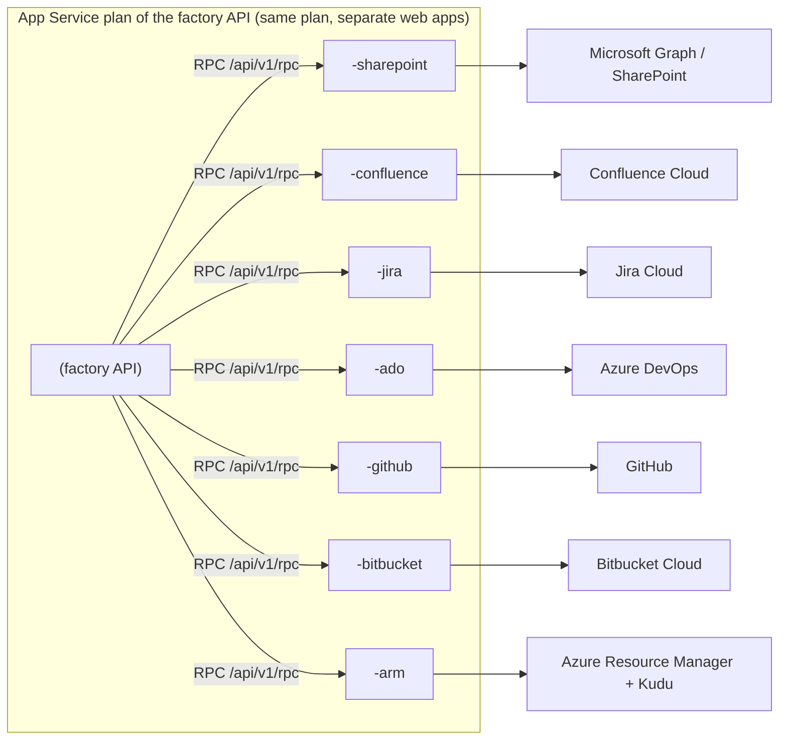

# Connector Setup Guides

The Agentic SDLC Factory stores every project asset in the systems of record (SOR) you select: requirements and design documents, backlogs, test cases, repositories, pull requests, pipelines, and the Azure hosting of generated applications. Each system has its **own connector micro-service**, its own credential, its own Swagger (OpenAPI) contract, and its own step-by-step test so that every setup step can be proven before the next one starts.

## Table of Contents

- [Connector Guides](#connector-guides)
- [Swagger URLs](#swagger-urls)
- [How the Connector Services Are Deployed](#how-the-connector-services-are-deployed)
- [Factory Routing](#factory-routing)
- [Agent Tools (Read-Only)](#agent-tools-read-only)
- [Placeholders Used in Every Guide](#placeholders-used-in-every-guide)
- [Step 1. Create the Connector Web Apps](#step-1-create-the-connector-web-apps)
- [Step 2. Deploy the Connector Code](#step-2-deploy-the-connector-code)
- [Step 3. Test Each Connector](#step-3-test-each-connector)
- [Service API Contract](#service-api-contract)
- [Service API Key Handling](#service-api-key-handling)
- [Troubleshooting Matrix](#troubleshooting-matrix)

## Connector Guides

Complete only the guides for the providers you selected. Each guide ends with a **Verify** step that must pass before go-live.

| # | Connector | What the factory saves there | Credential | Guide | Swagger (OpenAPI) |
| --- | --- | --- | --- | --- | --- |
| 1 | SharePoint Online | A dedicated site per SDLC project (or folders in a shared site), overview page, category folders, uploaded documents | Microsoft Graph application permission (managed identity or app registration) | [sharepoint.md](sharepoint.md) | [sharepoint.openapi.json](openapi/sharepoint.openapi.json) |
| 2 | Confluence Cloud | Project page tree, category folders, document attachments | Scoped Atlassian API token | [confluence.md](confluence.md) | [confluence.openapi.json](openapi/confluence.openapi.json) |
| 3 | Jira Cloud | Projects, Epic → Story → Task backlogs, sprints, test plans and test cases | Unscoped Atlassian API token | [jira.md](jira.md) | [jira.openapi.json](openapi/jira.openapi.json) |
| 4 | Azure DevOps | Projects, Boards work items, Repos, Test Plans, Pipelines, wiki, dashboards | Managed identity (recommended) or PAT exception | [azure-devops.md](azure-devops.md) | [ado.openapi.json](openapi/ado.openapi.json) |
| 5 | GitHub | Private repositories, branches, commits, pull requests, issues, Actions runs | Personal access token of an automation account | [github.md](github.md) | [github.openapi.json](openapi/github.openapi.json) |
| 6 | Bitbucket Cloud | Repositories, branches, commits, pull requests, Pipelines runs | Scoped Bitbucket API token | [bitbucket.md](bitbucket.md) | [bitbucket.openapi.json](openapi/bitbucket.openapi.json) |
| 7 | Azure Resource Manager | App Service plans and web apps for generated applications; published code | Managed identity with App Service roles | [azure-resource-manager.md](azure-resource-manager.md) | [azure-arm.openapi.json](openapi/azure-arm.openapi.json) |

Open any OpenAPI file in an interactive viewer with `https://petstore.swagger.io/?url=https://raw.githubusercontent.com/csdmichael/Foundry-Agentic-Workflow-SDLC-Docs/main/docs/setup/connectors/openapi/<file>`. The deployed service serves the same contract live at `https://<api-app>-<suffix>/docs`.

## Swagger URLs

Every connector service publishes interactive Swagger UI at `/docs`, ReDoc at `/redoc`, and the OpenAPI document at `/openapi.json`. The pages are anonymous; operations require the `X-Connector-Api-Key` header (use **Authorize** in Swagger UI).

| Connector | Swagger UI (your environment) | Reference environment | Committed contract |
| --- | --- | --- | --- |
| [SharePoint](sharepoint.md) | `https://<api-app>-sharepoint.azurewebsites.net/docs` | [Swagger](https://agentic-sdlc-api-my-sharepoint.azurewebsites.net/docs) · [OpenAPI](https://agentic-sdlc-api-my-sharepoint.azurewebsites.net/openapi.json) | [sharepoint.openapi.json](openapi/sharepoint.openapi.json) |
| [Confluence](confluence.md) | `https://<api-app>-confluence.azurewebsites.net/docs` | [Swagger](https://agentic-sdlc-api-my-confluence.azurewebsites.net/docs) · [OpenAPI](https://agentic-sdlc-api-my-confluence.azurewebsites.net/openapi.json) | [confluence.openapi.json](openapi/confluence.openapi.json) |
| [Jira](jira.md) | `https://<api-app>-jira.azurewebsites.net/docs` | [Swagger](https://agentic-sdlc-api-my-jira.azurewebsites.net/docs) · [OpenAPI](https://agentic-sdlc-api-my-jira.azurewebsites.net/openapi.json) | [jira.openapi.json](openapi/jira.openapi.json) |
| [Azure DevOps](azure-devops.md) | `https://<api-app>-ado.azurewebsites.net/docs` | [Swagger](https://agentic-sdlc-api-my-ado.azurewebsites.net/docs) · [OpenAPI](https://agentic-sdlc-api-my-ado.azurewebsites.net/openapi.json) | [ado.openapi.json](openapi/ado.openapi.json) |
| [GitHub](github.md) | `https://<api-app>-github.azurewebsites.net/docs` | [Swagger](https://agentic-sdlc-api-my-github.azurewebsites.net/docs) · [OpenAPI](https://agentic-sdlc-api-my-github.azurewebsites.net/openapi.json) | [github.openapi.json](openapi/github.openapi.json) |
| [Bitbucket](bitbucket.md) | `https://<api-app>-bitbucket.azurewebsites.net/docs` | [Swagger](https://agentic-sdlc-api-my-bitbucket.azurewebsites.net/docs) · [OpenAPI](https://agentic-sdlc-api-my-bitbucket.azurewebsites.net/openapi.json) | [bitbucket.openapi.json](openapi/bitbucket.openapi.json) |
| [Azure Resource Manager](azure-resource-manager.md) | `https://<api-app>-arm.azurewebsites.net/docs` | [Swagger](https://agentic-sdlc-api-my-arm.azurewebsites.net/docs) · [OpenAPI](https://agentic-sdlc-api-my-arm.azurewebsites.net/openapi.json) | [azure-arm.openapi.json](openapi/azure-arm.openapi.json) |

## How the Connector Services Are Deployed



| Property | Value |
| --- | --- |
| Hosting | Seven Linux web apps, Python 3.13, on the **same App Service plan as the factory API**. No new plan or SKU is created. |
| Naming | `<api-app>-<suffix>`: `sharepoint`, `confluence`, `jira`, `ado`, `github`, `bitbucket`, `arm`. |
| Code | One package (`api/app` connector clients + `api/connector_services`). Each web app selects its service with its startup command, for example `gunicorn connector_services.jira.main:app -k uvicorn.workers.UvicornWorker --bind 0.0.0.0:8000 --workers 1 --timeout 300`. |
| Isolation | Each web app holds **only its own connector's credential** and its own system-assigned managed identity. A compromised Jira token cannot reach GitHub. |
| Health | App Service health check path `/health`; Always On; HTTPS only; TLS 1.2; FTPS disabled. |
| Authentication | `X-Connector-Api-Key` header on every call except `GET /health`. |
| Factory routing | With `CONNECTOR_SERVICE_URL_<KEY>` and `CONNECTOR_SERVICE_KEY_<KEY>` set on the factory API, **every live system-of-record call the factory makes executes in the matching connector service** (see [Factory Routing](#factory-routing)). The factory selects the service from the project's settings, for example SharePoint or Confluence for documentation. |
| CI/CD | One GitHub Actions workflow per connector: `deploy-connector-<name>.yml`, plus `provision-connector-services.yml` to create the web apps. |
| Capacity | Seven extra always-on Python workers share the plan's memory. Confirm the plan size (B3 baseline) has headroom: **App Service plan > Monitoring > Memory percentage** should stay below 80 % after all services are running. |

## Factory Routing

The factory API is connector-agnostic: workflow code asks for "documentation", "work items", "source control", or "hosting" for the project's selected provider, and the call executes inside that provider's connector service.

| Keys | `<KEY>` values |
| --- | --- |
| `CONNECTOR_SERVICE_URL_<KEY>` | `SHAREPOINT`, `CONFLUENCE`, `JIRA`, `ADO`, `GITHUB`, `BITBUCKET`, `AZURE_ARM` → `https://<api-app>-<suffix>.azurewebsites.net` |
| `CONNECTOR_SERVICE_KEY_<KEY>` | That service's `CONNECTOR_SERVICE_API_KEY` (Key Vault reference recommended) |
| `CONNECTOR_SERVICE_TIMEOUT_SECONDS` | Optional, default `600` |

How it works:

1. Each connector client method the factory calls (for example `ensure_project_structure` for a new project's documentation) is sent to `POST https://<api-app>-<suffix>.azurewebsites.net/api/v1/rpc` with the service API key. Only allow-listed public operations are accepted.
2. The service runs the operation with **its own** credential or managed identity and returns the result; errors keep their type, HTTP status, and upstream status, so retries and circuit breakers behave as before.
3. Calls stay in the factory when a connector is in mock mode, when no service URL is configured, or for pure URL helpers. Two Azure operations also stay in the factory because they use the factory identity: the Foundry model catalog and Entra federated-credential management.

Wire the factory after the services are deployed (Step 2):

```powershell
./scripts/connector-services/New-ConnectorServiceApps.ps1 -ResourceGroup $ResourceGroup -ApiAppName $ApiApp -Subscription $Subscription -WireFactory
az webapp restart -g $ResourceGroup -n $ApiApp --subscription $Subscription
```

**Verify**: the connector service log stream (`az webapp log tail -g $ResourceGroup -n "$ApiApp-jira"`) shows `connector-service-audit` records with `"action": "jira.rpc.<operation>"` and `"caller": "factory-api"` when the factory creates or updates Jira records. Keep each connector's `*_LIVE=1` flag and non-secret URL settings on the factory API; connector secrets are only needed on the connector services once routing is verified.

## Agent Tools (Read-Only)

Foundry agents can look up existing records in the project's systems of record through **read-only OpenAPI tools** that call the connector services. Agents cannot change anything through these tools: every change is written into the agent's proposal and published by the factory only after human approval.

| Piece | Detail |
| --- | --- |
| Tool contract | GET operations only, generated from each service's contract: [openapi/tools](openapi/tools) (for example `github_get_file`, `ado_list_work_items`, `jira_get_project`, `sharepoint_resolve_site`). |
| Credential | Each service has a separate `CONNECTOR_SERVICE_READONLY_API_KEY`. The service accepts it **only for GET/HEAD**; POST, PUT, PATCH, DELETE and `/api/v1/rpc` return `403`. |
| Foundry connection | `sdlc-connector-<service>` (category **Custom keys**, key `X-Connector-Api-Key`) in the Foundry project, one per service. |
| Agent assignment | `connectorTools.agents` in [agents.config.json](https://github.com/csdmichael/Foundry-Agentic-Workflow-SDLC/blob/main/api/src/agents/config/agents.config.json), for example Requirements → documentation and work-item lookups, Code Review → repositories. |
| Synchronization | The **Deploy API** workflow passes the service URLs to `sync_foundry_agents.py`, which attaches the tools and re-versions an agent only when its definition hash changes. |
| Failed lookups | A tool call that fails (for example invalid WIQL or an unknown project) returns HTTP 200 with `{"ok": false, "status": <code>, "error": "..."}` to the agent, so the model can correct the query or continue. Foundry would otherwise fail the whole agent response. If Foundry still reports a tool failure, the factory retries once without tools and then backs off as a transient error; the workflow is never stopped by a lookup. |

Create the read-only keys and Foundry connections (idempotent; keys are never displayed):

```powershell
./scripts/connector-services/New-ConnectorServiceApps.ps1 -ResourceGroup $ResourceGroup -ApiAppName $ApiApp -Subscription $Subscription -WireFoundry
gh workflow run deploy-api.yml --repo <github-owner>/<application-repository> --ref main
```

**Verify**

1. **Foundry portal > your project > Management center > Connected resources** lists `sdlc-connector-sharepoint` … `sdlc-connector-azure-arm`.
2. **Foundry portal > Agents > 010-requirements-agent > Tools** lists the `*_readonly` OpenAPI tools.
3. The read-only key reads but cannot write:

   ```powershell
   $key = az webapp config appsettings list -g $ResourceGroup -n "$ApiApp-github" --query "[?name=='CONNECTOR_SERVICE_READONLY_API_KEY'].value | [0]" -o tsv
   (Invoke-WebRequest "https://$ApiApp-github.azurewebsites.net/api/v1/repos" -Headers @{ 'X-Connector-Api-Key' = $key }).StatusCode        # 200
   (Invoke-WebRequest "https://$ApiApp-github.azurewebsites.net/api/v1/repos" -Method POST -Body '{"name":"x"}' -ContentType 'application/json' `
       -Headers @{ 'X-Connector-Api-Key' = $key } -SkipHttpErrorCheck).StatusCode                                                            # 403
   ```

Rotate with `-RotateApiKey -WireFoundry` (updates the service and the Foundry connection together).

## Placeholders Used in Every Guide

Replace every placeholder with your own value. The same names are used in commands, URLs, and screenshots captions.

| Placeholder | Meaning | Example format |
| --- | --- | --- |
| `<tenant-id>` | Entra ID tenant that hosts the factory | `00000000-0000-0000-0000-000000000000` |
| `<subscription-id>` | Azure subscription of the factory | GUID |
| `<factory-resource-group>` | Resource group of the factory API | `rg-agentic-sdlc-prod` |
| `<api-app>` | Factory API web app name | `agentic-sdlc-api-prod` |
| `<sharepoint-tenant>` | SharePoint Online host prefix | `contoso` for `contoso.sharepoint.com` |
| `<atlassian-site>` | Atlassian Cloud site prefix | `contoso` for `contoso.atlassian.net` |
| `<ado-organization>` | Azure DevOps organization | `contoso` for `dev.azure.com/contoso` |
| `<github-owner>` | GitHub organization or user | `contoso-engineering` |
| `<bitbucket-workspace>` | Bitbucket workspace slug | `contoso` |
| `<automation-email>` | Mailbox of the dedicated automation account | `sdlc-automation@contoso.com` |

Run all PowerShell commands in **PowerShell 7 from the root of the application repository** after `az login --tenant <tenant-id>` and `az account set --subscription <subscription-id>`:

```powershell
$ResourceGroup = '<factory-resource-group>'
$ApiApp = '<api-app>'
$Subscription = '<subscription-id>'
```

## Step 1. Create the Connector Web Apps

Complete the credential steps in the connector guides first, so that the factory API already holds each connector's settings. Then create all seven connector web apps on the factory API's plan and copy **only** each connector's own settings into its web app:

```powershell
./scripts/connector-services/New-ConnectorServiceApps.ps1 -ResourceGroup $ResourceGroup -ApiAppName $ApiApp `
    -Subscription $Subscription -CopyConnectorSettings -GrantArmRoles
```

Alternative without a workstation: **GitHub > Actions > Provision connector services > Run workflow** (`provision-connector-services.yml`).

Use `-Services jira,confluence` to limit the run to selected connectors. The script is idempotent; re-run it after changing a credential on the factory API. It generates a random 64-character `CONNECTOR_SERVICE_API_KEY` for each web app and never prints it.

**Verify step 1**

```powershell
az webapp list --resource-group $ResourceGroup --subscription $Subscription `
    --query "[?starts_with(name, '$ApiApp-')].{name:name, plan:appServicePlanId, state:state}" --output table
```

Expected: seven rows, all with the factory API's plan ID and `Running`.

## Step 2. Deploy the Connector Code

Preferred: push to `main` or run **GitHub > Actions > Deploy connector service - &lt;name&gt;**. Each workflow runs the connector tests, verifies the committed OpenAPI documents are current, deploys the package, and smoke-tests `/health`, `/docs`, API-key enforcement, readiness, and connectivity.

First-time or controlled redeploy from a workstation:

```powershell
./scripts/connector-services/Deploy-ConnectorServices.ps1 -ResourceGroup $ResourceGroup -ApiAppName $ApiApp -Subscription $Subscription
```

**Verify step 2**: every service answers its anonymous liveness probe.

```powershell
foreach ($suffix in 'sharepoint','confluence','jira','ado','github','bitbucket','arm') {
    $health = Invoke-RestMethod "https://$ApiApp-$suffix.azurewebsites.net/health"
    '{0,-11} {1} mode={2}' -f $suffix, $health.status, $health.mode
}
```

Expected: `ok` for every service and `mode=live` for every selected connector.

## Step 3. Test Each Connector

Every connector has a script in [`scripts/connector-services`](https://github.com/csdmichael/Foundry-Agentic-Workflow-SDLC/tree/main/scripts/connector-services). Each script runs the same five read-only checks, then optional write checks against disposable resources:

| Check | Call | Passes when |
| --- | --- | --- |
| 1. Liveness | `GET /health` (anonymous) | HTTP 200 and the expected connector name |
| 2. Swagger | `GET /openapi.json`, `GET /docs` | HTTP 200; contract contains the health and operation paths |
| 3. API key enforced | `GET /health/ready` without key | HTTP 401 (503 means no key configured) |
| 4. Readiness | `GET /health/ready` with key | HTTP 200; every required setting is present (values are never returned) |
| 5. Connectivity | `GET /health/connectivity` with key | HTTP 200; one authenticated, read-only call to the external system |
| 6. Write smoke test | Connector-specific, with `-Create` | Disposable project/repository/page/site is created; `-Cleanup` deletes it where supported |

```powershell
./scripts/connector-services/test-jira-connector.ps1 -ResourceGroup $ResourceGroup -ApiAppName $ApiApp
./scripts/connector-services/test-jira-connector.ps1 -ResourceGroup $ResourceGroup -ApiAppName $ApiApp -Create -Cleanup
```

The script reads the service API key from the web app's settings with your `az` session, from `$env:CONNECTOR_SERVICE_API_KEY`, or from a masked prompt. It exits with code 1 on any failure and prints the fix for the first failed step.

## Service API Contract

Every connector service exposes the same platform endpoints:

| Method | Path | Auth | Purpose |
| --- | --- | --- | --- |
| GET | `/health` | Anonymous | Liveness: `status`, `service`, `connector`, `version`, `mode` (`live`, `mock`, `disabled`). No outbound call, no configuration. |
| GET | `/health/ready` | API key | Configuration readiness: each required setting by **name** with `ok` and a hint. 200 ready, 503 not ready. |
| GET | `/health/connectivity` | API key | Live read-only probe: identity summary and latency. 200 connected; 409 mock/disabled; 502/503 rejected. |
| GET | `/docs`, `/redoc`, `/openapi.json` | Anonymous | Swagger UI, ReDoc, OpenAPI 3.1 document. Disable with `CONNECTOR_SERVICE_DOCS_ENABLED=0` if policy requires. |
| * | `/api/v1/...` | API key | Connector operations. See each guide and its OpenAPI file. |
| POST | `/api/v1/rpc` | API key | Internal contract used by the factory API to execute allow-listed client operations ([Factory Routing](#factory-routing)). |

Errors use the factory envelope `{"error": "...", "correlationId": "..."}`. Send `x-correlation-id` to trace one call across logs and `X-Caller` to name the caller in the audit record. Every write operation writes one JSON audit line (`connector_services.audit` logger) to the App Service log stream with action, target, caller, and correlation ID; secrets and document contents are never logged.

## Service API Key Handling

| Task | How |
| --- | --- |
| Read the key for a test | The test scripts read it with `az`. Manually: `az webapp config appsettings list -g $ResourceGroup -n "$ApiApp-jira" --query "[?name=='CONNECTOR_SERVICE_API_KEY'].value" -o tsv`. Do not paste it into tickets or chat. |
| Rotate with zero downtime | `New-ConnectorServiceApps.ps1 ... -Services jira -RotateApiKey`. The previous key moves to `CONNECTOR_SERVICE_API_KEY_SECONDARY` and keeps working until you delete that setting. |
| Store in Key Vault | Replace the setting value with `@Microsoft.KeyVault(SecretUri=https://<vault>.vault.azure.net/secrets/<name>/)` and grant the web app identity **Key Vault Secrets User**. |
| Restrict network access | Add App Service access restrictions (or a private endpoint) so only the factory API subnet and approved admin IPs reach `/api/v1`. Keep `/health` reachable by the platform health check. |

## Troubleshooting Matrix

| Symptom | Cause | Fix |
| --- | --- | --- |
| `/health` times out after deployment | Container still starting, or code not deployed yet | Wait 2–5 minutes; check **Log stream**; re-run Step 2. |
| `/health` returns 200 with `mode=mock` | `*_LIVE=1` not set on the connector web app | Set the live flag (see guide), restart, re-test. |
| `/health/ready` without key returns 503 | `CONNECTOR_SERVICE_API_KEY` missing or shorter than 32 characters | Re-run Step 1. |
| `/health/ready` returns 503 with `MISSING` rows | A required setting is absent on the connector web app | Set it (or re-run Step 1 with `-CopyConnectorSettings`), restart. |
| `/health/connectivity` returns 502 with an upstream 401/403 | Credential expired or missing a permission | Follow the permission table in the connector guide; rotate the credential. |
| Deploy fails with Kudu 403 | Wrong default `az` subscription/tenant | `az account set --subscription <subscription-id>`, then re-run with `-Subscription`. |
