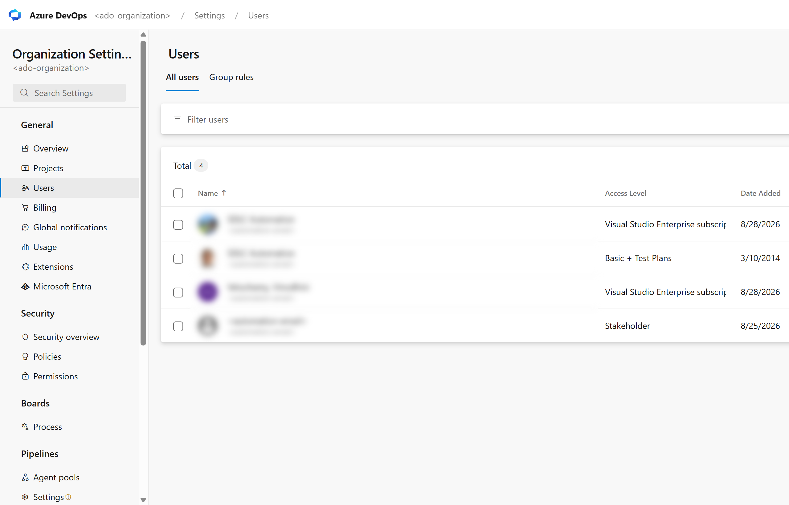
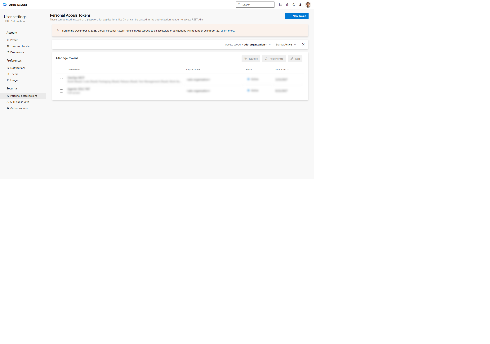
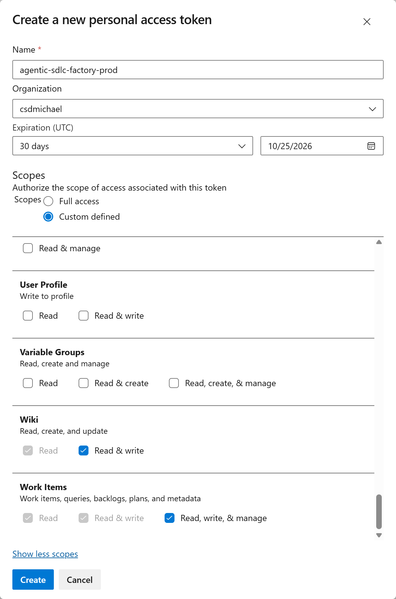
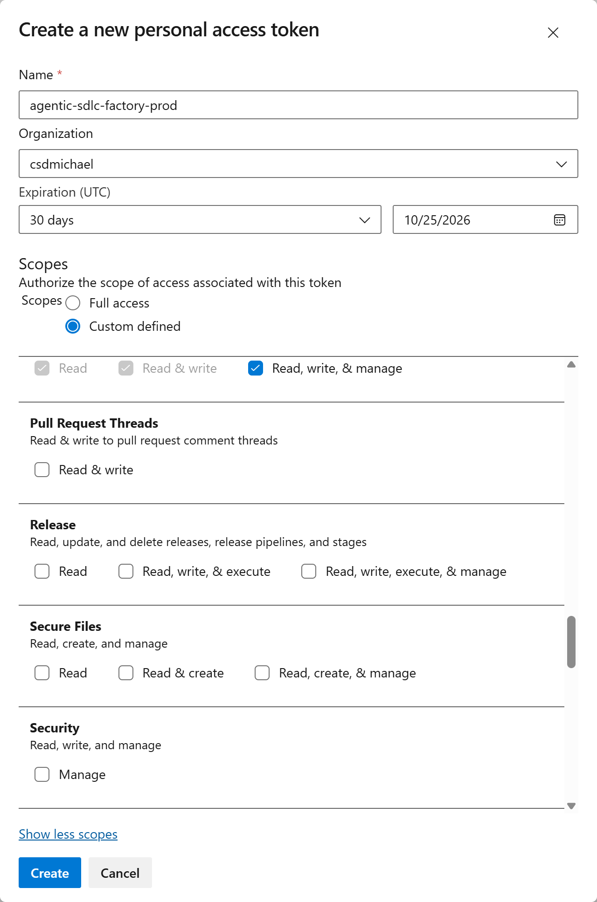
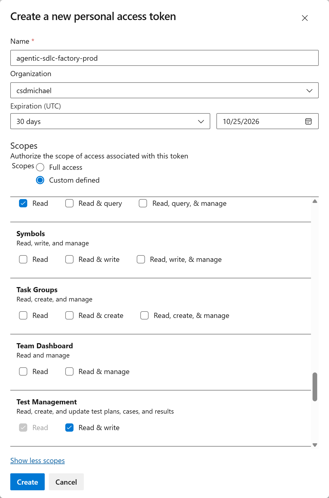
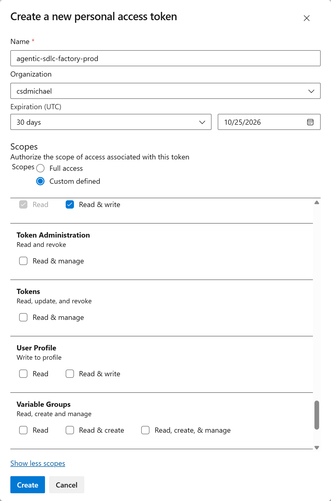
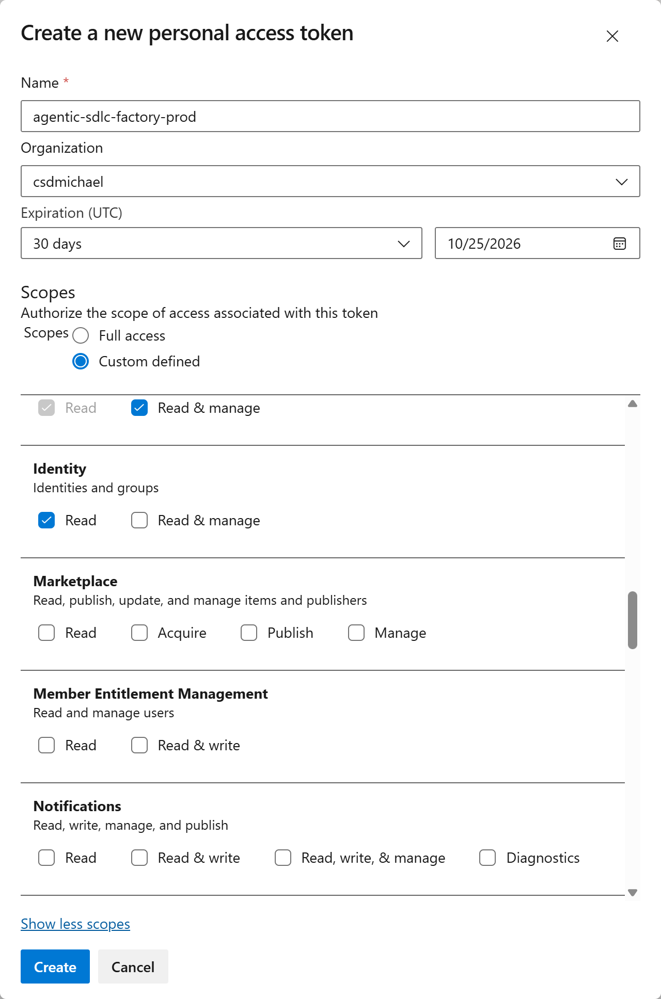

# Azure DevOps Connector Setup

The Azure DevOps (ADO) connector creates and maintains everything the factory owns in Azure DevOps: projects, Azure Boards work items and backlog hierarchies, iterations, Azure Repos repositories and branches, pull requests, Test Plans, pipelines, wiki pages and dashboards. It runs as its own micro-service, `<api-app>-ado`.

## Table of Contents

- [What You Will Configure](#what-you-will-configure)
- [Prerequisites](#prerequisites)
- [Authentication Options (Best Practice)](#authentication-options-best-practice)
- [Option A (Recommended). Managed Identity](#option-a-recommended-managed-identity)
- [Option B. User-Assigned Managed Identity or Service Principal](#option-b-user-assigned-managed-identity-or-service-principal)
- [Option C (Not Recommended). Personal Access Token Exception](#option-c-not-recommended-personal-access-token-exception)
- [Grant Azure DevOps Permissions](#grant-azure-devops-permissions)
- [Azure Pipelines Service Connection](#azure-pipelines-service-connection)
- [Deploy and Test the ADO Connector Service](#deploy-and-test-the-ado-connector-service)
- [API Reference (Swagger)](#api-reference-swagger)
- [Troubleshooting](#troubleshooting)

## What You Will Configure

| Setting | Where | Value |
| --- | --- | --- |
| `ADO_ORGANIZATION_URL` | Factory API and `<api-app>-ado` | `https://dev.azure.com/<ado-organization>` |
| `ADO_LIVE` | Same | `1` |
| `ADO_PAT` | **Only for Option C** | PAT. When present it takes precedence over managed identity — remove it for Options A/B. |
| `ADO_AZURE_SERVICE_CONNECTION` | Same | Name of the ARM workload-identity service connection used by generated pipelines |

## Prerequisites

| Requirement | Verify |
| --- | --- |
| Azure DevOps organization `https://dev.azure.com/<ado-organization>` **connected to the Entra tenant** of the factory (`<tenant-id>`) | **Organization settings → Microsoft Entra** shows the tenant. |
| Project Collection Administrator (to add identities and set access levels) | Can open **Organization settings → Users**. |
| Connector web apps created ([overview](README.md#step-1-create-the-connector-web-apps)) | `https://<api-app>-ado.azurewebsites.net/health` returns `ok`. |

## Authentication Options (Best Practice)

Microsoft recommends **Microsoft Entra tokens over "higher-risk" personal access tokens** for automation: managed identities and service principals are not tied to an employee, obtain short-lived tokens, and can be governed by Entra Conditional Access; organizations can restrict or disable PAT creation by policy. See [Use service principals and managed identities in Azure DevOps](https://learn.microsoft.com/azure/devops/integrate/get-started/authentication/service-principal-managed-identity), [Authentication guidance](https://learn.microsoft.com/azure/devops/integrate/get-started/authentication/authentication-guidance), and [Make your Azure DevOps secure](https://learn.microsoft.com/azure/devops/organizations/security/security-overview#replace-service-accounts-with-modern-alternatives).

| Option | Credential stored | Recommendation |
| --- | --- | --- |
| **A. System-assigned managed identity** of `<api-app>` and `<api-app>-ado` | None | **Recommended** |
| B. User-assigned managed identity, or an Entra service principal with a federated credential/certificate | None (MI) or certificate | Use when several apps must share one ADO identity, or the org is in another tenant |
| C. PAT of a dedicated licensed account | Long-lived secret | **Not recommended.** Documented exception only when A/B are blocked; short expiry, custom scopes, owner and rotation required |

## Option A (Recommended). Managed Identity

The connector uses `DefaultAzureCredential` for ADO whenever `ADO_PAT` is **absent**, which resolves the web app's system-assigned managed identity.

1. Get the principal (object) IDs of both identities (created by `New-ConnectorServiceApps.ps1`):

   ```powershell
   foreach ($app in '<api-app>', '<api-app>-ado') {
       '{0,-24} {1}' -f $app, (az webapp identity show -g <factory-resource-group> -n $app --query principalId -o tsv)
   }
   ```

2. Open `https://dev.azure.com/<ado-organization>/_settings/users` → **Add users**. Search by the web app name (the managed identity's display name) or paste the principal ID. Access level **Basic** (or **Basic + Test Plans** to create test plans). Add to the projects/groups below. Do not use the app registration's object ID.

   
   *`https://dev.azure.com/<ado-organization>/_settings/users` — user names are blurred; the managed identity appears as a service principal row after it is added.*

3. Remove any leftover PAT and enable live mode:

   ```powershell
   foreach ($app in '<api-app>', '<api-app>-ado') {
       az webapp config appsettings delete -g <factory-resource-group> -n $app --setting-names ADO_PAT --output none
       az webapp config appsettings set -g <factory-resource-group> -n $app --settings `
           ADO_ORGANIZATION_URL=https://dev.azure.com/<ado-organization> ADO_LIVE=1 --output none
   }
   ```

**Verify Option A**: run the [test](#deploy-and-test-the-ado-connector-service). Readiness shows `authentication  managed-identity (DefaultAzureCredential)` and connectivity shows `"authMode":"entra-id"`.

## Option B. User-Assigned Managed Identity or Service Principal

| Variant | Setup |
| --- | --- |
| User-assigned managed identity | Create it, assign it to `<api-app>-ado` (**Identity → User assigned**), set `AZURE_CLIENT_ID=<uami-client-id>` **on the connector web app only**, and add the identity to ADO as in Option A. |
| Service principal with certificate | Register an app, upload a certificate, set `AZURE_TENANT_ID`, `AZURE_CLIENT_ID`, `AZURE_CLIENT_CERTIFICATE_PATH` on `<api-app>-ado` only, and add the service principal to ADO. Never use a client secret for production. |

Do not set generic `AZURE_*` variables on the factory API: they redirect `DefaultAzureCredential` for every Azure call it makes.

## Option C (Not Recommended). Personal Access Token Exception

Use only with a documented security exception when Options A/B are not possible (for example, the organization is not connected to Entra ID). Use a dedicated licensed automation account, never an employee.

1. Sign in as the automation account and open `https://dev.azure.com/<ado-organization>/_usersSettings/tokens` → **New Token**.

   
   *`https://dev.azure.com/<ado-organization>/_usersSettings/tokens` (existing tokens blurred).*

2. **Name** `agentic-sdlc-factory-<environment>`, **Organization** `<ado-organization>` (never *All accessible organizations*), **Expiration** the shortest practical (30–90 days), **Scopes: Custom defined**, then **Show all scopes**.
3. Tick exactly the scopes below and never **Full access**:

   | Capability | Scope to tick | Scope ID | Screenshot |
   | --- | --- | --- | --- |
   | Backlog, iterations, queries, plans | Work Items: **Read, write, & manage** | `vso.work_full` |  |
   | Repos, branches, commits, pull requests | Code: **Read, write, & manage** | `vso.code_manage` | Same pattern as the other rows (near the top of the list) |
   | Project and team creation | Project and Team: **Read, write, & manage** | `vso.project_manage` |  |
   | Pipeline definitions and runs | Build: **Read & execute** | `vso.build_execute` | Same pattern (top of the list) |
   | Existing service connection lookup | Service Connections: **Read** | `vso.serviceendpoint` |  |
   | Test plans, suites, cases, runs | Test Management: **Read & write** | `vso.test_write` |  |
   | Project wiki | Wiki: **Read & write** | `vso.wiki_write` |  |
   | Optional: project access administration | Graph: **Read & manage**; Identity: **Read** | `vso.graph_manage`, `vso.identity` |  |
   | Dashboards | Team dashboards are covered by *Work Items* / *Project and Team* in the current UI; add *Dashboards* if shown | `vso.dashboards_manage` | — |

4. **Create**, copy once, and store it:

   ```powershell
   $Target = @{ ResourceGroup = '<factory-resource-group>'; ApiAppName = '<api-app>' }
   ./scripts/set-connector-secrets.ps1 @Target -AdoPat -Gui
   ./scripts/connector-services/New-ConnectorServiceApps.ps1 -ResourceGroup <factory-resource-group> -ApiAppName <api-app> -Services ado -CopyConnectorSettings
   ```

A PAT only narrows its owner's rights; it does not create missing product permissions. Set an expiry alert and a named rotation owner.

## Grant Azure DevOps Permissions

Grant the chosen identity (A, B, or the C account) only what enabled features need:

| Capability | Permission | Where |
| --- | --- | --- |
| Create projects per SDLC project | **Create new projects** | Organization settings → Permissions → Project Collection level (or pre-create projects and disable ADO provisioning) |
| Delete disposable projects | **Delete team project** | Project settings → Permissions |
| Work items, iterations, queries | Project **Contributors** | Project settings → Permissions |
| Repos, branches, pull requests | Contribute, Create branch, Contribute to pull requests | Project settings → Repositories → Security |
| Test Plans | Access level **Basic + Test Plans** | Organization settings → Users |
| Pipelines | Queue builds, Edit build pipeline | Pipelines → Security |
| Service connection | **User** role on the connection | Project settings → Service connections → Security |

**Verify**: run the write test below; project creation, backlog and repository creation must pass.

## Azure Pipelines Service Connection

For generated applications released by Azure Pipelines, pre-create an **Azure Resource Manager → Workload identity federation** service connection scoped to the generated-app resource group (`https://dev.azure.com/<ado-organization>/<project>/_settings/adminservices`), grant pipeline permission only to the generated pipeline, and set `ADO_AZURE_SERVICE_CONNECTION=<connection-name>`. An ADO PAT is not an Azure deployment credential.

## Deploy and Test the ADO Connector Service

Deploy with **GitHub > Actions > Deploy connector service - Azure DevOps**, then:

```powershell
./scripts/connector-services/test-ado-connector.ps1 -ResourceGroup <factory-resource-group> -ApiAppName <api-app>
./scripts/connector-services/test-ado-connector.ps1 -ResourceGroup <factory-resource-group> -ApiAppName <api-app> -Create -Cleanup
```

`-Create` creates project `agentic-sdlc-verify-<timestamp>`, an Epic → Feature → User Story → Task hierarchy and a repository; `-Cleanup` deletes the project (ADO keeps deleted projects restorable for 28 days).

## API Reference (Swagger)

| Item | Location |
| --- | --- |
| Live Swagger UI | `https://<api-app>-ado.azurewebsites.net/docs` |
| Committed contract | [openapi/ado.openapi.json](openapi/ado.openapi.json) ([interactive viewer](https://petstore.swagger.io/?url=https://raw.githubusercontent.com/csdmichael/Foundry-Agentic-Workflow-SDLC-Docs/main/docs/setup/connectors/openapi/ado.openapi.json)) |

| Method | Path | Purpose |
| --- | --- | --- |
| GET | `/health`, `/health/ready`, `/health/connectivity` | Probes (connectivity reports org URL, auth mode, project count) |
| GET/POST | `/api/v1/projects`, `/api/v1/projects/{project}` | List, get, create projects |
| DELETE | `/api/v1/projects/{project}?confirm={project}` | Delete a disposable project |
| GET/POST | `/api/v1/projects/{project}/repos`, `/repos/{repo}/branches` | Repositories and branches |
| GET/POST/PATCH | `/api/v1/projects/{project}/workitems[/{id}]` | Query (WIQL), create, update work items |
| POST | `/api/v1/projects/{project}/backlog` | Create a linked hierarchy |
| POST | `/api/v1/projects/{project}/testplans`, `/testcases` | Test Plans |
| GET/POST | `/api/v1/projects/{project}/pipelines[/{id}/runs]` | List and queue pipelines |

## Troubleshooting

| Symptom | Cause | Fix |
| --- | --- | --- |
| Connectivity 502 `TF400813` / 401 with managed identity | Identity not added to the organization, or org in another tenant | Add the principal ID (Option A step 2); check the org's Entra connection. |
| `authMode` shows `pat` unexpectedly | `ADO_PAT` still set | Delete it (Option A step 3) and restart. |
| 6b fails `(403)` | Missing **Create new projects** | Grant it or disable ADO project provisioning. |
| Test plan creation fails | Access level lacks Test Plans | Assign **Basic + Test Plans**. |
