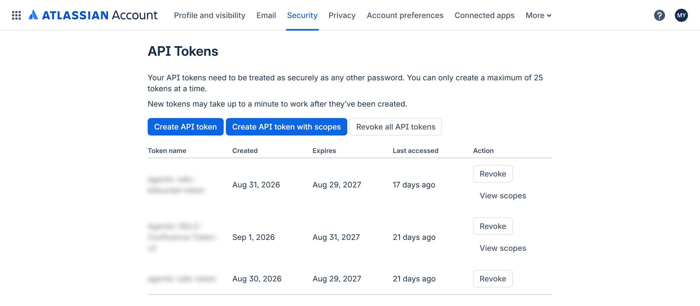
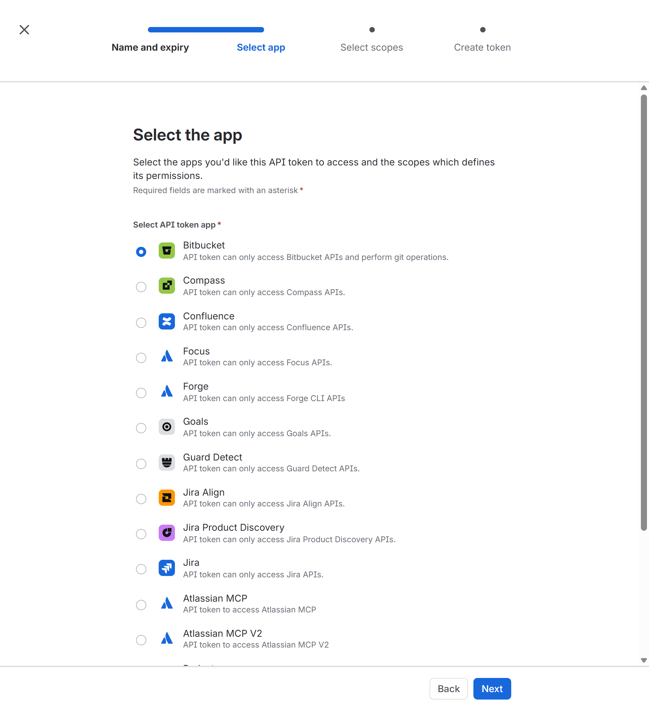
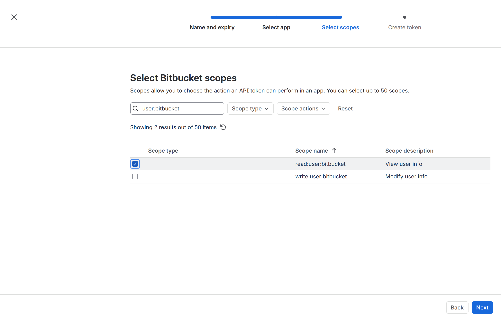
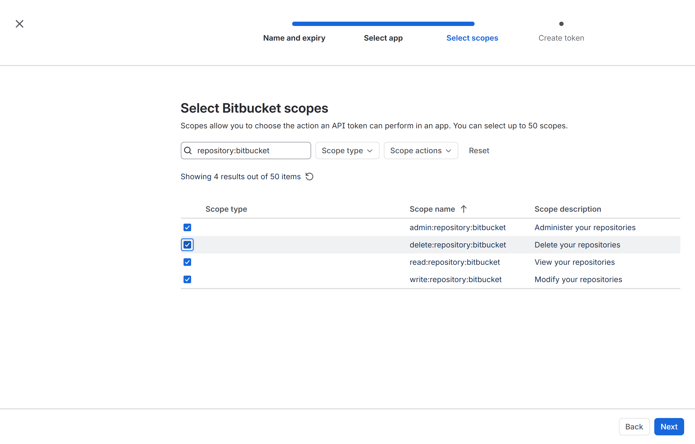
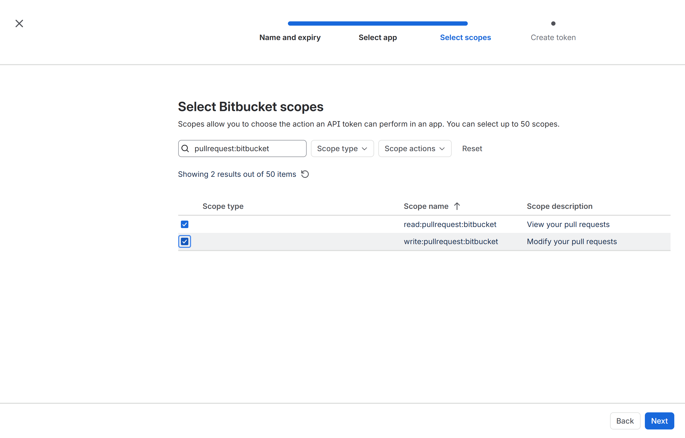
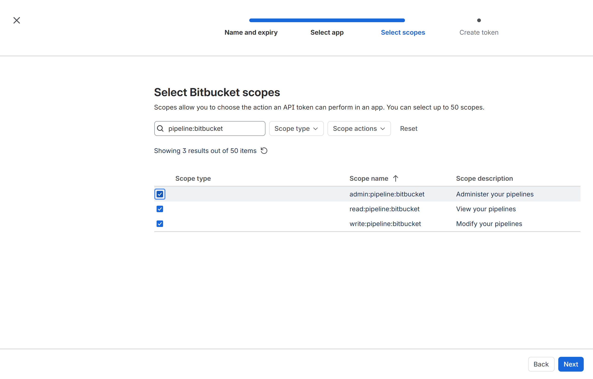
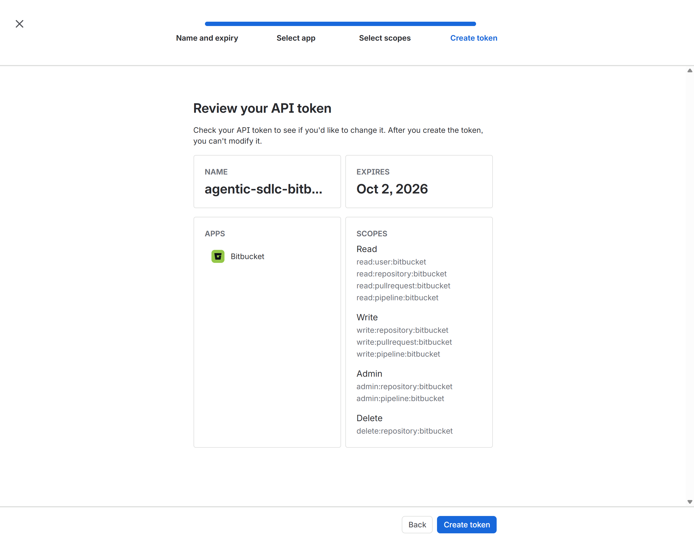

# Bitbucket Cloud Connector Setup

The Bitbucket connector creates and manages the Bitbucket Cloud records the factory owns: one private repository per SDLC project, branches, commits, pull requests, and Bitbucket Pipelines runs. It runs as its own micro-service, `<api-app>-bitbucket`.

> **Swagger / API docs:** `https://<api-app>-bitbucket.azurewebsites.net/docs` (your environment) · [reference environment](https://agentic-sdlc-api-my-bitbucket.azurewebsites.net/docs) · [committed OpenAPI contract](openapi/bitbucket.openapi.json). The Swagger page is anonymous; every `/api/v1` call and `/health/ready`, `/health/connectivity` need the `X-Connector-Api-Key` header — select **Authorize** in Swagger UI and paste the key (see [Service API Key Handling](README.md#service-api-key-handling)).

## Table of Contents

- [What You Will Configure](#what-you-will-configure)
- [Prerequisites](#prerequisites)
- [Authentication Options](#authentication-options)
- [Step 1. Prepare the Workspace and Automation Account](#step-1-prepare-the-workspace-and-automation-account)
- [Step 2. Create the Scoped API Token](#step-2-create-the-scoped-api-token)
- [Step 3. Store the Credential](#step-3-store-the-credential)
- [Step 4. Enable Pipelines](#step-4-enable-pipelines)
- [Step 5. Deploy and Test the Bitbucket Connector Service](#step-5-deploy-and-test-the-bitbucket-connector-service)
- [API Reference (Swagger)](#api-reference-swagger)
- [Azure Release from Bitbucket Pipelines](#azure-release-from-bitbucket-pipelines)
- [Troubleshooting](#troubleshooting)
- [Rotation and Offboarding](#rotation-and-offboarding)

## What You Will Configure

| Setting | Where | Value |
| --- | --- | --- |
| `BITBUCKET_WORKSPACE` | Factory API and `<api-app>-bitbucket` | `<bitbucket-workspace>` |
| `BITBUCKET_WORKSPACE_URL`, `BITBUCKET_REPO_BASE_URL` | Same | `https://bitbucket.org/<bitbucket-workspace>/workspace`, `https://bitbucket.org/<bitbucket-workspace>` |
| `BITBUCKET_USERNAME` | Secret setting | `<automation-email>` (the Atlassian account email) |
| `BITBUCKET_APP_PASSWORD` | Secret setting (Key Vault reference recommended) | Scoped **API token** from Step 2 (the name is kept for compatibility) |
| `BITBUCKET_ACCESS_TOKEN` | Alternative Bearer credential | Workspace/project/repository access token. **Never set both** credential modes. |
| `BITBUCKET_LIVE` | App setting | `1` |

## Prerequisites

| Requirement | Verify |
| --- | --- |
| Bitbucket Cloud workspace `https://bitbucket.org/<bitbucket-workspace>` on a plan with Pipelines minutes | **Workspace settings → Plan details** shows the plan. |
| Workspace admin to add the automation account and configure Pipelines | Can open **Workspace settings**. |
| Connector web apps created ([overview](README.md#step-1-create-the-connector-web-apps)) | `https://<api-app>-bitbucket.azurewebsites.net/health` returns `ok`. |

## Authentication Options

| Option | Status | Notes |
| --- | --- | --- |
| **Scoped Bitbucket API token** + Atlassian account email (Basic) | **Supported and recommended** | Least-privilege scopes below; dedicated account. |
| Workspace / project / repository **access token** (Bearer) | Supported | Not tied to a user; good for fixed repositories. Validate creation reach before using for dynamic repository provisioning. |
| App passwords | **Deprecated by Atlassian — do not create** | Replaced by API tokens. |
| OAuth consumer | Not supported by this release | — |

## Step 1. Prepare the Workspace and Automation Account

1. Invite `<automation-email>` to the workspace at `https://bitbucket.org/<bitbucket-workspace>/workspace/settings/user-directory` with **Member** access and create permission for repositories in the target project.
2. Accept the invitation and enable two-step verification if the workspace requires it.

**Verify step 1**: as the automation account, open `https://bitbucket.org/<bitbucket-workspace>` and confirm **Create → Repository** is available.

## Step 2. Create the Scoped API Token

Sign in **as `<automation-email>`** and open `https://id.atlassian.com/manage-profile/security/api-tokens` (Bitbucket: **Personal settings → Atlassian account settings → Security → Create and manage API tokens**).


*`https://id.atlassian.com/manage-profile/security/api-tokens`*

1. **Create API token with scopes** → Name `agentic-sdlc-bitbucket-<environment>`, shortest practical expiry → **Next**.
2. **Select app**: **Bitbucket** → **Next**.

   

3. **Select scopes** — search and tick exactly these ten scopes:

   | Search term | Tick | Used for | Screenshot |
   | --- | --- | --- | --- |
   | `user:bitbucket` | `read:user:bitbucket` | Identity probe |  |
   | `repository:bitbucket` | `read:repository:bitbucket`, `write:repository:bitbucket`, `admin:repository:bitbucket`, `delete:repository:bitbucket` | Create repos, commit, enable Pipelines, governed cleanup |  |
   | `pullrequest:bitbucket` | `read:pullrequest:bitbucket`, `write:pullrequest:bitbucket` | Open and merge pull requests |  |
   | `pipeline:bitbucket` | `read:pipeline:bitbucket`, `write:pipeline:bitbucket`, `admin:pipeline:bitbucket` | Run pipelines, read status, set variables |  |

4. **Next** → confirm the Review page (4 Read, 3 Write, 2 Admin, 1 Delete) → **Create token** → **Copy**.

   

**Verify step 2**

```powershell
$email = '<automation-email>'
$token = Read-Host -AsSecureString 'Bitbucket API token'
$basic = [Convert]::ToBase64String([Text.Encoding]::UTF8.GetBytes("${email}:$([System.Net.NetworkCredential]::new('', $token).Password)"))
Invoke-RestMethod 'https://api.bitbucket.org/2.0/user' -Headers @{ Authorization = "Basic $basic" } | Select-Object username, display_name
Invoke-RestMethod 'https://api.bitbucket.org/2.0/repositories/<bitbucket-workspace>?pagelen=1' -Headers @{ Authorization = "Basic $basic" } | Select-Object size
Remove-Variable basic, token
```

## Step 3. Store the Credential

```powershell
$Target = @{ ResourceGroup = '<factory-resource-group>'; ApiAppName = '<api-app>' }
./scripts/set-connector-secrets.ps1 @Target -Bitbucket -BitbucketAuthMode AppPassword -BitbucketUsername '<automation-email>' -Gui
az webapp config appsettings set -g <factory-resource-group> -n <api-app> --settings BITBUCKET_WORKSPACE=<bitbucket-workspace> BITBUCKET_LIVE=1 --output none
./scripts/connector-services/New-ConnectorServiceApps.ps1 -ResourceGroup <factory-resource-group> -ApiAppName <api-app> -Services bitbucket -CopyConnectorSettings
```

The secret script removes the settings of the opposite authentication mode. For the Bearer alternative use `-BitbucketAuthMode AccessToken`.

**Verify step 3**: readiness in Step 5 shows `authentication  app-password` (Basic) or `access-token` (Bearer) — never `ambiguous`.

## Step 4. Enable Pipelines

1. Open `https://bitbucket.org/<bitbucket-workspace>/workspace/settings/plans-and-billing` and confirm Pipelines minutes are available.
2. Open **Workspace settings → Pipelines → Settings** and complete first-run enrollment if prompted. Token scopes alone do not complete enrollment.

**Verify step 4**: the Step 5 `-Create` run reports `6f. Pipelines preflight ... enabled=True`.

## Step 5. Deploy and Test the Bitbucket Connector Service

Deploy with **GitHub > Actions > Deploy connector service - Bitbucket**, then:

```powershell
./scripts/connector-services/test-bitbucket-connector.ps1 -ResourceGroup <factory-resource-group> -ApiAppName <api-app>
./scripts/connector-services/test-bitbucket-connector.ps1 -ResourceGroup <factory-resource-group> -ApiAppName <api-app> -Create -Cleanup
```

`-Create` creates a private repository `agentic-sdlc-verify-<timestamp>`, a branch, a commit, a pull request, runs the read-only Pipelines preflight, and `-Cleanup` deletes the repository.

## API Reference (Swagger)

| Item | Location |
| --- | --- |
| Swagger UI (your environment) | `https://<api-app>-bitbucket.azurewebsites.net/docs` |
| ReDoc (your environment) | `https://<api-app>-bitbucket.azurewebsites.net/redoc` |
| OpenAPI JSON (your environment) | `https://<api-app>-bitbucket.azurewebsites.net/openapi.json` |
| Swagger UI (reference environment) | [https://agentic-sdlc-api-my-bitbucket.azurewebsites.net/docs](https://agentic-sdlc-api-my-bitbucket.azurewebsites.net/docs) |
| OpenAPI JSON (reference environment) | [https://agentic-sdlc-api-my-bitbucket.azurewebsites.net/openapi.json](https://agentic-sdlc-api-my-bitbucket.azurewebsites.net/openapi.json) |
| Committed contract | [openapi/bitbucket.openapi.json](openapi/bitbucket.openapi.json) ([interactive viewer](https://petstore.swagger.io/?url=https://raw.githubusercontent.com/csdmichael/Foundry-Agentic-Workflow-SDLC-Docs/main/docs/setup/connectors/openapi/bitbucket.openapi.json)) |

| Method | Path | Purpose |
| --- | --- | --- |
| GET | `/health`, `/health/ready`, `/health/connectivity` | Probes |
| GET/POST | `/api/v1/repos`, `/api/v1/repos/{repo}` | List, get, create repositories |
| DELETE | `/api/v1/repos/{repo}?confirm={repo}` | Delete a disposable repository |
| GET/POST | `/api/v1/repos/{repo}/branches` | List / create branches |
| GET/POST | `/api/v1/repos/{repo}/contents` | Read / commit a file |
| GET/POST | `/api/v1/repos/{repo}/pulls` | List / open pull requests |
| GET | `/api/v1/repos/{repo}/pipelines/access` | Read-only Pipelines preflight |
| POST | `/api/v1/repos/{repo}/pipelines/runs` | Run a pipeline |
| GET | `/api/v1/repos/{repo}/pipelines/latest`, `/{run_id}` | Pipeline status |

## Azure Release from Bitbucket Pipelines

Generated applications that release from Bitbucket Pipelines to Azure need a separate Entra workload identity federation. Set `BITBUCKET_AZURE_CLIENT_ID` / `BITBUCKET_AZURE_TENANT_ID` and the exact `azureOidc` issuer, audience, subject, repository UUID and deployment environment UUID from Bitbucket's OIDC metadata. The current code requires audience `api://AzureADTokenExchange`. See [Azure Resource Manager](azure-resource-manager.md#bitbucket-pipelines-release-identity).

## Troubleshooting

| Symptom | Cause | Fix |
| --- | --- | --- |
| Readiness `authentication ambiguous` | Both Basic and Bearer settings exist | Re-run Step 3 with one mode. |
| Connectivity 502 `(401)` | Username is not the Atlassian **email**, or token expired | Use the email; recreate the token. |
| 6b fails `(403)` | Missing `admin:repository` or no create permission | Recreate token with all scopes; grant workspace create permission. |
| 6f fails | Pipelines not enrolled or no minutes | Complete Step 4. |

## Rotation and Offboarding

Create a new token with the same scopes, store it (Step 3), restart both web apps, run Step 5, then revoke the old token. To offboard, revoke all tokens and remove the account from the workspace.
