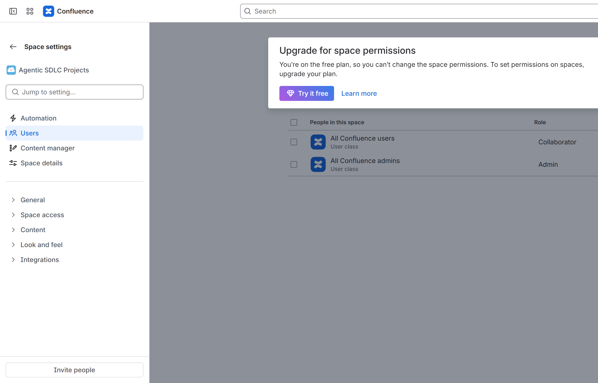
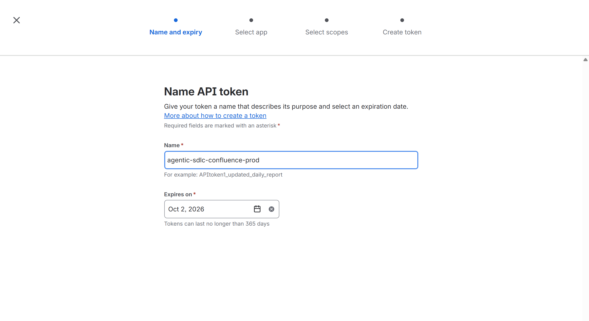
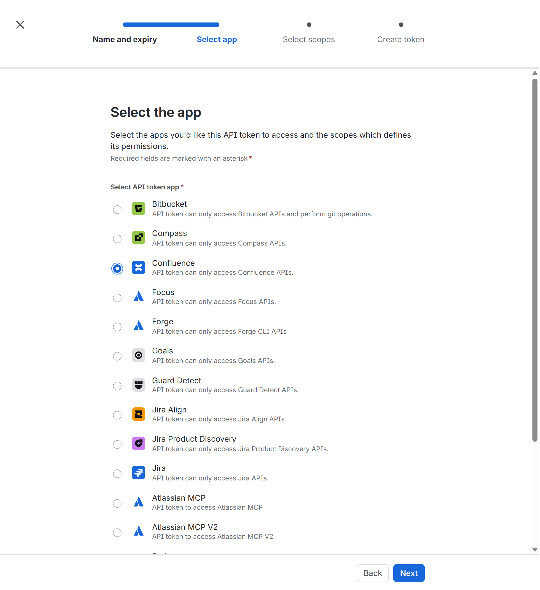
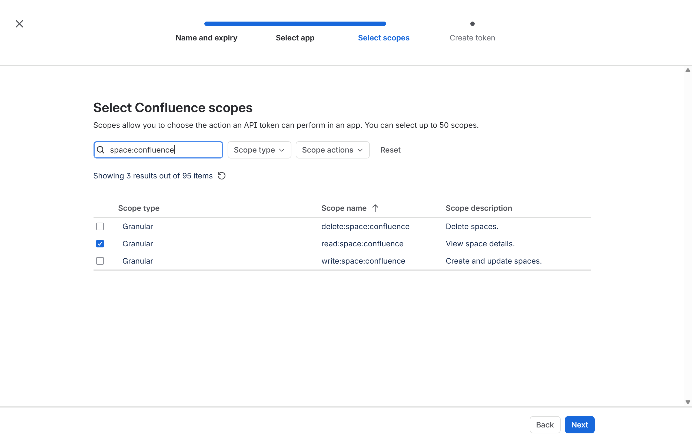
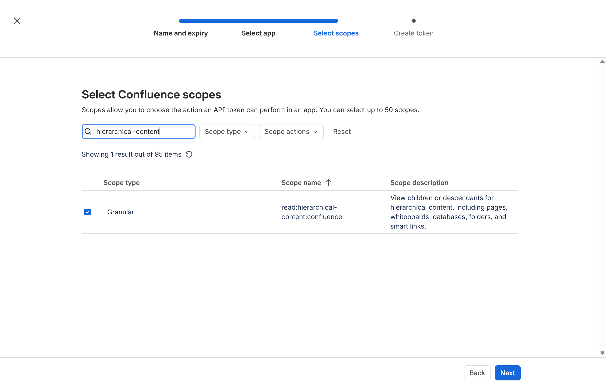
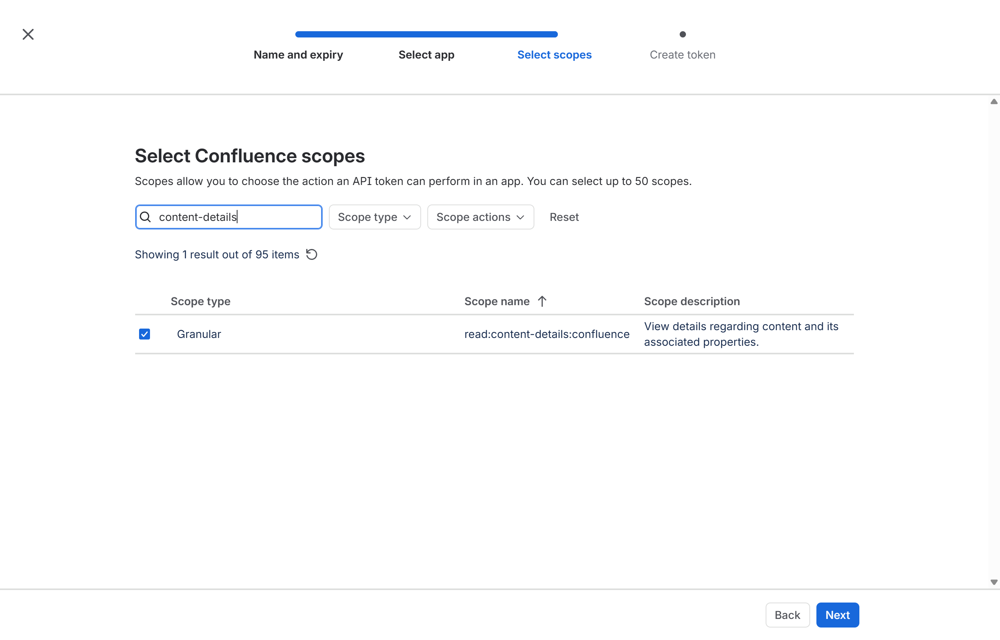
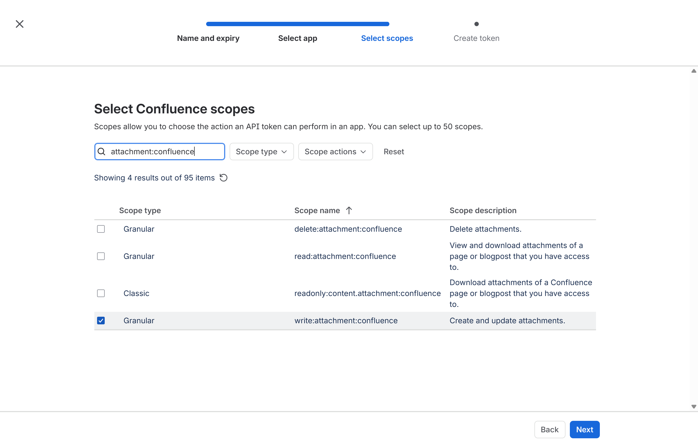
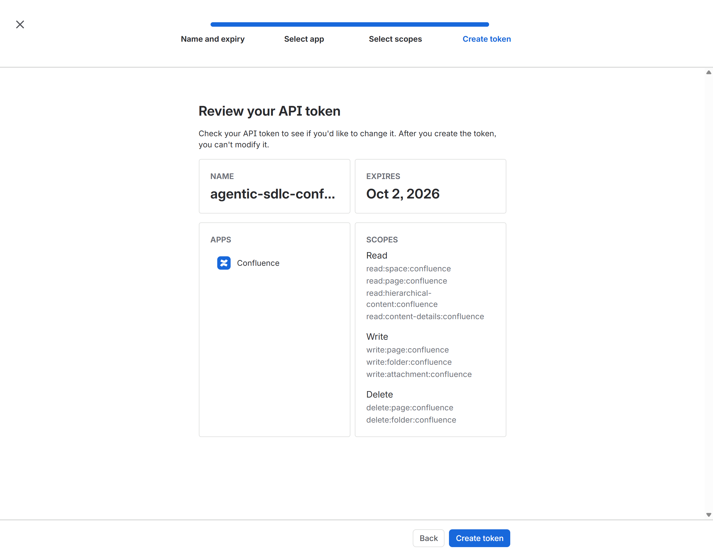

# Confluence Cloud Connector Setup

The Confluence connector publishes each SDLC project's documentation to Confluence Cloud: one project page, one folder per documentation category (Requirements, Technical Requirements, UX and Design, Architecture and Design, Planning, Testing, Release and Operations, Supporting Files), and file attachments. It runs as its own micro-service, `<api-app>-confluence`.

## Table of Contents

- [What You Will Configure](#what-you-will-configure)
- [Prerequisites](#prerequisites)
- [Authentication Options](#authentication-options)
- [Step 1. Prepare the Automation Account and Space](#step-1-prepare-the-automation-account-and-space)
- [Step 2. Find the Cloud ID](#step-2-find-the-cloud-id)
- [Step 3. Create the Scoped API Token](#step-3-create-the-scoped-api-token)
- [Step 4. Store the Credential](#step-4-store-the-credential)
- [Step 5. Deploy and Test the Confluence Connector Service](#step-5-deploy-and-test-the-confluence-connector-service)
- [API Reference (Swagger)](#api-reference-swagger)
- [Troubleshooting](#troubleshooting)
- [Rotation and Offboarding](#rotation-and-offboarding)

## What You Will Configure

| Setting | Where | Value |
| --- | --- | --- |
| `CONFLUENCE_BASE_URL` | Factory API and `<api-app>-confluence` | `https://<atlassian-site>.atlassian.net/wiki` |
| `CONFLUENCE_SPACES_URL` | Same | `https://<atlassian-site>.atlassian.net/wiki/spaces` |
| `CONFLUENCE_CLOUD_ID` | Same (not a secret) | Cloud ID from Step 2 |
| `CONFLUENCE_EMAIL` | Secret setting | `<automation-email>` |
| `CONFLUENCE_API_TOKEN` | Secret setting (Key Vault reference recommended) | Scoped token from Step 3 |
| `CONFLUENCE_LIVE` | App setting | `1` |
| `confluence.spaceKey`, `confluence.spaceName`, `confluence.createSpaceIfMissing` | [integrations.config.json](https://github.com/csdmichael/Foundry-Agentic-Workflow-SDLC/blob/main/api/src/config/integrations.config.json) | Your space key/name; `false` recommended |

## Prerequisites

| Requirement | Verify |
| --- | --- |
| Confluence Cloud site `https://<atlassian-site>.atlassian.net/wiki` | The site opens. |
| An Atlassian organization admin and a Confluence space admin | Both can manage users and space permissions. |
| Dedicated automation account `<automation-email>` with **Confluence** product access (use a different credential from Jira and Bitbucket) | The account can open the site. |
| Connector web apps created ([overview](README.md#step-1-create-the-connector-web-apps)) | `https://<api-app>-confluence.azurewebsites.net/health` returns `ok`. |

## Authentication Options

| Option | Status | Notes |
| --- | --- | --- |
| **Scoped API token** (granular Confluence scopes) + account email, routed through `https://api.atlassian.com/ex/confluence/<cloud-id>` | **Supported and recommended** | Least privilege: only the ten scopes below. |
| Unscoped (classic) API token | Works, **not recommended** | Grants everything the account can do. |
| OAuth 2.0 (3LO) app / Atlassian service account | Not supported by this release | Preferred long-term by Atlassian for organization-owned automation. |

## Step 1. Prepare the Automation Account and Space

1. Invite `<automation-email>` in `https://admin.atlassian.com` with **Confluence** product access.
2. Create (as a Confluence admin) the space that will hold factory projects, for example key `ASDLC`, name *Agentic SDLC Projects*. Keep `createSpaceIfMissing: false` so the connector never creates spaces.
3. In the space open **Space settings → Users** and give the automation account a role that can **view, add and edit pages, add attachments, and delete** its own pages and folders (for example *Collaborator* with delete, or *Admin*). If parent pages are restricted, add the account to the restriction.

   
   *`https://<atlassian-site>.atlassian.net/wiki/spaces/<space-key>/settings/members` (Free plans cannot change per-space permissions; all users get the default role).*

**Verify step 1**: sign in as the automation account, open `https://<atlassian-site>.atlassian.net/wiki/spaces/<space-key>`, and create then delete a test page.

## Step 2. Find the Cloud ID

Open `https://<atlassian-site>.atlassian.net/_edge/tenant_info` in a browser. The response is `{"cloudId":"<cloud-id>"}`. This ID is not a secret.

**Verify step 2**

```powershell
(Invoke-RestMethod "https://<atlassian-site>.atlassian.net/_edge/tenant_info").cloudId
```

## Step 3. Create the Scoped API Token

Sign in **as `<automation-email>`** and open `https://id.atlassian.com/manage-profile/security/api-tokens`.


*`https://id.atlassian.com/manage-profile/security/api-tokens`*

1. Select **Create API token with scopes**. Name: `agentic-sdlc-confluence-<environment>`; **Expires on**: shortest practical date (maximum 365 days). Select **Next**.

   

2. **Select app**: choose **Confluence**, then **Next**.

   

3. **Select scopes**: type each search term into *Search by scope name* and tick exactly these scopes (the read scopes must be selected explicitly; write scopes do not imply them):

   | Search term | Tick | Used for | Screenshot |
   | --- | --- | --- | --- |
   | `space:confluence` | `read:space:confluence` | Resolve the configured space |  |
   | `page:confluence` | `read:page:confluence`, `write:page:confluence`, `delete:page:confluence` | Project page lifecycle |  |
   | `folder:confluence` | `write:folder:confluence`, `delete:folder:confluence` | Category folders |  |
   | `hierarchical-content` | `read:hierarchical-content:confluence` | Find existing children (idempotency) |  |
   | `content-details` | `read:content-details:confluence` | Read attachment metadata |  |
   | `attachment:confluence` | `write:attachment:confluence` | Upload documents |  |
   | `space:confluence` *(optional)* | `write:space:confluence` | Only if `createSpaceIfMissing: true` | — |

4. Select **Next** and compare the **Review** page with the screenshot: 4 Read, 3 Write, 2 Delete scopes. Select **Create token**, then **Copy**.

   

5. Paste the token directly into the masked prompt in Step 4. Record expiry and owner in the handover checklist.

**Verify step 3**

```powershell
$email = '<automation-email>'; $cloudId = '<cloud-id>'
$token = Read-Host -AsSecureString 'Confluence API token'
$basic = [Convert]::ToBase64String([Text.Encoding]::UTF8.GetBytes("${email}:$([System.Net.NetworkCredential]::new('', $token).Password)"))
Invoke-RestMethod "https://api.atlassian.com/ex/confluence/$cloudId/wiki/api/v2/spaces?keys=<space-key>" -Headers @{ Authorization = "Basic $basic" } |
    Select-Object -ExpandProperty results | Select-Object id, key, name
Remove-Variable basic, token
```

Expected: one row with your space key.

## Step 4. Store the Credential

```powershell
$Target = @{ ResourceGroup = '<factory-resource-group>'; ApiAppName = '<api-app>' }
./scripts/set-connector-secrets.ps1 @Target -Confluence -ConfluenceCloudId '<cloud-id>' -Gui
az webapp config appsettings set -g <factory-resource-group> -n <api-app> --settings `
    CONFLUENCE_BASE_URL=https://<atlassian-site>.atlassian.net/wiki `
    CONFLUENCE_SPACES_URL=https://<atlassian-site>.atlassian.net/wiki/spaces CONFLUENCE_LIVE=1 --output none
./scripts/connector-services/New-ConnectorServiceApps.ps1 -ResourceGroup <factory-resource-group> -ApiAppName <api-app> -Services confluence -CopyConnectorSettings
```

**Verify step 4**: `az webapp config appsettings list -g <factory-resource-group> -n <api-app>-confluence --query "[?starts_with(name,'CONFLUENCE_')].name" -o tsv` lists `CONFLUENCE_API_TOKEN`, `CONFLUENCE_CLOUD_ID`, `CONFLUENCE_EMAIL`, `CONFLUENCE_LIVE`.

## Step 5. Deploy and Test the Confluence Connector Service

Deploy with **GitHub > Actions > Deploy connector service - Confluence**, then:

```powershell
./scripts/connector-services/test-confluence-connector.ps1 -ResourceGroup <factory-resource-group> -ApiAppName <api-app>
./scripts/connector-services/test-confluence-connector.ps1 -ResourceGroup <factory-resource-group> -ApiAppName <api-app> -Create
```

The read-only run checks the identity and that `confluence.spaceKey` resolves. `-Create` creates a disposable page tree `Connector Verification <timestamp>` with eight category folders and uploads `connector-verification.md`; delete the tree in Confluence after review.

Expected read-only readiness block:

```text
[PASS] 4. Readiness /health/ready     HTTP 200 status=ready
         ok       CONFLUENCE_BASE_URL                      configured
         ok       CONFLUENCE_CLOUD_ID                      configured
         ok       CONFLUENCE_EMAIL                         configured
         ok       CONFLUENCE_API_TOKEN                     configured
         ok       confluence.spaceKey                      configured
[PASS] 5. Connectivity (live read)    ... {"spaceKey":"<space-key>","spaceFound":true, ...}
```

## API Reference (Swagger)

| Item | Location |
| --- | --- |
| Live Swagger UI | `https://<api-app>-confluence.azurewebsites.net/docs` |
| Committed contract | [openapi/confluence.openapi.json](openapi/confluence.openapi.json) ([interactive viewer](https://petstore.swagger.io/?url=https://raw.githubusercontent.com/csdmichael/Foundry-Agentic-Workflow-SDLC-Docs/main/docs/setup/connectors/openapi/confluence.openapi.json)) |

| Method | Path | Purpose |
| --- | --- | --- |
| GET | `/health`, `/health/ready`, `/health/connectivity` | Probes |
| GET | `/api/v1/space` | Resolve the configured space (read-only) |
| POST | `/api/v1/projects/structure` | Create or reuse the project page tree (`{id, name, description}`) |
| POST | `/api/v1/projects/documents` | Upload an attachment (`project`, `category`, `fileName`, `contentBase64`, `contentType`) |

## Troubleshooting

| Symptom | Cause | Fix |
| --- | --- | --- |
| Connectivity 502 `(401)` | Token/email mismatch or expired token | Recreate the token (Step 3). |
| Connectivity 502 `(403) scope does not match` | Missing a scope | Compare with the Review screenshot; create a new token with all scopes. |
| `spaceFound: false` | Wrong `spaceKey` or no space permission | Fix config or grant space access (Step 1). |
| 6b fails creating folders | Parent page restricted | Add the automation account to the restriction. |
| Requests go to `<site>.atlassian.net/wiki/api/v2` and return 401 | `CONFLUENCE_CLOUD_ID` missing | Set it (Step 2) so scoped calls use the `api.atlassian.com` gateway. |

## Rotation and Offboarding

Create a new scoped token with the same scopes, store it (Step 4), restart both web apps, run Step 5, then revoke the old token at `https://id.atlassian.com/manage-profile/security/api-tokens`.
