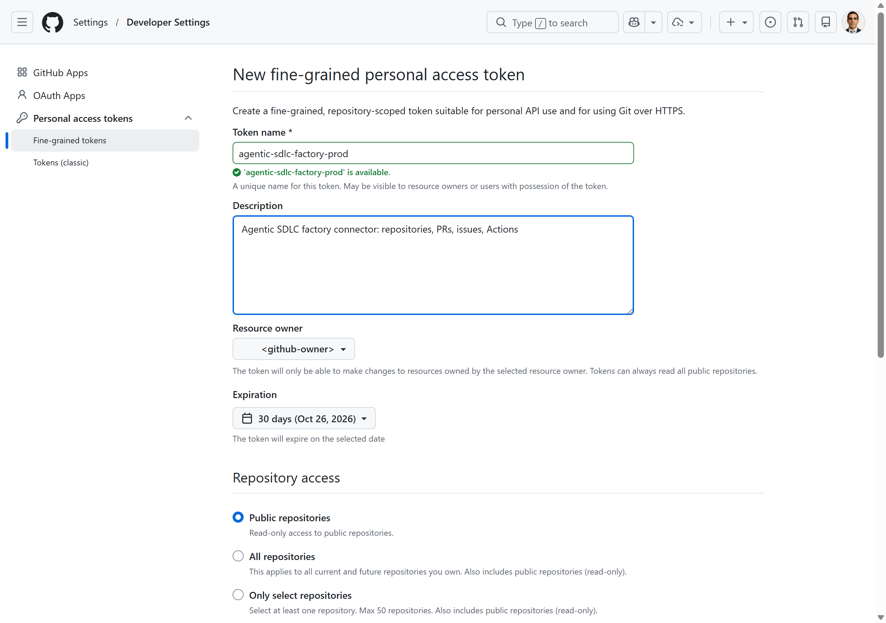
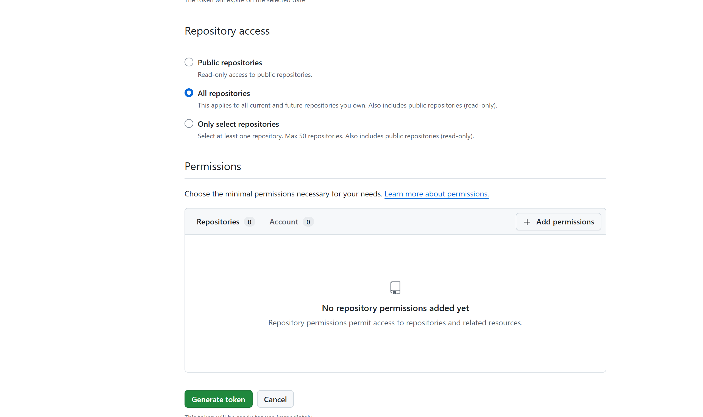
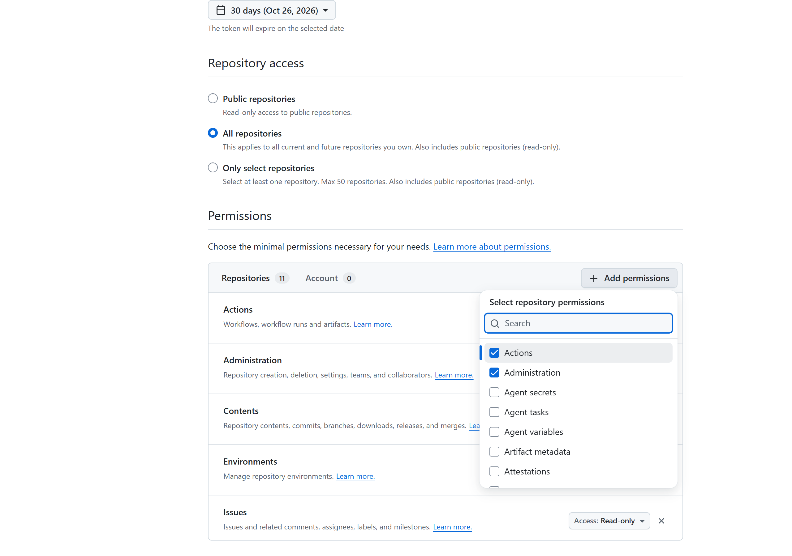
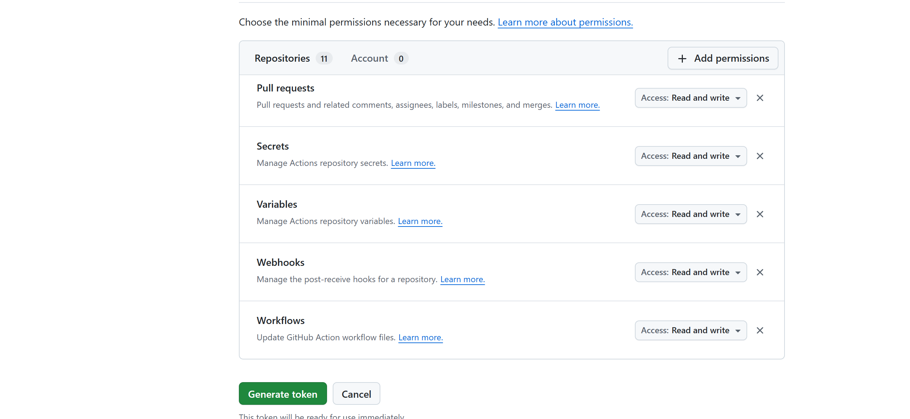
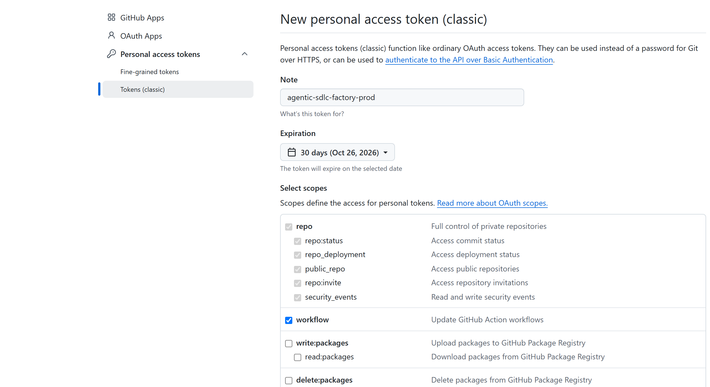
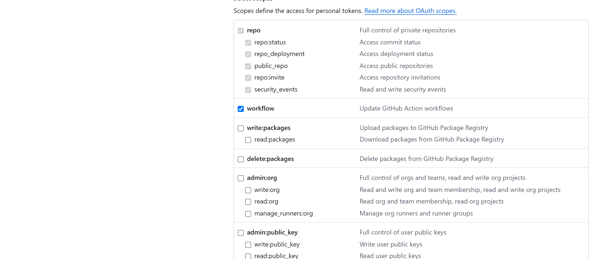

# GitHub Connector Setup

The GitHub connector creates and manages the GitHub records the factory owns: one private repository per SDLC project, branches, commits, pull requests, issues, and GitHub Actions workflow runs. It runs as its own micro-service, `<api-app>-github`.

> **Swagger / API docs:** `https://<api-app>-github.azurewebsites.net/docs` (your environment) · [reference environment](https://agentic-sdlc-api-my-github.azurewebsites.net/docs) · [committed OpenAPI contract](openapi/github.openapi.json). The Swagger page is anonymous; every `/api/v1` call and `/health/ready`, `/health/connectivity` need the `X-Connector-Api-Key` header — select **Authorize** in Swagger UI and paste the key (see [Service API Key Handling](README.md#service-api-key-handling)).

## Table of Contents

- [What You Will Configure](#what-you-will-configure)
- [Prerequisites](#prerequisites)
- [Authentication Options (Best Practice)](#authentication-options-best-practice)
- [Step 1. Create the Automation Account](#step-1-create-the-automation-account)
- [Step 2. Create the Token](#step-2-create-the-token)
- [Step 3. Store the Credential](#step-3-store-the-credential)
- [Step 4. Configure Actions, Environments and Callbacks](#step-4-configure-actions-environments-and-callbacks)
- [Step 5. Deploy and Test the GitHub Connector Service](#step-5-deploy-and-test-the-github-connector-service)
- [API Reference (Swagger)](#api-reference-swagger)
- [Troubleshooting](#troubleshooting)
- [Rotation and Offboarding](#rotation-and-offboarding)

## What You Will Configure

| Setting | Where | Value |
| --- | --- | --- |
| `github.org` | [integrations.config.json](https://github.com/csdmichael/Foundry-Agentic-Workflow-SDLC/blob/main/api/src/config/integrations.config.json) | `<github-owner>` (organization or user; `accountType: auto`) |
| `GITHUB_REPO_BASE_URL`, `GITHUB_API_BASE_URL` | Factory API and `<api-app>-github` | `https://github.com/<github-owner>`, `https://api.github.com` |
| `GITHUB_PAT` | Secret setting (Key Vault reference recommended) | Token from Step 2 |
| `GITHUB_LIVE` | App setting | `1` |
| `GITHUB_WEBHOOK_SECRET`, `SDLC_API_PUBLIC_URL` | Factory API | Random secret; `https://<api-app>.azurewebsites.net` |
| `GITHUB_OIDC_CLIENT_ID`, `GITHUB_OIDC_TENANT_ID` | Factory API | Generated-app release identity ([ARM guide](azure-resource-manager.md#github-actions-release-identity)) |

## Prerequisites

| Requirement | Verify |
| --- | --- |
| GitHub organization `https://github.com/<github-owner>` (Team/Enterprise recommended for private repos, rulesets and environments) | Organization settings open for an owner. |
| Organization owner to create the automation account membership and approve tokens | Can open **Settings → Personal access tokens**. |
| Connector web apps created ([overview](README.md#step-1-create-the-connector-web-apps)) | `https://<api-app>-github.azurewebsites.net/health` returns `ok`. |

## Authentication Options (Best Practice)

GitHub recommends **GitHub Apps** for organization automation and **fine-grained personal access tokens** over classic tokens, because classic tokens can reach every repository the user can access ([GitHub token guidance](https://docs.github.com/en/authentication/keeping-your-account-and-data-secure/managing-your-personal-access-tokens)).

| Option | Status in this release | Recommendation |
| --- | --- | --- |
| **Fine-grained PAT** of a dedicated machine account, resource owner = `<github-owner>`, **All repositories** (the factory creates new ones) | Supported for repository, contents, PR, issue, Actions and secrets routes; validate dynamic repository creation in your org first | **Preferred PAT type** |
| Classic PAT with `repo`, `workflow` (+ `delete_repo` for governed cleanup) | Supported — the reference environment uses it | Allowed with short expiry, SSO authorization and owner approval; **not recommended long term** |
| GitHub App (installation tokens) | Not supported by this client version (no installation-token refresh) | Recommended target architecture |
| Copilot cloud agent (optional) | Requires **user-to-server** credentials, not App installation tokens | Separate entitlement; GitHub-hosted inference is the documented APIM exception |

## Step 1. Create the Automation Account

1. Create a dedicated GitHub account, for example `<github-owner>-sdlc-bot`, with a team-owned mailbox and 2FA.
2. Invite it to the organization with a role that can **create private repositories** (member with repository creation allowed, or a custom role).
3. If the organization uses SAML SSO, the account must be SSO-linked.

**Verify step 1**: as the bot, `https://github.com/organizations/<github-owner>/repositories/new` shows the organization as an owner option.

## Step 2. Create the Token

### Fine-grained token (preferred)

Open `https://github.com/settings/personal-access-tokens/new` as the bot:

| Field | Value |
| --- | --- |
| Token name | `agentic-sdlc-factory-<environment>` |
| Resource owner | `<github-owner>` |
| Expiration | Shortest practical (for example 90 days) |
| Repository access | **All repositories** |
| Repository permissions | **Administration: Read and write**, **Contents: Read and write**, **Pull requests: Read and write**, **Issues: Read and write**, **Actions: Read and write**, **Workflows: Read and write**, **Secrets: Read and write**, **Variables: Read and write**, **Environments: Read and write**, **Webhooks: Read and write**, Metadata: Read (automatic) |

1. Enter the name, description, resource owner and expiration.

   
   *`https://github.com/settings/personal-access-tokens/new`*

2. **Repository access → All repositories** (the factory creates a new repository for every SDLC project).

   

3. **Permissions → Repositories → Add permissions** and tick Actions, Administration, Contents, Environments, Issues, Pull requests, Secrets, Variables, Webhooks and Workflows (Metadata is added automatically).

   

4. Change every added permission from **Read-only** to **Read and write** (Metadata stays Read-only). Compare with the screenshot: 10 permissions *Read and write* + Metadata *Read-only*.

   

5. Select **Generate token** and copy it once. The organization may require an owner to approve it under **Organization settings → Personal access tokens → Pending requests**.

### Classic token (reference environment)

Open `https://github.com/settings/tokens/new` (**Settings → Developer settings → Personal access tokens → Tokens (classic) → Generate new token (classic)**):

| Field | Value |
| --- | --- |
| Note | `agentic-sdlc-factory-<environment>` |
| Expiration | Shortest practical |
| Scopes | `repo` (all sub-scopes), `workflow`, and `delete_repo` only if governed cleanup is enabled |


*`https://github.com/settings/tokens/new` — note and shortest practical expiration.*


*Tick `repo` (all sub-scopes are selected automatically) and `workflow`.*


*Tick `delete_repo` only if governed cleanup of disposable repositories is enabled.*

Select **Generate token**, copy it once, then **Configure SSO → Authorize** for `<github-owner>` if SSO is enforced.

**Verify step 2**

```powershell
$token = Read-Host -AsSecureString 'GitHub token'
$plain = [System.Net.NetworkCredential]::new('', $token).Password
$r = Invoke-WebRequest 'https://api.github.com/user' -Headers @{ Authorization = "Bearer $plain"; 'X-GitHub-Api-Version' = '2022-11-28' }
($r.Content | ConvertFrom-Json).login
$r.Headers['X-OAuth-Scopes']   # classic tokens: repo, workflow[, delete_repo]
Remove-Variable plain, token
```

## Step 3. Store the Credential

```powershell
$Target = @{ ResourceGroup = '<factory-resource-group>'; ApiAppName = '<api-app>' }
./scripts/set-connector-secrets.ps1 @Target -GitHubPat -Gui
az webapp config appsettings set -g <factory-resource-group> -n <api-app> --settings GITHUB_LIVE=1 `
    GITHUB_REPO_BASE_URL=https://github.com/<github-owner> GITHUB_API_BASE_URL=https://api.github.com --output none
./scripts/connector-services/New-ConnectorServiceApps.ps1 -ResourceGroup <factory-resource-group> -ApiAppName <api-app> -Services github -CopyConnectorSettings
```

`GITHUB_WEBHOOK_SECRET` is intentionally **not** copied to the connector service; only the factory API validates webhooks.

## Step 4. Configure Actions, Environments and Callbacks

| Item | Setup | Verify |
| --- | --- | --- |
| Actions policy | **Organization settings → Actions → General**: allow the actions used by generated workflows | A generated repository's workflow starts. |
| `production` environment + Azure OIDC | Created per generated repository by the factory; trust configured per [ARM guide](azure-resource-manager.md#github-actions-release-identity) | Release job logs in to Azure without a secret. |
| Webhook callbacks | Set `SDLC_API_PUBLIC_URL=https://<api-app>.azurewebsites.net` and a random `GITHUB_WEBHOOK_SECRET` (Key Vault) on the factory API; callback `/api/webhooks/github` | GitHub → repository → Webhooks → Recent deliveries show `200`. |

## Step 5. Deploy and Test the GitHub Connector Service

Deploy with **GitHub > Actions > Deploy connector service - GitHub**, then:

```powershell
./scripts/connector-services/test-github-connector.ps1 -ResourceGroup <factory-resource-group> -ApiAppName <api-app>
./scripts/connector-services/test-github-connector.ps1 -ResourceGroup <factory-resource-group> -ApiAppName <api-app> -Create -Cleanup
```

Expected (reference environment):

```text
[PASS] 5. Connectivity (live read)    254 ms {"login":"<bot>","accountType":"User","owner":"<github-owner>"}
[PASS] 6a. List repositories          60 visible
[PASS] 6b. Create private repository  https://github.com/<github-owner>/agentic-sdlc-verify-<timestamp> created=True
[PASS] 6c. Create branch              HTTP 201
[PASS] 6d. Commit file                commit 6107ead...
[PASS] 6e. Open pull request          https://github.com/<github-owner>/agentic-sdlc-verify-<timestamp>/pull/1
[PASS] 6f. Delete disposable repository deleted=True
```

Without `delete_repo` / Administration write, omit `-Cleanup` and delete the repository manually.

## API Reference (Swagger)

| Item | Location |
| --- | --- |
| Swagger UI (your environment) | `https://<api-app>-github.azurewebsites.net/docs` |
| ReDoc (your environment) | `https://<api-app>-github.azurewebsites.net/redoc` |
| OpenAPI JSON (your environment) | `https://<api-app>-github.azurewebsites.net/openapi.json` |
| Swagger UI (reference environment) | [https://agentic-sdlc-api-my-github.azurewebsites.net/docs](https://agentic-sdlc-api-my-github.azurewebsites.net/docs) |
| OpenAPI JSON (reference environment) | [https://agentic-sdlc-api-my-github.azurewebsites.net/openapi.json](https://agentic-sdlc-api-my-github.azurewebsites.net/openapi.json) |
| Committed contract | [openapi/github.openapi.json](openapi/github.openapi.json) ([interactive viewer](https://petstore.swagger.io/?url=https://raw.githubusercontent.com/csdmichael/Foundry-Agentic-Workflow-SDLC-Docs/main/docs/setup/connectors/openapi/github.openapi.json)) |

| Method | Path | Purpose |
| --- | --- | --- |
| GET | `/health`, `/health/ready`, `/health/connectivity` | Probes |
| GET/POST | `/api/v1/repos`, `/api/v1/repos/{repo}` | List, get, create repositories |
| DELETE | `/api/v1/repos/{repo}?confirm={repo}` | Delete a disposable repository |
| GET/POST | `/api/v1/repos/{repo}/branches` | Branches |
| GET/PUT | `/api/v1/repos/{repo}/contents` | Read / commit a file |
| GET/POST | `/api/v1/repos/{repo}/pulls` | Pull requests (the service never merges) |
| POST | `/api/v1/repos/{repo}/issues` | Issues |
| GET/POST | `/api/v1/repos/{repo}/workflows[/{workflow}/dispatches]` | Actions workflows |

## Troubleshooting

| Symptom | Cause | Fix |
| --- | --- | --- |
| Connectivity 502 `(401) Bad credentials` | Expired/revoked token | Recreate (Step 2). |
| 6b 403 `Resource not accessible by personal access token` | Fine-grained token lacks Administration write or org blocks bot repo creation | Add the permission; allow repository creation for the bot. |
| 403 `SAML enforcement` | Token not SSO-authorized | **Configure SSO → Authorize**. |
| 6f 403 | Missing `delete_repo` | Add scope or skip `-Cleanup`. |

## Rotation and Offboarding

Generate a new token, store it (Step 3), restart both web apps, run Step 5, then revoke the old token at `https://github.com/settings/tokens` (or `/settings/personal-access-tokens`). To offboard, revoke tokens and remove the bot from the organization.
