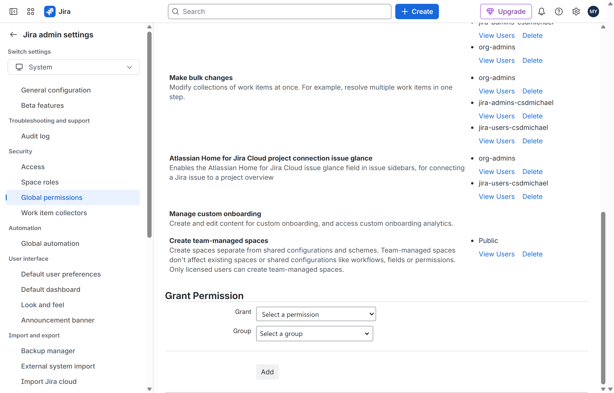
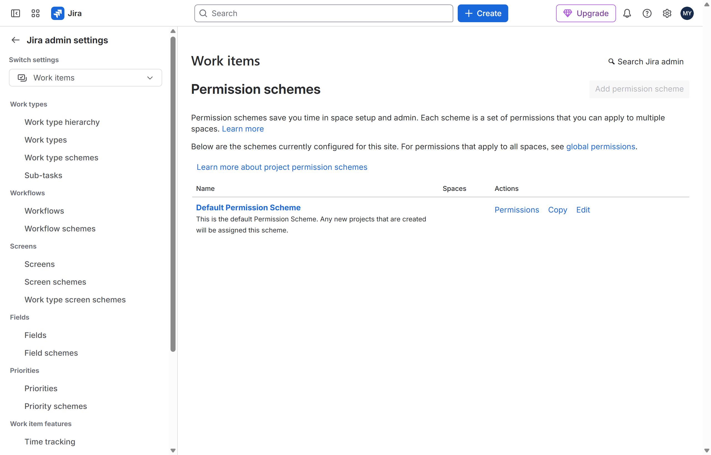
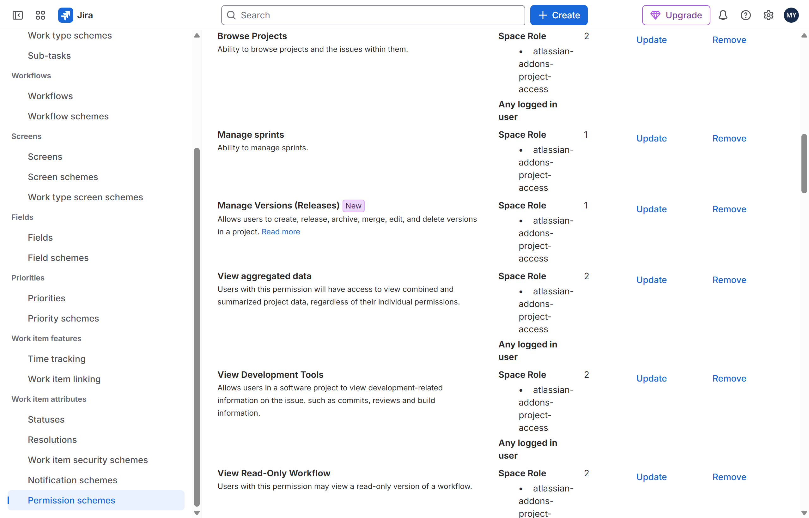
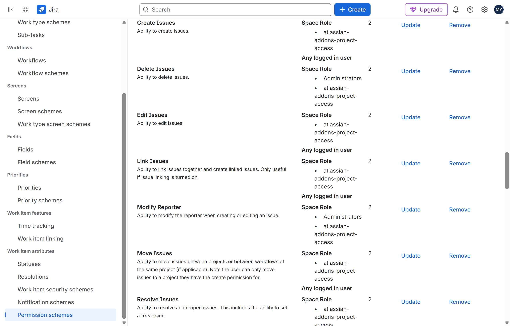
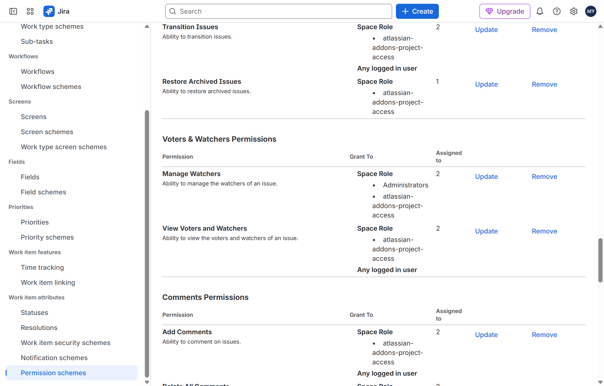
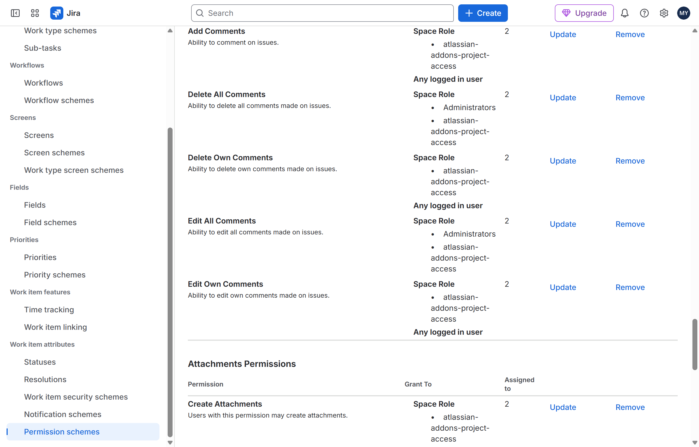
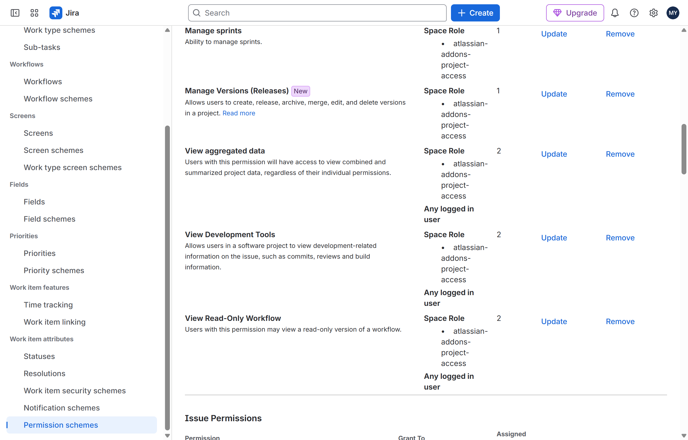
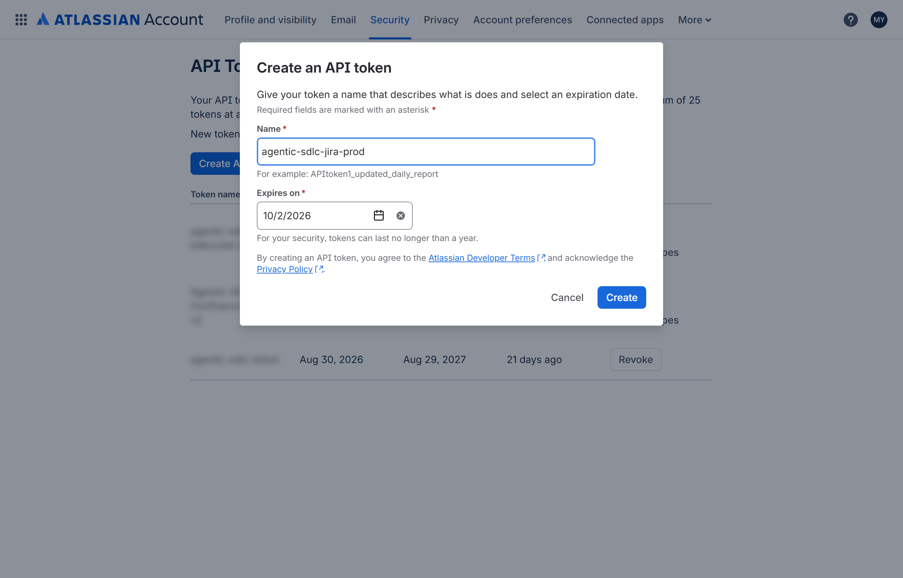

# Jira Cloud Connector Setup

The Jira connector creates and maintains the Jira records the factory owns for every SDLC project: the Jira project, the Epic → Story → Task backlog, sprints, and test plans and test cases (represented as Jira issues). It runs as its own micro-service, `<api-app>-jira`.

> **Swagger / API docs:** `https://<api-app>-jira.azurewebsites.net/docs` (your environment) · [reference environment](https://agentic-sdlc-api-my-jira.azurewebsites.net/docs) · [committed OpenAPI contract](openapi/jira.openapi.json). The Swagger page is anonymous; every `/api/v1` call and `/health/ready`, `/health/connectivity` need the `X-Connector-Api-Key` header — select **Authorize** in Swagger UI and paste the key (see [Service API Key Handling](README.md#service-api-key-handling)).

## Table of Contents

- [What You Will Configure](#what-you-will-configure)
- [Prerequisites](#prerequisites)
- [Authentication Options](#authentication-options)
- [Step 1. Create the Dedicated Automation Account](#step-1-create-the-dedicated-automation-account)
- [Step 2. Grant Jira Permissions](#step-2-grant-jira-permissions)
- [Step 3. Create the API Token](#step-3-create-the-api-token)
- [Step 4. Store the Credential](#step-4-store-the-credential)
- [Step 5. Deploy and Test the Jira Connector Service](#step-5-deploy-and-test-the-jira-connector-service)
- [API Reference (Swagger)](#api-reference-swagger)
- [Troubleshooting](#troubleshooting)
- [Rotation and Offboarding](#rotation-and-offboarding)

## What You Will Configure

| Setting | Where | Value |
| --- | --- | --- |
| `JIRA_BASE_URL` | Factory API and `<api-app>-jira` | `https://<atlassian-site>.atlassian.net/jira` |
| `JIRA_PROJECTS_URL` | Factory API and `<api-app>-jira` | `https://<atlassian-site>.atlassian.net/jira/software/projects` |
| `JIRA_EMAIL` | Secret setting | `<automation-email>` |
| `JIRA_API_TOKEN` | Secret setting (Key Vault reference recommended) | API token from Step 3 |
| `JIRA_LIVE` | App setting | `1` |

## Prerequisites

| Requirement | Verify |
| --- | --- |
| Jira Cloud site `https://<atlassian-site>.atlassian.net` with Jira Software | Open the URL; the Jira home page loads. |
| An Atlassian **organization admin** (to create the account and grant product access) and a **Jira admin** (to grant permissions) | Both can open `https://admin.atlassian.com`. |
| A mailbox for `<automation-email>` that a named team owns | The mailbox receives the Atlassian verification email. |
| Factory API deployed; connector web apps created ([connector overview](README.md#step-1-create-the-connector-web-apps)) | `https://<api-app>-jira.azurewebsites.net/health` returns `ok`. |

## Authentication Options

| Option | Status in this release | When to use |
| --- | --- | --- |
| **Unscoped API token + Basic auth** of a dedicated licensed automation account | **Supported (required today).** The client calls `https://<atlassian-site>.atlassian.net/rest/api/3/...`. | Default. Short expiry, dedicated account, Key Vault storage, owner assigned for rotation. |
| Scoped API token (`api.atlassian.com/ex/jira/<cloud-id>` gateway) | Not supported by this client version. | Plan for it if your Atlassian organization mandates scoped tokens; the Confluence connector already uses this gateway pattern. |
| Atlassian service account (scoped credential) or OAuth 2.0 (3LO) app | Not supported by this client version. | Preferred long-term by Atlassian for organization-owned automation; requires a connector update. |

> API tokens are long-lived bearer credentials equivalent to the account password for the REST API. Atlassian recommends the shortest practical expiry and scoped tokens where supported. Do not use a personal employee account.

## Step 1. Create the Dedicated Automation Account

1. In **Atlassian Administration** open `https://admin.atlassian.com/o/<org-id>/users` → **Invite users**.
2. Email: `<automation-email>`; product access: **Jira** (User). Do not grant Jira admin unless you enable automatic project creation (Step 2c).
3. Accept the invitation from the mailbox and set a strong password with MFA according to your policy.

**Verify step 1**: sign in as `<automation-email>` at `https://<atlassian-site>.atlassian.net/jira` and confirm Jira opens.

## Step 2. Grant Jira Permissions

### 2a. Global permissions (only when the factory creates projects)

The factory creates one Jira project per SDLC project. Creating and deleting projects needs the **Administer Jira** global permission. If your governance forbids this, pre-create projects and set `provisionOnProjectCreate.jira` to `false`.

URL: `https://<atlassian-site>.atlassian.net/secure/admin/GlobalPermissions!default.jspa`


*`https://<atlassian-site>.atlassian.net/secure/admin/GlobalPermissions!default.jspa` — add the automation account's group to **Administer Jira** only if the factory provisions projects.*

### 2b. Project permissions

Open the permission scheme used by factory projects (normally **Default Permission Scheme**):

URL: `https://<atlassian-site>.atlassian.net/secure/admin/ViewPermissionSchemes.jspa` → **Permissions** on the scheme (opens `https://<atlassian-site>.atlassian.net/jira/settings/issues/permission-schemes/<scheme-id>`).


*`https://<atlassian-site>.atlassian.net/secure/admin/ViewPermissionSchemes.jspa`*

Grant the automation account (directly, through a group, or through a project role it holds) each permission below:

| Permission | Why the factory needs it | Screenshot |
| --- | --- | --- |
| Browse Projects | Read projects, issue types, created issues |  |
| Create Issues, Edit Issues, Link Issues | Create the backlog and link hierarchy/test cases |  |
| Transition Issues | Move work items through the workflow as agents complete tasks |  |
| Add Comments | Record agent progress and evidence on issues |  |
| Manage Sprints | Create sprints on Scrum boards |  |

**Verify step 2**: as the automation account, open any factory project and create then delete a test issue manually; or run the Step 5 write test.

## Step 3. Create the API Token

1. Sign in **as `<automation-email>`** and open `https://id.atlassian.com/manage-profile/security/api-tokens`.

   
   *`https://id.atlassian.com/manage-profile/security/api-tokens` (existing token names are blurred).*

2. Select **Create API token** (the button *without* scopes). Atlassian may ask for an emailed verification code first.
3. **Name**: `agentic-sdlc-jira-<environment>`; **Expires on**: the shortest period your rotation process supports (maximum 365 days). Select **Create**.

   
   *`https://id.atlassian.com/manage-profile/security/api-tokens` → **Create API token**.*

4. Select **Copy** and paste the token directly into the masked prompt of Step 4. The token is shown only once. Record the **expiry date and owner** (not the token) in the handover checklist.

**Verify step 3** (from a workstation, without saving the token in history):

```powershell
$email = '<automation-email>'
$token = Read-Host -AsSecureString 'Jira API token'
$pair = "${email}:$([System.Net.NetworkCredential]::new('', $token).Password)"
$basic = [Convert]::ToBase64String([Text.Encoding]::UTF8.GetBytes($pair))
Invoke-RestMethod "https://<atlassian-site>.atlassian.net/rest/api/3/myself" -Headers @{ Authorization = "Basic $basic" } |
    Select-Object displayName, accountType, active
Remove-Variable pair, basic, token
```

Expected: the automation account's display name, `accountType = atlassian`, `active = True`.

## Step 4. Store the Credential

Set the credential on the factory API with the masked prompt, then copy it to the Jira connector service:

```powershell
$Target = @{ ResourceGroup = '<factory-resource-group>'; ApiAppName = '<api-app>' }
./scripts/set-connector-secrets.ps1 @Target -Jira -Gui
az webapp config appsettings set -g <factory-resource-group> -n <api-app> --settings `
    JIRA_BASE_URL=https://<atlassian-site>.atlassian.net/jira `
    JIRA_PROJECTS_URL=https://<atlassian-site>.atlassian.net/jira/software/projects JIRA_LIVE=1 --output none
./scripts/connector-services/New-ConnectorServiceApps.ps1 -ResourceGroup <factory-resource-group> -ApiAppName <api-app> -Services jira -CopyConnectorSettings
```

Production: store `JIRA_API_TOKEN` in Key Vault and set the app setting to `@Microsoft.KeyVault(SecretUri=https://<vault>.vault.azure.net/secrets/jira-api-token/)` on both web apps.

**Verify step 4**

```powershell
az webapp config appsettings list -g <factory-resource-group> -n <api-app>-jira `
    --query "[?starts_with(name,'JIRA_')].name" -o tsv
```

Expected: `JIRA_API_TOKEN`, `JIRA_EMAIL`, `JIRA_LIVE` (and base URLs if set). Values are not displayed.

## Step 5. Deploy and Test the Jira Connector Service

Deploy with **GitHub > Actions > Deploy connector service - Jira**, or:

```powershell
./scripts/connector-services/Deploy-ConnectorServices.ps1 -ResourceGroup <factory-resource-group> -ApiAppName <api-app> -Services jira
```

Run the read-only test, then the write test with cleanup:

```powershell
./scripts/connector-services/test-jira-connector.ps1 -ResourceGroup <factory-resource-group> -ApiAppName <api-app>
./scripts/connector-services/test-jira-connector.ps1 -ResourceGroup <factory-resource-group> -ApiAppName <api-app> -Create -Cleanup
```

Expected output (reference environment):

```text
[PASS] 1. Liveness /health            status=ok mode=live version=1.0.0
[PASS] 2. Swagger /docs + OpenAPI     HTTP 200/200; 7 operation paths
[PASS] 3. API key enforced            HTTP 401 without X-Connector-Api-Key
[PASS] 4. Readiness /health/ready     HTTP 200 status=ready
         ok       JIRA_BASE_URL                            configured
         ok       JIRA_EMAIL                               configured
         ok       JIRA_API_TOKEN                           configured
[PASS] 5. Connectivity (live read)    884 ms {"displayName":"<automation account>", ...}
[PASS] 6a. Create Jira project        V09260446 created=True
[PASS] 6b. Create backlog hierarchy   V09260446-1, V09260446-2, V09260446-3
[PASS] 6c. Create test case           V09260446-4 (Task)
[PASS] 6d. Delete disposable project  deleted=True
All connector checks passed.
```

Finally, confirm the factory API sees Jira as connected: sign in to the factory, open **Global Settings > Systems of Record**, or call `GET https://<api-app>.azurewebsites.net/api/integrations/status` with an `integrations.read` user; the `jira` entry must show `"connected": true`.

## API Reference (Swagger)

| Item | Location |
| --- | --- |
| Swagger UI (your environment) | `https://<api-app>-jira.azurewebsites.net/docs` |
| ReDoc (your environment) | `https://<api-app>-jira.azurewebsites.net/redoc` |
| OpenAPI JSON (your environment) | `https://<api-app>-jira.azurewebsites.net/openapi.json` |
| Swagger UI (reference environment) | [https://agentic-sdlc-api-my-jira.azurewebsites.net/docs](https://agentic-sdlc-api-my-jira.azurewebsites.net/docs) |
| OpenAPI JSON (reference environment) | [https://agentic-sdlc-api-my-jira.azurewebsites.net/openapi.json](https://agentic-sdlc-api-my-jira.azurewebsites.net/openapi.json) |
| Committed contract | [openapi/jira.openapi.json](openapi/jira.openapi.json) ([interactive viewer](https://petstore.swagger.io/?url=https://raw.githubusercontent.com/csdmichael/Foundry-Agentic-Workflow-SDLC-Docs/main/docs/setup/connectors/openapi/jira.openapi.json)) |

| Method | Path | Purpose |
| --- | --- | --- |
| GET | `/health`, `/health/ready`, `/health/connectivity` | Liveness, readiness, live identity probe |
| GET | `/api/v1/projects/{key}` | Get a project |
| GET | `/api/v1/projects/{key}/issue-types` | Issue types available in the project |
| POST | `/api/v1/projects` | Create or reuse a project (`name`, `key`, `templateId`) |
| DELETE | `/api/v1/projects/{key}?confirm={key}` | Delete a disposable project |
| POST | `/api/v1/projects/{key}/backlog` | Create an Epic → Story → Task hierarchy (`items[].parentIndex`) |
| POST | `/api/v1/projects/{key}/iterations` | Create a sprint |
| POST | `/api/v1/projects/{key}/test-plans`, `/test-cases` | Create test plan / test case issues |

Example call:

```powershell
$key = az webapp config appsettings list -g <factory-resource-group> -n <api-app>-jira --query "[?name=='CONNECTOR_SERVICE_API_KEY'].value | [0]" -o tsv
Invoke-RestMethod "https://<api-app>-jira.azurewebsites.net/health/connectivity" -Headers @{ 'X-Connector-Api-Key' = $key }
```

## Troubleshooting

| Symptom | Cause | Fix |
| --- | --- | --- |
| Readiness `MISSING JIRA_API_TOKEN` | Setting not copied to `<api-app>-jira` | Re-run Step 4 `New-ConnectorServiceApps.ps1 -Services jira -CopyConnectorSettings`. |
| Connectivity 502 `(401)` | Wrong email/token pair, expired or revoked token | Create a new token (Step 3); the email must match the token owner. |
| Connectivity 502 `(403)` with a scoped token | Scoped tokens need the `api.atlassian.com` gateway | Use an unscoped token (Step 3) with this release. |
| 6a fails `(403)` | Account lacks **Administer Jira** | Grant Step 2a, or disable automatic project provisioning. |
| 6b fails `issuetype` errors | Project template lacks Epic/Story | Use the `scrum` template or check `GET /api/v1/projects/{key}/issue-types`. |

## Rotation and Offboarding

1. Create a new token (Step 3), set it with Step 4, restart `<api-app>` and `<api-app>-jira`, run Step 5.
2. Revoke the old token at `https://id.atlassian.com/manage-profile/security/api-tokens` → **Revoke**.
3. To offboard, revoke all tokens for the account and remove its Jira product access in Atlassian Administration.
