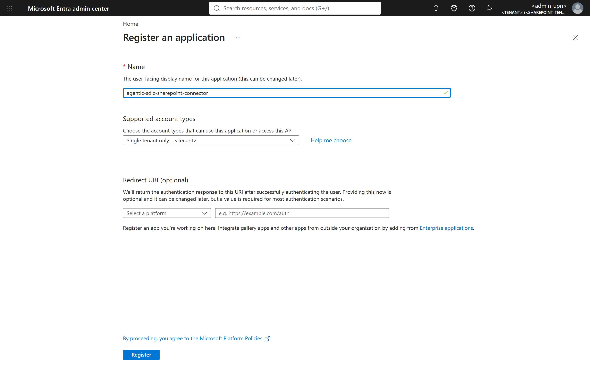
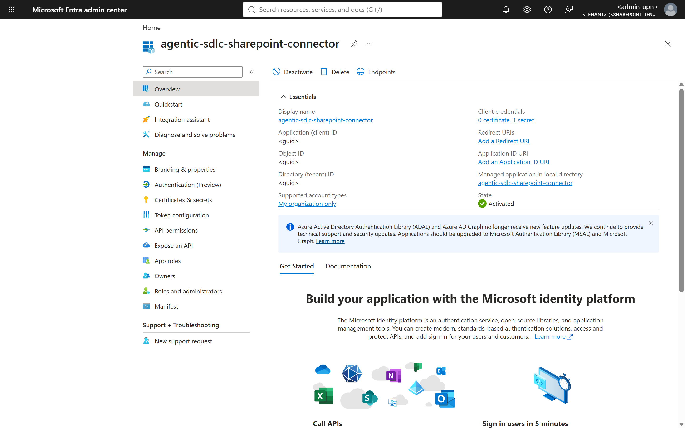
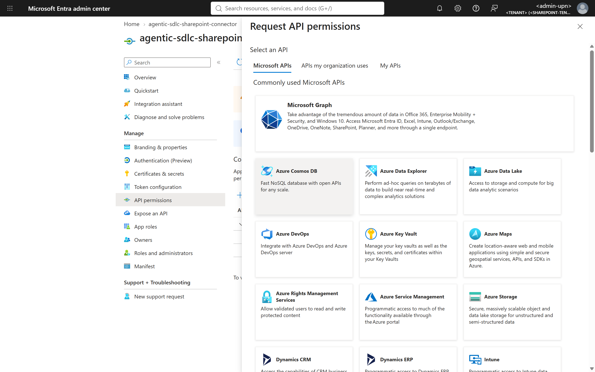
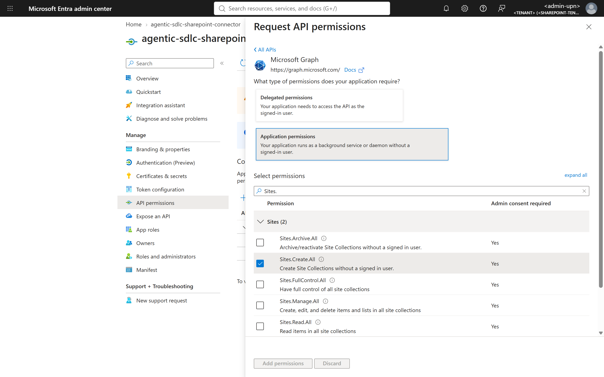
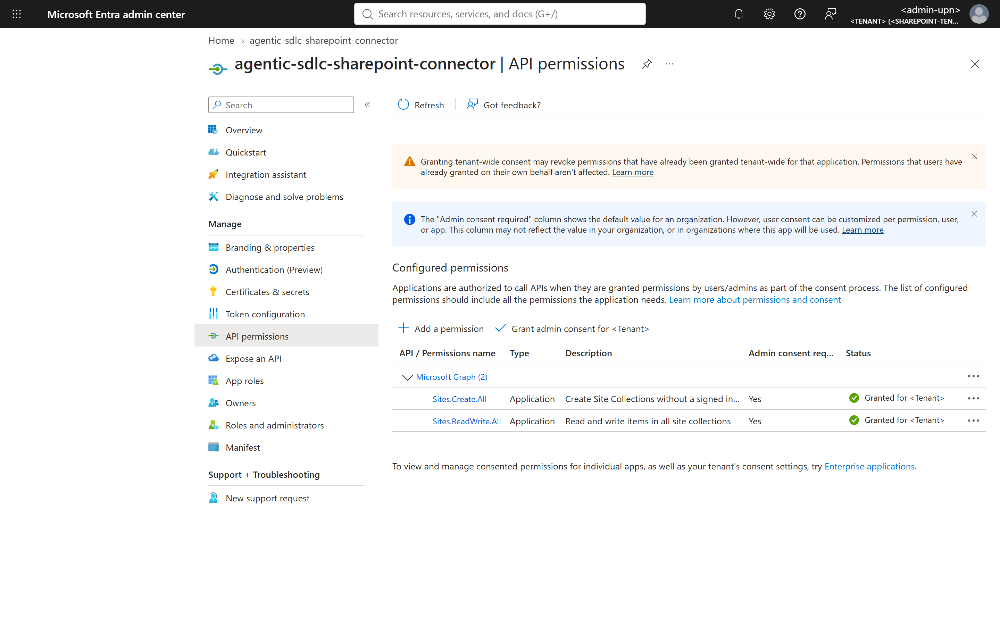
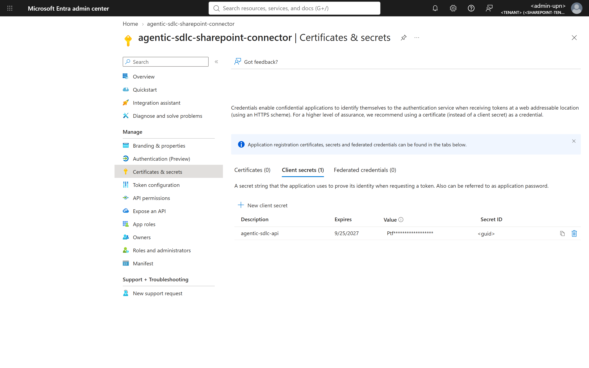
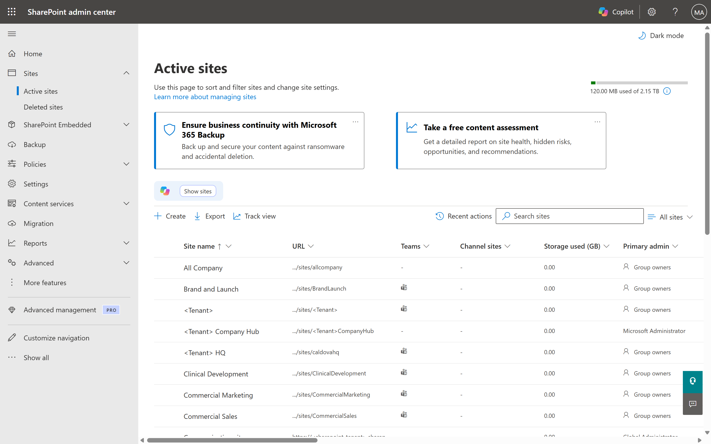
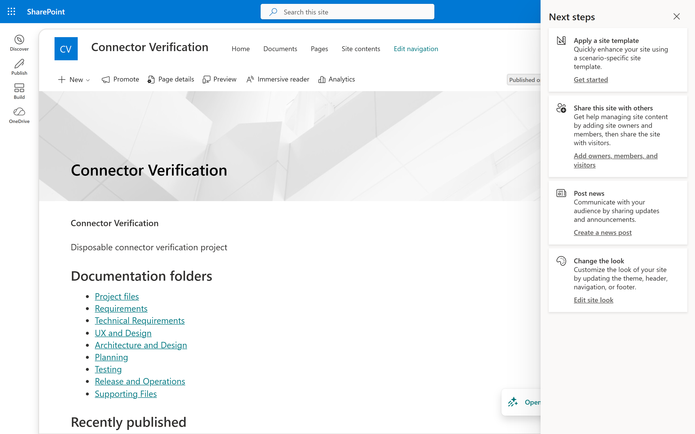
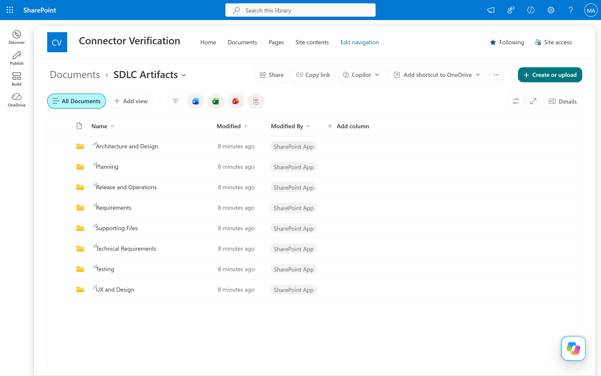

# SharePoint Online Connector Setup

The SharePoint connector stores each SDLC project's documentation in SharePoint Online through Microsoft Graph. In the recommended **`perProjectSite`** mode the factory creates a **dedicated SharePoint communication site for every SDLC project** (`https://<sharepoint-tenant>.sharepoint.com/sites/sdlc-<project-name>-<id>`), then creates an *SDLC Artifacts* folder with one sub-folder per category, a published overview page, and uploads approved documents. In `sharedSite` mode projects get folders and a page inside one configured site instead. It runs as its own micro-service, `<api-app>-sharepoint`.

## Table of Contents

- [What You Will Configure](#what-you-will-configure)
- [Prerequisites](#prerequisites)
- [Choose the Identity](#choose-the-identity)
- [Step 1. Register the Connector Application](#step-1-register-the-connector-application)
- [Step 2. Grant Microsoft Graph Application Permissions](#step-2-grant-microsoft-graph-application-permissions)
- [Step 3. Create the Credential](#step-3-create-the-credential)
- [Step 4. Configure the Factory](#step-4-configure-the-factory)
- [Step 5. Deploy and Test the SharePoint Connector Service](#step-5-deploy-and-test-the-sharepoint-connector-service)
- [Step 6. Verify in SharePoint](#step-6-verify-in-sharepoint)
- [API Reference (Swagger)](#api-reference-swagger)
- [Troubleshooting](#troubleshooting)
- [Rotation and Offboarding](#rotation-and-offboarding)

## What You Will Configure

| Setting | Where | Value |
| --- | --- | --- |
| `SHAREPOINT_SITE_URL` | Factory API and `<api-app>-sharepoint` | `https://<sharepoint-tenant>.sharepoint.com` (tenant root, `perProjectSite`) or a site URL (`sharedSite`) |
| `sharePoint.siteProvisioning` | [integrations.config.json](https://github.com/csdmichael/Foundry-Agentic-Workflow-SDLC/blob/main/api/src/config/integrations.config.json) | `mode`, `api`, `template`, `sitePathPrefix`, `documentFolder`, `ownerEmail` (see Step 4) |
| `SHAREPOINT_SITE_OWNER_EMAIL` | App setting | UPN of the person/group owner of new project sites |
| `SHAREPOINT_TENANT_ID`, `SHAREPOINT_CLIENT_ID` | App settings | Only for the app-registration identity (Step 1) |
| `SHAREPOINT_CLIENT_CERTIFICATE_PATH` or `SHAREPOINT_CLIENT_SECRET` | Secret | Certificate (recommended) or secret for the app registration |
| `SHAREPOINT_LIVE` | App setting | `1` |

## Prerequisites

| Requirement | Verify |
| --- | --- |
| Microsoft 365 tenant with SharePoint Online (`https://<sharepoint-tenant>.sharepoint.com`) | The tenant root site opens. |
| **Global Administrator** or **Privileged Role Administrator** to grant Graph application consent; **SharePoint Administrator** to review sites | Admins can open `https://entra.microsoft.com` and `https://<sharepoint-tenant>-admin.sharepoint.com`. |
| Security approval for tenant-wide `Sites.ReadWrite.All` (and `Sites.Create.All` for per-project sites) | Approval recorded. |
| Connector web apps created ([overview](README.md#step-1-create-the-connector-web-apps)) | `https://<api-app>-sharepoint.azurewebsites.net/health` returns `ok`. |

## Choose the Identity

| Identity | When | Secrets |
| --- | --- | --- |
| **Managed identity** of `<api-app>` and `<api-app>-sharepoint` | SharePoint is in the **same Entra tenant** as the factory's Azure subscription | None (recommended) |
| **App registration in the SharePoint tenant** (this guide, Steps 1–3) | SharePoint is in **another tenant** than the factory hosting, or policy requires a named app | Certificate (recommended) or client secret |

For the managed-identity path skip Steps 1 and 3: grant the Graph application roles of Step 2 to each web app's managed identity service principal (Graph API `POST /servicePrincipals/{mi-object-id}/appRoleAssignments`, or `New-MgServicePrincipalAppRoleAssignment`), and do not set `SHAREPOINT_TENANT_ID`/`SHAREPOINT_CLIENT_ID`.

## Step 1. Register the Connector Application

In the **SharePoint tenant**, open `https://entra.microsoft.com/#view/Microsoft_AAD_RegisteredApps/CreateApplicationBlade` (**Entra admin center → Identity → Applications → App registrations → New registration**):

| Field | Value |
| --- | --- |
| Name | `agentic-sdlc-sharepoint-connector` |
| Supported account types | **Single tenant only** |
| Redirect URI | Leave empty (daemon app) |


*`https://entra.microsoft.com/#view/Microsoft_AAD_RegisteredApps/CreateApplicationBlade`*

Select **Register**, then copy **Application (client) ID** and **Directory (tenant) ID** from **Overview**.


*`https://entra.microsoft.com/#view/Microsoft_AAD_RegisteredApps/ApplicationMenuBlade/~/Overview/appId/<client-id>` (IDs masked).*

CLI equivalent (run as an admin of the SharePoint tenant):

```powershell
az login --tenant <sharepoint-tenant>.onmicrosoft.com --allow-no-subscriptions
$app = az ad app create --display-name agentic-sdlc-sharepoint-connector --sign-in-audience AzureADMyOrg --query "{appId:appId}" -o json | ConvertFrom-Json
az ad sp create --id $app.appId --output none
$app.appId
```

**Verify step 1**: `az ad sp show --id <client-id> --query displayName -o tsv` returns `agentic-sdlc-sharepoint-connector`.

## Step 2. Grant Microsoft Graph Application Permissions

1. Open **API permissions → Add a permission → Microsoft Graph**.

   
   *`https://entra.microsoft.com/#view/Microsoft_AAD_RegisteredApps/ApplicationMenuBlade/~/CallAnAPI/appId/<client-id>` → **Add a permission**.*

2. Select **Application permissions** (not Delegated), search `Sites.`, and tick:

   | Permission | Needed for |
   | --- | --- |
   | `Sites.ReadWrite.All` | Resolve sites, create folders/pages, upload documents |
   | `Sites.Create.All` | Create a dedicated site per project (`perProjectSite` + `graphBetaSites`) |
   | `Group.ReadWrite.All` *(only if `api: m365Group`)* | Create Microsoft 365 group-connected team sites instead |

   

3. Select **Add permissions**, then **Grant admin consent for &lt;tenant&gt;**. Both rows must show **Granted**.

   

CLI equivalent:

```powershell
$graph = '00000003-0000-0000-c000-000000000000'
az ad app permission add --id <client-id> --api $graph --api-permissions `
    9492366f-7969-46a4-8d15-ed1a20078fff=Role 80819dd8-2b3b-4551-a1ad-2700fc44f533=Role   # Sites.ReadWrite.All, Sites.Create.All
az ad app permission admin-consent --id <client-id>
```

**Verify step 2**

```powershell
$sp = az ad sp show --id <client-id> --query id -o tsv
az rest --method GET --url "https://graph.microsoft.com/v1.0/servicePrincipals/$sp/appRoleAssignments" --query "value[].appRoleId" -o tsv
```

Expected: `9492366f-7969-46a4-8d15-ed1a20078fff` and `80819dd8-2b3b-4551-a1ad-2700fc44f533`.

## Step 3. Create the Credential

**Certificate (recommended)**: create a certificate in Key Vault, import it into the connector web app (**Certificates → Bring your own certificates**), set `WEBSITE_LOAD_CERTIFICATES=<thumbprint>`, upload the public key under **Certificates & secrets → Certificates**, and set `SHAREPOINT_CLIENT_CERTIFICATE_PATH=/var/ssl/private/<thumbprint>.p12`.

**Client secret (allowed with short expiry)**: **Certificates & secrets → Client secrets → New client secret**, description `agentic-sdlc-sharepoint-<environment>`, expiry 6–12 months, **Add**, copy the **Value** once.


*`https://entra.microsoft.com/#view/Microsoft_AAD_RegisteredApps/ApplicationMenuBlade/~/Credentials/appId/<client-id>`*

## Step 4. Configure the Factory

1. Review `sharePoint.siteProvisioning` in the integration configuration:

   ```json
   "siteProvisioning": {
     "mode": "perProjectSite",
     "api": "graphBetaSites",
     "template": "sitepagepublishing",
     "sitePathPrefix": "sdlc",
     "documentFolder": "SDLC Artifacts",
     "locale": "en-US",
     "ownerEmail": "<site-owner-upn>",
     "provisioningTimeoutSeconds": 180,
     "pollIntervalSeconds": 5
   }
   ```

   `graphBetaSites` uses Microsoft Graph `POST /beta/sites` (a **beta** API; validate it against your change policy) and needs `Sites.Create.All`. `m365Group` creates a private Microsoft 365 group whose team site becomes the project site and needs `Group.ReadWrite.All`.

2. Set the app settings on the factory API (values entered through a temporary file so the secret is not in history):

   ```powershell
   $secret = Read-Host -AsSecureString 'SharePoint client secret'
   $file = New-TemporaryFile
   @(
     @{ name = 'SHAREPOINT_SITE_URL'; value = 'https://<sharepoint-tenant>.sharepoint.com' },
     @{ name = 'SHAREPOINT_SITE_OWNER_EMAIL'; value = '<site-owner-upn>' },
     @{ name = 'SHAREPOINT_TENANT_ID'; value = '<sharepoint-tenant-id>' },
     @{ name = 'SHAREPOINT_CLIENT_ID'; value = '<client-id>' },
     @{ name = 'SHAREPOINT_CLIENT_SECRET'; value = [System.Net.NetworkCredential]::new('', $secret).Password },
     @{ name = 'SHAREPOINT_LIVE'; value = '1' }
   ) | ConvertTo-Json | Set-Content $file
   az webapp config appsettings set -g <factory-resource-group> -n <api-app> --settings "@$file" --output none
   Remove-Item $file; Remove-Variable secret
   ./scripts/connector-services/New-ConnectorServiceApps.ps1 -ResourceGroup <factory-resource-group> -ApiAppName <api-app> -Services sharepoint -CopyConnectorSettings
   ```

3. In the factory UI choose **SharePoint** as the Documentation system of record (Global Settings or project intake).

## Step 5. Deploy and Test the SharePoint Connector Service

Deploy with **GitHub > Actions > Deploy connector service - SharePoint**, then:

```powershell
./scripts/connector-services/test-sharepoint-connector.ps1 -ResourceGroup <factory-resource-group> -ApiAppName <api-app>
./scripts/connector-services/test-sharepoint-connector.ps1 -ResourceGroup <factory-resource-group> -ApiAppName <api-app> -Create
```

Expected (reference environment):

```text
[PASS] 4. Readiness /health/ready     HTTP 200 status=ready
         ok       SHAREPOINT_SITE_URL                      configured
         ok       sharePoint.siteProvisioning.mode         perProjectSite
         ok       authentication                           app-registration-secret
         ok       SHAREPOINT_TENANT_ID                     configured
         ok       SHAREPOINT_CLIENT_ID                     configured
         ok       sharePoint.siteProvisioning.api          graphBetaSites
         ok       SHAREPOINT_SITE_OWNER_EMAIL              configured
[PASS] 5. Connectivity (live read)    ... {"siteUrl":"https://<sharepoint-tenant>.sharepoint.com","driveName":"Documents", ...}
[PASS] 6a. Project site + folders     site=https://<sharepoint-tenant>.sharepoint.com/sites/sdlc-connector-verification-verify-2 siteCreated=True folders=8
[PASS] 6b. Upload document            https://<sharepoint-tenant>.sharepoint.com/sites/sdlc-connector-verification-verify-2/Shared%20Documents/SDLC%20Artifacts/Supporting%20Files/connector-verification.md
```

Site creation takes 20–60 seconds. The disposable site is retained for review; delete it in the SharePoint admin center (**Active sites → select → Delete**).

## Step 6. Verify in SharePoint

| Check | URL | Expected |
| --- | --- | --- |
| New site listed | `https://<sharepoint-tenant>-admin.sharepoint.com/_layouts/15/online/AdminHome.aspx#/siteManagement/view/ALL%20SITES` | `sdlc-<project>-<id>`, Communication site, *Created from: API* |
| Overview page | `https://<sharepoint-tenant>.sharepoint.com/sites/sdlc-<project>-<id>/SitePages/agentic-sdlc-<project>-<id>.aspx` | Project description and links to eight category folders |
| Folders | `https://<sharepoint-tenant>.sharepoint.com/sites/sdlc-<project>-<id>/Shared%20Documents/SDLC%20Artifacts` | Requirements, Technical Requirements, UX and Design, Architecture and Design, Planning, Testing, Release and Operations, Supporting Files |


*`https://<sharepoint-tenant>-admin.sharepoint.com/_layouts/15/online/AdminHome.aspx#/siteManagement/view/ALL%20SITES`*


*`https://<sharepoint-tenant>.sharepoint.com/sites/sdlc-connector-verification-verify-2/SitePages/agentic-sdlc-connector-verification-verify-2.aspx`*


*`https://<sharepoint-tenant>.sharepoint.com/sites/<project-site>/Shared%20Documents/SDLC%20Artifacts`*

## API Reference (Swagger)

| Item | Location |
| --- | --- |
| Live Swagger UI | `https://<api-app>-sharepoint.azurewebsites.net/docs` |
| Committed contract | [openapi/sharepoint.openapi.json](openapi/sharepoint.openapi.json) ([interactive viewer](https://petstore.swagger.io/?url=https://raw.githubusercontent.com/csdmichael/Foundry-Agentic-Workflow-SDLC-Docs/main/docs/setup/connectors/openapi/sharepoint.openapi.json)) |

| Method | Path | Purpose |
| --- | --- | --- |
| GET | `/health`, `/health/ready`, `/health/connectivity` | Probes |
| GET | `/api/v1/sites/resolve?url=` | Resolve a site and its document library |
| POST | `/api/v1/projects/site` | Create or reuse the dedicated project site (201 created / 200 existing) |
| POST | `/api/v1/projects/structure` | Ensure site (per-project mode), folders and overview page |
| POST | `/api/v1/projects/documents` | Upload a document to a category |
| DELETE | `/api/v1/projects/resources?siteId=&driveId=&pageId=&folderId=&groupId=&confirm=DELETE` | Delete workflow-created resources |

## Troubleshooting

| Symptom | Cause | Fix |
| --- | --- | --- |
| Connectivity 503 `could not obtain a Microsoft Graph token` | Wrong tenant/client ID or expired secret | Re-check Step 1/3 values. |
| Connectivity 502 `(403) Access denied` | Admin consent missing | Step 2 **Grant admin consent**. |
| 6a 502 `(403)` on `POST /beta/sites` | `Sites.Create.All` missing | Add and consent (Step 2). |
| 6a 504 `site ... not available yet` | Provisioning slower than `provisioningTimeoutSeconds` | Re-run; the operation is idempotent. |
| Managed identity token for the wrong tenant | SharePoint is in another tenant | Use the app-registration identity. |

## Rotation and Offboarding

Add a new secret/certificate, update `SHAREPOINT_CLIENT_SECRET` (or the certificate), restart both web apps, run Step 5, then delete the old credential in **Certificates & secrets**. To offboard, remove the app's admin consent or delete the app registration.
