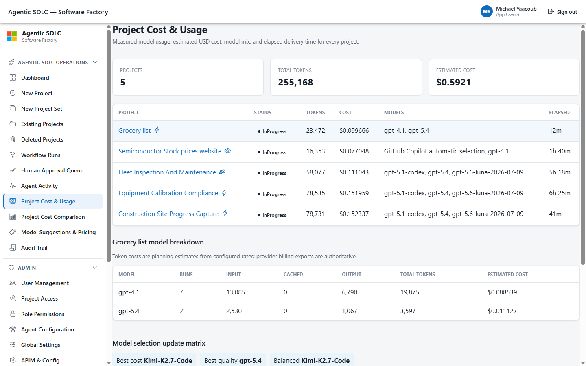
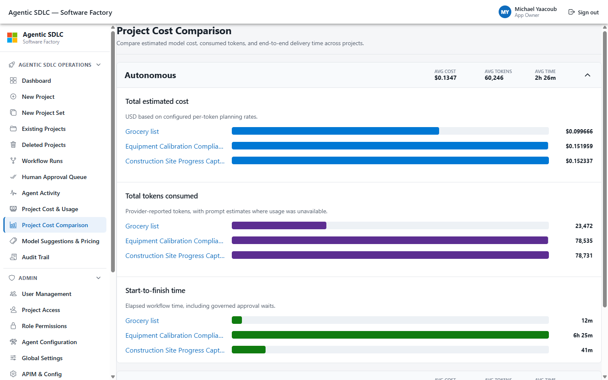
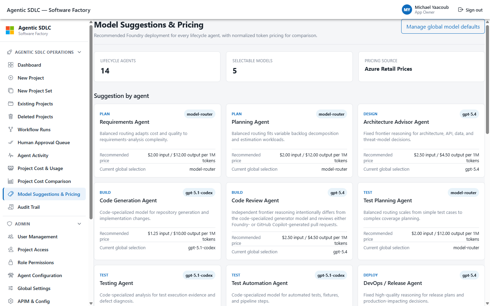
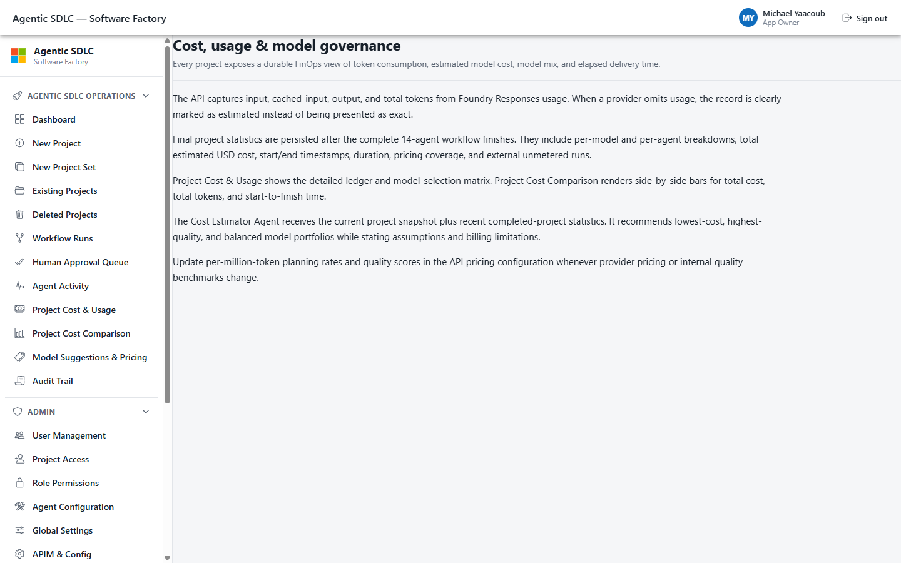

# Agentic SDLC Software Factory - User Guide

Production edition: August 2026

This guide explains every user-facing screen in the Agentic SDLC Software Factory, the end-to-end Microsoft Agent Framework workflow, the three execution policies, both code-generation providers, and the generated assets published to Azure DevOps, GitHub, and Azure App Service.

Production application: [https://agentic-sdlc-ui-my.azurewebsites.net](https://agentic-sdlc-ui-my.azurewebsites.net)

API health: [https://agentic-sdlc-api-my.azurewebsites.net/api/health](https://agentic-sdlc-api-my.azurewebsites.net/api/health)

> Factory screenshots were captured from the deployed production UI at release `3fd8ff2`, backed by API release `29e8d09`. GitHub and published-application images are native browser captures. Azure DevOps and Azure resource images labeled **Live generated evidence** were rendered from live REST responses because unattended browser access stopped at interactive Microsoft sign-in. No synthetic work-item, test, dashboard, wiki, repository, or resource counts are used in those evidence views.

## Guide scope

The guide covers:

- Authentication, guest access, access requests, and navigation.
- New Project Default Settings and every step of the Custom workflow.
- New Project Set Default Settings and every step of the Custom workflow.
- Existing and deleted projects, project details, revision, and cleanup evidence.
- Human Review, Minimal, and Autonomous execution policies.
- All 14 ordered Microsoft Foundry Prompt Agents and all ten approval gates.
- Workflow Runs, Human Approval Queue, Agent Activity, and Audit Trail.
- User, project access, role, agent, model, system-of-record, APIM, and configuration administration.
- Generated ADO work items, sprints, queries, dashboards, delivery plan, test plan, test run, wiki, and Azure Repo.
- Generated GitHub repository, README, pull request, and deployment workflow.
- Published Azure UI/API applications and App Service resources.
- Every in-app documentation topic.

## Architecture and operating model

The Software Factory separates people, experience, orchestration, model execution, persistence, and systems of record. The Angular/Ionic UI calls a FastAPI service. Microsoft Agent Framework owns the workflow graph, durable pause/resume, and agent sequencing. Every Microsoft Foundry model call crosses Azure API Management before reaching the named Prompt Agent. Cosmos DB stores production workflow, approval, artifact, audit, project, user, notification, and checkpoint state.

Microsoft Foundry is the default code-generation provider. A project can instead select GitHub Copilot, which delegates implementation to a GitHub-hosted coding agent in the provisioned repository. That hosted execution is the documented APIM exception; Factory task state, pull-request evidence, independent code review, approvals, and audit records remain governed by this application.

The workflow is deterministic. Agents create proposals and evidence; they do not silently publish external changes. Approval policy and server-side evidence checks decide when reviewed output can update ADO, GitHub, or Azure.

## Roles and access

| Role | Primary responsibilities |
| --- | --- |
| App Owner | Full application administration, project access, permissions, configuration, audit, and deletion. |
| Admin | Agent, project, test, security, and operational administration according to the permission matrix. |
| IT User | Architecture, implementation, pull-request, release, platform, and operational decisions. |
| Business User | Scope, requirements, backlog, outcomes, and improvement decisions. |
| Guest | Read-only exploration of allowed application content. |

The API is authoritative. Hiding a button in the UI does not grant or remove permission; each operation is checked again against the effective capability matrix.

## Sign in

The sign-in screen supports three paths:

- Internal users on the configured tenant use Microsoft Entra ID single sign-on.
- External users use an email one-time passcode.
- Guests can continue with read-only access.

Enter an email address and select **Sign in with your email**. External users enter the six-digit code delivered by Azure Communication Services. Internal tenant users can choose **Sign in with Microsoft Entra ID**. The signed-in identity, provider, role, and effective capabilities determine visible navigation and API authorization.

### Request access

A person without an account can open **Request access**, enter identity and business context, and submit the request for App Owner review. The form itself does not grant permissions.

## Dashboard

The dashboard is the operational landing page. It summarizes project counts, pending approvals, active workflow state, and recent projects. Use it to decide whether to review a gate, inspect a running project, or create new work.

## Create a project

New Project opens on **Default Settings**. This is the recommended path for most work because global connector, model, lifecycle-agent, environment, and system-of-record settings already define a governed baseline.

### Default Settings

Default Settings asks only for:

- Project name.
- Optional description.
- Owner. The same value is saved as both Business Owner and IT Owner.
- Workflow execution policy: Human Review, Minimal, or Autonomous.
- Code-generation provider: Microsoft Foundry or GitHub Copilot.
- Requirements text or an attached readable requirements document.
- Optional supporting documents attached with the paperclip action.

If requirements are typed, the client creates a Markdown requirements document. If text is blank, the first readable attachment becomes the requirements source. Remaining uploads are supporting evidence. No template download is required.

Select **Create & start workflow** only after name, owner, and requirements are present. The API provisions project systems, publishes intake documents, creates the durable workflow run, and starts eligible agents according to policy.

### Custom - Step 1: Project brief

Custom exposes every project-level control in three steps. Project Brief captures name, description, separate Business and IT Owners, workflow execution policy, requirements, and supporting documents. Type requirements directly or attach a readable requirements file; architecture notes, technical constraints, mockups, images, presentations, and other evidence can be attached in the same composer. Each file is limited to 25 MB.

### Custom - Step 2: Delivery connections

Delivery Connections combines the repository, environment, and Systems of Record controls. Override the inherited ADO organization/project, GitHub repository and visibility, or target environment only when this project needs a different destination. ADO visibility remains restricted to the organization-supported value.

The five Systems of Record rows inherit global administration by default. Toggle **Override** only when Documentation, Work Items, Test Plans, Pipelines, or Source Code must use a different provider, URL, project, repository, or path.

### Custom - Step 3: Agents and launch

All enabled lifecycle agents are selected by default. Clear an agent only when the project intentionally excludes that responsibility. Model dropdowns inherit global policy; a project override applies to future runs and revisions. Each choice shows input and output prices per 1M tokens. Successful deployments that cannot back a Foundry Prompt Agent remain visible but disabled with the compatibility reason.

Choose the code-generation provider on this step:

- **Microsoft Foundry** runs the Code Generation Agent through APIM and publishes its approved repository proposal.
- **GitHub Copilot** creates a governed GitHub coding task, runs in GitHub's cloud, and returns the resulting pull request for independent review. Other lifecycle agents continue to use their configured Foundry models through APIM.

The compact launch summary confirms ownership, intake, destinations, environment, execution policy, Systems of Record overrides, selected agents, models, and provider before **Create & start workflow** provisions anything.

## Create a project set

Project sets create two to twenty independent projects with separate workflow runs, approvals, checkpoints, artifacts, and audit records. Runs advance concurrently with a bounded worker pool.

### Default Settings

The streamlined set builder applies one owner, execution policy, and code-generation provider to every project. Each project brief contains its own name, description, requirements text, and supporting attachments. Add or remove briefs before launch; at least two valid projects are required.

### Custom - Step 1: Shared defaults and intake source

Custom separates default Business/IT owners and environment. Choose the manual wizard or a validated folder-per-project ZIP. ZIP intake requires one functional requirements document per top-level project folder; technical and UX files are optional.

### Custom - Step 2: Project intake

For manual intake, each project can override its name, description, owners, and execution policy and use the same typed-or-attached requirements composer as New Project. The ZIP path previews folders and classified documents before creation.

### Custom - Step 3: Agents and launch

Shared agent, model, and code-generation-provider configuration applies across the set. A project can replace that policy without changing sibling projects. This enables one portfolio to compare models, select Microsoft Foundry or GitHub Copilot, or exclude an agent for a specific project. The final review on the same step summarizes project count, shared policy, per-project overrides, and execution modes before one submission creates an independent durable run for every project.

## Project directories

### Existing Projects

Existing Projects groups and filters project cards by project set, state, execution mode, and text. Cards show status-aware progress and open the detailed workflow workspace.

### Deleted Projects

Deleted Projects is a read-only audit projection. It retains who deleted the project, when it was deleted, its last state and execution mode, and the outcome of selected ADO, GitHub, Azure, and local cleanup operations.

## The 14-agent lifecycle

Every project uses the same ordered topology. The selected execution policy changes who approves a gate, not agent responsibilities, evidence requirements, connector boundaries, or audit behavior.

| Order | Agent | Stage | Primary output |
| --- | --- | --- | --- |
| 010 | Requirements Agent | Plan | Scope, actors, functional/non-functional requirements, constraints, risks. |
| 020 | Planning Agent | Plan | Epic, Features, User Stories, Tasks, estimates, priorities, acceptance criteria. |
| 030 | Architecture Advisor Agent | Design | Architecture, data model, API contracts, threat-model and implementation decisions. |
| 040 | Code Generation Agent | Build | Application scaffold, database, tests, pipelines, branch, and pull request. |
| 045 | Code Review Agent | Build | Independent pull-request findings, remediation, test gaps, and release recommendation. |
| 050 | Test Planning Agent | Test | Test strategy, suites, cases, and requirement traceability. |
| 060 | Testing Agent | Test | Exact-commit CI assessment, defects, quality evidence, and readiness. |
| 070 | Test Automation Agent | Test | Automated runs, result evidence, and ADO test updates. |
| 080 | Security and Compliance Agent | Security | Findings, severity, mitigation, residual risk, promotion recommendation. |
| 090 | DevOps / Release Agent | Deploy | OIDC, Azure hosting, merge, deployment, smoke tests, and release record. |
| 100 | Ops Monitoring Agent | Operate | Health indicators, alerts, dashboards, incidents, and runbooks. |
| 110 | Knowledge Assistant | Operate | Cited project and operational knowledge brief. |
| 120 | Insights Agent | Improve | Metrics, thresholds, trends, risks, and prioritized improvement backlog. |
| 130 | Cost Estimator Agent | Improve | Token and cost forecast plus best-cost, best-quality, and balanced model guidance. |

## Approval gates

Ten gates separate estimation, generation, and publication:

1. Cost and Time Estimate Approval.
2. Plan and Scope Approval.
3. Backlog Generation Approval.
4. Architecture and Design Approval.
5. Code Generation Approval.
6. Pull Request Review Approval.
7. Test Acceptance Approval.
8. Security Review Approval.
9. Release and Deployment Approval.
10. Operate and Improve Approval.

Submission creates and attaches the preflight estimate before any model call.
Human Review and Minimal require a person to approve that estimate before agents
can run. Autonomous validates the artifact and records an automated approval.

A gate cannot publish until its prerequisite is approved and required artifact/tool evidence exists. Approve records the selected artifacts and triggers publication. Request Changes requires a comment and returns the owning agent output for revision. Reject closes the decision. Delegate records the replacement approver. Every transition is appended to the audit trail.

## Workflow execution policies

| Policy | Human checkpoints | Behavior |
| --- | --- | --- |
| Human Review | All ten gates | A person reviews the estimate, every proposal, and every publication action. |
| Minimal | Preflight estimate plus four consequential gates | The estimate pauses before inference; routine evidence gates then advance automatically, while backlog, architecture, pull request, and release decisions pause. |
| Autonomous | None | Policy validates evidence and records automated decisions across the full lifecycle. |

### Human Review

Human Review is intended for regulated, unfamiliar, high-impact, or first-of-kind work.

The Fleet Inspection and Maintenance project shows the live full-review state. Overview identifies owners, environment, targets, current stage, and policy.

The workflow panel shows ordered agent state, named Foundry identity, prerequisite, publication gate, last run, and whether each checkpoint is human or automated.

The review workspace lets an approver include or exclude artifacts, edit proposal text, expand work-item trees, select exact rows, add/remove items, save drafts, approve and publish, request changes, reject, or delegate.

### Minimal

Minimal policy pauses at the preflight estimate plus Backlog Generation, Architecture and Design, Pull Request Review, and Release and Deployment. Routine evidence gates normally advance automatically.

The Semiconductor Stock Prices project uses Minimal policy with GitHub Copilot as its external code-generation provider. Its current production capture intentionally shows a post-output guardrail block: Minimal reduces approval clicks, but it never bypasses guardrails, evidence checks, authorization, or audit. An authorized operator can inspect the blocked run and retry automation after remediation.

The same editing and evidence controls remain available at retained human checkpoints and when a stopped automation run needs an authorized recovery decision.

### Autonomous

Autonomous policy runs the same agents and evidence checks with system-recorded gate decisions. It does not bypass guardrails, server authorization, APIM, external-system verification, or audit.

Equipment Calibration Compliance demonstrates a completed autonomous run.

All 14 agents complete in order; checkpoints are labeled automated rather than awaiting a human action.

Completed projects can start a traceable revision from Requirements, Planning/Work Items, or Architecture. Revision instructions enter all downstream prompts; valid prior approvals are carried forward and a new run is created.

## Project Details workspace

Project Details is the primary project command center. The redesigned page keeps the project overview, model policy, revision controls, lifecycle, review workspace, provisioned systems, checkpoints, and evidence in one sequential view. Dense evidence sections start collapsed so the current workflow state stays prominent.

### Overview, models, and revision

Overview shows owners, environment, execution mode, code-generation provider, current stage, ADO project, GitHub repository, and visibility. **Agent models** expands only when a project-level override must be inspected or changed. A completed project also displays **Revise completed workflow**, which can restart from Requirements, Planning / Work Items, or Architecture while retaining published artifacts as the traceable baseline.

### Provisioned systems

This section links the ADO project and GitHub repository and surfaces provisioning status, visibility, reason, and actionable failure detail.

### Lifecycle and agent workflow

The consolidated lifecycle shows all eight stage states and all 14 ordered agents in one panel. Each row includes the named identity, last run, proposal state, prerequisite, checkpoint type, and current action. Knowledge Assistant and Cost Estimator are advisory and therefore show an automated, no-publication-gate checkpoint.

### Approval gates

Approval Checkpoints keeps active decisions expanded and groups previous and future decisions compactly. It shows role, state, artifact count, comments, delegation, prerequisites, and available actions across all ten gates, including the preflight cost-and-time estimate.

### Systems of Record

This collapsible section resolves each of the five effective providers and indicates whether the value is inherited globally or overridden for the project.

### Generated assets

The collapsible Generated Assets section groups links by system and category: ADO planning/test/release assets, GitHub repository/PR/commits/docs, Azure applications, and other published evidence.

### Agent runs and artifacts

The collapsible Agent Runs & Artifacts trace correlates each prompt agent, model, timing, token count, guardrail outcome, proposal artifact, and verified tool call.

## Operational screens

### Workflow Runs

Workflow Runs provides cross-project execution status, automation state, progress, active task, policy, timestamps, and failure context.

### Human Approval Queue

The queue consolidates actionable gates across projects. Open a row to review the corresponding proposal in Project Details.

### Agent Activity

Agent Activity is the operational trace of model runs and outputs. Use it to inspect agent identity, lifecycle stage, model, project, status, duration, and correlation data.

### Project Cost and Usage

Project Cost & Usage is the detailed FinOps ledger. It summarizes project count, tokens, and estimated USD cost, then breaks each project down by model, input/cached-input/output tokens, run count, and elapsed delivery time. The model-selection matrix compares configured price and quality scores and identifies the best-cost, best-quality, and balanced choices.

Provider-reported usage is kept separate from estimated usage. GitHub-hosted Copilot code generation is identified as an externally billed, unmetered run and is not silently represented as Foundry token cost. Configured rates are planning estimates; provider billing exports remain authoritative.

### Project Cost Comparison

Project Cost Comparison groups projects by Autonomous, Minimal, and Human Review execution policy. Expand a group to compare total estimated cost, consumed tokens, and start-to-finish time, including governed approval waits, with group averages shown in the header.

### Model Suggestions and Pricing

Model Suggestions & Pricing lists the recommended deployment and rationale for
each lifecycle agent. Its pricing matrix shows normalized input, cached-input,
and output rates per 1M tokens, quality score, and whether a rate came from Azure
Retail Prices or the configured fallback policy. Azure billing exports remain
the authoritative charge record.

### Audit Trail

Audit Trail is append-only evidence for user, system, workflow, connector, publication, access, and administration actions. Filters support investigation by action, target, actor, and correlation ID.

## Email notifications

Azure Communication Services sends lifecycle email to deduplicated Business and IT Owners. Persistent notification records make delivery idempotent across retries and API restarts. Notifications are emitted when:

- A project is created, including execution mode, environment, creator, and a link back to the Factory.
- A workflow reaches an actionable human approval gate.
- A workflow fails and requires operator attention.
- A project completes its full lifecycle.
- Project Access grants or removes managed Factory, ADO, and optional GitHub access.

The Project Access email groups Factory, Azure DevOps, and GitHub destinations into one message and copies the configured audit recipient. When GitHub username is blank, GitHub access and GitHub-specific email copy are omitted.

## Generated Azure DevOps assets

> Native ADO browser capture was retried and reached an interactive password prompt. The following screenshots are therefore clearly labeled live evidence views generated from authenticated ADO REST responses. They contain actual project IDs, work-item IDs/states, sprint dates, query definitions, dashboard widget metadata, test records, wiki content, and repository records from Equipment Calibration Compliance.

### Backlog and work-item hierarchy

The Azure DevOps backlog publication created 76 work items: one Epic, nested Features, 12 User Stories, implementation Tasks, and test cases. Parent-child relationships and sprint assignment preserve traceability from scope to delivery.

Individual work items retain type, state, area, iteration, description, acceptance criteria, parent/child relationships, and hyperlinks to code, pull request, CI, and deployment evidence.

### Sprints

Planning creates three dated two-week iterations and subscribes the default team so sprint boards, capacity, burndown, and current-iteration queries work.

### Shared queries

The generated Shared Queries cover all work, active stories, open bugs, test cases, current sprint, and agent-generated items. Dashboard tiles reuse these stable query IDs.

### Dashboards

The default Overview dashboard is populated with project links, delivery/testing context, and query-scalar widgets.

A second Agentic SDLC dashboard provides workflow-focused delivery metrics.

### Delivery plan

The delivery plan maps the team backlog across generated sprints and gives stakeholders a cross-iteration roadmap.

### Test plan and automated run

Test Planning publishes an idempotent plan and suites linked to requirement-derived cases.

Testing and Test Automation reuse exact-commit CI evidence, create a plan-linked ADO Test Run, set outcomes, and attach automation links. The captured run contains 15 passed results.

### Project wiki

The release agent publishes a Project Overview wiki page containing owners, stack, repository/PR/deployment evidence, hosted UI/API/health/Swagger links, governance context, and publication timestamp.

### Azure Repos

The public GitHub repository is imported idempotently into Azure Repos after intake publication. Private GitHub repositories are skipped unless a suitable service connection is configured.

## Generated GitHub assets

GitHub screenshots are native public pages from the generated Equipment Calibration Compliance repository.

### Repository

Code Generation creates one repository with `ui/`, `api/`, `db/`, `docs/`, `.github/workflows/`, tests, configuration, license, and README.

### README

The README explains architecture and folder layout and contains published UI, API, Swagger, OpenAPI, health, and collection links updated by the release workflow.

### Pull request

Code is proposed on an agent branch and must pass the Pull Request Review gate. The release agent verifies the persisted generated PR before merge; it never selects an unrelated stale PR.

### GitHub Actions deployment

The generated workflow uses OIDC, builds/tests UI and API, deploys both App Services, performs bounded health/CRUD smoke tests, and writes published links back to README.

## Published Azure applications

The following native screenshots use the healthy Field Service Work Orders deployment because it provides populated user workflows and a matching API collection.

### Published UI

The generated Angular/Ionic application exposes the domain workflow. The queue is loaded from the deployed API and contains seeded work orders.

Selecting an item opens operational detail and enables the remaining service workflow tabs.

### Published API

FastAPI Swagger documents health plus generated collection CRUD operations and schemas.

### App Service resources

The release evidence project has separate Linux UI and API App Services plus an App Service plan. The live ARM response confirms resource names, hostnames, region, state, kind, and SKU.

## Administration

### User Management

App Owners create or update users, role, identity provider, disabled state, and optional GitHub username. The directory shows authentication method and status. App Owner safeguards prevent removal or demotion of the last active owner.

### Project Access - grant

Project Access accepts pasted Outlook-style contacts or manual rows, selects one or more projects, and grants ADO Contributors, optional GitHub collaborator, and Factory administrator access. Leaving GitHub username blank intentionally skips GitHub while continuing ADO and Factory access.

### Project Access - remove

Remove mode reverses access recorded by this workflow. It removes only managed ADO/GitHub memberships, preserves access that existed before the grant, and restores the prior Factory role when the last managed project is removed. Durable progress events and audit records show each decision.

### Role Permissions

Role Permissions displays the effective capability matrix, immutable App Owner protection, and locked capabilities. Changes are validated server-side and can be reset to configuration defaults.

### Agent Configuration

Agent Configuration controls enabled state, model, temperature, input/output limits, tools, MCP servers, approval behavior, and guardrails for all 14 configured roles. Foundry base identities use ordered `010-` through `130-` names, including the independent `045-code-review-agent` and final `130-cost-estimator-agent`.

### Global Settings

Global Settings manages model policy and system-of-record defaults inherited by projects. Only agent-compatible live Foundry deployments appear in model dropdowns.

### APIM and Configuration

APIM & Configuration presents sanitized runtime configuration and connector readiness without exposing secrets. All Microsoft Foundry model execution remains behind the configured APIM gateway; GitHub-hosted Copilot generation is the explicit external-provider exception described above.

## In-app documentation

The application includes role-accessible reference topics.

### Overview

Overview summarizes the governed factory and consolidated architecture.

### Architecture

Architecture explains UI, API, persistence, Agent Framework, APIM, Foundry, and external systems.

### Human-in-the-loop

This topic explains all ten gates and policy-dependent accountability.

### Agent responsibilities

Agent Responsibilities describes all 14 roles, stages, human owners, checkpoints, and outputs, including provider-neutral Code Review and the final advisory Cost Estimator.

### Security and guardrails

Security & Guardrails explains identity, least privilege, secret handling, pre/post model checks, correlation, and audit.

### Cost, usage, and model governance

Cost, Usage & Model Governance explains measured versus estimated tokens, persisted project statistics, external unmetered runs, comparison views, configured pricing, and how the Cost Estimator recommends future model portfolios.

## End-to-end operating flow

1. An authorized creator opens New Project or New Project Set.
2. The creator supplies scope, owners, policy, and requirements, using defaults or Custom overrides.
3. The API validates input, provisions ADO/GitHub, publishes intake files, creates the durable workflow run, and sends owner notification.
4. Requirements and Planning agents produce scope and backlog proposals.
5. Policy or a human gate publishes reviewed work items, sprints, queries, dashboards, and delivery plan to ADO.
6. Architecture produces solution, data, API, security, and implementation decisions and publishes approved documentation.
7. Code Generation either invokes its Foundry Prompt Agent through APIM or delegates to the selected GitHub Copilot cloud agent, then records the governed branch, task, and pull-request evidence.
8. Code Review independently evaluates the pull request with a model distinct from the Foundry generator, or provider-neutral review when Copilot generated the code.
9. Test Planning, Testing, and Test Automation create ADO test assets and verify exact-commit CI evidence.
10. Security and Compliance validates findings and residual risk before release.
11. DevOps / Release configures GitHub OIDC, provisions Azure App Services, verifies/merges the persisted PR, dispatches one deployment, runs smoke tests, updates README links, closes related work items, and publishes the ADO wiki.
12. Ops Monitoring, Knowledge Assistant, and Insights produce operating and improvement evidence.
13. Cost Estimator runs as the final advisory agent after Operate and Improve, combining measured usage, configured prices, and completed-project history into best-cost, best-quality, and balanced recommendations.
14. The run completes, durable cost statistics and audit remain queryable, owners receive completion notification, and a later revision can restart from an earlier stage.

## Screen index

| Screen | Route | Guide section |
| --- | --- | --- |
| Sign in / request access | `/login` | Sign in |
| Dashboard | `/dashboard` | Dashboard |
| New Project | `/projects/new` | Create a project |
| New Project Set | `/projects/new-set` | Create a project set |
| Existing Projects | `/projects` | Project directories |
| Deleted Projects | `/projects/deleted` | Project directories |
| Project Details | `/projects/:id` | Workflow policies and Project Details |
| Workflow Runs | `/workflow-runs` | Operational screens |
| Human Approval Queue | `/approvals` | Operational screens |
| Agent Activity | `/agent-activity` | Operational screens |
| Project Cost & Usage | `/project-costs` | Operational screens |
| Project Cost Comparison | `/project-cost-comparison` | Operational screens |
| Model Suggestions & Pricing | `/models-and-pricing` | Operational screens |
| Audit Trail | `/audit` | Operational screens |
| User Management | `/admin/users` | Administration |
| Project Access | `/admin/project-access` | Administration |
| Role Permissions | `/admin/permissions` | Administration |
| Agent Configuration | `/admin/agents` | Administration |
| Global Settings | `/admin/settings` | Administration |
| APIM & Configuration | `/admin/config` | Administration |
| Overview documentation | `/docs/overview` | In-app documentation |
| Architecture documentation | `/docs/architecture` | In-app documentation |
| HITL documentation | `/docs/hitl` | In-app documentation |
| Agent Responsibilities | `/docs/agents` | In-app documentation |
| Security & Guardrails | `/docs/security` | In-app documentation |
| Cost, Usage & Model Governance | `/docs/costs` | In-app documentation |

## Troubleshooting

- **A project is waiting:** Open Project Details and inspect the first Awaiting Approval gate, missing evidence message, or failed automation banner.
- **An agent cannot run:** Confirm its prerequisite gate, selected-agent policy, model availability, APIM path, and circuit-breaker state.
- **GitHub Copilot generation is not in Foundry token totals:** Copilot runs in GitHub's cloud and is reported as externally billed/unmetered. Check GitHub billing for that execution; the Factory still records its task, pull request, review, approvals, and audit evidence.
- **ADO or GitHub publication failed:** Open Generated Assets, Agent Runs & Artifacts, and Audit Trail for the exact connector error and correlation ID.
- **A project has no description:** New intake derives two or three sentences from readable functional requirements when the description is blank.
- **GitHub access should be skipped:** Leave GitHub username blank in Project Access. Do not enter a placeholder value.
- **Access must be removed:** Use Project Access Remove mode with the same email and selected projects. Pre-existing memberships are preserved.
- **A generated API is cold:** Warm `/health`, then reload the UI. App Service startup may take longer on a shared free/basic plan.
- **A deployment appears stale:** Verify the exact GitHub Actions run and deployed behavior; App Service may need a worker recycle after some deployment methods.
- **Native ADO capture prompts for credentials:** Use approved interactive organizational sign-in. This guide uses live REST-backed evidence panels rather than storing browser credentials.

## Production references

- Factory UI: [https://agentic-sdlc-ui-my.azurewebsites.net](https://agentic-sdlc-ui-my.azurewebsites.net)
- Factory API: [https://agentic-sdlc-api-my.azurewebsites.net](https://agentic-sdlc-api-my.azurewebsites.net)
- Application repository: [https://github.com/csdmichael/Foundry-Agentic-Workflow-SDLC](https://github.com/csdmichael/Foundry-Agentic-Workflow-SDLC)
- Documentation repository: [https://github.com/csdmichael/Foundry-Agentic-Workflow-SDLC-Docs](https://github.com/csdmichael/Foundry-Agentic-Workflow-SDLC-Docs)
- Generated Equipment Calibration repository: [https://github.com/csdmichael/equipment-calibration-compliance](https://github.com/csdmichael/equipment-calibration-compliance)
- Published Field Service UI: [https://field-service-work-orders-ui.azurewebsites.net](https://field-service-work-orders-ui.azurewebsites.net)
- Published Field Service Swagger: [https://field-service-work-orders-api.azurewebsites.net/docs](https://field-service-work-orders-api.azurewebsites.net/docs)
